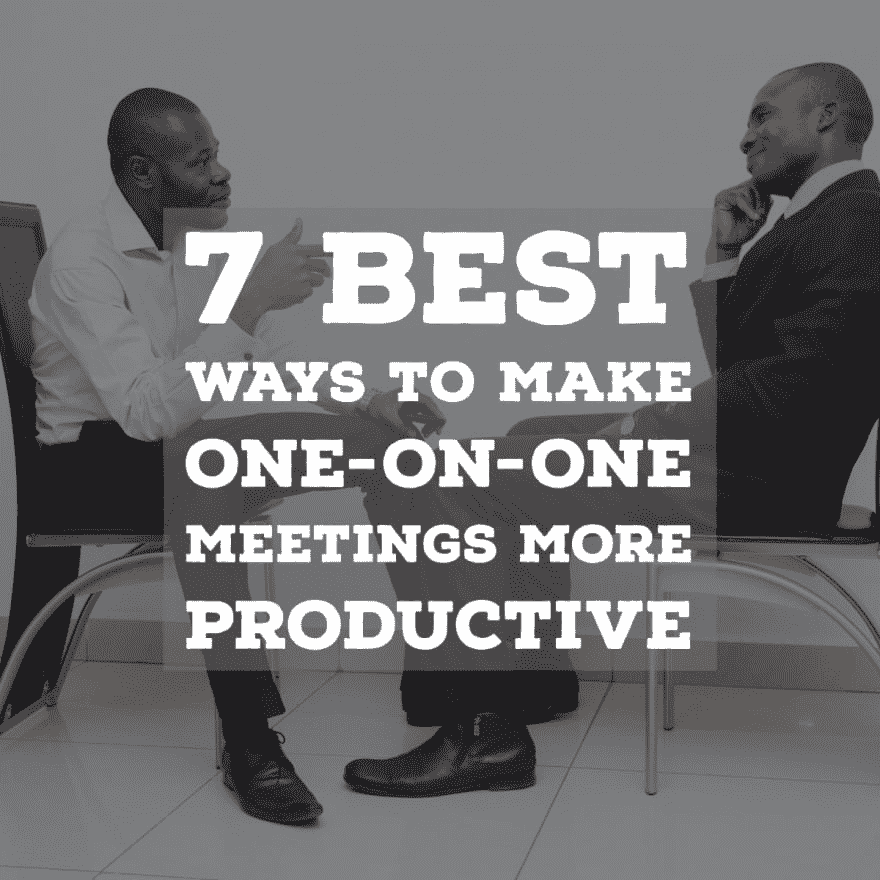

# 提高一对一会议效率的 7 个最佳方法

> 原文：<https://dev.to/lpasqualis/7-best-ways-to-make-one-on-one-meetings-more-productive>

这篇文章最初发表在 [CoderHood](https://coderhood.com) 上，被称为[让一对一会议更有成效的 7 个最佳方法](https://www.coderhood.com/7-best-ways-to-make-one-on-one-meetings-more-productive-in-tech)。CoderHood 是一个致力于软件工程人类层面的博客。

[T2】](https://www.coderhood.com/7-best-ways-to-make-one-on-one-meetings-more-productive-in-tech)

## 什么是一对一会谈？

在大多数情况下，一对一是两个人之间的会面。在企业界，它与一场讨论有关，在这场讨论中，两个人坦诚地交换反馈，分享关注点，并讨论他们如何能更好地帮助彼此。它也用来描述经理和他或她的一个员工之间的会议。后者就是我要讨论的情况。

> 我将要讨论的一对一帖子是一个软件工程师和他或她的老板之间的会议。

在我职业生涯的早期，我的老板们不会定期安排一对一的会议。我和那些经理的关系是由罕见的互动组成的。我不认识他们，他们也不认识我。他们只从我的工作和偶尔的闲聊中了解我。当时我没有想到要求更多的定期互动，主要是因为我不相信这是我必须发起的事情。在一个封闭的房间里与我的老板交谈是很少见的，通常只用于特定的头脑风暴、升职或加薪。

有效的一对一应该是经理和员工的首要任务。以下 7 个建议将帮助你充分利用这段关键时间。

## # 1——安排好一对一会议的时间，并优先考虑。

你需要确保安排重复性的一对一会议。频率和持续时间取决于相关人员的个性。对于我的直接下属，我倾向于每两周做 30 分钟。在某些情况下，我每周做 30 分钟，在其他情况下，我每周做一小时。有些人比其他人需要更多的时间来交谈，时间表应该是灵活的，以适应相关人员的需要。

一对一很重要，而且必须优先考虑。我尽我所能不取消它们，而且我非常认真地对待它们。在一对一的时间里，我意识到了我以前不知道的问题和情况。如果我没有一对一的会议，我会对我的小组的许多重要方面视而不见。我做过的大多数最好的决定都是一对一讨论的结果。

也就是说，记住预定的一对一会议不是你唯一应该和你的老板或员工交谈的时间。它更多的是一种提醒，一种强迫功能，存在于生活变得忙碌，你分心并忘记互动的情况下。在这段时间之外，只要有重要的事情要谈，就应该进行一对一的讨论。如果你已经谈过了，当预定的一对一时间到来时，没有什么新的东西要讨论，就跳过它。

## # 2——保持自由形式。

如果有议程，应该由员工而不是老板来制定。老板可能有一些事情要谈，如果还有时间，他或她应该提出来。但是，如果在预定的一对一时间内没有时间，经理可以安排单独的会议来讨论这些事项。目的是让预定的一对一会议集中在员工的议程上。

议程不一定要正式。不一定要提前写或者分享。一对一的会议和头脑风暴是唯一一种我不认为应该预先计划好时间细节的会议。就像头脑风暴一样，保持事情的非正式和自由形式有很大的价值。

## # 3——开会前，进入一对一的心态。

在会议之前，要有一个正确的心态。不要去想其他的事情，匆忙地去完成它，好像这是在浪费你的时间。花几分钟时间理清思路，为你要交谈的人腾出空间。回顾你之前和那个人一对一谈话的笔记。

除非迫不得已，否则不要将笔记本电脑带到一对一的环境中。笔记本电脑在两个人之间造成的隔离是一个应该被消除的障碍。用笔记本和笔，以老式的方式记笔记。

准备好联系并积极参与。如果你不能进入那种心态，带你的一对一去咖啡店或办公室外的某个地方。踏入一个不同的环境会帮助你走出你的头脑。

## # 4——老板 90%的时间都要听。

一对一是员工谈话和推动谈话的时间，也是老板倾听的时间。一般来说，如果经理讲话的时间超过了 10%,那么他或她就是说得太多了。比如你的一对一时长 30 分钟，老板发言时间应该在 3 分钟以内。

我相信仆人式领导，为了能够为我的员工服务，我需要了解他们的担忧、他们的挣扎和他们的观点。我需要仔细倾听他们，并感同身受。

当你和你的老板一对一的时候，推动谈话。敞开心扉，让他们知道你的想法。不要退缩！这是你给他们提供反馈的时间，告诉他们在哪些方面可以做得更好，或者征求他们的反馈和指导。

如果你觉得自己不能对老板开诚布公，试着想办法改变这种情况。如果这是不可能的，你可能要考虑找一份新工作或者换一个团队。一个没有兴趣听你说话的老板不是你想为之工作的老板。

在这个话题上，确保不要把“老板没在听”和“我不喜欢老板说的话”混淆这两者是非常不同的东西。你希望被听到，但你不能总是期望喜欢别人告诉你的事情。倾听是双向的。

## #5 -分享关注。

分享关注点是一对一会议的一个重要方面。在软件开发中尤其如此。软件工程师大部分时间都处于高度集中的状态。在那种状态下，关注点往往被埋没在持续聚焦形成的阴影中。如果不允许这些问题出现，它们会毒害开发人员。

有时，开发人员直到与他们的老板或同事进行一对一的谈话后，才会意识到这些问题。自由交谈和分享想法会让担忧浮出水面，并减轻很多负面影响。分享关注是一种净化，应该非常认真地对待。

一句警告:不要过度。如果你大部分时间所做的只是提出担忧，而你从不尝试寻找可能的解决方案，你最终可能会被视为一个抱怨者。我们需要尊重一条微妙的界限，并保持平衡。

试着提出问题和解决方案的建议。如果你对可能的解决方案没有一点头绪，请和你谈话的人来一次头脑风暴。关注解决方案的前景，而不仅仅是问题的存在。

## # 6——利用和老板一对一的会面时间来管理你的职业生涯。

你的职业管理不是你老板的责任。你的老板可以帮助你，但是你有责任把它带到你想去的地方。一对一的会议是一个很好的机会来集思广益职业抱负，并意识到你想做什么，你需要做些什么来实现它。

对于许多软件工程师来说，职业目标通常以项目类型和技术职责的形式来表达。对其他人来说，职业目标是头衔或影响范围。然而，许多人不知道他们想要什么，对他们想去哪里没有强烈的意见。

利用一对一的时间和老板交流想法。试着了解你有哪些选择，你的老板对你的这些选择有什么看法，以及你需要做些什么来达到目的。你谈论的职业目标越多，你想做的事情就会变得越清晰，你的老板也会越清楚。帮助他们帮助你。

如果你等着老板告诉你下一步该怎么做，你就是让他或她开车带你去某个地方，你可能不喜欢他或她要去的地方。做司机。把你的职业生活掌握在自己手中，弄清楚什么会让你快乐和兴奋。期待被告知你还没准备好。当这种情况发生时，问问你能做些什么来做好准备。

## # 7——给予和接受反馈。

给予和接受反馈是一种很好的成长方式。我们对自己性格和表现的许多方面都有些视而不见。我们无法通过别人的眼睛看清自己。事实上，这是不可能的，因为我们有自我偏见。对外界的一瞥是一种天赋，它让我们找到需要改进的地方。

对于开发人员来说，需要改进的地方可能是:

*   代码或系统设计质量。
*   文件质量。
*   代码评审的参与和质量。
*   估算技巧。
*   会议期间的态度。
*   你对团队的影响。
*   你与他人互动的方式。
*   在有压力的情况下你如何处理自己。
*   工作习惯。
*   生产力。
*   快速学习的能力。
*   你可能有的和需要知道的教条。
*   你倾向于做出的假设。
*   无意识偏见。
*   等等。

获得反馈的最好方式是去要求。询问的最好方式是询问细节。不要问一些普通的问题，比如“我能做得更好吗？”这就把想出点子的责任推给了另一个人。

尽量具体一点。例如，“我该如何更好地处理这种情况？”或者“你认为当我演 XYZ 时，别人会怎么看我？”或者更具体的事情，比如，“我说得太快了吗？我应该努力放慢速度吗？”

寻求具体的反馈可以提高你得到的答案的质量。这给了和你谈话的人一个关注某个方面的机会，而不会让他们觉得他们在评判你这个人。当你要求具体的反馈时，你得到的答案往往会让你大吃一惊。

* * *

### 如果你喜欢这篇文章，请保持联系！

*   在 CoderHood 上找到我所有的帖子。
*   在 LinkedIn 上加入我的职业网络。
*   在推特上关注我。
*   加入我的脸书主页。
*   最后，请在 dev.to 上关注我！