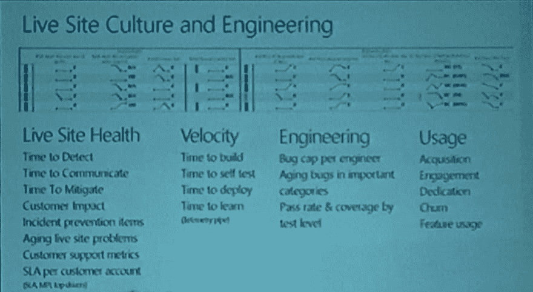
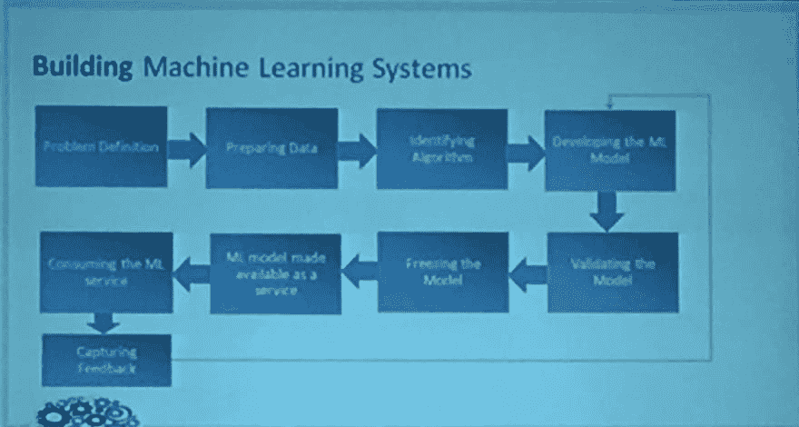
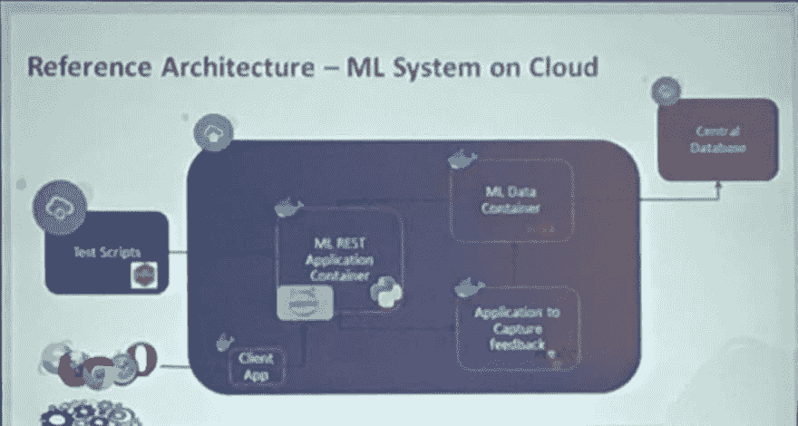
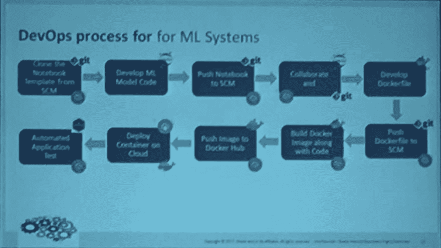
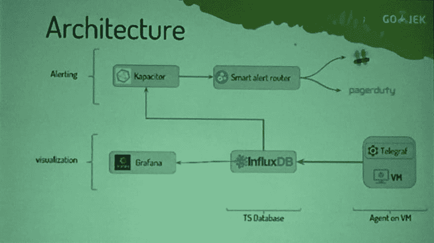

# DevOpsDays 印度 2017 会议笔记

> 原文:[https://dev.to/cnu/devopsdays-india-2017-conference-notes](https://dev.to/cnu/devopsdays-india-2017-conference-notes)

*本文最初发表于[我的个人博客](https://cnu.name/devopsdays-india-2017-notes/)。*

[DevOpsDays](http://devopsdaysindia.org/) 是一个技术会议，主题涵盖软件开发、IT 基础设施运营以及它们之间的交集。主题通常包括自动化、测试、安全和组织文化。

这是一个人们和公司聚集在一起，分享他们如何处理与 DevOps 相关的各种挑战的经验的地方。

2017 年印度 DevOpsDays 于 9 月 16 日和 17 日在班加罗尔举行，这是我第一次参加印度 DevOpsDays 大会，我做了很多笔记。以下是我记下/记住的不同演讲的电子版笔记。

# 第 1 天

# Nathen Harvey 的主题演讲

[纳森哈维](http://nathenharvey.com/)([@纳森哈维](https://twitter.com/NathenHarvey))是[厨师软件](https://www.chef.io/)的社区开发副总裁。如果你想学厨师，去 [learn.chef.io](https://learn.chef.io/) 找一系列不错的教程和课程。

*   我们工程师是
    *   不受遗留技术债务的束缚。
    *   而不是启动云服务器。
    *   不仅仅是建立系统。
*   你的主要工作是“取悦你的顾客”。
*   构建服务客户的规模。
*   Code / Chef / ansible /不管你用什么，都要放在 VCS 里。
*   编写测试(好)与 Nagios 警报(坏)。
    *   写任何测试用例都是好的。
    *   不写测试用例是不好的。
    *   测试用例将随着您的发展而发展。所以不全面也没关系。
*   始终进行**静态分析**
    *   测试 ruby 脚本的风格指南。
    *   美食评论家 -测试厨师脚本的风格指南。
*   集成测试
    *   启动虚拟机。
    *   把你的代码放上去。
    *   测试。
*   使用**四眼法则**
    *   在投入生产之前，一定要让四只眼睛看代码。
    *   代码审查是测试过程的一个重要部分。
*   源报告-工件-工件报告。
*   信息安全
    *   81%的 IT 专业人员认为 infosec 团队抑制了部署/生产的速度。
    *   77%的 Infosec 专业人士也这么认为。
*   对于协作，让事情变得可见。
    *   明确我们的限制和瓶颈在哪里。
*   软件成功指标:
    1.  速度
    2.  效率
    3.  风险
*   尝试在早期**检测故障。**
*   持续改进
    *   主动学习。
    *   共享信息-指标/报告。
    *   协调所有团队的激励和目标。
*   事后分析——总是问这两个问题:
    *   我们怎么能早点发现呢？
    *   我们将来如何避免它？
*   了解你的客户。
*   让工作可见。
*   衡量进展。
*   参与社区。

我从这次演讲中得到的重要收获是“**取悦你的客户**”。你被雇佣来做你所做的工作的唯一原因是解决你客户的问题。

作为工程师/开发人员，我们能够创造新的东西。但是无论我们创造什么，如果不能解决一个客户的痛点，都是没有用的。

# 使用 BOSH 管理您的 Kubernetes 集群

Ronak Banka ( [@ronakbanka](https://twitter.com/RonakBanka) )正在与乐天合作

乐天的原则:

1.  不断改进。永远前进。
2.  非常专业。
3.  假设->实践->验证->四国卡。
4.  最大限度提高客户满意度。
5.  速度！速度！速度！

不断发展的自动化工具的痛点:

*   高可用性
*   缩放比例
*   自我修复红外线
*   滚动升级
*   供应商锁定

使用 [BOSH](https://bosh.io/) ，发布工程、部署、生命周期管理等。，变得更容易。

# 将 65000 个 Microsofties 迁移到公共云上的 Devops

## 移动到一个工程系统

作者 Sam Guckenheimer([@ SamGuckenheimer](https://twitter.com/SamGuckenheimer))(Visual Studio Team Services)

*   在 2011 年之前的微软，每个团队都有自己的工程，自己的代码库，团队之间没有依赖关系。
*   塞特亚·纳德拉引进了一种工程系统。更开放。
*   生产力比其他任何功能都重要。
*   PR 代码审查测试案例安全测试合并以掌握持续集成。
*   在 6 分 39 秒内运行 60237 个测试。
*   运行测试用例的时间限制是 8 分钟。之前是 10 分钟。
*   12 小时限制做代码审查。否则 PR 过期。开发人员必须重新提交新的 PR/代码审查。
*   Git 虚拟文件系统
    *   Linux 内核 0.6GB
    *   VSTS 3GB
    *   Windows 270GB
    *   从克隆到提交，总体性能提高了 300 倍。
*   要跟踪的指标
    *   现场运行状况
    *   速度
    *   工程
    *   使用
*   在博客中发布更严重问题的根本原因分析(RCA)——更加透明。
*   分配给团队
    *   每位团队领导有 2 分钟时间介绍他的团队以及人们为什么需要加入他们的团队。
    *   开发人员可以选择他们感兴趣的 3 个团队和他们的优先级。
    *   根据选择和可用性将开发人员与团队相匹配。
    *   匹配率> 90%。
*   短距离赛跑
    *   不要想超过 3 次冲刺。
    *   太多的不确定性和陈旧的功能。

我的心得:即使像微软这样的大公司也可以遵循最佳实践。临时做东西的小创业公司有希望。

# 规模化开发是个难题

by Kishore Jalleda([@ Kishore Jalleda](https://twitter.com/KishoreJalleda))，就职于 IMVU，Zynga，现任雅虎高级总监！

*   **让创新民主化**
    *   没有创新的口袋。创新实验室部门。
    *   你无法控制特定团队的创新时间。
*   向 1%的用户发布功能不需要权限。
*   动作要快。有很高的速度。
    *   但是隐私和安全是没有商量余地的。
*   你写的；你拥有它。
*   你写的；你来经营。
*   发信号
    *   警报 a 队 a 队 b 队 c 队 d 队。
    *   提醒麦德德夫。(好多了)
    *   理想情况:< 2 个警报/班次，因此 RCA 是可能的。
    *   说不很难，但很有力。
    *   对于提醒来说，日志比电子邮件要好。
*   提交投入生产:
    *   有人类的参与。
    *   没有人类的参与。(更好)
    *   需要 TDD。
        *   需要时间。很多反对意见。不是每个人都买。
        *   有非常高的速度
        *   测试**覆盖率永远不会是 100%**——但是没问题。就像软件有 bug 一样，没关系。
*   自动化
    *   不要奖励不良行为。
    *   不要允许开发者**不**自动化他们的东西。每天凌晨 3 点重启服务器是不好的行为。
    *   自动化允许你做“**更高价值的工作**”。
        *   你想干嘛?重启服务器？还是写生产代码？
    *   不要再说无关紧要的事情了。
*   公共云和私有数据中心:
    *   采用混合方法，根据时间和使用情形购买或构建
    *   如果你做的事情与公司其他人不一致:“打破规则，但在光天化日之下打破规则”。
    *   构建考虑到云的新应用。
*   激励团队实现自动化。
*   奖励良好行为。
*   快速行动以保持相关性。
*   不要追求 100%的合规性。
*   重要的是过程。

我的建议是:你不可能从第一天起就 100%遵守。让每个人都遵循自动化、测试用例、代码审查、CI/CD 是很难的。最终人们(如果他们聪明的话)会到达那里。

此外，自动化你的东西的主要动机是你可以继续前进，处理更大更好的挑战。为下一个 10 亿用户解决问题将比重启服务器更有趣。

# 构建无服务器分布式&批处理数据架构的经验

[拉吉·罗希特](http://jrajrohit.me/)([@数据 _ 向导](https://twitter.com/data__wizard))

*   总是从你的 lambda 函数返回。否则，这是一个错误，AWS 会重试该功能。
*   不要使用服务器来监控无服务器。
*   无服务器分布式系统必须能够自我修复。
    *   当处理数百台服务器时，调试丢失的文件是很困难的。
*   拥有适当的负载平衡。
*   不要尝试对分布式系统进行微优化。
*   签出分布式跟踪:
    *   [齐普金](http://zipkin.io/)
    *   [AWS x 射线](https://aws.amazon.com/xray/)

我的心得:分布式跟踪工具看起来很有趣。我确实想开始使用它们，这样调试不同的微服务就更容易了。

第一天以简短的谈话和一个关于 Kubernetes 的研讨会结束。

# 第二天

# 构建思维系统——机器学习

by Abhinav shrov-([@ Abhinav shrov](https://twitter.com/abhinavshroff))

*   更智能地构建应用程序-使用数据。
*   ML 系统需要反馈——这需要正确的 Devops 策略和工具。
*   语言
    *   计算机编程语言
    *   稀有
*   开发工具
    *   黯然失色
    *   Jupyter
    *   RStudio
*   为什么要集装箱化？
    *   调谐
    *   捆
    *   独立的
    *   使聚集
    *   定义的接口
    *   云微服务
*   容器编排选项
    *   码头工人群
    *   库伯内特斯
    *   Apache Mesos
    *   (或)
    *   容器部署云(Oracle 开发者云服务)
*   微服务
    *   Jupyter 内核网关
    *   在你的 jupyter 笔记本上创建一个 REST 服务。

# Mario Star 增强您的基础设施:使用 Inspec 测试基础设施

来自厨师软件的 Hannah Madely([@ DJ jamapantz](https://twitter.com/DJPajamaPantz))&[Victoria Jeffrey](http://www.victoriadjeffrey.com/)([@ vick koala](https://twitter.com/vickkoala))。

由于我不是厨师/相关软件类的人，所以我没有太关注这个演讲。但是他们有整个会议中最好的幻灯片。加油马里奥加油。

*   [检查](https://www.inspec.io/)测试转轮结束
    *   嘘
    *   WinRM
    *   码头工人
*   检查外壳
*   缩短反馈回路非常重要
*   准备使用上提供的配置文件
    *   开源代码库
    *   超级市场

# 规模可靠性

来自[戈杰克工程](http://gojekengineering.com/)的[普拉文舒克拉](https://praveenatc42.wordpress.com/)([@ _ 普拉文舒克拉](https://twitter.com/_praveenshukla)

可靠性转化为商业利润。但向商界人士推销这一点很难。这是 GoJek 工程团队如何让他们的系统大规模可靠的故事。

*   100 个实例到 8000 个实例
*   每秒一百万(内部)事务
*   可靠性
    *   正常运行时间- 4 个 9
    *   MTBF -正常运行时间/故障
    *   每年故障数(AFR)
    *   服务质量
    *   SLA - 2ms 响应 vs 2s 响应，哪个靠谱？
*   要定义可靠性，先定义故障。
*   故障:系统在指定参数之外运行
*   业务失败:用户在抱怨
*   Two thousand and fifteen
    *   4 种产品
    *   10 项微服务
    *   100 个实例
    *   50 多名技术人员
    *   速度与稳定性
*   Two thousand and seventeen
    *   18 种产品
    *   250 多项微服务
    *   8000 多个实例
    *   3 个数据中心
    *   AWS、GCE、自有数据中心
    *   350 多名技术人员
*   问题
*   CI/CD
    *   詹金斯
    *   管道访问管理。
    *   定制部署-必须求助于 devops/SRE 团队。
    *   DSL 存储库管理。代码和配置项位于两个不同的仓库中。
    *   没有基于分支的部署
*   结构管理
    *   为每个微服务创建一个食谱。
    *   350 多本烹饪书。
*   警报和监控
    *   警报丢失。
    *   没有向正确的人发出警报。
    *   太多人收到太多寻呼机。
    *   谁负责对警报采取行动？
*   解决方法
*   CI/CD
    *   Jenkinsá[gitlab ci](https://about.gitlab.com/features/gitlab-ci-cd/)。
    *   比特桶 [Gitlab](http://www.gitlab.com/) 。
    *   CI 现在是 YAML 文件，是源代码的一部分。
    *   基于分支和标签的部署。
*   结构管理
    *   使用 4 种语言
        *   红宝石
        *   golang
        *   clojure
        *   jruby
    *   为每种语言创建一个主食谱
    *   4 本烹饪书而不是 350 本
*   警报和监控
    *   **智能报警路由器**
        *   每个产品属于一个组
        *   每个组都有许多微服务
        *   每个微服务运行在多个服务器上
        *   每个成员属于多个组
        *   当服务器上发生警报时，只有相应的组会收到警报
    *   配置警报
        *   创建一个 yaml 文件
        *   推到回购
        *   CI 从 yaml 文件配置警报
*   可靠性和依赖性
    *   1 服务:R:99%
    *   1 至… 3 项服务:答:97%
    *   1 至… 3 至… 3 项服务:答:88%
    *   **快速失败**。
    *   使用断路器。
    *   30 个微服务的正常运行时间为 99.99%，而整个系统的正常运行时间仅为 99.7%。
    *   10 亿个请求中的 0.3% 300 万个请求失败
    *   每月停机时间超过 2 小时
*   排队延迟
    *   向上扩展并不能每次都解决问题
    *   DDOS 会杀了它
    *   相反**节流你的系统**
*   可靠性是一个迭代过程

# 快速移动，构建稳定的基础设施

由 Thoughtworks 的[桑奇特·巴哈尔](https://sanchitbahal.wordpress.com/) (@ [桑奇特 _ 巴哈尔](https://twitter.com/sanchit_bahal))撰写

**上下文:**

Thoughtworks 被要求为一个航空行李系统开发一个移动应用程序。

他们通常用 Git + [GoCD](https://www.gocd.org/) 来表示 CI/CD。但是客户不想要公共云。所以构建机器是内部的——混合了 MAC 和 linux 虚拟机。

他们开始经历漫长的构建等待时间，有时大约 1.5 天。

这导致开发人员的反馈延迟，当生成构建结果时，开发人员已经向前移动了。这开始导致大部分红色构建，最后开发人员不再关注构建。

### 旅程:

*   自动化资源调配
    *   使用 [Ansible](https://www.ansible.com/) 。
    *   安装 xcode，android sdk。
    *   使用本地文件服务器进行大量下载。
*   预烘焙黄金图像
    *   OSX +焦虑的年龄形象。
    *   使用 deploy studio。
    *   新机器需要 30 分钟而不是 2 天。
*   同质构建剂
    *   所有机器都是构建类型。
    *   更好的负载平衡。
    *   更好的工作分配。
    *   韧性。
*   每台计算机 1 个生成代理
    *   简化设置。
    *   更容易分配工作负荷。
*   仿真器
    *   [Geny motion](https://www.genymotion.com/) 安卓模拟器。
    *   Genymotion 有时会卡住。不确定性。
    *   每个测试套件上的 Android 模拟器的加速和减速。
    *   以无头模式运行。
    *   节省许可代码。80 人每年 30000 美元。
    *   Android 模拟器允许在一个干净的石板上开始，在一个干净的石板上结束。
*   Devops 分析
    *   衡量改进。
    *   持续监控。
    *   可行的见解。
    *   电报+影响 xdb + grafana。
*   仪表盘
    *   生成等待时间-将生成代理分配给计划作业的时间。
    *   部署就绪构建-从提交到构建就绪以进行 QA 的时间。
    *   构建机器健康负载、CPU、内存、磁盘等。
*   结果
    *   机器配置时间:2 天< 30 分钟。
    *   构建等待时间:6 小时< 10 秒。
    *   构建稳定、强健、有弹性的基础设施。
    *   更快的反馈周期意味着每天更多的提交。
    *   更高的开发效率。

我的心得:开发人员的生产力非常重要，更快的反馈循环可以让你更快地提交代码。

# 普罗米修斯 2.0

这是一个 GSoC 的学生[古森](https://geekon.tech/)([@假定](https://twitter.com/putadent))的闪电般的谈话，他正在研究[普罗米修斯](https://prometheus.io/)。他谈到了 v2.0 中更低的内存使用率和其他改进。

它仍处于测试阶段，但由于普罗米修斯公司推出了度量标准，请在您的服务器上同时安装 1.x 和 2.0。当它变得稳定时切换版本。

普罗米修斯已经在我的雷达上有一段时间了，我想我应该试试它，看看它是如何工作的，我可以把它插在哪里。

# 结束主题演讲:与社区一起航行于你的职业生涯

By 尼彭德拉([@尼彭德拉](https://twitter.com/neependra) ) - [CloudYuga](https://cloudyuga.guru/)

社区！社区！社区！

*   社区能给你的职业生涯带来什么
    *   满足感。
    *   获得可见性。
    *   得到你喜欢的工作。
    *   开创自己的事业。
*   是什么阻止我们成为社区的一部分
    *   时间承诺。
    *   公司文化。
    *   恐惧。
    *   舒适区。
*   为自己打造一个品牌。

那是 DevOpsDays 2017 大会的尾声。总的来说，大多数讲座都很不错，我确实从每次讲座中至少学到了一个关键的东西。从不同的谈话中，可以看出许多人都在努力为他们的公司带来变革，带来自动化、TDD、代码评审等 DevOps 思维模式。