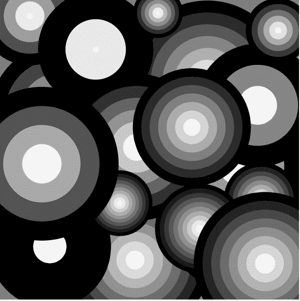
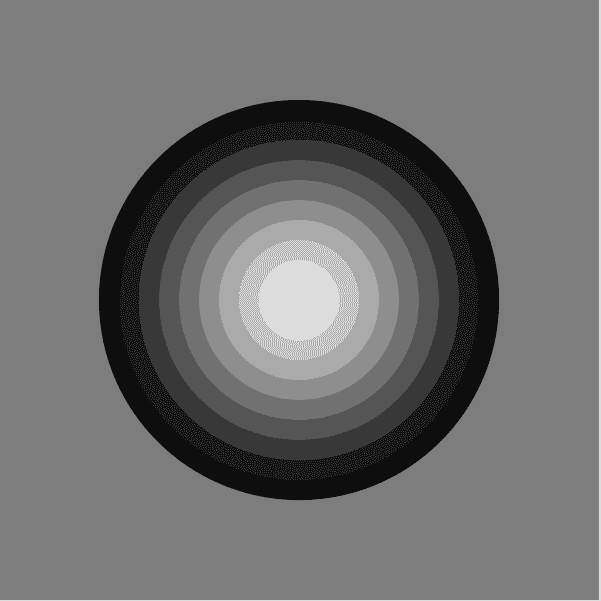
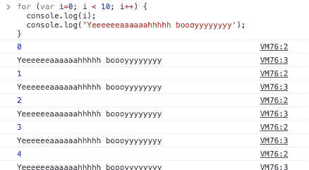
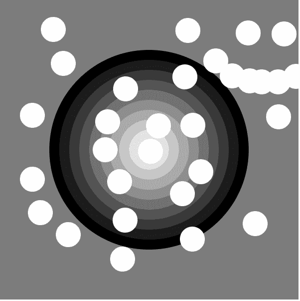
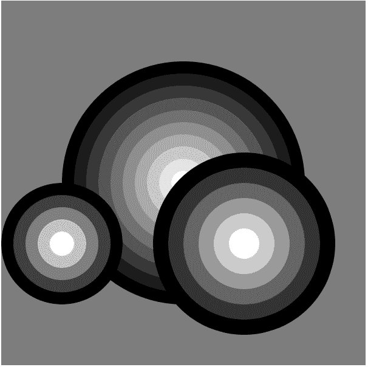
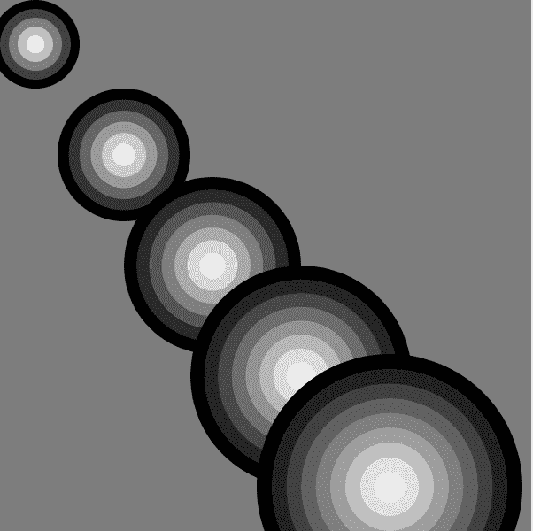

# 学习编码，第 2 部分——循环目标

> 原文:[https://dev.to/rpalo/learn-to-code-part-2 循环目标](https://dev.to/rpalo/learn-to-code-part-2---looping-targets)

这是我学习编码系列的第二部分。如果你错过了第一部分,请查看一下[。不知何故，第一个之后老婆还在我身边，大家继续坚持吧！我要把上一部分的这段摘录删掉，因为我认为尽可能多地重复真的很重要。](https://assertnotmagic.com/2017/09/09/p5-part-1-random-walker/)

> 如果你刚刚开始学习编程，让我告诉你一些事情。编程很难。所以请不要感到气馁或愚蠢。本教程移动*真的*快，涵盖*很多*，所以第一遍感觉不知所措或不理解一切是**完全正常**。我在这里的目标是带你体验一下程序员无中生有地创造出动态的、令人敬畏的东西的那种兴奋感。一旦你完成了，问我每一个你能想到的问题，直到事情变得更有意义。你可以给我发电子邮件或推特信息。链接在我的简历的第[页](https://assertnotmagic.com/about/)上。我会和你一起完成作业(因为作业真的有助于巩固一些东西)。只要把头低下，挺过去，不要放弃，不要觉得求助很怪异。如果有些事情没有意义，那不是因为你是个笨蛋，而是因为我写得不够好。现在。这次是真的。我们开始吧

# 第二课:循环目标

恭喜你，你逃过了第一课！希望你渴望更多。在这一课中，我们将学习上一课所学的内容，并巩固它。我们将把 **if 语句**、**赋值变量**和**使用函数**带到下一个层次。我还会尝试加入一些新的很酷的 P5 功能。最后，我们将看到我们的第一个**循环**。这一课的工作方式与上一课也有所不同，我们不是在项目开始时就获得最终产品，而是逆向完成，我们将做程序员经常做的事情，即构建一些小东西，然后慢慢地增加它。不过，我会让你尝一尝将要发生的事情。

[T2】](https://res.cloudinary.com/practicaldev/image/fetch/s--ME5yLapV--/c_limit%2Cf_auto%2Cfl_progressive%2Cq_auto%2Cw_880/https://assertnotmagic.com/img/teaser.png)

我们打算这样做，当你点击画布时，一个随机大小的目标被画出来，并带有随机数量的环。这些环应该从外部的黑色到中心的白色，然后线性变暗。

## 第一步:循环(和`noLoops`)

让我们先把困难的事情解决掉，这样你就有更多的时间来熟悉它。这是我们第一步的目标:

[T2】](https://res.cloudinary.com/practicaldev/image/fetch/s--HzZk7MBk--/c_limit%2Cf_auto%2Cfl_progressive%2Cq_auto%2Cw_880/https://assertnotmagic.com/img/step1-goal.png)

它可能看起来没什么不同，但是我们最初删除了很多需求。我们正在处理一个大问题，我们正在把它分解成几个更小的、更容易解决的问题。我(和许多其他人)称之为“吃大象”。

> 作为一名程序员，你必须知道如何吃掉大象。你如何吃掉一头大象？
> 
> 一次吃一口，伙计。一次一口。

那么我们对第一步的要求是什么呢？我们必须在画布中间画一组静止不动的 10 个圆圈。总直径必须为 400 像素。环必须从白色到黑色，线性。

### 我们第一次尝试

好了，让我们从简单的东西开始:设置。我们需要一块画布，一个浅灰色的背景，我们不需要我们的绘图循环，没有一个圆圈真正有轮廓。

```
function setup() {
  createCanvas(600, 600);
  background(125);
  noStroke();
  noLoop();
} 
```

<svg width="20px" height="20px" viewBox="0 0 24 24" class="highlight-action crayons-icon highlight-action--fullscreen-on"><title>Enter fullscreen mode</title></svg> <svg width="20px" height="20px" viewBox="0 0 24 24" class="highlight-action crayons-icon highlight-action--fullscreen-off"><title>Exit fullscreen mode</title></svg>

前两行应该看起来很熟悉。我们想要一个中等的灰色背景，记住我们的灰度默认从 0 到 255。125 相对来说处于这个范围的中间。最后两个函数只需要简单介绍一下。`noStroke`关闭边框，`noLoop`关闭边框，这样我们的绘制循环就不会更新。如果我们的形状都没有移动，我们可以告诉画布不要一遍又一遍地运行 draw，这样可以节省一些 CPU 周期。不客气，CPU！我们爱你！

酷！所以画布:检查。灰色背景:检查。静态、不动的绘图:检查。下一步是什么？圈子的要求。让我们声明一些变量，让我们的生活更轻松。

```
function draw() {
  var maxSize = 400;  // pixels
  var steps = 10;
  var sizeStep = maxSize / steps;  // We'll use this to define our ring sizes
  var colorStep = 255 / steps;
  var centerX = width/2;  // pixels 
  var centerY = height/2;  // pixels
} 
```

<svg width="20px" height="20px" viewBox="0 0 24 24" class="highlight-action crayons-icon highlight-action--fullscreen-on"><title>Enter fullscreen mode</title></svg> <svg width="20px" height="20px" viewBox="0 0 24 24" class="highlight-action crayons-icon highlight-action--fullscreen-off"><title>Exit fullscreen mode</title></svg>

我们在第 1 课中已经讲述了以上所有内容，所以不必担心。你可能会问，“Ryan，如果我们不使用`draw`函数来循环(因为`noLoop`)，为什么我们不在 setup 函数中做所有的事情而完全忘记 draw 函数呢？”你说得对！你完全可以。据我所知，这两者在功能上是等同的。我选择这样做是因为在我看来，在`setup`只做“设置”的事情，在`draw`只做“绘制”的事情更有意义。不管什么能让你开心。你是这里的艺术家！

好了，终于到了创建我们的圈子的时候了。幸运的是，P5 为我们提供了 [`ellipse`函数](https://p5js.org/reference/#/p5/ellipse)，它需要一个`x, y, x width and y height`。因为我们是几何天才，所以我们知道如果我们画一个宽度和高度都一样的椭圆，就和画一个圆一样。

```
function draw() {
  var maxSize = 400;  // pixels
  var steps = 10;
  var sizeStep = maxSize / steps;  // We'll use this to define our ring sizes
  var colorStep = 255 / steps;
  var centerX = width/2;  // pixels 
  var centerY = height/2;  // pixels

  // Draw the circles, start with the biggest, black one on bottom
  fill(0);
  ellipse(centerX, centerY, maxSize, maxSize);
  fill(1 * colorStep);
  ellipse(centerX, centerY, maxSize - 1*sizeStep, maxSize - 1*sizeStep);
  fill(2 * colorStep);
  ellipse(centerX, centerY, maxSize - 2*sizeStep, maxSize - 2*sizeStep);
  fill(3 * colorStep);
  ellipse(centerX, centerY, maxSize - 3*sizeStep, maxSize - 3*sizeStep);
  // oy vey...  Getting tired of typing yet?
  // ...
} 
```

<svg width="20px" height="20px" viewBox="0 0 24 24" class="highlight-action crayons-icon highlight-action--fullscreen-on"><title>Enter fullscreen mode</title></svg> <svg width="20px" height="20px" viewBox="0 0 24 24" class="highlight-action crayons-icon highlight-action--fullscreen-off"><title>Exit fullscreen mode</title></svg>

没有。我拒绝让你复制粘贴所有代码。我们正在学习循环的**。**

### 为循环

在你的主机上试试这个:

```
for (var i=0; i < 10; i++) {
  console.log(i);
  console.log('Yeeeeeeaaaaaahhhhh boooyyyyyyyy');
} 
```

<svg width="20px" height="20px" viewBox="0 0 24 24" class="highlight-action crayons-icon highlight-action--fullscreen-on"><title>Enter fullscreen mode</title></svg> <svg width="20px" height="20px" viewBox="0 0 24 24" class="highlight-action crayons-icon highlight-action--fullscreen-off"><title>Exit fullscreen mode</title></svg>

[T2】](https://res.cloudinary.com/practicaldev/image/fetch/s--Y5igk2UO--/c_limit%2Cf_auto%2Cfl_progressive%2Cq_auto%2Cw_880/https://assertnotmagic.com/img/first-loop.png)

现在让我们来分解一下。这是循环的**。现在你可以明白为什么这么叫了。我们说“每次通过这个循环，执行以下动作”。回路**的**有三个主要部分。**初始化步骤**、**测试步骤**和**递增步骤**。**

**初始化步骤**是你来到的第一个环节:

```
var i=0; 
```

<svg width="20px" height="20px" viewBox="0 0 24 24" class="highlight-action crayons-icon highlight-action--fullscreen-on"><title>Enter fullscreen mode</title></svg> <svg width="20px" height="20px" viewBox="0 0 24 24" class="highlight-action crayons-icon highlight-action--fullscreen-off"><title>Exit fullscreen mode</title></svg>

这里的所有东西都在循环开始时运行一次。一般来说，你只需要设置初始循环变量值，但是你可以在这里做任何你想做的事情。

接下来是**测试步骤**。这在每个循环之前运行。如果测试步骤为真，则循环继续。

```
i < 10; 
```

<svg width="20px" height="20px" viewBox="0 0 24 24" class="highlight-action crayons-icon highlight-action--fullscreen-on"><title>Enter fullscreen mode</title></svg> <svg width="20px" height="20px" viewBox="0 0 24 24" class="highlight-action crayons-icon highlight-action--fullscreen-off"><title>Exit fullscreen mode</title></svg>

计算机第一次读取代码时，我们刚刚设置了`i = 0`，所以——0 小于 10——循环激活，运行里面的所有东西。

在这之后是递增步骤。

```
i++ 
```

<svg width="20px" height="20px" viewBox="0 0 24 24" class="highlight-action crayons-icon highlight-action--fullscreen-on"><title>Enter fullscreen mode</title></svg> <svg width="20px" height="20px" viewBox="0 0 24 24" class="highlight-action crayons-icon highlight-action--fullscreen-off"><title>Exit fullscreen mode</title></svg>

我们在第 1 课中看到过这一点，当时我们将我们的 walker 移动了一个像素。这只是将`i`增加 1。然后，我们循环回到**测试步骤**。现在，`i`等于 1，还是小于 10，于是循环又发生了。如此反复，直到`i`等于 9。在最后一次循环之后，`i`是 10，而不是*比* 10 小。满意后，循环退出，我们可以继续我们的程序。你开始看到我们如何在我们的程序中使用它了吗？

### 我们第二次尝试

```
function setup() {
  createCanvas(600, 600);
  background(125);
  noStroke();
  noLoop();
}

function draw() {
  var maxSize = 400;  // pixels
  var steps = 10;
  var sizeStep = maxSize / steps;  // We'll use this to define our ring sizes
  var colorStep = 255 / steps;
  var x = width/2;  // pixels 
  var y = height/2;  // pixels

  // The new stuff!
  for (var i=0; i<steps; i++) {
    fill(i * colorStep);  // 0, 25.5, 50.0, 75.5 ...
    var thisSize = maxSize - (i * sizeStep);  // 400, 360, 320 ...
    ellipse(x, y, thisSize, thisSize);
  }
} 
```

<svg width="20px" height="20px" viewBox="0 0 24 24" class="highlight-action crayons-icon highlight-action--fullscreen-on"><title>Enter fullscreen mode</title></svg> <svg width="20px" height="20px" viewBox="0 0 24 24" class="highlight-action crayons-icon highlight-action--fullscreen-off"><title>Exit fullscreen mode</title></svg>

有道理吗？首先，循环通过`i === 0`完成。因此，我们调用`fill(0)`并且我们的填充是黑色的。`thisSize`设置为`400 - 0 * 40`，我们最大的圆是 400。我们画一个圆。下一次通过，`i === 1`，所以我们叫`fill(25.5)`和`thisSize === 400 - 1 * 40 === 360`，以此类推！

只有一个问题，一个从程序出现以来就一直困扰程序员的问题。**逐个关闭**错误。注意，在循环的最后一次迭代中，`i`将等于 9。因此，填充颜色将是`9 * 25.5`，它只是`229.5!`而不是我们想要的`255`。我们的中心点是*灰白色*！人类！问题源于我们有 10 个环，但第一个环从零开始。我们实际上只走了九次。因此，我们需要修复我们的`colorStep`。

```
var colorStep = 255/(steps - 1);
// now our fill will be 0, 28.33, 56.66, 85 ... 255 
```

<svg width="20px" height="20px" viewBox="0 0 24 24" class="highlight-action crayons-icon highlight-action--fullscreen-on"><title>Enter fullscreen mode</title></svg> <svg width="20px" height="20px" viewBox="0 0 24 24" class="highlight-action crayons-icon highlight-action--fullscreen-off"><title>Exit fullscreen mode</title></svg>

同样的问题也会影响到我们的`sizeStep`，但是在这种情况下，我们希望它发生。我们希望最后一个圆的直径是 40px，而不是 0px。如果我们确实想让 0px 成为我们的停止点，我们也必须在那里做最后的调整。

一个接一个的错误是非常令人困惑的，也是最常见的错误原因之一，所以不要担心这是否有点密集和混乱。如果你有任何问题，打电话给我，我会看看我能做些什么来澄清。但现在，我们要继续前进！向前！

## 第二步:鼠标点击和功能

现在我们已经实现了我们的第一个里程碑目标，让我们增加一点复杂性，尝试更接近我们的最终目标。对于这一步，我们想画一个 400 像素大的有 10 个环的目标，和以前一样，但是我们想只在用户点击画布时画它，我们想把它放在用户点击画布的地方。两个新目标。

### 鼠标功能/变量

P5 为我们提供了一个函数叫做`mouseClicked`函数。每当鼠标单击画布时，就会调用这个函数。P5 还为我们提供了两个内置变量`mouseY`和`mouseX`。你有三次机会猜猜这里面有什么。让我们把之前的草图稍微调整一下，看看我们在说什么。

```
// This stuff is all the same as before

function setup() {
  createCanvas(600, 600);
  background(125);
  noStroke();
  noLoop();
}

function draw() {
  var maxSize = 400;  // pixels
  var steps = 10;
  var sizeStep = maxSize / steps;  // We'll use this to define our ring sizes
  var colorStep = 255/(steps - 1);
  var x = width/2;  // pixels 
  var y = height/2;  // pixels
  for (var i=0; i<steps; i++) {
    fill(i * colorStep);
    var thisSize = maxSize - (i * sizeStep);
    ellipse(x, y, thisSize, thisSize);
  }
}

// Here is the new hotness

function mouseClicked() {
  fill(255);
  ellipse(mouseX, mouseY, 50, 50);
} 
```

<svg width="20px" height="20px" viewBox="0 0 24 24" class="highlight-action crayons-icon highlight-action--fullscreen-on"><title>Enter fullscreen mode</title></svg> <svg width="20px" height="20px" viewBox="0 0 24 24" class="highlight-action crayons-icon highlight-action--fullscreen-off"><title>Exit fullscreen mode</title></svg>

试试吧！

[T2】](https://res.cloudinary.com/practicaldev/image/fetch/s--qv0QITVG--/c_limit%2Cf_auto%2Cfl_progressive%2Cq_auto%2Cw_880/https://assertnotmagic.com/img/first-click.png)

我想你能明白我的意思。

### 功能回顾

但是首先，我要做一点清理工作(也称为**重构**)，这会让我们的生活稍微轻松一些，更重要的是，帮助我们回顾**函数**。让我们将我们的目标绘图从 draw 循环中取出，并放入一个名为`createTarget`的函数中。

```
// ...
function draw() {
  createTarget();
}

function createTarget() {
  var maxSize = 400;  // pixels
  var steps = 10;
  var sizeStep = maxSize / steps;  // We'll use this to define our ring sizes
  var colorStep = 255/(steps - 1);
  var x = width/2;  // pixels 
  var y = height/2;  // pixels
  for (var i=0; i<steps; i++) {
    fill(i * colorStep);
    var thisSize = maxSize - (i * sizeStep);
    ellipse(x, y, thisSize, thisSize);
  }
} 
```

<svg width="20px" height="20px" viewBox="0 0 24 24" class="highlight-action crayons-icon highlight-action--fullscreen-on"><title>Enter fullscreen mode</title></svg> <svg width="20px" height="20px" viewBox="0 0 24 24" class="highlight-action crayons-icon highlight-action--fullscreen-off"><title>Exit fullscreen mode</title></svg>

看到了吗？没什么太大的不同。但是让我们做一个更好的。让我们通过**参数**定制目标。记得他们吗？这些是你放在括号里的函数输入。幸运的是，我们将输入都放在了函数的顶部，所以很容易发现。

```
// ...
function draw() {
  createTarget(width/2, height/2, 400, 10);
}

function createTarget(x, y, maxSize, steps) {
  // calculate what we need from our inputs
  var sizeStep = maxSize / steps;
  var colorStep = 255 / (steps - 1);

  for (var i=0; i<steps; i++) {
    fill(i * colorStep);
    var thisSize = maxSize - (i * sizeStep);
    ellipse(x, y, thisSize, thisSize);
  }
} 
```

<svg width="20px" height="20px" viewBox="0 0 24 24" class="highlight-action crayons-icon highlight-action--fullscreen-on"><title>Enter fullscreen mode</title></svg> <svg width="20px" height="20px" viewBox="0 0 24 24" class="highlight-action crayons-icon highlight-action--fullscreen-off"><title>Exit fullscreen mode</title></svg>

刷新页面，什么都没有改变！太好了！这时你就知道你已经成功地进行了**重构**。那么我们为什么要这样做呢？因为这样做真的很容易:

```
function draw() {
  createTarget(width/2, height/2, 400, 10);
  createTarget(100, 400, 200, 5);
  createTarget(400, 400, 300, 6);
} 
```

<svg width="20px" height="20px" viewBox="0 0 24 24" class="highlight-action crayons-icon highlight-action--fullscreen-on"><title>Enter fullscreen mode</title></svg> <svg width="20px" height="20px" viewBox="0 0 24 24" class="highlight-action crayons-icon highlight-action--fullscreen-off"><title>Exit fullscreen mode</title></svg>

[T2】](https://res.cloudinary.com/practicaldev/image/fetch/s--gD6sFjo9--/c_limit%2Cf_auto%2Cfl_progressive%2Cq_auto%2Cw_880/https://assertnotmagic.com/img/functions.png)

甚至:

```
function draw() {
  for (var i=0; i < 5; i++) {
    createTarget(40 + i*100, 50 + i*125, 100 + i*50, 5 + i);
    // Get it?
    // x = 40, 140, 240, 340, 440
    // y = 50, 175, 300, 425, 550
    // maxSize = 100, 150, 200, 250, 300
    // steps = 5, 6, 7, 8, 9
  }
} 
```

<svg width="20px" height="20px" viewBox="0 0 24 24" class="highlight-action crayons-icon highlight-action--fullscreen-on"><title>Enter fullscreen mode</title></svg> <svg width="20px" height="20px" viewBox="0 0 24 24" class="highlight-action crayons-icon highlight-action--fullscreen-off"><title>Exit fullscreen mode</title></svg>

[T2】](https://res.cloudinary.com/practicaldev/image/fetch/s--8S0_okVW--/c_limit%2Cf_auto%2Cfl_progressive%2Cq_auto%2Cw_880/https://assertnotmagic.com/img/functions-and-loops.png)

为了阐明函数中发生的事情，我将尝试用另一种方式来解释，这种方式对我很有帮助。当你第一次定义一个函数时，你放在括号里的东西就像一个食谱。你说出了你的期望。类似于一本食谱上说的:吃点肉和蔬菜。

```
function iAmTheBest(x, y, r) {
    // ...
} 
```

<svg width="20px" height="20px" viewBox="0 0 24 24" class="highlight-action crayons-icon highlight-action--fullscreen-on"><title>Enter fullscreen mode</title></svg> <svg width="20px" height="20px" viewBox="0 0 24 24" class="highlight-action crayons-icon highlight-action--fullscreen-off"><title>Exit fullscreen mode</title></svg>

然后，当你实际上**调用**函数时，就好像你实际上在做菜谱。

```
function draw() {
  iAmTheBest(25, 30, 50);
} 
```

<svg width="20px" height="20px" viewBox="0 0 24 24" class="highlight-action crayons-icon highlight-action--fullscreen-on"><title>Enter fullscreen mode</title></svg> <svg width="20px" height="20px" viewBox="0 0 24 24" class="highlight-action crayons-icon highlight-action--fullscreen-off"><title>Exit fullscreen mode</title></svg>

这个函数会查看你传入的内容，然后说，“好的。我要用`x = 25, y = 30, and r = 50`来做这件事。”用这个不自然的食谱比喻来说，就像你读了食谱，开始用牛肉和西兰花烹饪，但是按照食谱中的步骤来做。如果你用牛肉和西兰花，它会和你用鸡肉和胡萝卜相似，但不完全一样。我成功地把这个比喻打死了吗？

### 整理完第二步

太好了。让我们通过完成我们的目标来结束这一步。

```
function setup() {
  createCanvas(600, 600);
  background(125);
  noStroke();
  noLoop();
}

function draw() {
  // nothing in here anymore!
}

function mouseClicked() {
  createTarget(mouseX, mouseY, 400, 10);
}

function createTarget(x, y, maxSize, steps) {
  var sizeStep = maxSize / steps;
  var colorStep = 255/(steps - 1);
  for (var i=0; i<steps; i++) {
    fill(i * colorStep);
    var thisSize = maxSize - (i * sizeStep);
    ellipse(x, y, thisSize, thisSize);
  }
} 
```

<svg width="20px" height="20px" viewBox="0 0 24 24" class="highlight-action crayons-icon highlight-action--fullscreen-on"><title>Enter fullscreen mode</title></svg> <svg width="20px" height="20px" viewBox="0 0 24 24" class="highlight-action crayons-icon highlight-action--fullscreen-off"><title>Exit fullscreen mode</title></svg>

[T2】](https://res.cloudinary.com/practicaldev/image/fetch/s--HAafjYbQ--/c_limit%2Cf_auto%2Cfl_progressive%2Cq_66%2Cw_880/https://assertnotmagic.com/img/complete-step-2.gif)

## 第三步:添加随机性

如果你记得我们最初的目标:

> 我们打算这样做，当你点击画布时，一个随机大小的目标被画出来，并带有随机数量的环。这些环应该从外部的黑色到中心的白色，然后线性变暗。

你会注意到我们差不多已经到了！我们只需要增加随机性。让我们创建一个新的函数来处理这个额外的复杂性。多亏了我们的`createTarget`函数，这个新函数应该相对简单。

```
function createRandomTarget(x, y) {
  var maxSize = floor(random(25, 350));
  var steps = floor(random(1, 10));
  createTarget(x, y, maxSize, steps);
} 
```

<svg width="20px" height="20px" viewBox="0 0 24 24" class="highlight-action crayons-icon highlight-action--fullscreen-on"><title>Enter fullscreen mode</title></svg> <svg width="20px" height="20px" viewBox="0 0 24 24" class="highlight-action crayons-icon highlight-action--fullscreen-off"><title>Exit fullscreen mode</title></svg>

还记得我们第一课的老朋友吗？太好了。最后，让我们在我们的`mouseClicked`函数中使用它。

```
function mouseClicked() {
  createRandomTarget(mouseX, mouseY);
} 
```

<svg width="20px" height="20px" viewBox="0 0 24 24" class="highlight-action crayons-icon highlight-action--fullscreen-on"><title>Enter fullscreen mode</title></svg> <svg width="20px" height="20px" viewBox="0 0 24 24" class="highlight-action crayons-icon highlight-action--fullscreen-off"><title>Exit fullscreen mode</title></svg>

沙伯兰！圈子很多。

[T2】](https://res.cloudinary.com/practicaldev/image/fetch/s--S3wPamn7--/c_limit%2Cf_auto%2Cfl_progressive%2Cq_66%2Cw_880/https://assertnotmagic.com/img/complete.gif)

不算太寒酸吧？

## 作业

1.  回到你的随机漫步机。这样当你点击屏幕时，它会清空屏幕，然后他会重新回到画布的中央。
2.  做#1，但是要让它从你点击鼠标的地方开始。
3.  做一个不是`point`而是目标的随机行者！
4.  更新你的目标函数来使用颜色。额外收获:让它变成彩虹。
5.  想办法让你的目标变成长方形/正方形，而不是圆形。

和以前一样，我很乐意回答你的任何问题。让我知道什么进展顺利，让我知道我本可以解释得更好。此外，请让我知道这一课与上一课相比如何！这种渐进的建筑方法是否比上次提前看到项目更好？你喜欢在开始的时候得到困难的东西( **for loops** )然后让困难稍微放松一下吗？也许你认为循环比上一部分更容易！我很乐意收到你的来信。

* * *

*原帖 [`assert_not magic?`](https://assertnotmagic.com/2017/09/16/p5-part-2-looping-targets/)*