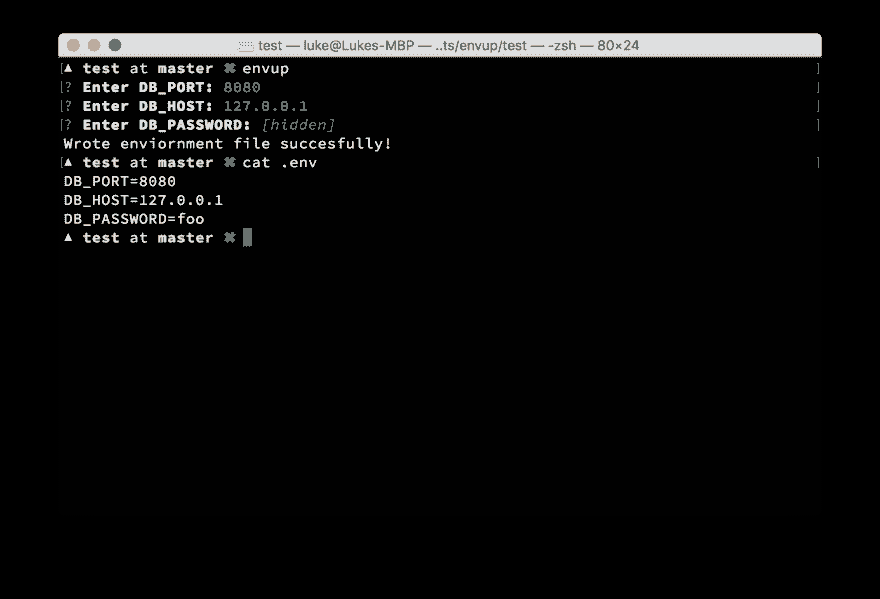

# 管理 git 存储库中的 dotenv 文件

> 原文:[https://dev . to/luk 707/managing-dotenv-files-in-git-repositories](https://dev.to/luk707/managing-dotenv-files-in-git-repositories)

有时，您的项目需要访问敏感信息，如访问令牌或数据库密码。也许您的项目需要一些配置，比如运行的主机名或端口。

如果是这样，那么很可能您至少知道 dotenv 文件。如果没有，请参阅这篇关于在 Node.js 中管理环境变量的文章。

在 git 存储库中存储敏感信息的最大问题是您可能会推送和泄露这些密钥(对于开源项目来说更是如此)。因此，作为一种预防措施，大多数 gitignore 文件模板包含所有扩展名为`.env`的文件。

现在安全都不在话下了，方便呢。当你第一次克隆一个依赖于`.env`文件的项目时，你必须 A)知道项目期望的环境变量，或者 B)从一个 env 示例文件或 readme 中复制并手动填充内容。

这可以更加简化，这就是为什么我发布了一个 npm 包 [envup](https://www.npmjs.com/package/envup) 。

[T2】](https://res.cloudinary.com/practicaldev/image/fetch/s--DXfKHqOI--/c_limit%2Cf_auto%2Cfl_progressive%2Cq_auto%2Cw_880/https://thepracticaldev.s3.amazonaws.com/i/7zjuzac7ry386rqcyr36.png)

这个工具允许您在项目的根目录下创建一个包含环境文件内容的`env.json`文件，然后用一个命令配置它。

这允许您忽略您的 env 文件，也使其他人配置他们的环境变得容易！