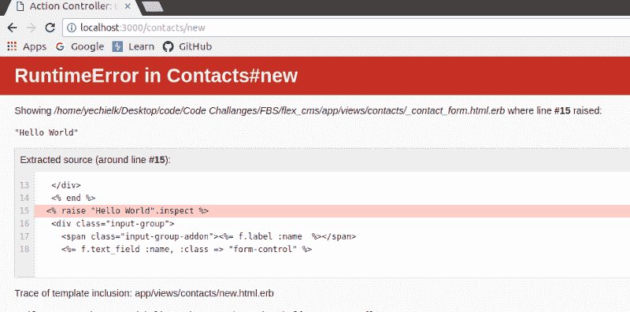
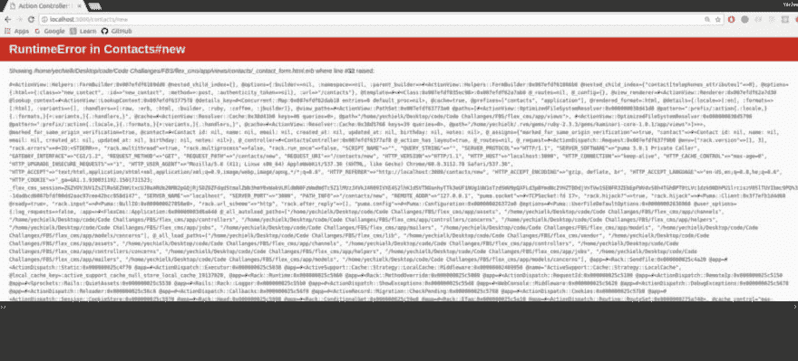

# Rails:嵌套表单中的单选按钮

> 原文:[https://dev.to/yechielk/rails-radio-buttons-in-nested-forms](https://dev.to/yechielk/rails-radio-buttons-in-nested-forms)

## 我的第一叠溢出答案背后的故事。

最近有人要求我给一个 Rails 应用程序添加一个特性。该应用程序是一个联系人管理系统(CMS)。每个联系人都有姓名、电子邮件地址和电话号码。我被要求为每个联系人添加多个电话号码的功能；每个电话号码应该可以是家庭电话号码、工作电话号码或手机号码。此外，其中一个号码应该被指定为默认号码。

我的方法是将电话号码移到一个单独的`PhoneNumber`类中，与`Contact`类有多对一的关系，所以现在每个联系人可以有许多电话号码，每个电话号码都属于一个联系人。

此外，我现在必须更新“新联系人”表单，以接受`PhoneNumber`类的嵌套属性，并添加一个单选按钮，以便用户可以选择哪个号码是默认号码，这就是我遇到问题的地方。

### 没有肥皂，收音机！

首先简单解释一下单选按钮的工作原理:

如果您查看带有单选按钮的表单的 HTML，您会看到每个按钮都有自己的`input`元素，将它们链接在一起的是它们都共享同一个`name`属性。这是它的样子:

```
<form>
  <input type="radio" name="picker" value="chose_me" checked> Chose Me!<br>
  <input type="radio" name="picker" value="no_me"> No Me!<br>
  <input type="radio" name="picker" value="whatever_who_cares"> Whatever, who cares?  
</form> 
```

[Codepen 样本](https://codepen.io/yechielk/pen/rzRRoZ)

注意每个`input`都有相同的名字(`picker`，这让浏览器知道它们都是链接的，并且它应该一次只允许选择一个按钮。

### Rails 助手

Rails 有一个内置的 helper 方法，可以为表单生成单选按钮；`radio_button`法。当在表单元素上调用该方法时，Rails 会自动生成具有正确属性的 HTML 元素，这样当表单被提交时，您的服务器就会知道如何从数据中构造一个新的对象(或更新现有的对象)。

我的问题是，我不是在做一个常规的表单，而是在做一个嵌套的表单，一个表单中的表单。我有我的联系表单，在联系表单中，我为我的 PhoneNumber 类收集属性。

Rails 通常能很好地处理这类事情。它的作用是，向表单添加字段，每个字段都有一个遵循`parent_class[nested_classes_attributes][:index][attribute]`格式的名称属性。所以在我的例子中，我将`PhoneNumbers`嵌套在`Contacts`父类中，第一个电话号码表单中的号码字段有一个`contact[phone_numbers_attributes][0][number]`的`name`属性；第二个电话号码表单中的号码字段有一个属性为`contact[phone_numbers_attributes][1][number]`的`name`，依此类推。每个表单都将索引递增 1，这样服务器就会知道我们在处理不同的 PhoneNumber 对象。

问题是我需要在每个电话号码表单上有一个单选按钮，这样用户可以选择哪个电话号码是默认的，但是我需要所有的单选按钮都有相同的名称。如前所述，Rails form helper 方法将每个电话号码视为一个单独的表单，并为每个按钮赋予不同的 name 属性。

像往常一样，我转向谷歌，非常兴奋地看到第一批结果中有一个与堆栈溢出问题相关的，听起来就像我遇到的问题。问题是，当我点击它时，我看到即使这个问题是在 2011 年首次提出的，它也只有三个答案，没有一个解决了我的问题。

[T2】](https://res.cloudinary.com/practicaldev/image/fetch/s--ZXR6UWOh--/c_limit%2Cf_auto%2Cfl_progressive%2Cq_auto%2Cw_880/https://imgs.xkcd.com/comics/wisdom_of_the_ancients.png)

### 大有帮助！

其中一个答案提供了一个不完整的解决方案，不是将单选按钮附加到现有的表单，而是将它作为一个独立的`radio_button_tag`并手动提供名称以及任何其他需要的属性。这将产生如下所示的表单:

```
<%= form_for @contact do |f| %>
    <%= f.text_field :name %>
    <%= f.email_field :email %>
    <%= f.fields_for :phoneNumbers do |phone_form| %>
        <%= phone_form.text_field :number %>
        <%= phone_form.select :location, ["Home", "Work", "Mobile", "Fax"] %>
        <%= radio_button_tag "contact[default_telephone]" %>
   <% end %>
<% end %> 
```

您会注意到`number`和`location`字段被附加到一个`phone_form`对象上，该对象赋予它们`name`属性，但是单选按钮标签没有附加到任何东西上，取而代之的是作为参数提供的名称(`contact[default_telephone]`)。

问题是单选按钮还需要两条信息才能正常工作。第一条信息是按钮被选中时提交的值，理想情况下是表单呈现的当前电话号码的索引。第二条信息是哪个电话号码是当前的默认号码，因此如果表单是编辑联系人表单，那么默认情况下会选择正确的按钮。而这两条信息在堆栈溢出回答中是缺失的；我独自一人。

### 解决所有问题的方法

我花了一些时间思考这个问题，并意识到一些事情。其他字段，即那些附加到`phone_form`的字段，很可能从`phone_form`对象中获取信息。如果我的`radio_button_tag`仍然在`phone_form`范围内(确实如此，只要我把它放在第一个`<% end %>`标签之前)，它应该可以访问`phone_form`对象和任何可用的方法。

我必须找到一种方法来检查这个`phone_form`对象，看看通过它能得到什么。

rails 中我最喜欢的调试方法之一是在我的代码中放置一个`raise <object>.inspect`,然后当我的应用程序到达该断点时，它会在屏幕上显示该对象为一个错误，同时还有一个控制台，可以访问断点处的任何变量。

问题是，我只在我的控制器中使用过这种方法，我从来没有在视图中使用过，虽然我有预感它会工作，但我想确定一下。因此，首先我在视图中间放置了以下内容:`<% raise "Hello World".inspect %>`并导航到该页面。果然，我得到了以下屏幕:

[T2】](https://res.cloudinary.com/practicaldev/image/fetch/s--mtbM8KP4--/c_limit%2Cf_auto%2Cfl_progressive%2Cq_auto%2Cw_880/https://cdn-images-1.medium.com/max/800/1%2AVL-FQKFxudVzo1znUxdTJg.png)

很好，现在让我们来检查实际的物体。我将下面的代码放入我的表单中，就在单选按钮标签的前面:
`<% raise phone_form.inspect %>`:

[T2】](https://res.cloudinary.com/practicaldev/image/fetch/s--qYryLKaw--/c_limit%2Cf_auto%2Cfl_progressive%2Cq_auto%2Cw_880/https://cdn-images-1.medium.com/max/1000/1%2AG8azhubxHhqI7XBBkGZ64w.png)

是啊，真是大开眼界。这就是 Ruby 对象的样子，这个对象显然是一个`FormBuilder`对象。我需要的所有信息都在巨大的文本墙中的某个地方；问题是如何找到它。

我走向底部的控制台，看看我能找到什么。运行`phone_form`显然给了我同样的文本墙，所以我决定运行`phone_form.methods`来看看`phone_form`对象有什么可用的方法。

我实际上运行了`phone_form.methods - Object.methods`来删除所有 Ruby 对象通用的方法，得到了:

```
>>  phone_form.methods - Object.methods
=> [:select, :index, :options, :label, :options=, :object, :multipart?, :submit, 
:object=, :fields, :to_partial_path, :to_model, :multipart, :date_select, 
:object_name, :time_select, :datetime_select, :fields_for, :text_field, 
:password_field, :hidden_field, :file_field, :text_area, :check_box, 
:radio_button, :color_field, :search_field, :telephone_field, :phone_field, 
:date_field, :time_field, :datetime_field, :datetime_local_field, :month_field, 
:week_field, :url_field, :email_field, :number_field, :range_field, 
:field_helpers, :field_helpers=, :multipart=, :button, :emitted_hidden_id?, 
:field_helpers?, :object_name=, :collection_select, :grouped_collection_select,
:time_zone_select, :collection_radio_buttons, :collection_check_boxes, 
:model_name_from_record_or_class, :convert_to_model] 
```

我尝试了一些听起来更有前途的方法名，发现`:index`方法确实给了我当前表单的索引，而`:object`给了我绑定到表单的对象，所以我最后的单选标记看起来像这样:
`<%= radio_button_tag "contact[default_telephone]", phone_form.index, phone_form.object.default %>`

第一个参数(`"contact[default_telephone]"`)是`name`属性，它对于所有的电话号码表单都是一样的，确保我的单选按钮像单选按钮一样工作。

第二个参数(`phone_form.index`)是单选按钮传入的值，它等于当前正在处理的表单的索引，控制器将使用它来确定哪个电话号码是默认的(我很快就会展示)。

第三个参数(`phone_form.object.default`)决定单选按钮是否应该默认选中。`phone_form.object`是表单正在渲染的当前`PhoneNumber`对象，`.default`是该`PhoneNumber`实例是否默认的当前值。

现在我只需要更新我的控制器，让它使用我的表单传递的信息。我在我的`create`和`update`控制器的开头添加了下面两行代码:

```
 def create
    # Determine the index of the phone number that should be the default 
    default_index = params[:contact][:default_telephone]
    # Set the phone number at that index as default
    params[:contact][:telephones_attributes][default_index][:default] = true
    # Create the new object....
  end 
```

### 分享爱！

只剩下一件事要做了。我记得发现堆栈溢出问题没有正确答案是什么样的，我意识到我可能不是最后一个问这个问题的人，所以我返回了这个问题，并添加了我的第一个堆栈溢出答案！

<header>

#  [ 回答 re: Rails:嵌套对象的单选按钮选择](https://stackoverflow.com/questions/5090820/rails-radio-button-selection-for-nested-objects/46029423#46029423)

Sep 4 '17[9](https://stackoverflow.com/questions/5090820/rails-radio-button-selection-for-nested-objects/46029423#46029423) </header>

你可以使用`radio_button_tag`并传递给它你自己的 name 属性。

由于您仍然在`choice_fields`范围内，您可以使用一些方法来公开您正在处理的对象，这将帮助您正确地命名您的`radio_button_tag`。

下面的代码会给你的…

<button class="ltag__stackexchange--btn" type="button">[Open Full Answer](https://stackoverflow.com/questions/5090820/rails-radio-button-selection-for-nested-objects/46029423#46029423)</button>

> Yechiel K[@ yechielk](https://dev.to/yechielk)刚刚回答了我在 [@StackOverflow](https://twitter.com/StackOverflow) 上的第一个问题！
> 
> [stackoverflow.com/a/46029423/629…](https://t.co/7Ouxea3ZRl)2017 年 9 月 04 日上午 04:24[](https://twitter.com/intent/tweet?in_reply_to=904560867752243200)[](https://twitter.com/intent/retweet?tweet_id=904560867752243200)0[](https://twitter.com/intent/like?tweet_id=904560867752243200)3

作为一个代码新手，我花了无数个小时阅读关于堆栈溢出的问答。栈溢出一直是我的哥们，导师，和大哥。能够回馈和贡献是一个巨大的里程碑。希望这个答案是众多答案中的第一个。

* * *

*这篇文章是从我的博客 [Coding Hassid](https://blog.yechiel.me/rails-radio-tags-in-nested-forms-4f252ae8cf53)
交叉发布的，你可以在那里阅读更多关于我的编码之旅，或者在 Twitter 上关注我 [@yechielk](https://twitter.com/yechielk)*