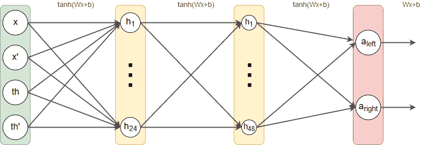
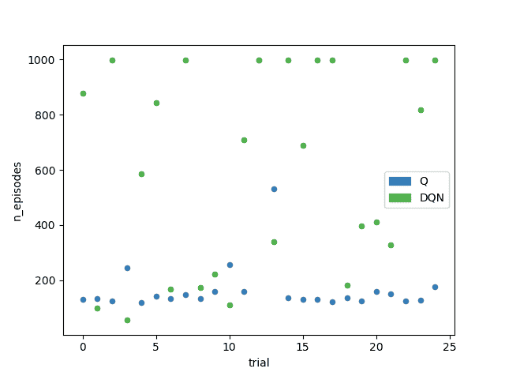

# 具有深度 Q 网络的杆

> 原文:[https://dev.to/n1try/cartpole-with-a-deep-q-network](https://dev.to/n1try/cartpole-with-a-deep-q-network)

在我的[上一篇文章](https://dev.to/n1try/cartpole-with-q-learning---first-experiences-with-openai-gym)中，我开发了一个基于经典 Q-Learning 算法的 [OpenAI Gym 的 CartPole 环境](https://gym.openai.com/envs/CartPole-v0)的解决方案。**我用它取得的最好成绩是 120** ，尽管我上传到[排行榜](https://gym.openai.com/evaluations/eval_emRbuGdHRnWoJuMUnPwd1Q)的成绩是 188。虽然这肯定不是一个坏结果，但我想知道如果使用更先进的技术，我是否能做得更好。除此之外，我还想实践我最近在大学的[机器学习 2](http://www.aifb.kit.edu/web/Lehre/Vorlesung_Maschinelles_Lernen_2_%E2%80%93_Fortgeschrittene_Verfahren/en) 课程中学到的概念。顺便说一下，我发现学习新算法的最好方法之一。实际上是**尝试在代码**中实现它们！

## 动机

我的经典 Q-Learning 方法的一个主要限制是，可能状态的数量必须从基本上无穷大(由于观察的连续性质)减少到我的情况下的`1 * 1 * 6 * 12 = 72`个离散状态。考虑到这种极端的简化，结果是惊人的好！然而，如果我们可以利用更多的信息，观察给我们？一种解决方案是将 Q 学习与(深度)神经网络相结合，这产生了一种称为深度 Q 学习(DQN)的技术。当处理非常高维的问题时，神经网络天生有效。这就是为什么他们在图像、视频和音频数据方面做得如此之好。此外，它们可以轻松处理连续输入，而我们的经典方法需要 Q 表是一个有限的(在这种情况下是(4+1)维)矩阵(或张量)。因此，使用 DQN，我们不再需要离散的桶，而是能够直接使用原始观测值。

## 深度 Q-学习

但是这是怎么做到的呢？虽然我不想在这里详细解释 DQN，但基本思想是用神经网络代替 Q 表，神经网络被训练来预测状态的 Q 值。输入是一个状态向量(或一批这样的向量)，在这种情况下由四个特征组成(对应于四个输入神经元)。输出是一个 Q 值的向量，每个可能的动作一个，在我们的例子中是两个(对应于两个输出神经元)。使用**经验回放**完成训练。基本上，代理开始尝试一些随机动作，并将其“经验”存储到内存中。一个体验就是一个类似`(old_state, performed_action, received_reward, new_state)`的元组。以固定的间隔(例如，在每个训练集之后，但不是在每个步骤之后)，从存储器中对批次进行采样，并用作网络的训练数据。因此，该网络(有望)改善每一集，并为状态-行为对预测更精确的 Q 值。

## 我的实现

我的实现基本上是基于 [Keon](https://github.com/keon) 的[这篇伟大的博文](https://keon.io/deep-q-learning/)。它使用 [Keras](http://keras.io) 作为 [TensorFlow](http://tensorflow.com) 之上的高级抽象。然而，在我采用通用结构的同时，我做了一些调整和修复来大幅提高性能。

### 调整#1:更多隐藏神经元

我稍微修改了一下网络布局，将第二个隐藏层的隐藏神经元数量增加了一倍。在随机试验一些布局时，我发现这种布局平均起来似乎更好。一般来说，确定一个神经网络的布局基本上是试错法。主要是你想掌握[偏差-方差权衡](https://en.wikipedia.org/wiki/Bias%E2%80%93variance_tradeoff)，但是没有规则如何选择网络结构以便这样做。我的现在是这样的:

[T2】](https://res.cloudinary.com/practicaldev/image/fetch/s--a1YZPomn--/c_limit%2Cf_auto%2Cfl_progressive%2Cq_auto%2Cw_880/https://ferdinand-muetsch.img/dqn4.png)

### 调整#2:更大的重放内存

在 Keon 的最初实现中，重放内存的最大容量是 2000。假设平均“存活”时间为 100 步，它只能保存 20 集的经验，这并不多。我看不出有什么理由不让它们在训练例子中有更大的变化，所以我把**的内存大小增加到 100，000** 。

### 调整#3:小批量训练

虽然最初网络是从每集 32 个样本中训练出来的，但在我看来，训练的方式并不高效。不是给 TensorFlow 一个 **32 x 4 矩阵**，而是给它一个 **1 x 4 矩阵 32 倍**，所以实际的训练过程有效地使用了 1 的小批量。在没有 TensorFlow 如何工作的技术知识的情况下，我仍然非常确定用一个大批量而不是 32 个小批量来训练网络更快——特别是在使用 GPU 时。

### 调整#4:设置= 1

正如我在上一篇文章中提到的，我认为将 gamma 参数设置为小于 1 是没有意义的。其目的是“惩罚”需要很长时间才能达到目标的代理。然而，在翻筋斗中，我们的目标是尽可能多走几步。

### 调整#5:对数衰减

由于来自 [@tuzzer 的解决方案](https://medium.com/@tuzzer/cart-pole-balancing-with-q-learning-b54c6068d947)的自适应探索率在我上次的实现中非常有效，所以我也简单地将其用于这次实现。我没有交叉验证它比 [Keon](https://github.com/keon) 的ε衰变更好还是更差，但至少它看起来不坏。

[T2】](https://res.cloudinary.com/practicaldev/image/fetch/s--oNRN-ABO--/c_limit%2Cf_auto%2Cfl_progressive%2Cq_auto%2Cw_880/https://ferdinand-muetsch.img/dqn3.png)

### 调整#6: tanh 激活功能

这一点我真的不太清楚，如果说错了请指正。最初的实现使用 ReLU 激活函数，它是一个线性函数，将输入映射到自身，但是阈值为零。

[T2】](https://res.cloudinary.com/practicaldev/image/fetch/s--kHlVxgX8--/c_limit%2Cf_auto%2Cfl_progressive%2Cq_auto%2Cw_880/https://ferdinand-muetsch.img/dqn2.png)

然而，由于输入特征可能是负的，ReLU 可能会导致神经元死亡，不是吗？为了克服这个问题，我决定将 *tanh* 作为一个激活函数。

### 调整#7:交叉验证超参数

最终，我进行了网格搜索(使用我上次的[脚本](https://gist.github.com/n1try/87b442fce7f7d58606f462191c6d6033)，为`alpha`(学习率)、`alpha_decay`和`epsilon_min`(最小探索率)找到好的值。结果表明，平均来看，`alpha=0.01`、`alpha_decay=0.01`和`epsilon_min=0.01`似乎是所有测试值中效果最好的。

## 结果

在所有这些优化之后，我运行了几次该算法，我获得的最好成绩实际上是 **24** 。然而，我没有记录那次跑步，所以我在[排行榜](https://gym.openai.com/evaluations/eval_EIcM1ZBnQW2LBaFN6FY65g)中的最好成绩是 **85** ，这比我的经典 Q-Learning 方法要好。
然而，我发现尽管 DQN 方法*可以*收敛得更快，但同时它似乎也更加不稳定。连续两次运行完全相同的算法和配置通常会导致一个分数非常好，而第二个分数甚至根本没有解决环境问题(> 999 集)。换句话说，DQN 的方差比基于表格的方法大得多，如下图所示，我对每种算法运行了 25 次。此外，正如所料，神经网络速度较慢。运行 DQN 25 次花费了 **744 秒**，而运行基于表格的 Q-Learning 25 次仅花费了 **24 秒**在我的机器的 CPU 上使用四个线程在四个核心上。

[>>【github 上的代码(dqm _ carpole . py)](https://gist.github.com/n1try/2a6722407117e4d668921fce53845432)

[T2】](https://res.cloudinary.com/practicaldev/image/fetch/s--2Jhx7oz2--/c_limit%2Cf_auto%2Cfl_progressive%2Cq_auto%2Cw_880/https://ferdinand-muetsch.img/dqn1.png)

**Q**:`Min 120, Max 999, Mean 197.16, Std: 183.223`
T5】DQN:`Min 56, Max 999, Mean 600.04, Std: 356.046`