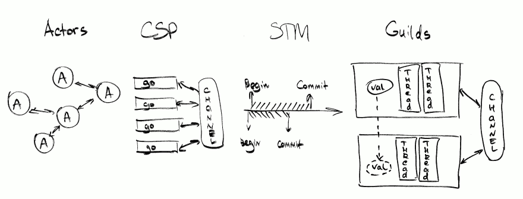

# Ruby 并发模型介绍。第二部分

> 原文：<https://dev.to/exaspark/introduction-to-concurrency-models-with-ruby-part-ii>

# Ruby 并发模型介绍。第二部分

在本系列的第二部分中，我们将看看更高级的并发模型，如参与者、通信顺序进程、软件事务内存，当然还有 Guilds——一种可能在 Ruby 3 中实现的新的并发模型。

如果你还没有读过我们系列的第一篇文章,我强烈建议你先读一读。在那里我描述了进程、线程、GIL、EventMachine 和纤程，我将在这篇文章中提到它们。

[T2】](https://res.cloudinary.com/practicaldev/image/fetch/s--zwHaza-V--/c_limit%2Cf_auto%2Cfl_progressive%2Cq_auto%2Cw_880/https://cdn-images-1.medium.com/max/7684/1%2AwTtV8K5ZTTA8B0jv8aZqnQ.jpeg)

## 演员

参与者是并发原语，可以相互发送消息，创建新的参与者，并确定如何响应下一个接收到的消息。他们保留自己的私有状态而不共享，所以他们只能通过消息来影响彼此。因为没有共享状态，所以不需要锁。

> *不通过共享内存进行交流；相反，通过交流来分享记忆。*

Erlang 和 Scala 都在语言本身中实现了 Actor 模型。在 Ruby 中，[赛璐珞](https://github.com/celluloid/celluloid)是最流行的实现之一。在幕后，它在一个单独的线程中运行每个参与者，并为每个方法调用使用纤程，以避免在等待其他参与者的响应时阻塞方法。

这里有一个演员用赛璐珞的基本例子:

```
# actors.rb
require 'celluloid'
class Universe
  include Celluloid
  def say(msg)
    puts msg
    Celluloid::Actor[:world].say("#{msg} World!")
  end
end
class World
  include Celluloid
  def say(msg)
    puts msg
  end
end
Celluloid::Actor[:world] = World.new
Universe.new.say("Hello") 
```

Enter fullscreen mode Exit fullscreen mode

```
$ ruby actors.rb
Hello
Hello World! 
```

Enter fullscreen mode Exit fullscreen mode

### 优点:

*   没有手动多线程编程和共享内存意味着没有显式锁的几乎无死锁的同步。

*   与 Erlang 类似，赛璐珞使演员容错，这意味着它将尝试用[监管器](https://github.com/celluloid/celluloid/wiki/Supervisors)重启崩溃的演员。

*   Actor 模型是为解决分布式程序的问题而设计的，因此它非常适合跨多台机器伸缩。

### 缺点:

*   如果系统需要使用共享状态，或者您需要保证某个行为需要以特定的顺序发生，那么 Actors 可能不工作。

*   调试可能很棘手——想象一下通过多个参与者跟踪系统流程，或者如果一些参与者改变了消息会怎么样？记住 Ruby 不是一种不可变的语言，对吗？

*   与手动处理线程相比，赛璐珞可以更快地构建复杂的并发系统。但是它以[运行时间成本](http://www.mikeperham.com/2015/10/14/optimizing-sidekiq/)来实现(例如，速度慢 5 倍，内存多 8 倍)。

*   不幸的是，Ruby 实现并不擅长跨多个服务器使用分布式角色。比如使用 0MQ 的 [DCell](https://github.com/celluloid/dcell) ，还没有做好生产准备。

### 例子:

*   [卷轴](https://github.com/celluloid/reel/)–基于事件的网络服务器，与基于赛璐珞的应用程序一起工作。每个连接使用一个参与者。可用于流或 WebSockets。

*   [赛璐珞::IO](https://github.com/celluloid/celluloid-io/)–将演员和事件 I/O 循环放在一起。与 EventMachine 不同，通过创建多个 Actors，它允许每个流程使用任意多的事件循环。

## 沟通顺序流程

沟通顺序流程(CSP)是一个与参与者模型非常相似的范例。它也是基于不共享内存的消息传递。然而，CSP 和 Actors 有以下两个主要区别:

*   CSP 中的流程是匿名的，而参与者是有身份的。因此，CSP 使用显式通道进行消息传递，而 Actors 则直接发送消息。

*   使用 CSP，发送方无法传输消息，直到接收方准备好接受它。演员可以异步发送消息(例如在赛璐珞中用[异步调用](https://github.com/celluloid/celluloid/wiki/Basic-usage))。

CSP 是用这样的编程语言实现的:Go 带 [goroutines 和通道](https://blog.golang.org/share-memory-by-communicating)，Clojure 带 [core.async](http://clojure.com/blog/2013/06/28/clojure-core-async-channels.html) 库，Crystal 带[纤程和通道](https://crystal-lang.org/docs/guides/concurrency.html)。对于 Ruby，有一些 gem 实现了 CSP。其中之一是在 [concurrent-ruby](https://github.com/ruby-concurrency/concurrent-ruby/blob/df482db36caf1b0c1d69a8ff97a2407469e1e315/doc/channel.md) 库中实现的`Channel`类:

```
# csp.rb
require 'concurrent-edge'
array = [1, 2, 3, 4, 5]
channel = Concurrent::Channel.new
Concurrent::Channel.go do
  puts "Go 1 thread: #{Thread.current.object_id}"
  channel.put(array[0..2].sum) # Enumerable#sum from Ruby 2.4
end
Concurrent::Channel.go do
  puts "Go 2 thread: #{Thread.current.object_id}"
  channel.put(array[2..4].sum)
end
puts "Main thread: #{Thread.current.object_id}"
puts channel.take + channel.take 
```

Enter fullscreen mode Exit fullscreen mode

```
$ ruby csp.rb
Main thread: 70168382536020
Go 2 thread: 70168386894280
Go 1 thread: 70168386894880
18 
```

Enter fullscreen mode Exit fullscreen mode

因此，我们基本上在两个不同的线程中运行了两个操作(`sum`)，同步了结果并在主线程中计算了总值。一切都是通过`Channel`完成的，没有任何显式的锁。

在底层，每个`Channel.go`在线程池中的一个单独的线程中运行，如果没有空闲线程，线程池会自动增加它的大小。在这种情况下，在阻塞 I/O 操作期间使用这种模型是有用的，这将释放 GIL(参见[上一篇文章](https://engineering.universe.com/introduction-to-concurrency-models-with-ruby-part-i-550d0dbb970)了解更多信息)。另一方面，例如，Clojure 中的 core.async 使用有限数量的线程并试图“停放”它们，但这种方法在 I/O 操作期间可能会出现问题，这可能会[阻塞任何其他工作](https://martintrojer.github.io/clojure/2013/07/07/coreasync-and-blocking-io)。

### 优点:

*   CSP 信道最多只能容纳一条消息，这使得推理更加容易。而对于 Actor 模型，它更像是拥有一个潜在的无限邮件邮箱。

*   通信顺序流程允许您通过使用通道来避免生产者和消费者之间的耦合；他们不需要互相了解。

*   在 CSP 中，消息按照发送的顺序传递。

> *Clojure 最终可能会支持分布式编程的 actor 模型，只在需要分布的时候才付出代价，但是我觉得对于同进程编程来说还是挺麻烦的。[有钱的吻痕](https://clojure.org/about/state#actors)T3】*

### 缺点:

*   CSP 通常在单台机器上使用，它没有分布式编程的 Actor 模型那么好。

*   在 Ruby 中，大部分实现都没有使用 M:N 线程模型，所以每个“goroutine”实际上都使用了一个 Ruby 线程，相当于一个 OS 线程。这意味着 Ruby“go routines”不是那么轻量级的。

*   在 Ruby 中使用 CSP 并不流行。因此，没有积极开发的、稳定的、经过实战检验的工具。

### 例子:

*   代理——CSP 的另一个 Ruby 实现。这个 gem 也在一个单独的 Ruby 线程中运行每个 go-block。

## 软件事务性内存

Actors 和 CSP 是基于消息传递的并发模型，而软件事务内存(STM)是使用共享内存的模型。这是基于锁的同步的替代方案。与数据库事务类似，这些是主要概念:

1.  事务中的值可以更改，但是这些更改对其他人来说是不可见的，直到事务被**提交**。

2.  在事务**中发生的错误中止**它们并回滚所有的更改。

3.  如果一个事务由于冲突的改变而不能被提交，它**重试**直到它成功。

[并发红宝石](https://github.com/ruby-concurrency/concurrent-ruby)宝石实现了 [TVar](https://ruby-concurrency.github.io/concurrent-ruby/Concurrent/TVar.html) ，这是基于克洛伊的[参考文献](https://clojure.org/reference/refs)。下面是一个例子，它实现了资金从一个银行账户到另一个银行账户的转账:

```
# stm.rb
require 'concurrent'
account1 = Concurrent::TVar.new(100)
account2 = Concurrent::TVar.new(100)
Concurrent::atomically do
  account1.value -= 10
  account2.value += 10
end
puts "Account1: #{account1.value}, Account2: #{account2.value}" 
```

Enter fullscreen mode Exit fullscreen mode

```
$ ruby stm.rb
Account1: 90, Account2: 110 
```

Enter fullscreen mode Exit fullscreen mode

`TVar`是包含单个值的对象。它们与`atomically`一起在事务中实现数据突变。

### 优点:

*   与基于锁的编程相比，使用 STM 要简单得多。它允许避免死锁，简化关于并发系统的推理，因为你不必考虑竞争条件。

*   更容易适应，因为你不需要像 Actors(使用模型)或 CSP(使用通道)那样重构代码。

### 缺点:

*   因为 STM 依赖于事务回滚，所以您应该能够在任何时间点撤销事务中的操作。实际上，很难保证您是否进行了 I/O 操作(例如，POST HTTP 请求)。

*   STM 与 Ruby MRI 的伸缩性不好。因为有 GIL，你不能使用超过一个 CPU。同时，你也不能利用在线程中运行并发 I/O 操作的优势，因为很难撤销这样的操作。

### 例子:

*   来自 [concurrent-ruby](https://github.com/ruby-concurrency/concurrent-ruby) 的 TVar 实现了 STM，并且还包含了一些[基准](https://ruby-concurrency.github.io/concurrent-ruby/Concurrent/TVar.html)，它们在 MRI、JRuby 和 Rubinius 中比较了基于锁的实现和 STM。

## 行会

Guild 是由 Koichi Sasada 为 Ruby 3 提出的一种新的并发模型 Koichi Sasada 是一位 Ruby 核心开发人员，他设计了当前的 Ruby VM(虚拟机)、fibers 和 GC(垃圾收集器)。以下是创建公会的要点:

*   新模型应该与 Ruby 2 兼容，并允许更好的并发性。

*   强制使用类似于 Elixir 的不可变数据结构可能会慢得令人无法接受，因为 Ruby 使用了许多“写”操作。因此，最好像 rack([Place](https://docs.racket-lang.org/reference/places.html))一样复制共享的可变对象，但是复制必须很快才能成功。

*   如果有必要共享可变对象，应该有类似 Clojure 的特殊数据结构(例如 STM)。

这些想法导致了以下行会的主要概念:

*   公会是一个并发原语，可以包含多个线程，可以包含多个纤程。

*   只有公会所有者可以访问它的可变对象，所以没有必要使用锁。

*   公会可以通过复制对象或者将成员资格(“移动”对象)从一个公会转移到另一个公会来共享数据。

*   不可变对象可以通过引用从任何公会访问，无需复制。如数字，符号，`true`，`false`，深度冻结的物体。

因此，我们用公会从一个银行账户转账到另一个银行账户的例子可能是这样的:

```
bank = Guild.new do
  accounts = ...
  while acc1, acc2, amount, channel = Guild.default_channel.receive
    accounts[acc1].balance += amount
    accounts[acc2].balance -= amount
    channel.transfer(:finished)
  end
end

channel = Guild::Channel.new
bank.transfer([acc1, acc2, 10, channel])
puts channel.receive
# => :finished 
```

Enter fullscreen mode Exit fullscreen mode

所有关于账户余额的数据都存储在一个单独的公会(`bank`)中，因此，只有这个公会负责可以通过渠道请求的数据突变。

### 优点:

*   公会之间没有可变的共享数据意味着不需要锁定机制，所以没有死锁。公会之间的通信是为了安全而设计的。

*   公会鼓励使用不可变的数据结构，因为这是跨多个公会共享数据的最快和最简单的方法。现在就开始冻结尽可能多的数据，例如，在文件的开头添加`# frozen_string_literal: true`。

*   公会与 Ruby 2 完全兼容，这意味着你当前的代码将只在一个公会中运行。您不需要使用不可变的数据结构或在代码中做任何更改。

*   与此同时，行会支持更好的 MRI 并发性。它最终将允许我们在一个 Ruby 进程中使用多个 CPU。

### 缺点:

*   现在预测性能还为时过早，但是与线程相比，在行会之间交流和共享可变对象可能会有更大的开销。

*   Guilds 是更复杂的并发原语，因为它们允许同时使用多个并发模型。例如:通过通道进行公会间通信的 CSP，具有特殊数据结构以共享可变数据从而提高性能的 STM，单个公会内的多线程编程等。

*   尽管从资源使用的角度来看，在一个进程中运行多个行会比运行多个进程更便宜，但是行会并不是轻量级的。它们将比 Ruby 线程更重，这意味着你将无法处理，比方说，仅仅通过公会的数万个 WebSocket 连接。

### 例子:

因为 Ruby 3 还没有发布，所以没有例子。但是我看到了一个光明的未来，开发者将开始构建像 web 服务器、后台作业处理等对公会友好的工具。很有可能所有这些工具都允许使用混合方法:用多个行会运行多个流程，每个行会都有多个线程。但是现在，你可以阅读 Koichi Sasada 的原始 PDF 演示文稿。

## 结论

没有灵丹妙药。文章中描述的每种并发模型都有其优缺点。CSP 模型在没有死锁的单台机器上工作得最好。Actor 模型可以轻松地跨多台机器伸缩。STM 允许编写更简单的并发代码。但所有这些模型都不是 Ruby 的一等公民，不能完全适应其他编程语言；主要是因为在 Ruby 中，它们都是用标准的并发原语实现的，比如线程和纤程。然而，有可能会在 Ruby 3 中发布公会，这是向更好的并发模型迈出的一大步！

*最初发表于[媒体](https://engineering.universe.com/introduction-to-concurrency-models-with-ruby-part-ii-c39c7e612bed)。*