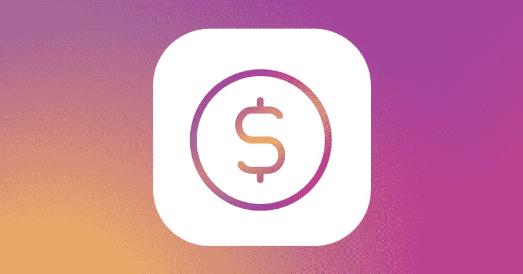
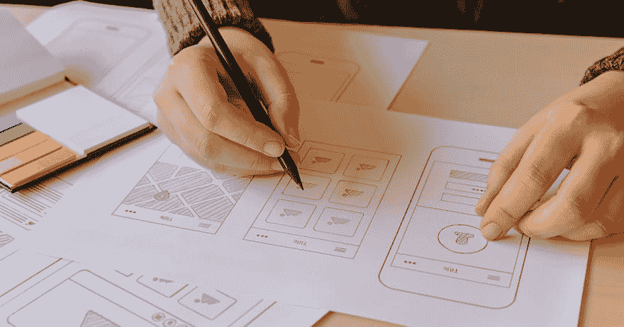
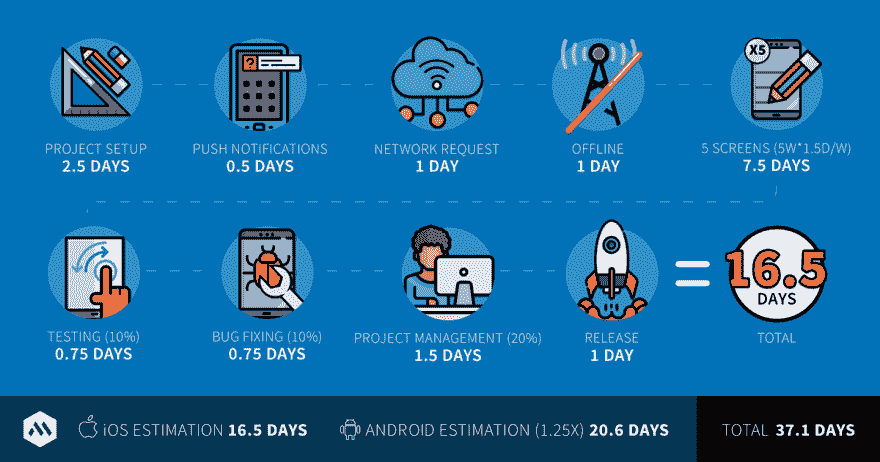
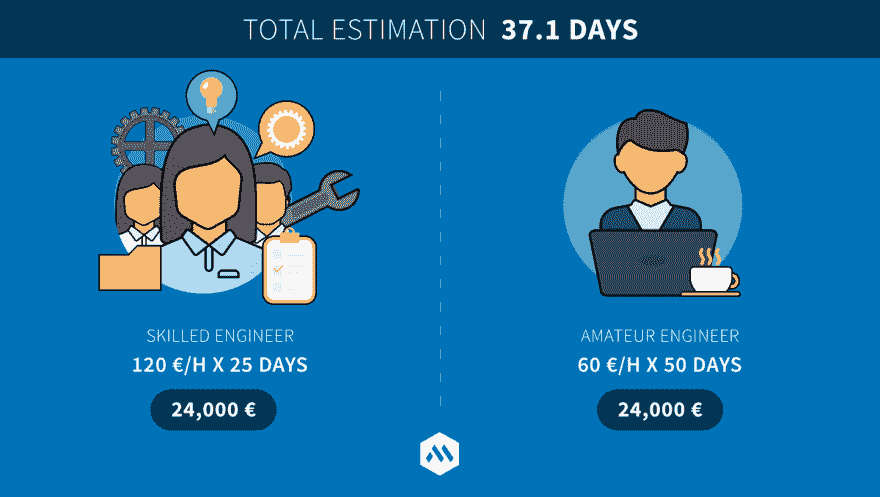

# 如何估算你的移动应用的成本

> 原文：<https://dev.to/bugfenderapp/how-to-estimate-the-cost-of-your-mobile-app>

*这篇文章最初[发表在我们的博客](https://bugfender.com/blog/how-to-estimate-the-cost-of-your-mobile-app/)上。*

[T2】](https://res.cloudinary.com/practicaldev/image/fetch/s--5kvLRdxW--/c_limit%2Cf_auto%2Cfl_progressive%2Cq_auto%2Cw_880/https://bugfender.com/wp-content/uploads/2017/09/estimating-mobile-apps.jpg)

蒙特利尔奥林匹克体育场、悉尼歌剧院和苏格兰议会大厦有什么共同点？

他们都是巨大的预算破坏者。蒙特利尔奥林匹克体育场在 1976 年夏季奥运会前及时完工，因其甜甜圈形状而被称为“大 O”，因其超出预算 1990%而被称为“大欠账”。

在巴塞罗那，我们有自己的预算大户，安东尼·高登的圣家堂。这座庞然大物巴西利卡的工程始于 1882 年，预计要到 2026 年——高登逝世一百年后——才能完工。据说其年度预算约为 2500 万欧元。

谢天谢地，我们从事的是构建应用程序的业务，而不是体育场或教堂。但是这两种情况下对高质量预算估计的需求是相同的。

开发一个手机 app 实际要花多少钱？在本文中，我们将带你了解移动应用程序的开发过程，并向你展示如何估算你需要的资金。

等等，为什么要听我们的？点击此处了解更多关于 Mobile Jazz 和我们的服务。

## 令人讨厌的惊喜

琼·马丁有丰富的应用程序开发经验。他已经在 Mobile Jazz 工作了四年，目前领导着我们的移动团队。当他不在山里享受休息时间时，他会管理移动团队项目，并涉足 iOS 工程。

[T2】](https://res.cloudinary.com/practicaldev/image/fetch/s--2QeQ6MQy--/c_limit%2Cf_auto%2Cfl_progressive%2Cq_auto%2Cw_880/https://mobilejazz.com/blog/wp-content/uploads/2017/09/joan-martinique.jpg)

琼我们的移动小组在马提尼克岛负责。

如果你想在不久的将来创建一个应用程序，直接启动它可能会很有诱惑力。时间不多了，对吧？琼建议不要这样做:

> “你需要非常清楚开发你的移动应用需要多少成本。这将有助于你调整自己的预期，并做好相应的准备——避免日后令人不快的意外。”

所以这只是一个运行数字的问题？我们喜欢这种热情。但是首先，你需要引导你内心的政治家，定义你的产品宣言。

## 产品宣言

想象一下，你正在参加一个社交活动(对一些人来说是梦想，对另一些人来说是噩梦——但在这里请忍耐一下)。有人问你:“那么你的应用到底是做什么的？”你能给他们一个明确的答复吗？如果你的祖父母也问同样的问题呢？

这是一切开始的地方——你的产品宣言。你的整个团队需要能够向他们的祖父母解释。它将帮助您定义发展路径，并围绕关键特性进行所有决策。

它需要是一个简单而精确的陈述。它应该传达——给任何询问的人——你的产品是什么，它是给谁的，它解决了什么问题。

琐事时间。这里有一些著名的产品宣言，但是你知道产品的名字吗？

*   "一个人们旅行时可以从其他人那里租赁公寓的平台."
*   “将世界各地的专业人士联系起来，让他们更有效率、更成功。”
*   “你需要的所有音乐。数百万首歌曲即刻可用。”

你做得怎么样？这些分别是 Airbnb、LinkedIn 和 Spotify 的宣言。

注意这三者的简洁之美。焦点保留在产品解决的单一主要问题上，不会迷失在不重要的细节中。

一旦你有了一个产品宣言，你的团队应该像网球围绕着一套旋转球一样围绕着它。你会一次又一次地想起它；从举办第一次产品研讨会，一直到全面上市。不要轻易迈出这一步——世界上最成功的公司都没有。

## 集合你的队伍

说到团队——你有团队吗？

[T2】](https://res.cloudinary.com/practicaldev/image/fetch/s--t_sonfnY--/c_limit%2Cf_auto%2Cfl_progressive%2Cq_auto%2Cw_880/https://mobilejazz.com/blog/wp-content/uploads/2017/09/mj-team-italian-alps.jpg)

*MJ 队员在意大利阿尔卑斯山徒步旅行。*

以下是主要参与者:

*   **产品人**。这个小组应该高度参与确定宣言。他们不断地回答“我们的应用程序是做什么的？”并围绕关键特性做出有针对性的决策。
*   **设计人员**。不要吝啬优秀的移动设计师——那些重视用户体验高于一切的人是一个普通应用和一个伟大应用的区别。
*   **开发人员**。找到有经验的熟练工程师。这个团队正在为你的应用打下基础——不要把基础建立在流沙上。
*   **测试人员**

等等，测试人员？我们不能用我们的开发人员来做吗？

你会让厨师长点评她自己的餐厅吗？即使是世界上最优秀的开发者，对 app 的理解也是有偏差的。他们花了几个月的时间通过打开应用程序并以某种方式测试代码来实现功能。因此，他们有盲点。琼又来了:

> “一个普通的测试人员会像你的用户一样接近应用程序，揭示那些原本不会被发现的角落案例和错误。他们将探索产品所有者和开发人员都没有计划到的流程。”

那么如果产品负责人和开发者都不能测试你的 app，谁能呢？嗯，几乎任何人——朋友、亲戚或专业测试公司。当你团队中的某个人第一次探索这个应用时，你会获得最好的洞察力。

## 规划

虽然圣家族大教堂看起来像是一场自由的设计狂潮，但每一个立面都经过了精心的规划——工程师和施工人员一丝不苟地遵循着蓝图。

[T2】](https://res.cloudinary.com/practicaldev/image/fetch/s--fXYqcVEu--/c_limit%2Cf_auto%2Cfl_progressive%2Cq_auto%2Cw_880/https://mobilejazz.com/blog/wp-content/uploads/2017/09/sagrada-familiar.jpg)

*我们无法想象圣家堂所涉及的规划。*

引导你的内心，精心计划以下事情:

*   产品定义。这是你对产品的愿景。它应该包括产品概念、设计要求、功能、目标市场、定价点和定位策略。
*   用例列表。不同的受众会如何以不同的方式使用你的应用？这些有时被称为用户故事。在完成这项任务时，要以应用程序的最基本规范为目标——仅仅描述用户可以用它做什么。集思广益，收集更多用例。
*   线框。UX 的设计师将先前定义的规格转换成用户流的可视化表示。线框是规范文件和最终设计之间的步骤。他们向您的团队“展示”应用程序，就像第一次显示婴儿发育情况的超声波一样。
*   期望的平台。要不要在安卓上运行？iOS？两者都有？确保你能从商业角度证明在你的平台上运行是合理的。
*   后端文档。围绕应用和基础设施的数据访问层的指导。

请务必回答以下附加问题:

*   你的应用会有社交整合吗？哪些？
*   你的应用会有推送通知吗？什么情况下？
*   您的应用程序将支持哪些语言？为什么？
*   您的应用将支持哪些操作系统版本？为什么？
*   您会针对平板电脑或智能手机进行优化吗？为什么？你会从哪一个开始？
*   你的应用会得到离线支持吗？为什么/为什么不？

仔细想想最后一个问题的答案。“离线支持”没有神奇的开关——构建这一功能是一项复杂的任务。你的应用程序需要能够从互联网上获取数据，将其存储在用户的本地设备上，并在没有互联网时重用。需要做大量的计划——计划会占用你更多的宝贵时间。

[T2】](https://res.cloudinary.com/practicaldev/image/fetch/s--7Lq9x5z4--/c_limit%2Cf_auto%2Cfl_progressive%2Cq_auto%2Cw_880/https://mobilejazz.com/blog/wp-content/uploads/2017/09/app-wireframes.jpg)

用线框规划你的应用程序屏幕是重要的一步。

## 估计

时间就是金钱，我们都知道。因此，在我们开始讨论美元和美分之前，我们需要计算时间和天数。

首先，我们需要定义如何。我们的主要计量单位是工作天数，1 天等于 8 小时。在 Mobile Jazz，我们使用最小值 0.25 天，相当于 2 小时。这是因为，根据我们的经验，任何比这小的都是不现实的。

我们将通过线框来评估，因为它是你的应用程序中最真实的屏幕外观。它还反映了用户交互和数据管理的复杂性。每个线框都必须包含对这两件事的估计:

*   **UI 布局:**与创建用户界面(UI)元素及其布局相关的任务。这与 UI 交互相关的动作无关，而是实现不同 UI 元素的复杂性。
*   **业务逻辑:**与应用流程管理和智能相关的任务。例如，一个按钮——当按下时——向服务器发送请求，然后服务器处理接收到的数据，将其存储在数据库中，与其他数据进行比较，最后向用户输出结果。它还与实现屏幕导航的复杂性有关。

除去喧闹的公司聚会后的宿醉时间，一般来说，UI 布局需要 0.5 天，业务逻辑需要 0.5 天——每个屏幕需要 1 天。

将以下组件放入等式中:

*   项目设置的额外 2 天时间
*   另外 15%用于测试
*   另外 20%用于修复漏洞
*   和一个额外的释放日
*   另外 20%用于项目管理

还和我们在一起吗？很好。现在，为 Android 开发平均比 iOS 估计多花 1.5 倍的时间。我们请琼解释:

> “这个数字来自我们的经验。用于创建 UI 的 Android API 比 iOS API 更复杂。它也有更多的设备，每一个都有自己的设置来控制。在 iOS 中，苹果会自动完成这一过程——这要简单得多。”

## 示例估计

让我们想象一下，你的团队已经有了一个从网上收集假新闻的杀手级新应用。下面是一个例子，说明您的应用程序可能包含哪些内容:

1.  登录和注册。
2.  饲料和(假)新闻职位。
3.  你的资料。
4.  出现在提要中的新帖子的一个推送通知。
5.  离线支持。

现在，您的估计可能是这样的:

[T2】](https://res.cloudinary.com/practicaldev/image/fetch/s--0qO0u5Vq--/c_limit%2Cf_auto%2Cfl_progressive%2Cq_auto%2Cw_880/https://mobilejazz.com/blog/wp-content/uploads/2017/09/ema-estimation.jpg)

请记住，这一估算中没有包括什么:

*   后端开发、评估和测试。
*   设计和资产的削减。
*   测试阶段。
*   新功能。
*   维护和升级。

## 现金飞溅

是时候了。带着沾沾自喜的笑容、规划文件、估价单和装满未标记账单的公文包，你大步走进最近的合作空间去寻找自由工程师。

但是，为了找到这份工作的最佳人选并满足你的业务需求，应该问什么样的问题呢？每小时的费用是多少？

这是个不该问的问题。你的估计已经完成——你知道整个过程需要多少时间。所以你可以雇佣一个花费更长时间的人来破坏评估，或者雇佣一个工作更快的人来完成指定的时间框架。

最好的问题是:“你有什么经验？”

熟练的工程师会以更高的每小时速度更快地完成项目。一个业余工程师将以较低的每小时速度较慢地完成项目。

我们已经算过了:

[T2】](https://res.cloudinary.com/practicaldev/image/fetch/s--CBQmJE_g--/c_limit%2Cf_auto%2Cfl_progressive%2Cq_auto%2Cw_880/https://mobilejazz.com/blog/wp-content/uploads/2017/09/ema-engineers.jpg)

有些人会忍不住从这个数字中减去一些现金。所以他们去找一个差劲的工程师，他声称他们会以更低的速度做得更快。每小时 60 英镑 x 25 天= 12，000 英镑。不错的节省——但是你得到了你所付出的。以下是我们在与廉价机构和初级开发人员的合作中看到的一些情况:

*   离线支持差(或不存在)
*   对不同屏幕尺寸的适应性差
*   对新旧操作系统版本的可怕支持
*   薄弱的软件架构–使您的应用不可扩展
*   糟糕的职业关系

## 应用成功的 5 个步骤

获得一个应用程序的想法是令人兴奋的。启动它，看着它成功，更是如此。如果你想达到目标，首先要打好基础，给自己最好的机会:

1.  定义你的应用宣言:它能做什么？
2.  获得移动 UX/用户界面专家。
3.  找一个你觉得不错的有经验的工程团队。
4.  开发你的应用程序，只实现关键特性(其他的都可以等)。
5.  如果太贵了，可以通过删除功能和减少估计时间来简化你的应用。

遵循这些步骤，你和你的团队就能做出不超出预算的杰作。

移动爵士乐如何帮助建立你的圣家堂？[取得联系](https://mobilejazz.com/contact)。