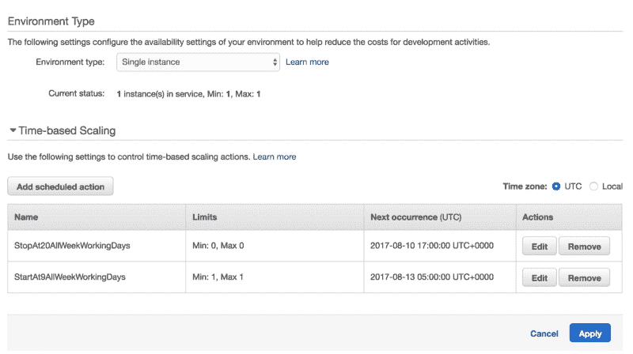
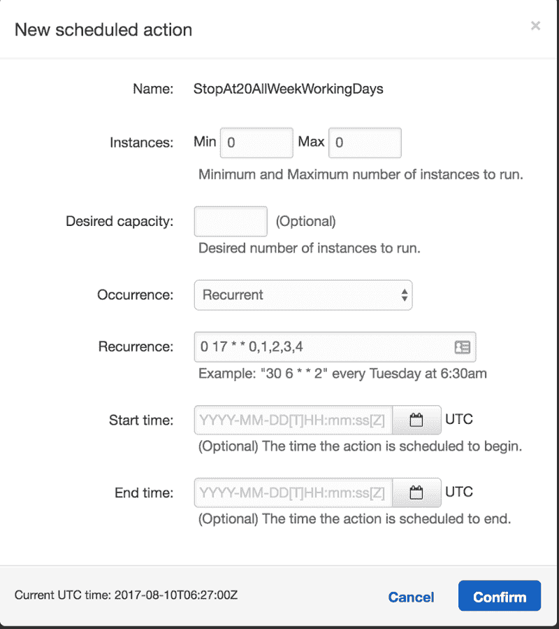
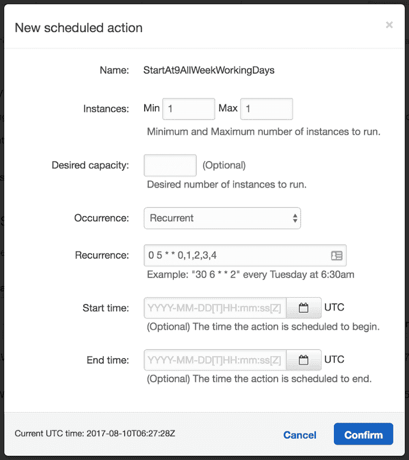

# 如何通过让 AWS Elastic Beanstalk EC2 机器进入睡眠状态来节省它们

> 原文：<https://dev.to/poison_dv/how-to-save-on-aws-elastic-beanstalk-ec2-machines-by-putting-them-to-sleep>

如果您在 AWS Elastic Beanstalk 上运行一些非生产环境，您可能想知道如何在下班时间让它的服务器休眠，以便节省一些资源💰💰💰？

AWS 提供了一个简单的技巧，但不要因为一个原因而推广它。因此，没有多少人知道它。；)

您所需要做的就是在您的环境中定义两个时间段*配置- >扩展- >基于时间的扩展部分。*

[T2】](https://res.cloudinary.com/practicaldev/image/fetch/s--ANX1rPLf--/c_limit%2Cf_auto%2Cfl_progressive%2Cq_auto%2Cw_880/https://cdn-images-1.medium.com/max/800/1%2AKlB0ZzhaW4OoihmK5J0ALQ.png)

一个周期使用基于 cron 的时间设置来停止 EC2 环境机器，另一个周期启动它们。

这里是 cron 定义，在每个工作日的 17:00 UTC 将 EC2 机器的数量减少到零— *0 17 * * 0，1，2，3，4*

[T2】](https://res.cloudinary.com/practicaldev/image/fetch/s--WNGxdyDL--/c_limit%2Cf_auto%2Cfl_progressive%2Cq_auto%2Cw_880/https://cdn-images-1.medium.com/max/800/1%2A-lCFhTldteYTZyPGaN9gNQ.png)

以及一个 cron 定义，在每个工作日的 05:00 UTC 将 EC2 机器的数量增加到一个— *0 5 * * 0，1，2，3，4*

[T2】](https://res.cloudinary.com/practicaldev/image/fetch/s--_5piCpTo--/c_limit%2Cf_auto%2Cfl_progressive%2Cq_auto%2Cw_880/https://cdn-images-1.medium.com/max/800/1%2A7OpOwEJ-3Bu09VoYRucjIA.png)

它实际做的是终止并重新创建机器，因为 AWS 不允许挂起/暂停 EC2 机器。

如果你可以在没有弹性负载平衡器的情况下运行，这将为你节省更多，因为这个技巧不会终止 LB。🤑