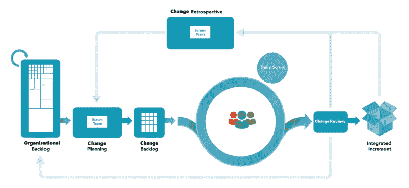
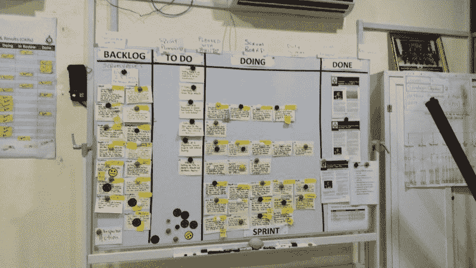
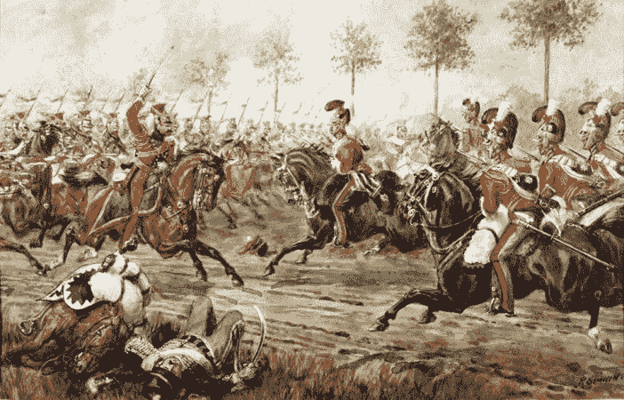

# 加纳警察署的专业组织变革

> 原文:[https://dev . to/nkd agility/professional-organization-change-at-the-Ghana-police-service-33i](https://dev.to/nkdagility/professional-organisational-change-at-the-ghana-police-service-3i3i)

加纳警察部门陷入了困境。在过去的几十年里，每一个新的警察组织和政府都试图以各种方式进行一些变革，但大多数变革都是临时性的，不够有力或具有战略性。旧问题再次困扰着新政府，许多警察和公众已经失去了希望。

为了创造任何持久和永久的变化，需要一个转变。一种从旧的到新的现代和专业的方式，为公众提供保护性服务和维护法律。要实现永久的改变，需要三样东西。

1.  以仆人式领导风格为基础的清晰愿景、目标和衡量标准，让人们相信可能性的力量。
2.  由高绩效框架支持的结构化战略方法，可快速交付成果。
3.  一个由变革推动者组成的变革网络，这些变革推动者接受过培训并被授权在全国范围内推动变革。

目前，公众信心已经下降到创纪录的水平。新的管理层计划改变这种状况，但不是通过蚕食边缘。新的警察总监(IGP)负责将这项服务转变为世界一流的警察服务，进行彻底和急需的变革。

> 只有当一个组织完全彻底地失败了，它才会考虑彻底的改变。
> 
> -肯施瓦伯

我一直与阿卡迪亚蒂和 T2 一起致力于加纳警察部门的组织改革，这是世界上最早的改革之一，我从未见过如此清晰的愿景，也从未见过如此实证的方法。任何组织层面的变革的关键是领导力和远见。在公共部门组织中更是如此。加纳警察部门已经自上而下地接受了转型，这在任何组织中都是罕见的。当我说自上而下的时候，你需要明白不仅仅是 IGP，还有他的老板，加纳总统，都被改变收买了。

> #### 远景
> 
> 加纳警察署力求成为世界一流的警察署，能够提供符合国际最佳做法标准的有计划、民主、保护性及和平的服务
> 
> #### 使命
> 
> 警察署的任务是确保预防犯罪和侦查、逮捕和起诉罪犯，这符合加纳人对安全、有保障和和平的社区的期望。

问题总是在于，你如何以一种经验主义的方式，而不是一种定义好的传统方式，来采用 Scrum &组织变革。史蒂文·博格和我之间的争论。几年前，Scrum.org 悄悄地发布了敏捷路径指南，作为实现这一目标的一种方式。随着越来越多的人获得成功，它已经慢慢获得了牵引力。

我应该不需要告诉你，为了在一个组织中实现持久的变革，你需要一个[框架，而不是一个](https://nkdagility.com/organisational-change-create-path/)方法。既然每个组织都有自己的做事方式(独特的人、流程、&实践)，反映了独特的文化，为什么别人的蓝图会为你工作呢？您需要一个框架(就像构建任何物理事物一样),围绕它您可以构建自己的定制方法。敏捷路径指南引入了一个基于 Scrum 的框架，以实现专业的组织变革。这个框架可以用来富有成效和创造性地交付最高价值的组织变革。

[T2】](https://res.cloudinary.com/practicaldev/image/fetch/s--Bj9gW8yn--/c_limit%2Cf_auto%2Cfl_progressive%2Cq_auto%2Cw_880/https://nkdagility.com/wp-content/uploads/2017/09/nkdagility-akaditi-ghana-police-scrum-change-team-800x369.png)

我们需要框架，而不是方法，因为组织中的每个团队、小组和部门都是不同的。接受这种差异，这个框架帮助我们确保我们至少从一开始就在玩同样的游戏。如果一切都可以改变，我们很容易陷入混乱或停滞。就像 Scrum 一样，专业的组织变革框架对修改是封闭的，但对扩展是开放的。

[T2】](https://res.cloudinary.com/practicaldev/image/fetch/s--UkzuFIRd--/c_limit%2Cf_auto%2Cfl_progressive%2Cq_auto%2Cw_880/https://nkdagility.com/wp-content/uploads/2017/09/nkdagility-akaditi-ghana-police-scrum-board-800x450.jpg)

我见过的一个在软件和非软件工作中产生巨大影响的令人敬畏的扩展是看板。它为正在发生的事情提供了透明度和一目了然的状态。虽然这是来自组织变革办公室的看板，但警察总监在他的“作战室”里有一个看板和一个 Scrum 板，这是他的变革团队和访客聚集在一起讨论策略和下一步行动的地方。虽然我们保持核心框架，在我们的过程中体现经验主义，但组织的许多部分将扩展该框架，创造独特的方式来帮助他们解决独立的个人问题。

正如你所想象的，加纳警察系统等级森严，严重依赖等级来办事。它在近 60 年里没有发生重大变化，他们仍然遵循着旧的方式。命令和控制是做事的方式，但它已经不起作用了。军官的教育水平在 60 年间发生了很大的变化。举例来说，我本周为他们开设的两个专业 Scrum 基础课程，比欧洲或美国的同类课程拥有更多的 MBA、心理学和其他学位。有些人说，对学历的推动太大了，但这意味着劳动力发生了变化。为未受过教育的劳动力设计的命令和控制将不再有效，而且实际上会侵蚀道德。命令和控制是现代世界的一个谬误，也是一个因泰勒主义和迷失时代的无知而产生的谜。

[T2】](https://res.cloudinary.com/practicaldev/image/fetch/s--nu8_6F7L--/c_limit%2Cf_auto%2Cfl_progressive%2Cq_auto%2Cw_880/https://nkdagility.com/wp-content/uploads/2017/09/nkdagility-akaditi-ghana-police-napolion-702x450.jpg)

见鬼，300 年前拿破仑击败波斯军队时，军方意识到指挥和控制是一种失败的战略。加纳警方肯定不是最后一个意识到这一点的，因为许多欧洲和美国公司仍试图以这种方式使用指挥和控制。

在任何敏捷组织中，管理层都从“告诉人们做什么”的角色转变为仆人式领导。他们从下达指令转变为设定目标。他们不再是计划者，而是老师、教练和领导者。

领导力与下达指示和咆哮命令没有多大关系。

加纳警察署的职业组织变革这个职位最早出现在 T2 马丁辛舍尔伍德-裸体敏捷有限公司。