# 忙于 B 树

> 原文:[https://dev.to/vaidehijoshi/busying-oneself-with-b-trees](https://dev.to/vaidehijoshi/busying-oneself-with-b-trees)

<figure>[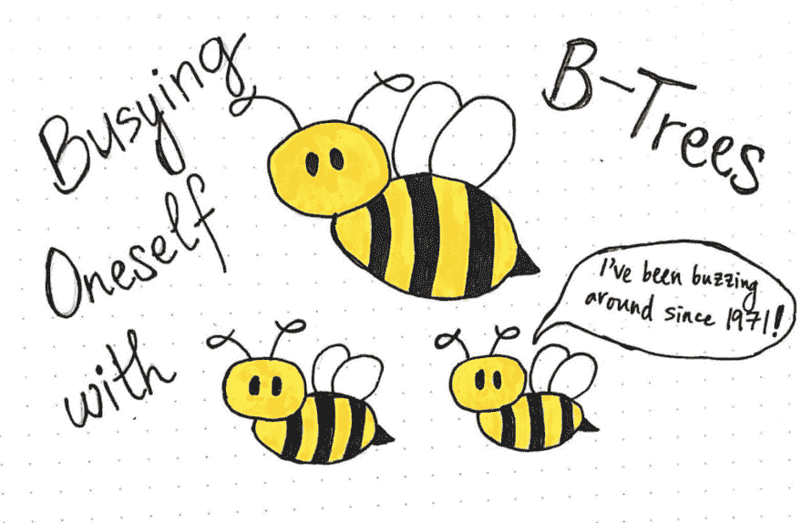](https://res.cloudinary.com/practicaldev/image/fetch/s--sBNhahLL--/c_limit%2Cf_auto%2Cfl_progressive%2Cq_auto%2Cw_880/https://cdn-images-1.medium.com/max/1024/1%2APzLtlyaG4EQrZP5vGe_J8Q.jpeg) 

<figcaption>忙于 B 树！</figcaption>

</figure>

如果你花足够的时间思考和学习计算机科学，你会开始注意到一切都是相互联系的。计算的历史通常感觉像是一个事件的链表，一个事件、一个人或一项发明不可避免地与下一个事件、个人或发明联系在一起。

如果我们认真想想，人类历史上几乎所有的都是如此。人类倾向于根据他们所钦佩的人的工作来创造自己的作品。我们从前辈大师那里汲取灵感和想法，经常复兴或重新发明旧的想法，并重新配置它们以成为我们自己的想法。在这个过程中，我们添加了另一个节点，历史的链表，它最终成为其他人以后的垫脚石。

正如我们上周所了解到的，红黑树的发明者就是这种情况，他们的理论和研究是基于他们之前的另一位计算机科学家的工作。红黑树的创造者从一个叫鲁道夫·拜尔·兰德的人的基础上改编了他们的作品，兰德站在他的肩膀上，以便推导出他们自己的数据结构。

那么，拜耳的工作有什么启发性呢？他的工作是如何成为我们今天使用的数据结构的基石的？是时候让我们在历史的链表中往回遍历一步，最终找到答案了。

### 解剖 2-3 棵树

在本系列的整个过程中，我们一直在向我们的知识库[添加树形数据结构](https://dev.to/vaidehijoshi/how-to-not-be-stumped-by-trees)。最近，我们潜入自平衡树，包括 [AVL 树](https://dev.to/vaidehijoshi/the-little-avl-tree-that-could)和[红黑树](https://dev.to/vaidehijoshi/painting-nodes-black-with-red-black-trees)。事实证明，B 树也属于这一类树。

<figure>[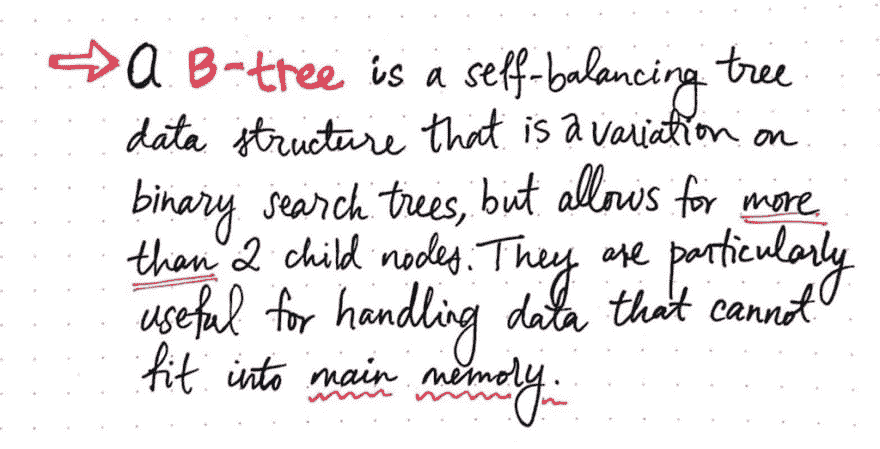](https://res.cloudinary.com/practicaldev/image/fetch/s--oxIyqRHm--/c_limit%2Cf_auto%2Cfl_progressive%2Cq_auto%2Cw_880/https://cdn-images-1.medium.com/max/1024/1%2APUffmRph6h6aunMPrtZTlQ.jpeg) 

<figcaption>二叉树:一个定义</figcaption>

</figure>

一棵 ***B 树*** 是一棵自平衡树，它是二叉查找树的变体，因为它允许超过 2 个子节点。与其他自平衡树结构类似，B 树也有一套必须遵循的规则；然而，它们是独一无二的，因为它们特别擅长处理那些不适合机器或程序主存的数据。换句话说，它们不同于 AVL 树和红黑树，因为它们可以处理大量数据，而这些自平衡树都不能。

事实证明——惊喜，惊喜！“B”树有自己有趣的历史。既然我们试图理解 B 树是什么，以及它们为什么以及如何被创造出来，那么理解 B 树从何而来也是值得的！

b 树只不过是 2-3 树的一种推广，它是由计算机科学家 John Hopcroft 在 1970 年发明的。***2–3 树*** 是一种树形数据结构，其中每棵树的节点都包含关键字形式的数据，以及潜在的子节点。关于 2–3 树中节点的数据，有趣的是它可以包含不止一个键的*，这不同于我们在本系列中迄今为止讨论的任何树结构。*

<figure>[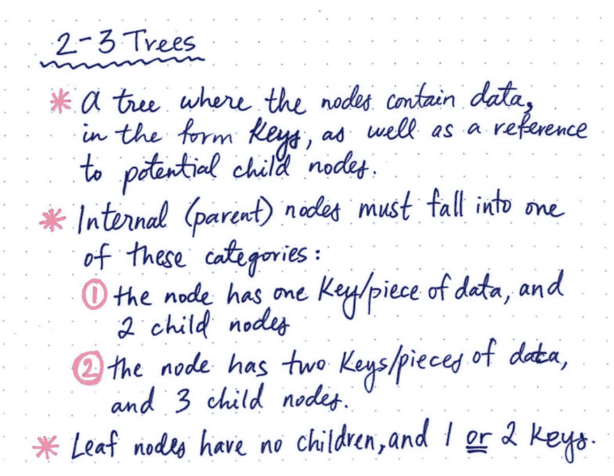](https://res.cloudinary.com/practicaldev/image/fetch/s---UA7w9Gw--/c_limit%2Cf_auto%2Cfl_progressive%2Cq_auto%2Cw_880/https://cdn-images-1.medium.com/max/1024/1%2AU_6DigHtp0Za6emyA7Ub8A.jpeg)

<figcaption>2–3β树的特征</figcaption>

</figure>

但是，2–3 树的节点必须遵循一些约束；例如，单个节点不能包含无限数量的键。

2–3 树的一般规则如下:

1.  一个 2–3 树的内部(父)节点必须包含一个*键/一条*数据，以及一个对两个子节点*的引用*
2.  或者，内部(父)节点可以包含*两个*键/数据块，以及对*三个*子节点的引用

无论如何，2–3 树中的每个内部节点都必须遵循这个比率，这样它才有效。当涉及到叶节点时呢？嗯，由于根据*定义*一个叶节点不能有任何子节点(因为这是它成为一个叶的原因)，一个 2–3 树的叶可以包含*一个*或 _ 两个 _ keys。

因为树形数据结构最好用一个可视化的例子来解释，所以让我们画一个出来看看这些规则的作用。

<figure>[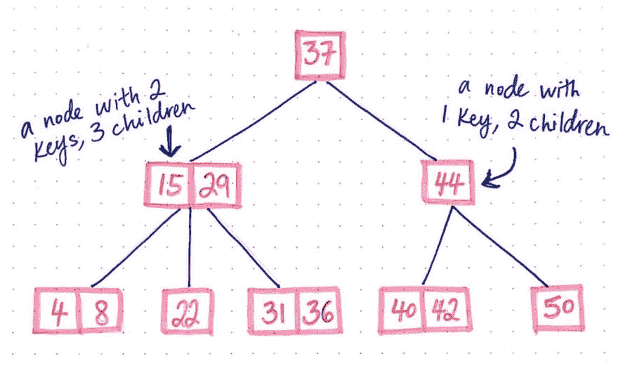](https://res.cloudinary.com/practicaldev/image/fetch/s--sCq1-hLA--/c_limit%2Cf_auto%2Cfl_progressive%2Cq_auto%2Cw_880/https://cdn-images-1.medium.com/max/1024/1%2AbcP15OEr1oNeg7qqX4p77Q.jpeg) 

<figcaption>具有两种类型节点的 2–3 树</figcaption>

</figure>

在此处显示的示例中，我们有一个有效的 2–3 树。我们会注意到一些节点只包含*一个*键，而其他节点包含*两个*键。记住:一个节点不同于一个键！就像普通的[二叉查找树](https://dev.to/vaidehijoshi/leaf-it-up-to-binary-trees)一样，一个节点包含*数据*。在 2–3 树的情况下，可能有两条数据——两个键。

注意，根节点 37 的左侧子节点包含两个键:15 和 29。因为包含两个键的节点必须有三个子节点，所以我们可以确定这个左边的节点将有三个子节点，它确实有！类似地，根节点的右子节点是只有一个键的节点，44。因此，只能生两个孩子。

2–3 树有许多独特的特征，当我们回到 B 树的话题时，我们会再次看到所有这些特征。

<figure>[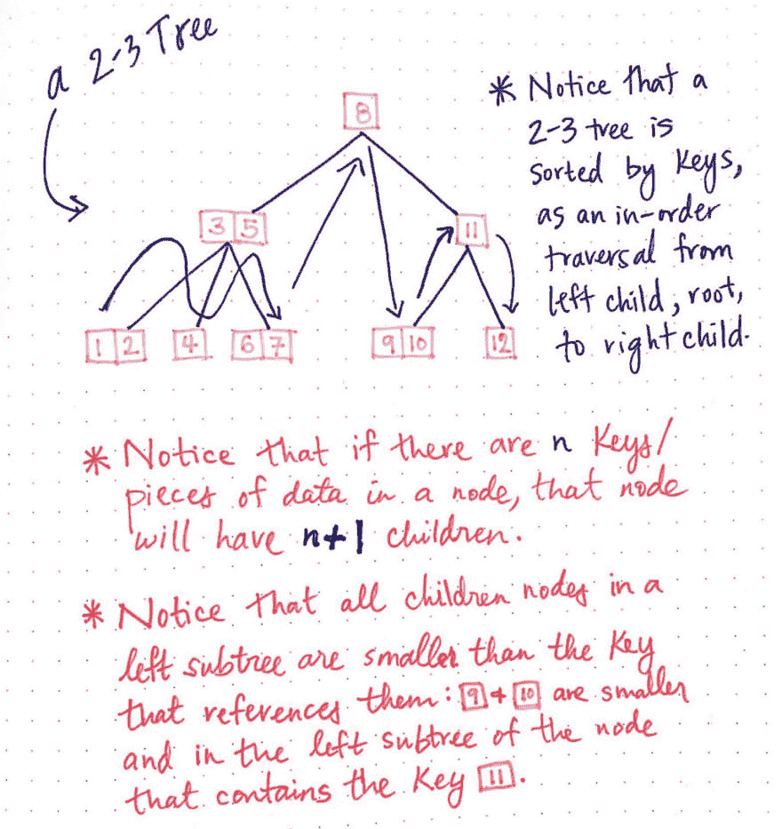](https://res.cloudinary.com/practicaldev/image/fetch/s--U1ABr0PG--/c_limit%2Cf_auto%2Cfl_progressive%2Cq_auto%2Cw_880/https://cdn-images-1.medium.com/max/1024/1%2A5joMecsfqUcIloiV4Y-rcA.jpeg) 

<figcaption>有序遍历一棵 2–3 的树</figcaption>

</figure>

在此处显示的插图中，每个节点的键都被替换为值 1-12。一旦我们将这些值重写为连续的整数，就开始出现一种模式:

> 2–3 树的键按顺序遍历排序，在结构中上下移动，从左孩子到根，再到右孩子。

我们还可以看到另一个抽象开始发挥作用，只要我们足够仔细地观察:如果一个节点中有 *n* 个键，那么该节点将总是有 *n+1* 个子节点。

类似地，我们可以注意到另一种模式，其中一个节点的左侧子树中的所有子节点都小于引用它们的键。例如，在这个 2–3 树的右边子树中，键 9 和 10 比键 11 小，并且在它们的父节点的左边(在左边子树中)。然而，键 12 比它的父节点 11 大，所以它在它的父节点的右边(在右边的子树中)。

就其核心而言，2–3 树并不复杂。即使没有真正经历从 2-3 树中搜索、插入或删除的步骤，我们也可以猜测会发生什么。因为我们可以很快确定这个结构与二叉查找树非常相似，所以我们可以利用我们对 BSTs 的了解，回忆一下从一个 2-3 树中搜索、插入和删除将花费[对数时间](https://dev.to/vaidehijoshi/looking-for-the-logic-behind-logarithms)，或者 *O(log n)* 。这里唯一的主要区别是，一个节点可以包含三个子节点，而不是两个子节点，并且当涉及到中可以有多少个键和子节点时，该树中的内部节点必须属于两个类别之一。

然而，定义 2–3 树的规则对于理解 B 树的实际功能至关重要。现在我们*理解了* Hopcroft 对 2–3 树的研究，是时候应用我们刚刚注意到的一些模式和抽象了！

### 到 B 树还是不到 B 树

当查看 2–3 树的模式时，我们注意到一个节点中的 *n* 键的数量与该节点可以引用多少个子节点( *n+1* )相关。事实证明，这种抽象正是 B 树的发明者在从 2–3 树派生出 B 树时所利用的。

1971 年，两位名叫鲁道夫·拜尔和爱德华·m·麦克赖特的研究人员在波音研究实验室从事一篇论文的研究。这篇名为*“大型有序索引的组织和维护”*，[的论文概述了一种数据结构](http://www.minet.uni-jena.de/dbis/lehre/ws2005/dbs1/Bayer_hist.pdf)，这种数据结构基于二叉查找树的通用版本，针对一次读取和写入大部分数据进行了优化。这篇论文的主要论点是，可以使用 ***分支因子*** 来确定一个节点可以有多少个可能的子节点，以及它可以包含多少个键。

<figure>[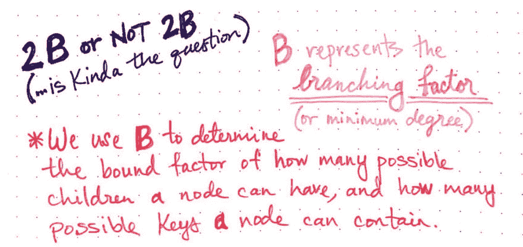](https://res.cloudinary.com/practicaldev/image/fetch/s--gIeALhf2--/c_limit%2Cf_auto%2Cfl_progressive%2Cq_auto%2Cw_880/https://cdn-images-1.medium.com/max/1024/1%2ApTgEdK1GgRcTmT07CGRJLg.jpeg) 

<figcaption>B 代表 a B 树的分支因子</figcaption>

</figure>

分支因子表示界限，或者树中每个节点的最大和最小子节点数。出于我们的目的，我们将把分支因子称为变量 ***B*** ，但是记住这只是一个变量！分支因子有时也被称为 *n* ，或者另一个可变字母。

那么，我们如何使用分支因子来确定 B 树看起来像什么以及它是如何构造的呢？为什么，当然是用公式！

B 树中每个节点的子节点数可以描述为:*B÷x<2B*，其中 *B* 为分支因子， *x* 代表每个节点的子节点数。注意，每个节点的子节点数量有一个严格的上限:我们使用的是<，**而不是**。

<figure>[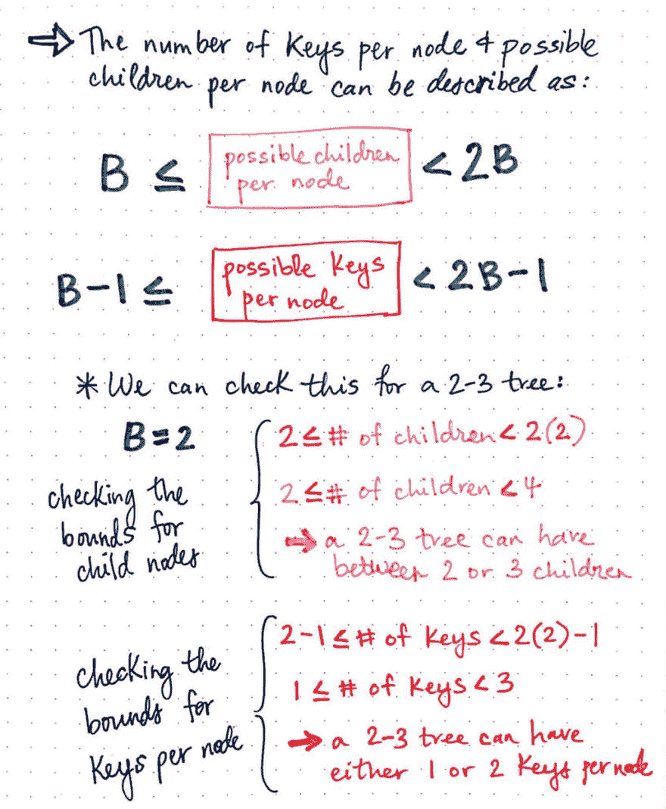](https://res.cloudinary.com/practicaldev/image/fetch/s--TyyB9lBu--/c_limit%2Cf_auto%2Cfl_progressive%2Cq_auto%2Cw_880/https://cdn-images-1.medium.com/max/1024/1%2AV8epRhBlk6NzoBOTYkJgkQ.jpeg) 

<figcaption>描述可能的键数和子节点数</figcaption>

</figure>

同样，B 树中每个节点的键数可以描述为:*B-1÷y<2B-1*，其中 *B* 又是分支因子， *y* 是键数/一个节点可以包含的数据。

如果我们回想一下 2-3 棵树，这是有意义的:还记得键的数量是如何用 *n* 表示的，而孩子的数量被抽象为 *n+1* 吗？我们在这里做的正好相反:可能的键的数量实际上等于可能的子元素的数量减 1。

事实上，让我们用一个 2–3 树来试试这个公式，看看它是否有效。在 2–3 树中，分支因子 B 等于 2。如果 B = 2，那么我们知道子节点的数量一定是 2*x<2(2)。*由于严格的上限，这基本上意味着 *x* 只能是 2 或 3。同理，键的个数必须是 2-1*y<2(2)-1*，也就是说 *y* 必须大于等于 1，但小于 3。因此，使用这个公式，我们可以确认 2–3 树的每个节点只能有 1 或 2 个键。

除了这些公式之外，在使用 B 树时，还有一些快速的事实要记住:

<figure>[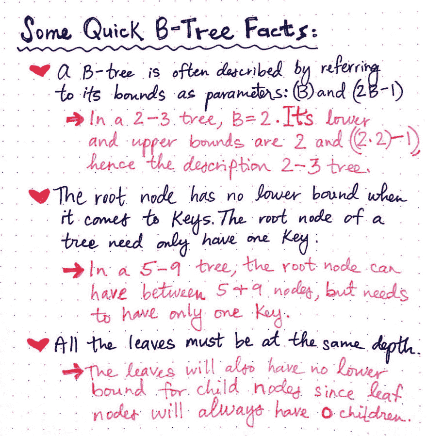](https://res.cloudinary.com/practicaldev/image/fetch/s--6Zmj2L6m--/c_limit%2Cf_auto%2Cfl_progressive%2Cq_auto%2Cw_880/https://cdn-images-1.medium.com/max/1024/1%2AbylkSxz7SmdZIjuUIKQ_3A.jpeg) 

<figcaption>一些快速的 B 树事实</figcaption>

</figure>

1.  B 树(包括 2-3 棵树)通常通过引用它的边界作为参数来描述。B 树被描述为“*(B)——( 2B-1)树*”。例如，当 B = 2 时，我们将这三种树称为“2 ——( 2(2)-1)树”，这就是“2–3”树的命名由来。
2.  根节点无视两个限制中的一个，因为当谈到它必须有多少个键时，它没有下限。例如，这意味着一个 5–9 的树根可以有许多子节点，但可能只包含一个键，这是完全可以接受的。
3.  B 树中的所有叶子必须总是在相同的深度。与根节点破坏键限制的方式类似，叶节点破坏了子节点规则，因为根据定义，叶节点永远不会有任何子节点。

在我们开始基本的 B 树操作之前，让我们提醒自己 B 树中的单个节点是什么样子的。

<figure>[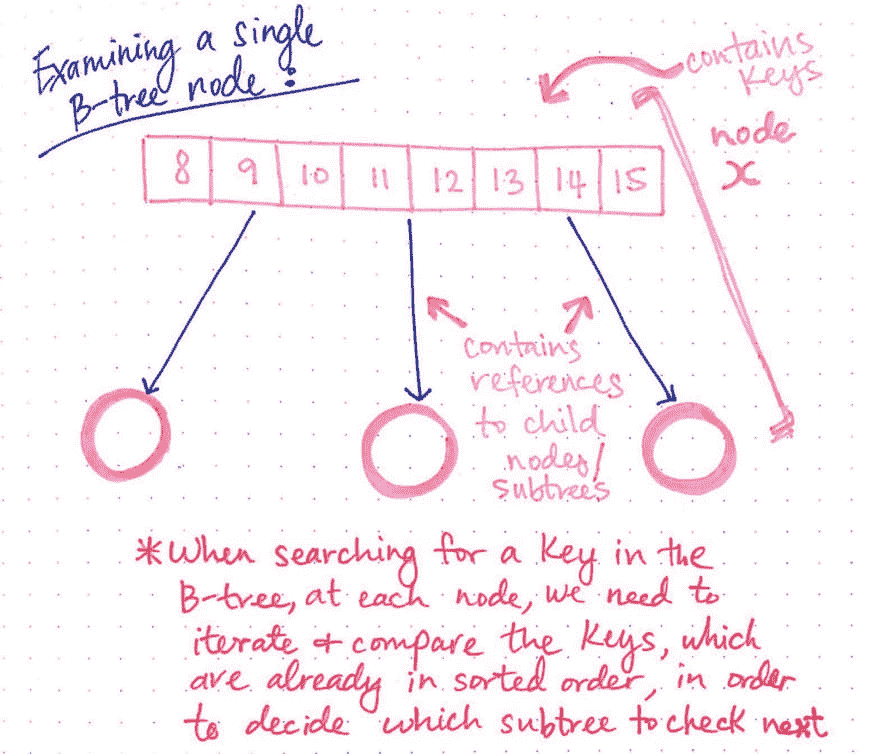](https://res.cloudinary.com/practicaldev/image/fetch/s--671GacnL--/c_limit%2Cf_auto%2Cfl_progressive%2Cq_auto%2Cw_880/https://cdn-images-1.medium.com/max/1024/1%2AqLUszvexSAONX1zG-2cwIA.jpeg) 

<figcaption>检查单个 B 树节点</figcaption>

</figure>

熟悉节点的外观是很重要的，因为我们将在下一节中处理指针和引用的变化。关于 B 树中单个节点的内部工作方式，需要记住以下一些关键事项:

*   一个节点至少包含一个键，也可能包含许多键作为它所保存的数据。
*   一个节点引用一个或多个子节点，除非它是叶节点。

我们不会介绍如何搜索 B 树，因为这与在 BST 中执行搜索操作非常相似。要记住的一件重要的事情是，当我们搜索 B 树时，我们将迭代和比较我们看到的每个节点的键；键是有序的，这很有帮助，因此我们可以一次比较一个键，并确定在继续搜索时是需要向左、向右还是向下移动树的中间。

然而，通过插入和删除，事情会变得稍微复杂一些。我们将研究更复杂的东西，但首先，让我们看看这两个过程的最简单版本。

插入到树中基本和搜索一样；我们从根开始，根据需要沿着树向下走，直到找到我们要插入的密钥的正确位置。在下面的例子中，我们将键 25 插入到 2–3 树中。我们从根节点开始，比较根节点的一个键的值 37 和要插入的值 25。因为 25 小于 37，所以我们向下移动到左边的子树。

<figure>[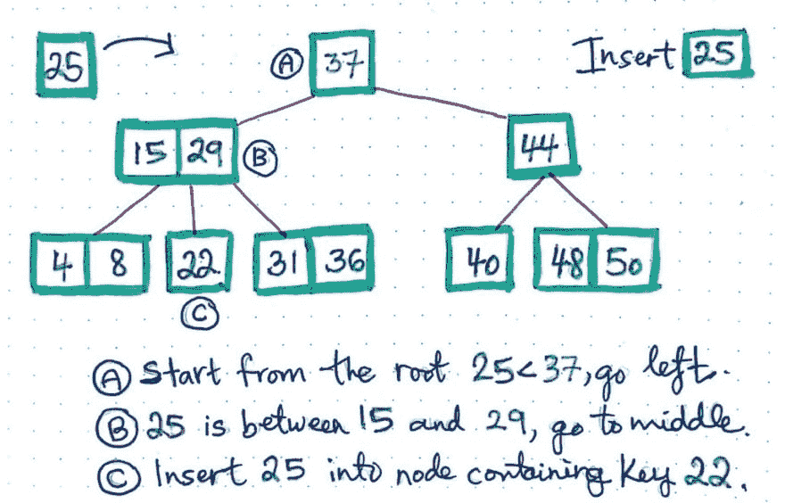](https://res.cloudinary.com/practicaldev/image/fetch/s--TpTO6GS---/c_limit%2Cf_auto%2Cfl_progressive%2Cq_auto%2Cw_880/https://cdn-images-1.medium.com/max/1024/1%2ApkiKohHotqueTCsi4oAb8w.jpeg) 

<figcaption>B 树插入，零件 1</figcaption>

</figure>

接下来，我们将查看左侧子节点的键，该节点是左侧子树的父节点。该节点的值为 15 和 29。由于 25 介于这两个值之间，我们将移到中间的子树，在这两个键之间。中间的节点包含一个键，所以在这个场景中，我们需要做的就是向这个节点添加另一个键，因为它还没有填满它的全部容量；我们将 25 添加到包含键 22 的节点中。

<figure>[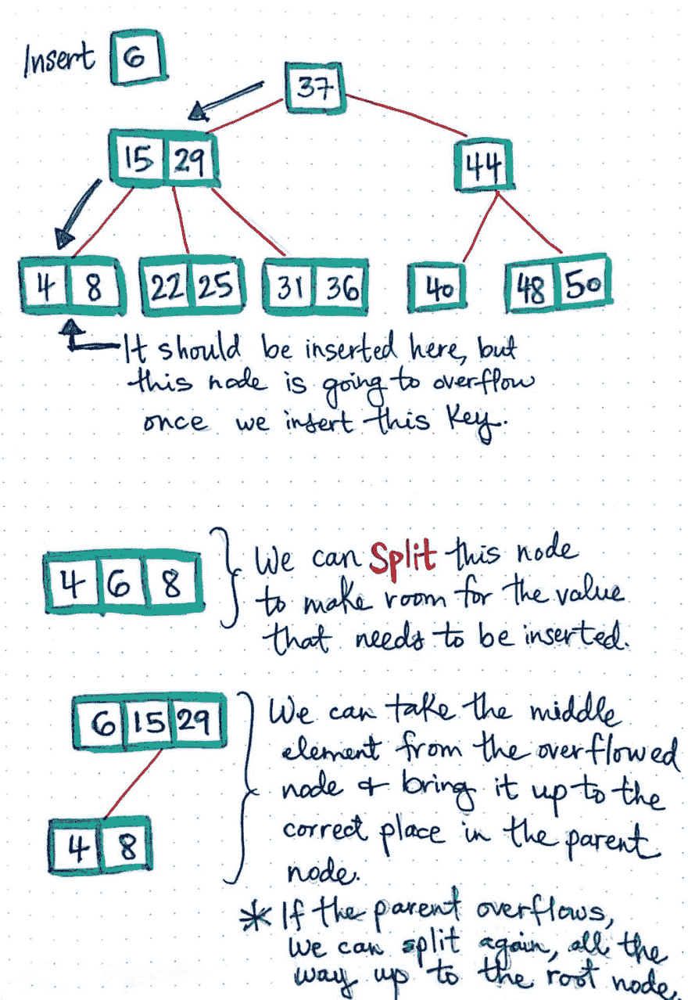](https://res.cloudinary.com/practicaldev/image/fetch/s--bkFujcbn--/c_limit%2Cf_auto%2Cfl_progressive%2Cq_auto%2Cw_880/https://cdn-images-1.medium.com/max/1024/1%2AkvHsOiDPEgtqOCAgNdnXoA.jpeg) 

<figcaption>B 树插入，零件 2</figcaption>

</figure>

然而，有时，即使看似简单的插入也可能涉及额外的步骤。例如，如果我们需要将键 6 插入到我们一直在处理的同一棵树中，我们将遵循与以前相同的流程:从根节点开始，向下到达正确的子树。

原来钥匙 6 需要插在 4 和 8 之间。但是，只要插入这个键，这个节点就会溢出！那么，我们该怎么办？我们可以 ***拆分*** 溢出的节点来为需要插入的值腾出空间。

我们将从溢出节点中取出中间的键，恰好是 6，并将它移到父节点的正确位置。如果父节点溢出，我们可以简单地重复再次分裂的过程，直到到达根节点。

如果我们要删除的节点有另一个键，那么从 B 树中删除就很容易。但是很多时候，我们要删除的节点只有一个键，在这种情况下，我们会遇到一个有问题的场景，即其他节点指向一个没有数据的节点！处理这种情况的最好方法是轮换。

<figure>[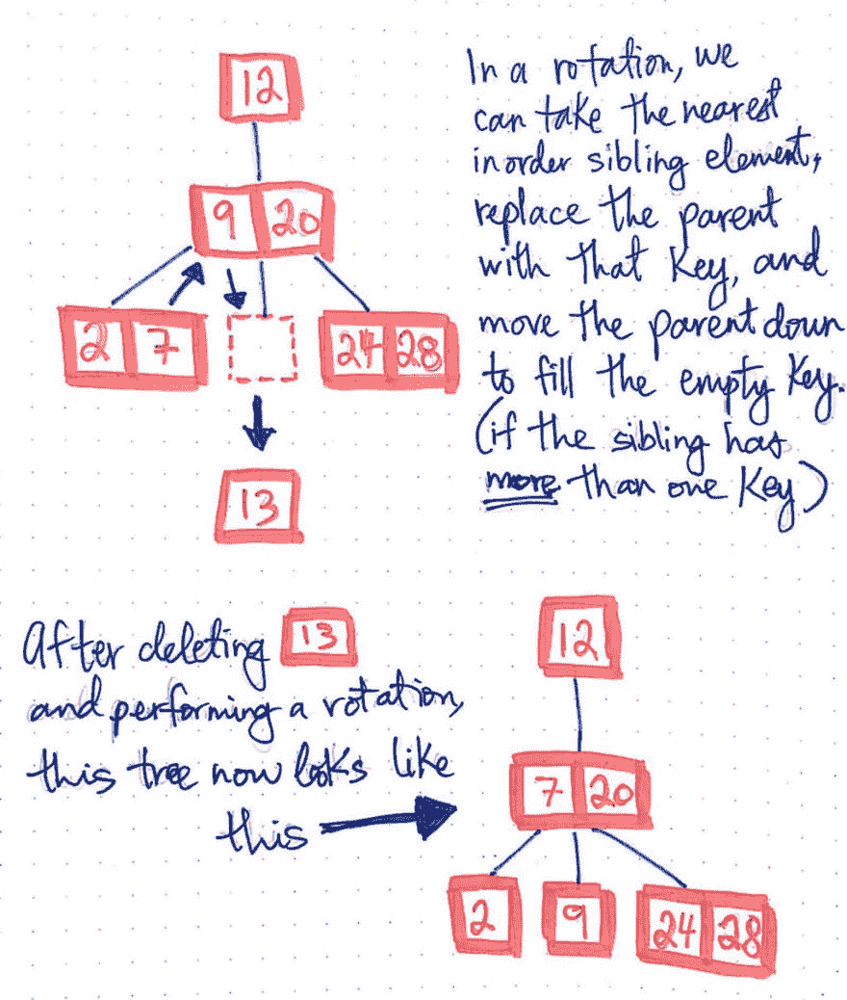](https://res.cloudinary.com/practicaldev/image/fetch/s--ieoqM8en--/c_limit%2Cf_auto%2Cfl_progressive%2Cq_auto%2Cw_880/https://cdn-images-1.medium.com/max/1024/1%2AezHI9qIMcMJGlXiUBB60eQ.jpeg) 

<figcaption>B 树删除:一个简单的例子</figcaption>

</figure>

在这里显示的示例树中，我们将关注 B 树的一部分(实际上，这必须是一个子树，并且是一个更大的树数据结构的一部分，以便有效)。

假设我们想从这个 B 树中删除键 13。我们可以很容易地做到这一点，除了一旦我们*删除*这个键，我们就有一个没有数据的空节点，这直接违反了我们的 B 树规则！

为了解决这个问题，我们可以从父节点向下*旋转一个密钥，因为它有一个密钥要给。但是，接下来我们需要确保用某个值填充父节点中的*即*空数据点；请记住，如果一个父节点要有 3 个子节点，它必须有 2 个键，这意味着我们需要向父节点再添加一个键。在循环中，我们可以取最近的有序兄弟元素，并用那个键替换父节点中的空键。删除键 13 后，我们向下旋转 9 来代替它，向上移动*键 7 来填充父节点中的空白点。**

 *不要太复杂，对吗？别担心，我会让它变得更复杂一点。

### 在野生 B 树周围嗡嗡作响

好的，当涉及到处理树时，我们有一些方便的工具:我们可以 ***分割*** 节点的键，甚至 ***围绕它们内部的值旋转*** 。但有时这两种选择都不足以完成工作。

让我们看一个这种情况的例子。

<figure>[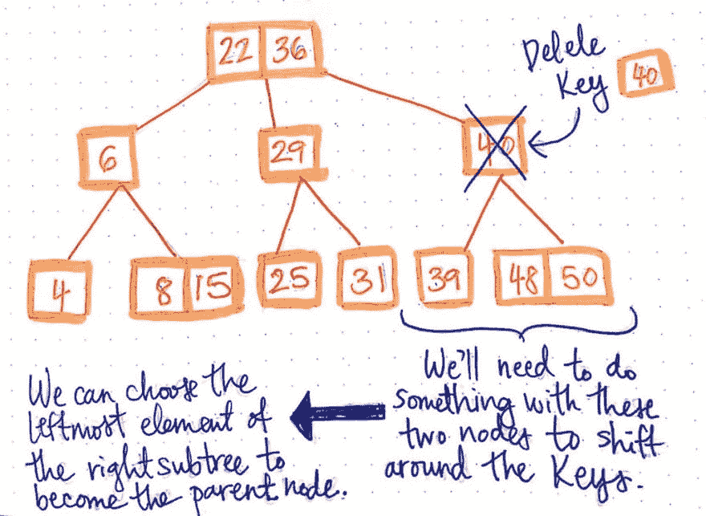](https://res.cloudinary.com/practicaldev/image/fetch/s--YtoAMOUQ--/c_limit%2Cf_auto%2Cfl_progressive%2Cq_auto%2Cw_880/https://cdn-images-1.medium.com/max/1024/1%2AlSx54zw4tzOOE09uJdgltg.jpeg) 

<figcaption>复杂 B 树删除，partβ1</figcaption>

</figure>

在下面的 B 树中——恰好是 2-3 树——我们想从结构中删除键 40。然而，即使只看这个图，一个问题开始变得非常明显:如果我们删除 40，我们需要对它的子节点做些什么。

<figure>[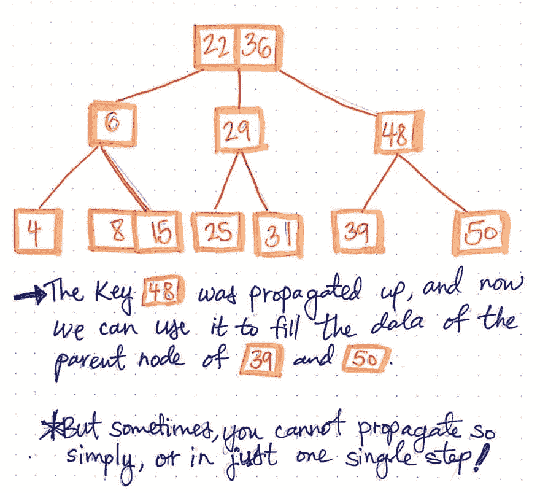](https://res.cloudinary.com/practicaldev/image/fetch/s--5rGaFcZz--/c_limit%2Cf_auto%2Cfl_progressive%2Cq_auto%2Cw_880/https://cdn-images-1.medium.com/max/1024/1%2AEZ0iSfohkrgSBs2vIn-m7g.jpeg) 

<figcaption>复杂 B 树删除，partβ2</figcaption>

</figure>

最简单的做法是用子代中的一个值替换我们删除的键；我们可以选择右边子节点的最左边的元素，因为这个节点有两个键，48 和 50。这应该是一个简单的选择，因为它有两个密钥，这意味着它有一个备用密钥，并且可以很容易地将这个密钥“捐赠”给它的父节点。我们可以将关键字 48 从子节点向上传播到其父节点，并使用子关键字来填充父节点的数据，从而不违反任何规则。

但是如果我们想在一个更不安全的地方删除一个键呢？假设现在我们需要删除键 48。

<figure>[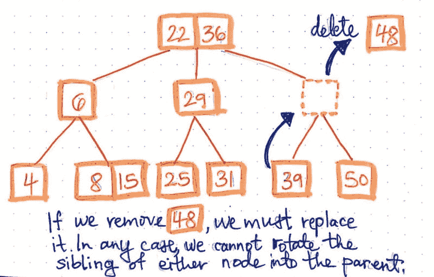](https://res.cloudinary.com/practicaldev/image/fetch/s--KC01vtxw--/c_limit%2Cf_auto%2Cfl_progressive%2Cq_auto%2Cw_880/https://cdn-images-1.medium.com/max/1024/1%2AsAwTPzndpQ1OY4G9H6H4SA.jpeg) 

<figcaption>复杂 B 树删除，partβ3</figcaption>

</figure>

这将会有点棘手，因为删除键 48 将会孤立它的两个子节点 39 和 50！啊哦。好吧，让我们做我们知道将开始工作的事情:我们将移动左边的有序子代来代替它的父代。

<figure>[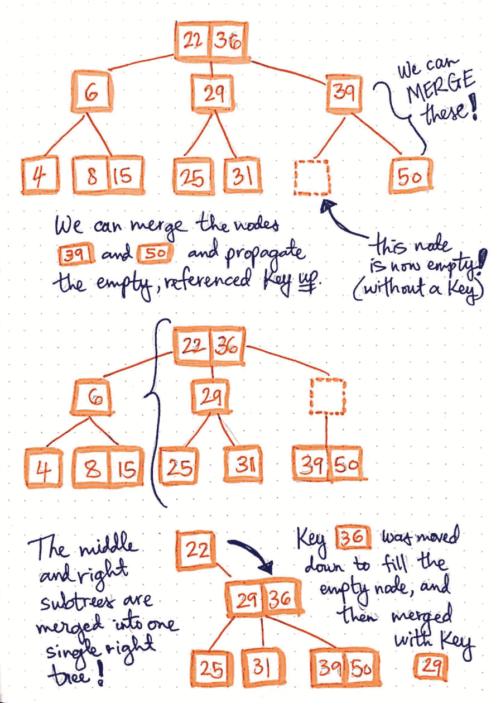](https://res.cloudinary.com/practicaldev/image/fetch/s--KtuMFb2f--/c_limit%2Cf_auto%2Cfl_progressive%2Cq_auto%2Cw_880/https://cdn-images-1.medium.com/max/1024/1%2AU0yIDJSsHcQ7zsfZ8bLEMQ.jpeg) 

<figcaption>复杂 B 树删除，partβ4</figcaption>

</figure>

但是，现在我们已经将 39 上移为父节点，原来是 39 的左子节点*现在是空的。*

处理这个问题的一个好方法是通过 ***将*** 这两个节点合并在一起，并将空的、被引用的键向上传播，这样“无键的”、空的节点现在就是父节点。

现在，我们终于可以将“无键节点”向上推至包含 22 和 36 的父节点，并将 ***旋转***36 的值向下推至子节点。因为我们不能有两个节点有一个值和两个子节点，所以我们需要对 29 和 36 做些什么。最简单的办法当然是将*和*合并在一起。

实际上，我们在整个过程中所做的是将中间和右边的子树合并成一个单独的右边的子树。

乍一看，所有这些工作似乎都很繁重，但是请考虑一下:即使是搜索、插入和删除这些工作——无论我们需要做多少步来重新排列指针和移动键——仍然是 ***对数*** ，这意味着所有这些工作仍然是超级高效的。

那么，为什么有人会使用 B 树而不是其他自平衡树呢？由于键的排序顺序和顺序遍历结构的能力，B 树在索引数据库中存储数据非常有效，例如 MySQL。数据库一次读取磁盘的一部分变得非常容易，因为大多数 B 树都有一个 B 值(分支因子),它相当于一个数据块的大小。缓存经常一次被映射到 B 树的整个部分/段，这意味着数据库可以一次取出整个段并从中读取它需要的任何值*，而*不必一次又一次地进行大量的额外调用。超级聪明，是吧？！

经过这一切，我们仍然有一个疑问:为什么是 B？历史上最有趣的时刻就是这样:这完全取决于你问的是谁。这个问题一直没有明确的解释和答案。一些人推测,“B”代表“平衡的”,或者“宽广的”,甚至可能是“波音”,麦克赖特和拜耳在写他们的研究论文时都在那里工作。

也许我们任何人都会得到的最好答案来自 2013 年第 24 届组合模式匹配年度研讨会，当时 Edward M. McCreight [解释了“B 树中的 B:](https://vimeo.com/73481096)

> 拜尔和我在午餐时间，我们开始考虑一个名字。还有… B 是，你知道…我们当时在为波音公司工作，我们不能在没有和律师交谈的情况下使用这个名字。因此，有一个 B(B 树)与平衡有关，另一个 B。拜尔是资深作者，他比我大几岁，发表的文章比我多得多。所以还有另一个 b。所以，在午餐桌上，我们从来没有决定是否有一个比其他的更有意义。真活要说的是:你越想 B 树中的 B 是什么意思，你就越理解 B 树。"

最终，我们所能确定的是——如果问题是要不要 B 树，答案是:当然要看情况！答案几乎总是，*这取决于我们想做什么*。但至少我们现在知道*如何*去做了！

### 资源

b 树特别容易阅读和研究，因为它们是数据库的基础，并且被广泛使用。然而，有如此多的资源，很难找到真正有用的。这里有一些我最喜欢的帮助你继续学习 B 树！

1.  技术讲座:B 树简介，约书亚·马斯-霍华德
2.  詹姆斯·阿斯彭斯教授
3.  [2-3 tree 和 B-tree——复习笔记](https://ocw.mit.edu/courses/electrical-engineering-and-computer-science/6-046j-design-and-analysis-of-algorithms-spring-2015/recitation-notes/MIT6_046JS15_Recitation2.pdf)，Erik Demaine、Srini Devadas 和 Nancy Lynch 教授
4.  [B 树|第一集(简介)](http://www.geeksforgeeks.org/b-tree-set-1-introduction-2/)，Geeksforgeeks
5.  [B-Trees 可视化](https://www.cs.usfca.edu/~galles/visualization/BTree.html)，大卫·加勒教授

* * *

*本帖最初发表于[medium.com](https://medium.com/basecs/busying-oneself-with-b-trees-78bbf10522e7)T3】**