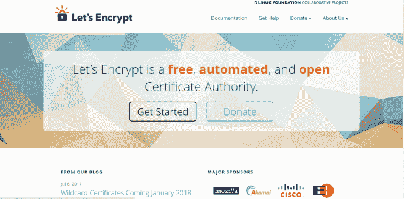

# 如何在 Godaddy 共享 Cpanel 主机上安装 Let's Encrypt 证书

> 原文:[https://dev . to/xeroism/how-to-install-lets-encrypt-certificate-on-go daddy-shared-cpanel-hosting-351d](https://dev.to/xeroxism/how-to-install-lets-encrypt-certificate-on-godaddy-shared-cpanel-hosting-351d)

## 使用图形/web 界面。

[T2】](https://i1.wp.com/fossnaija.com/wp-content/uploads/2017/09/letsencrypt-banner.png?ssl=1)

图片:让我们加密主页。

Let's encrypt (LE) SSL 证书是一个免费分发的证书，用于网站创建安全(加密)的服务器-客户端通信。LE 证书可以安装在多个域上。使用 LE 的唯一警告是它每 90 天到期，因此每 3 个月需要更新一次。但是如果你精通，可以使用 shell 脚本自动完成。否则你必须每 90 天做一次这些步骤。

安装 LE 证书的方法有很多。这里强调的步骤是在 godaddy cpanel 共享主机上安装它的方法。虽然它已经在 godaddy 上使用 cpanel 的共享主机上进行了测试，但它应该适用于任何使用 cpanel 的共享主机服务。所需要的只是一个网络浏览器，因此应该可以在任何操作系统(Linux、mac 或 windows)上运行。

**在您开始**之前，请确保您是将要安装证书的托管帐户的所有者/管理员(或有权访问-**用户名**和**密码**)。没有这个，就不可能安装 le 证书。

## 【SSLFORFREE.COM】第一节:。

**第一步:**转到<u></u>(其为网络版的一个例子)。该网站自动创建 LE 证书，无需键入终端命令。

第二步:在输入框中输入你网站的域名(比如:【yourdomain.com】T2)。对于多个域(子域)，只需用逗号分隔每个条目。SSLFORFREE 会自动为其添加一个“www.yourdomain.com”版本。如果你不想这样，有一个编辑按钮，让它这样做。

**步骤 3:** 选择您的域名后，点击“创建免费 SSL 证书”按钮。

**第四步:**选择“自动 FTP 验证”。

**步骤 5:** 在自动验证域标题下输入您的服务器信息(用户名和密码)进行验证。

-类型: **FTP** *(应自动填充)*

–主持人:**yourdomain.com***(应自动填充)*

–端口: **21** *(应自动填充)*

–用户名:*(由您提供)*

–密码:*(您提供)*

–目录(？):*留空自动检测。*

点击**下载免费 SSL 证书**。

**第六步:**验证成功后。下载证书(。zip)文件复制到您的计算机上。

**第七步:**解压 zip 文件。它应该包含另外 3 个较小的文件(*ca _ bundle . CRT . certificate . CRT*和 *private.key* )。这些是下一节需要的。

## **第二节:** CPANEL ON GODADDY。

**第一步:**登录你的 Godaddy cpanel 共享托管账号。转到安全部分并单击 SSL/TLS。

**第二步:**在证书(CRT)下，点击生成、查看、上传或删除 SSL 证书。"

**第三步:**在“上传新证书”下，上传您在前面第一节下载的 SSL 证书( *certificate.crt* )文件(您也可以选择将 _ **certificate.crt** _ 文件的内容复制粘贴到文本框中)。

**第四步:**添加描述，点击“上传证书”。

**步骤 5:** 点击返回，然后点击页面底部的“返回 SSL 管理器”。

**步骤 6:** 在“为您的站点安装和管理 SSL(HTTPS)”下，单击“管理 SSL 站点”

**第七步:**在“安装一个 SSL 网站”下，选择你的第一个域名(_【yourdomain.com】_)。单击“按域自动填充”,证书将填充到第一个框中。(所有 3 个框都可以自动填充。)

**步骤 8:** 如果“私钥(Key)”字段未填写:返回下载的文件夹，在您选择的任何文本编辑器中打开文件 **private.key** 。将文件的内容复制并粘贴到私钥(Key)文本框中。

**第九步:**如果“证书*权限包*没有填写:回到下载的文件夹，在你选择的任意文本编辑器中打开文件 **ca_bundle.crt** 。将文件和 past 的内容复制到“证书*权限包:(CABUNDLE)* 文本框中。

**第十步:**点击“安装证书”

如果成功，您应该会得到如下的响应消息:

> *SSL 主机成功安装
> 
> 您已经成功配置了 SSL。
> 【yourdomain.com】_
> 
> ……*

**第十一步:**点击“确定”关闭成功信息。

**步骤 12:** 如果您为多个域创建了此证书，则在“安装 SSL 网站”下，选择该证书所针对的下一个域。并再次重复步骤 7–11。并对您添加到证书中的任何其他域执行此操作。

但是，如果该证书仅适用于一个域，请跳至步骤 13。

**步骤 13:** 确认证书正在与任何 [ssl 检查器](https://www.google.com.ng/search?q=ssl+checker&oq=ssl+checker&aqs=chrome..69i57j69i60j0l4.2398j0j7&client=ubuntu&sourceid=chrome&ie=UTF-8)一起工作。

Linux 'NG 快乐！ _

帖子[如何在 Godaddy 共享 Cpanel 托管](https://fossnaija.com/install-lets-encrypt-certificate-godaddy-shared-cpanel-hosting/)上安装 Let's Encrypt Certificate 最早出现在 [Foss Naija](https://fossnaija.com) 上。