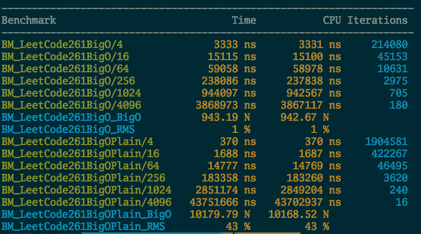

# Union-Find 算法的简短总结

> 原文:[https://dev . to/bobfang 1992/a-short-summary-of-the-union-find-algorithm](https://dev.to/bobfang1992/a-short-summary-of-the-union-find-algorithm)

首先，我想给你们看一下这个麻省理工的课堂笔记，它从理论上很好地解释了这个问题和解决方案。这篇笔记的前半部分只是麻省理工学院笔记的摘要。第二部分将是我的 C++实现，基准，第三部分将是我从 Leetcode 和我的解决方案中提取的示例问题。

我在这里不会过多关注分析部分，因为这里的大多数优化不会影响算法的大 O。此外，麻省理工学院的笔记提供了关于运行时间分析的详细讨论。

# 问题陈述

我们需要一个支持这三种操作的数据结构:

*   u 是一个元素，还不在任何集合中。`make-set`标记为只有一个元素的集合，本身。

*   `union(u, v)`，合并两个集合元素 u 和 v 都在。如果 u 或 v 不在一个集合中，则将其添加到另一个元素的集合中

*   `find(u)`，找出 u 元素在哪个集合中。

# 高层设计

## 链表解

这很容易想到，列表的头是一个集合的代表元素。`find`就是找出一个元素的头部。`union`实现为合并两个链表。两个操作都是 O(n)。

## 森林之树解

另一个容易想到的，O(lg(n)) `find` time 和 O(lg(n)) `union` time。

## 按等级联盟

因此，我们可以看到，树的高度是树的解决方案的算法运行时间的决定因素。那么我们如何优化它呢？

我们可以观察到，如果我们有两棵树，比如说`tree(u)`和`tree(v)` ( `tree(u)`意味着整个树元素 u 都在)。如果我们把后者合并到前者，新树的高度将是`max(height(tree(u)), height(tree(v)) + 1)`。我们总是希望将较小的合并到较大的树中，而不是相反(树的高度很重要！).所以对于每棵树，我们需要记录它的高度，称为`rank`。当你真正进行合并时，联合算法必须考虑树的高度。

`union`的伪代码描述如下:

```
Union(u, v):
ut <- Find(u)
vt <- Find(v)

if ut.rank = vt.rank then
    ut.rank <- ut.rank + 1
    vt.parent <- ut

else if u.rank > v.rank then
    vt.parent <- ut
else 
    ut.parent <- vt 
```

这里需要注意一点。如果算法不允许除“通过查找进行联合”之外的其他优化，那么`rank`这里是树的实际高度。但是如果我们允许下面的`path compression`优化，那么它将只是树高的一个上限。

## 路径压缩

另一个让树变短的技巧是，当你做`find`时，你可以将路径上的节点链接到根，从而让树变短。我将省略这里描述的详细算法，因为这个想法相当简单。

# C++实现

# 第一次迭代

所以我直接去找树解。下面是第一个实现的片段。

```
template <typename T>
class UFTree : public std::enable_shared_from_this<UFTree<T>> {
  size_t d_rank;
  T d_element;
  std::shared_ptr<UFTree<T>> d_parent;

public:
  UFTree(const T &e) : d_rank(0), d_element(e), d_parent() {}
  UFTree(T &&e) : d_rank(0), d_element(std::move(e)), d_parent() {}

  T value() const { return d_element; }
  T &ref() { return d_element; }
  T &ref() const { return d_element; }
  size_t rank() const { return d_rank; }

  std::shared_ptr<UFTree<T>> parent() const { return d_parent; }
  void setParent(std::shared_ptr<UFTree<T>> p) {
    if (p != this->shared_from_this()) {
      d_parent = p;
    }
  }

  std::shared_ptr<UFTree<T>> root() {
    std::shared_ptr<UFTree<T>> rtn =
        this->shared_from_this(); // default to return the node itself;
    while (rtn->parent()) {
      rtn = rtn->parent();
    }
    return rtn;
  }

  T findSet() { return root()->d_element; }

  std::shared_ptr<UFTree<T>> unionSet(UFTree &other) {
    std::shared_ptr<UFTree<T>> thisP = root();
    std::shared_ptr<UFTree<T>> thatP = other.root();
    thisP->setParent(thatP);
    return thatP;
  }
}; 
```

这里有许多事情需要注意。

这里要注意的第一件事是设计非常粗糙，它到处使用动态存储，并期望用户也使用它们。如果你仔细看，我在这里用了`enable_shared_from_this`,意思是你甚至不能有这样的东西:

```
UFTree<int> t1(1);
UFTree<int> t2(2);
//t1 and t2 are locally allocated
//So they cannot have shared_ptr pointing to them
t1.unionSet(t2); 
```

而是要全程使用 shared_ptr，比如`auto t1 = std::make_shared<Tree<int>>(1);`。

一个[建议](https://stackoverflow.com/questions/3574019/enable-shared-from-this-and-objects-on-stack)在这里建议一个工厂模式。但是我最终选择的是在 Tree 类的顶部添加一个额外的层，包裹住`shared_ptr`。代码类似于:

```
template <typename T> class UFElement {
  std::shared_ptr<UFTree<T>> d_tree;

public:
  UFElement() {}
  // UFElement(T e) : d_tree(std::make_shared<UFTree<T>>(e)) {}
  UFElement(const T &e) : d_tree(std::make_shared<UFTree<T>>(e)) {}
  UFElement(T &&e) : d_tree(std::make_shared<UFTree<T>>(std::move(e))) {}
  UFElement(std::shared_ptr<UFTree<T>> t) : d_tree(t) {}

  T value() const { return d_tree->value(); }

  UFElement root() { return UFElement(d_tree->root()); }
  T findSet() { return root().value(); }
  UFElement unionSet(UFElement e) {
    d_tree->unionSet(*e.d_tree.get());
    return e.root();
  }
  friend bool operator==(const UFElement &element, const UFElement &other) {
    return element.d_tree == other.d_tree;
  }
}; 
```

当然，这里有一点开销。根据我在一个非常粗略的基准测试中的测量，在这里使用`UFElement`而不是`UFTree`会直接增加 20%的对象构造开销。

在我们继续前面提到的优化之前，让我们看一些使用这个 API 的例子。

# 例题

## [图有效树](https://leetcode.com/problems/graph-valid-tree/description/)

问题陈述很容易理解，我们想知道给定一些节点和一列边，所描述的图是否会形成树。

注意，树的定义是一个没有圈的图，理解了这一点我们就明白了如何解决问题。当我们`union`连接一个图中的两个节点时，如果它们属于同一个集合，那么通过`union`连接它们，我们就创建了一个循环。因此，要解决这个问题，我们只需要`union`根据边列表中的所有节点，并测试正在添加的节点是否属于同一个集合。

然而，这里还有一点需要考虑，例如，如果这里的`n`是 4，而`edges`是`[(0,1),(2,3)]`。虽然我们通过了前面提到的检查，但最终我们有两棵树，而不是一棵树。所以在把所有的边连接起来之后，我们要检查有多少组。如果只有所有节点都在同一个集合中，则返回 true。

让我们看看这里的解决方案，在这个版本中，我根本没有使用 union find 数据结构，我只是使用了一个普通的向量。

```
class PlainSolution {
public:
  bool validTree(int n, vector<pair<int, int>> &edges) {
    vector<int> uf(n);
    for (int i = 0; i < n; i++) {
      uf[i] = i;
    }

    for (auto p : edges) {
      int f = p.first;
      int s = p.second;

      if (uf[f] == uf[s]) {
        return false;
      } else {
        int temp = uf[s];
        uf[s] = uf[f];
        for (int i = 0; i < n; i++) {
          if (uf[i] == temp) {
            uf[i] = uf[f];
          }
        }
      }
    }

    int g = -1;
    for (int i = 0; i < n; i++) {
      if (g == -1)
        g = uf[i];
      else {
        if (uf[i] != g)
          return false;
      }
    }
    return true;
  }
}; 
```

然后是使用我们构建的数据结构的版本。

```
#include <disjoint_set.h>

namespace class Solution {
public:
  bool validTree(int n, vector<pair<int, int>> &edges) {
    vector<UFElement<int>> v;
    for (int i = 0; i < n; i++) {
      v.push_back(i);
    }
    for (auto p : edges) {
      int t1 = v[p.first].findSet();
      int t2 = v[p.second].findSet();

      if (t1 == t2)
        return false;
      v[p.first].unionSet(v[p.second]);
    }

    for (int i = 0; i < v.size() - 1; i++) {
      if (v[i].findSet() != v[i + 1].findSet())
        return false;
    }
    return true;
  }
}; // namespace classSolution 
```

向量解决方案比使用我们定制的数据结构的解决方案更快。一些 google 基准静态数据显示:

[T2】](https://res.cloudinary.com/practicaldev/image/fetch/s--PntZOZnd--/c_limit%2Cf_auto%2Cfl_progressive%2Cq_auto%2Cw_880/https://thepracticaldev.s3.amazonaws.com/i/70k9tu0ybbcvz3a7hq91.png)

这两种算法的工作方式几乎完全相同，所以我试图对第二种解决方案进行一点优化，以赶上第一种解决方案(上面截图中的简单解决方案)。第一个技巧非常简单，`v.reserve(n)`将运行时间从 7000 左右减少到 6000 左右。

是时候添加路径压缩和联合秩了。代码可以在[这里](https://github.com/dorafmon/cf/blob/master/ds/disjoint_set.h)找到。优化完成后，我的 MacBook pro 的运行时间下降到了 4500 左右。但在 Leetcode 网站上，我看到性能有了更大的提升。一个 DisjointSet 解决方案优于普通向量解决方案(13 毫秒对 19 毫秒)。我怀疑这是因为在我的本地机器上，我的测试用例相对较小，但是在 wesite 上，他们有较大的测试用例。

为了测试这个理论，我想生成一棵更大的随机树来测试我的算法的性能。我找到了[这个生成随机树的算法](https://nokyotsu.com/qscripts/2008/05/generating-random-trees-and-connected.html)。我很快实现了算法，然后用它来测试两个解决方案的大 O。结果如下:

[T2】](https://res.cloudinary.com/practicaldev/image/fetch/s--qWZnwubh--/c_limit%2Cf_auto%2Cfl_progressive%2Cq_auto%2Cw_880/https://thepracticaldev.s3.amazonaws.com/i/fv5ze2lkpbzrjq4whhu7.png)

显然，当 n 足够小时，纯矢量解决方案会胜出，但随着 n 变大，性能会越来越差。请注意，当 n 为 8192 时，DisjointSet 解决方案比纯矢量解决方案快得多，DisjointSet 解决方案的 RMS(方差)也小得多，这意味着它在 O(n)行上表现一致，而矢量解决方案则不那么可靠。

[T2】](https://res.cloudinary.com/practicaldev/image/fetch/s--7lIRCj8D--/c_limit%2Cf_auto%2Cfl_progressive%2Cq_auto%2Cw_880/https://thepracticaldev.s3.amazonaws.com/i/fu1x1r0i4sobqz92fucl.png)

上面提供了性能图。

酷，理论证明！

现在我们可以继续讨论一些更实际的 Leetcode 问题解决方案。

# 第二个问题

[岛屿数量](https://leetcode.com/problems/number-of-islands/)

TODO:在这里写下我的发现....

# 第三个问题

[最长连续序列](https://leetcode.com/problems/longest-consecutive-sequence/description/)

TODO:在这里写下我的发现...

我这里的问题是很难优化岛的数量和最长的连续序列。我不知道为什么。需要更多的挖掘。