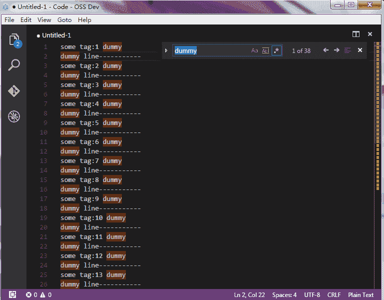

# Visual Studio 代码备忘单

> 原文：<https://dev.to/ech0server/visual-studio-code-cheat-sheet>

> 我会更新这篇文章，因为我在 vscode 中发现了我认为可能有用的快捷方式:)

## 根据正则表达式选择和编辑文本

1.  Ctrl+F:打开查找小部件。
2.  Alt+R:打开正则表达式模式。
3.  输入搜索文本:正则表达式文本或普通文本。
4.  Alt+Enter:选择所有匹配项。
5.  向左箭头:调整光标。(如果不想编辑所选文本，请忽略此步骤。)
6.  编辑文字:做你想做的。(如果不想编辑所选文本，请忽略此步骤。)
7.  Shift+Home:选择修改的文本。(如果不想编辑所选文本，请忽略此步骤。)
8.  Ctrl+C:复制选定的文本。
9.  Ctrl+N:打开一个新标签页。
10.  Ctrl+V:粘贴。

[T2】](https://res.cloudinary.com/practicaldev/image/fetch/s--6gvw3hmJ--/c_limit%2Cf_auto%2Cfl_progressive%2Cq_66%2Cw_880/https://cloud.githubusercontent.com/assets/6732524/14766916/01868528-0a4c-11e6-9a94-81a8340a0ccb.gif)

## 比较文件

1.  打开第一个要比较的文件。
2.  ⌘ + ⇧ + P 带菜单
3.  类型:文件:比较活动文件...
4.  选择要比较的文件。