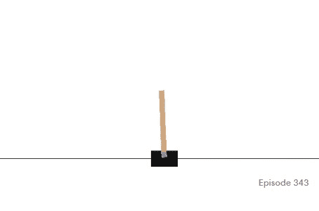
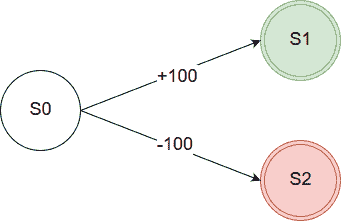
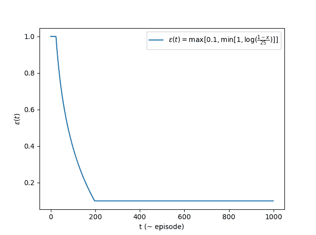

# 在 OpenAI 健身房体验 Q-Learning - First 体验

> 原文：<https://dev.to/n1try/cartpole-with-q-learning---first-experiences-with-openai-gym>

## OpenAI 健身房

今天我第一次体验了开放健身房，更确切地说是 T2 的侧手翻环境。Gym 基本上是一个 Python 库，包括几个机器学习挑战，其中应该学习一个自主代理来完成不同的任务，例如，掌握一个简单的游戏本身。最简单也是最受欢迎的挑战之一是横竿。这基本上是一个 2D 游戏，其中代理人必须控制，即向左或向右移动一辆手推车，以平衡垂直站在手推车上的一根柱子。这是一个经典的强化学习问题，例如，在一个场景中，代理人开始尝试随机行动，作为获得奖励(或不获得奖励)的结果。基于奖励，它不断地“学习”，在特定的情况下哪个动作是好的。这样做，它就学会了如何掌握游戏，甚至不需要被告知游戏是如何运作的。这种学习方式的主要优点是，它是完全通用的，不局限于特定的问题。例如，要学习一个国际象棋智能体，你不需要“告诉”它国际象棋的规则，只是让它尝试&错误，而“错误”意味着给它一个负的(或小的正的)奖励。

## 墨盒-v0

用机器学习的术语来说，CartPole 基本上是一个二元分类问题。有四个特征作为输入，包括推车位置、其速度、柱子与推车的角度及其导数(即柱子“下落”的速度)。输出为二进制，即 0 或 1，对应于“左”或“右”。一个挑战是，所有四个特征都是连续值(浮点数)，这天真地意味着无限大的特征空间。

[T2】](https://res.cloudinary.com/practicaldev/image/fetch/s--7H9jFHnb--/c_limit%2Cf_auto%2Cfl_progressive%2Cq_auto%2Cw_880/https://ferdinand-muetsch.img/cartpole1.jpg)

## 方法:基础 Q-学习

在我大学的[机器学习 1](https://his.anthropomatik.kit.edu/english/28_315.php) 课程中，我了解了一种最基本、但被广泛使用的强化学习方法，这就是 [Q-Learning](http://mnemstudio.org/path-finding-q-learning-tutorial.htm) 。Q-Learning 的核心是通过获得奖励来估计状态(s)和动作(a)的每个可能部分的值。想象下面的图表，它由三个状态组成，而您的代理目前在 *s0* 。它可以在两个动作之间进行选择，其中一个动作导致良好状态 *s1* (例如赢得了游戏)，另一个动作导致不良状态 *s2* (例如输掉了游戏)。相应地，导致好(坏)状态的转换给出了 100 (-100)的奖励。如果代理执行动作 *a0* ，那么 *s0* 的 Q 值很可能会变成负值(Q(s0，a0) < 0)，而 Q(s0，a1) > 0。

[T2】](https://res.cloudinary.com/practicaldev/image/fetch/s--iZlCKYFN--/c_limit%2Cf_auto%2Cfl_progressive%2Cq_auto%2Cw_880/https://ferdinand-muetsch.img/cartpole2.png)

q 值的更新根据以下等式完成。

[T2】](https://res.cloudinary.com/practicaldev/image/fetch/s--k7Z0JGcN--/c_limit%2Cf_auto%2Cfl_progressive%2Cq_auto%2Cw_880/https://ferdinand-muetsch.img/cartpole3.png)

基本上，a (S，A)-tuple 的新 q 值取决于它的旧 q 值、该动作收到的即时奖励以及在以下状态下可实现的最大 q 值。因此,( S，A)对的 q 值间接依赖于其所有后继者的 q 值，这在递归函数定义中得到表达。通过重复遍历所有节点和转移，代理可以更新任何(S，A)对 q 值，而好的和坏的动作的结果从终端节点慢慢“反向传播”到早期节点。代理以一个(通常是多维的)表结束，该表将状态和动作映射到 q 值，因此给定任何状态，可以通过选择相应的最高 q 值来挑选最佳动作。

## 我的实现

因为 Q-Learning 很容易理解和实现，所以我决定选择这个算法作为我的横竿挑战的起点。我寻找其他也使用 CartPole 的解决方案，发现[这篇由](https://medium.com/@tuzzer/cart-pole-balancing-with-q-learning-b54c6068d947) [@tuzzer](https://medium.com/@tuzzer) 写的博文，它在我的实施过程中给了我部分灵感。

[> >运行库代码(qcardpole . py)](https://gist.github.com/n1try/af0b8476ae4106ec098fea1dfe57f578)

### 变换特征空间

实际上，主要的挑战是将连续的 4 维输入空间转换成离散空间，其离散状态的数量有限，最好很少，但却很有表现力。我们拥有的状态越少，Q 表就越小，代理正确学习其值所需的步骤就越少。然而，太少的国家可能没有足够的信息来适当地代表环境。输入要素的原始属性域如下。

*   **x** (推车位置)∈ [-4.8，4.8]
*   **x'** (推车速度)∈ [-3.4 * 10^38，3.4 * 10^38]
*   **θ**(角度)∈ [-0.42，0.42]
*   **θ’**(角速度)∈ [-3.4 * 10^38，3.4 * 10^38]

### 查找参数

可以看出，特别是速度域非常大。然而，从 [@tuzzer](https://medium.com/@tuzzer) 的帖子中，我发现小得惊人的目标间隔就足够了。因此，我首先将**θ**缩小到一个离散的区间`theta ∈ [0, 6] ⊂ ℕ`(准确地说，只是一组整数{0..6})和**θ’**到`theta' ∈ [0, 12] ⊂ ℕ`。受到 [@tuzzer](https://medium.com/@tuzzer/) 的帖子的启发，我完全放弃了 **x** 和**x’**特性，这对应于将它们的任何值映射到一个标量。这背后的动机是，手推车在仅 200 个时间步骤(在 200 个步骤之后，环境自动重置自己)内离开环境的左边界或右边界的概率非常低，并且由此产生的维数减少更有价值。

实际 Q-Learning 算法的实现非常简单，包括一个从 q-table 中获取状态的最佳动作的函数和另一个根据最后一个动作更新 q-table 的函数。这里没什么特别的。

更有趣的是算法的超参数，包括**α(=学习率)**、**ε(=探索率)**和**γ(=折扣因子)**。

Alpha 用于“平滑”更新，使它们不那么激进，这首先防止了由噪声引起的错误。ε在**开采和**勘探之间调节。相应地，与其挑选出*状态中最好的*动作，不如随机挑选出有几率ε a 的*动作。这应该可以防止算法陷入局部最小值。例如，如果在开始时做出了错误的选择，没有ε，代理将继续评估次优路径，并且永远不会发现任何其他可能更好的路径。Gamma 用于惩罚需要很长时间才能达到目标的代理。然而，在这种情况下，gamma 被设置为常数 1(无折扣)，因为尽可能长时间地“生存”甚至是我们的目标。*

首先，我尝试选择ε和α参数作为常数，并尝试各种组合。然而，我总是取得很差的分数(大约在 20 到 50 分之间)。然后，再次受到 [@tuzzer](https://medium.com/@tuzzer/) 的启发，我决定引入一个自适应的学习和探索率，它以一个高值开始，并随着时间而降低(随着每一次训练)。令人惊讶的是，这产生了巨大的差异。突然，我的算法在大约 200 步内收敛。因为我从来没有想到这些超参数会产生如此极端的差异(从根本没有解决挑战到做得相当好)，这可能是我的 CartPole 项目中最有趣的发现。我只是简单的应用了 [@tuzzer](https://medium.com/@tuzzer/) 的自适应函数，如下图所示(最小值 *0.1* 是一个需要优化的超参数)。

[T2】](https://res.cloudinary.com/practicaldev/image/fetch/s--tciCQ_dX--/c_limit%2Cf_auto%2Cfl_progressive%2Cq_auto%2Cw_880/https://ferdinand-muetsch.img/cartpole4.png)

### 网格搜索

当我的具有自适应学习和探索速率的 Q-Learning 实现完成时，我实现了一个额外的网格搜索来做一些超参数调整。目标是找到 alpha 和 epsilon 的特征区间长度和下限的最佳组合。以下参数表现最佳:`'buckets': (1, 1, 6, 12), 'min_alpha': 0.1, 'min_epsilon': 0.1`。此外，我还可以计算不同的函数来计算自适应率，但是我还没有这样做。

[> >代码在 GitHub(qcartpole _ grid search . py)](https://gist.github.com/n1try/87b442fce7f7d58606f462191c6d6033)

## 成绩&未来工作

我的最终成绩是 **188** ，[在排行榜上可以看到](https://gym.openai.com/evaluations/eval_emRbuGdHRnWoJuMUnPwd1Q)。随着我在机器学习知识方面的进步，在为即将到来的[机器学习 2](http://www.aifb.kit.edu/web/Lehre/Vorlesung_Maschinelles_Lernen_2_%E2%80%93_Fortgeschrittene_Verfahren/en) 考试进行练习的同时，我想继续改进我的 CartPole 算法。很可能下一步将是整合深度 Q 学习，这基本上是 Q 学习，唯一的区别是 Q 值是由深度神经网络估计的。主要的(可能也是唯一的)优势是能够处理更大的特征空间。我会让你们了解最新情况。我希望我能鼓励你开始健身，或者一般的机器学习！

最初发表于。