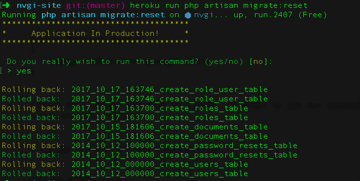
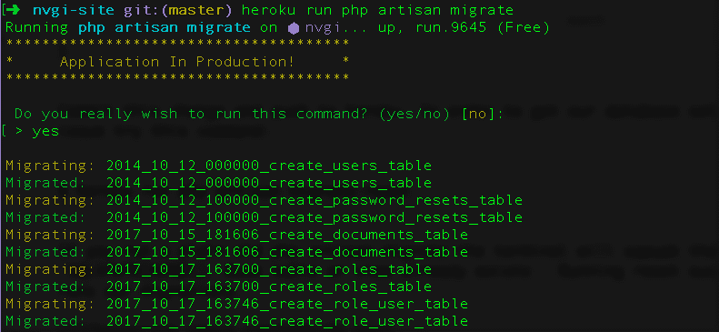

# 将 Laravel 5 应用程序部署到 Heroku

> 原文：<https://dev.to/connor11528/deploy-a-laravel-5-app-to-heroku>

[T2】](https://res.cloudinary.com/practicaldev/image/fetch/s--qKHxphj6--/c_limit%2Cf_auto%2Cfl_progressive%2Cq_auto%2Cw_880/https://bosnadev.com/wp-content/uploads/2014/09/laravel_heroku.jpg)

Heroku 是一个很棒的平台，最初建立在 AWS 之上，目前由 Salesforce 所有。Laravel 是一个用于构建应用程序的强大 PHP web 框架。

在这个简短的教程中，我们将从 [laravel-5-boilerplate](https://github.com/rappasoft/laravel-5-boilerplate) 生成一个应用，并将其部署到 Heroku。

到本教程结束时，我们将有一个用 Laravel、Bootstrap 构建的用户管理和许可系统，并由 Heroku 提供网络支持。

如果你更喜欢一个通用的 Laravel 5 应用程序，而不是一个庞大的样板文件[，遵循这个要点](https://gist.github.com/connor11528/fcfbdb63bc9633a54f40f0a66e3d3f2e)。除了第一步，其他都是一样的。

事不宜迟，我们开始吧。

### 步骤:

*   根据[快速入门文档](http://laravel-boilerplate.com/5.4/start.html)下载 Laravel 5 样板文件。也`git init`为项目。

*   创建用于开发的本地 MySQL 数据库:

```
$ mysql -uroot -p
> create database MY_DATABASE_NAME;
Ctrl-C to exit 
```

Enter fullscreen mode Exit fullscreen mode

*   创建一个 **Procfile** 来教 Heroku 如何启动我们的应用程序:

```
$ echo web: vendor/bin/heroku-php-apache2 public/ > Procfile 
```

Enter fullscreen mode Exit fullscreen mode

*   创建一个 Heroku app。你需要安装 Heroku CLI。

```
$ heroku create YOUR_APP_NAME 
```

Enter fullscreen mode Exit fullscreen mode

*   添加 PHP 构建包:

```
$ heroku buildpacks:set https://github.com/heroku/heroku-buildpack-php 
```

Enter fullscreen mode Exit fullscreen mode

*   将 MySQL 添加到我们的 Heroku 项目:

```
$ heroku addons:add cleardb 
```

Enter fullscreen mode Exit fullscreen mode

这将创建一个名为`CLEARDB_DATABASE_URL`的配置变量，您可以使用以下命令查看该变量。将 CLEARDB_DATABASE_URL 添加到我们的。环境文件。

```
$ heroku config | grep CLEARDB_DATABASE_URL 
```

Enter fullscreen mode Exit fullscreen mode

修改 **config/database.php** 以便我们连接到 Heroku 数据库。

```
<?php

$url = parse_url(getenv("CLEARDB_DATABASE_URL"));

$host = $url["host"];
$username = $url["user"];
$password = $url["pass"];
$database = substr($url["path"], 1);

return [
    ...
    'connections' => [
        'mysql' => [
            'driver' => 'mysql',
            'host' => env('DB_HOST', $host),
            'port' => env('DB_PORT', '3306'),
            'database' => env('DB_DATABASE', $database),
            'username' => env('DB_USERNAME', $username),
            'password' => env('DB_PASSWORD', $password),
            'unix_socket' => env('DB_SOCKET', ''),
            'charset' => 'utf8mb4',
            'collation' => 'utf8mb4_unicode_ci',
            'prefix' => '',
            'strict' => true,
            'engine' => null,
        ], 
```

Enter fullscreen mode Exit fullscreen mode

*   设置一个 heroku 配置变量。记住，你的**。env** 文件没有签入版本控制，所以我们需要让 heroku 知道我们的具体配置。：

```
$ php artisan key:generate --show
$ heroku config:set APP_KEY=app_key_goes_here
$ heroku config:set APP_URL=your_app_name.herokuapp.com 
```

Enter fullscreen mode Exit fullscreen mode

### 推至 Heroku。

当我们通过 CLI 创建 heroku 应用程序时，它自动添加了一个名为“heroku”的 git 遥控器。我们可以使用这个 git 遥控器将代码推送到 Heroku 服务器上。

```
$ git remote -v 
$ git add -A
$ git commit -m 'heroku deployment stuff'
$ git push heroku master
$ heroku open 
```

Enter fullscreen mode Exit fullscreen mode

第一个命令显示了您可以使用的 git 遥控器。下一个命令将所有内容添加到 git 中，包括新的或删除的文件。然后我们承诺和推动。最后一个命令将在浏览器中打开新的 Laravel heroku 应用程序。

### 数据库的东西

[T2】](https://res.cloudinary.com/practicaldev/image/fetch/s--YdxMrPQj--/c_limit%2Cf_auto%2Cfl_progressive%2Cq_auto%2Cw_880/https://i.imgur.com/9X2sFjX.png)

我们添加了一个 ClearDB 数据库，但是我们还没有运行迁移来创建我们的表。为此，我们可以运行

```
$ heroku run php artisan migrate 
```

Enter fullscreen mode Exit fullscreen mode

许多人都经历过一个常见的错误(如上所述)
现在`SQLSTATE[42000]: Syntax error or access violation: 1071 Specified key was too long; max key length is 767 bytes`。幸运的是，Eric Barnes 在这篇文章中概述了[的解决方案。](https://laravel-news.com/laravel-5-4-key-too-long-error)

进入**app/Providers/appserviceprovider . PHP**，为引导方法添加一个默认的字符串长度:

```
use Illuminate\Support\Facades\Schema;

...

public function boot()
{
   Schema::defaultStringLength(191);
} 
```

Enter fullscreen mode Exit fullscreen mode

提交此更改并推送到 heroku。为了让我们的数据库设置没有问题，尝试这个命令:

```
$ heroku run php artisan migrate:reset 
```

Enter fullscreen mode Exit fullscreen mode

如果您首先运行一个普通的旧 php artisan migrate，终端将 sqwuak 那个`SQLSTATE[42S01]: Base table or view already exists`。成功运行 reset 将运行我们的迁移。

[](https://res.cloudinary.com/practicaldev/image/fetch/s--cBNwTfN8--/c_limit%2Cf_auto%2Cfl_progressive%2Cq_auto%2Cw_880/https://i.imgur.com/S0WwjZk.png)
[T6】](https://res.cloudinary.com/practicaldev/image/fetch/s--STC1H6Hv--/c_limit%2Cf_auto%2Cfl_progressive%2Cq_auto%2Cw_880/https://i.imgur.com/RK2OL6m.png)

### SSL/HTTPS 的东西

我在 Medium 上为自定义域[写了一个关于通过 SSL 证书设置 HTTPS 的更全面的指南。出于某种原因，Laravel 应用程序会显示 HTTP urls，浏览器会将其标记为“不安全”。Heroku 默认使用`https://`进行部署。通过`http://`加载页面可能会给我们一个混合的内容、不安全的样式表或者不安全的脚本错误。](https://medium.com/@connorleech/https-ssl-on-heroku-with-google-domains-as-dns-provider-c55c438556c6)

解决这个问题的一个办法是配置 Laravel 在生产中通过 HTTPS 加载资产。为此，进入**App/Providers/appserviceprovider . PHP**并配置为在生产中加载 HTTPS 的所有内容:

```
use Illuminate\Support\Facades\URL;

...

// Force SSL in production
if ($this->app->environment() == 'production') {
    URL::forceScheme('https');
} 
```

Enter fullscreen mode Exit fullscreen mode

### 鳍

恭喜你。您已经使用 Heroku 将 Laravel 5 应用程序部署到了互联网上。

如果你有任何问题，请在推特上给我打电话。此外，我有一个**邮件列表**，我一周发两次，除了开源项目和工作之外，还有合法的教程，包括 Laravel、Vue、Heroku 和其他有趣的东西

在这里注册！[http://connorleech.info/](http://connorleech.info/)

## 更新:

*   您可以使用 ClearDB 插件创建一个数据库。然后，从 Sequel Pro 或类似的工具，您可以使用来自 URL: `CLEARDB_DATABASE_URL => mysql://[username]:[password]@[host]/[database name]?reconnect=true`的信息连接到生产数据库。使用`heroku config`命令设置 heroku 应用程序的配置变量。