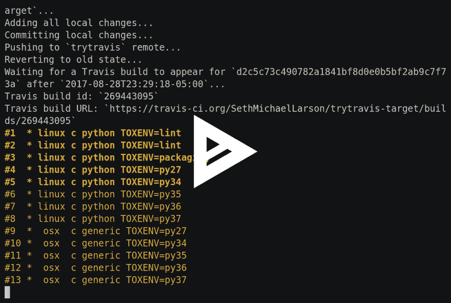

# 调试 Travis CI 而不提交

> 原文:[https://dev . to/sethmlarson/debugging-Travis-ci-without-commits-](https://dev.to/sethmlarson/debugging-travis-ci-without-commits-)

您正在对 GitHub 项目进行一项重要的变更。这是一个相当大的变化，增加了一些好的特性。就像任何优秀的贡献者一样，你也经常运行单元测试、集成测试和 linters。我不想破坏建筑。

一切都变绿了！

事情已经开始成形，您已经准备好打开您的拉动式请求。您将您的更改推送到分叉的存储库，打开一个拉取请求，并花费大量时间概述更改。你点击`Submit`，看着 Travis 启动构建器运行所有的持续集成测试，突然...

**红色的`X`出现在您的提交状态中。特拉维斯失败了。**

你看着失败的测试，却不明白为什么会失败。很难看出它为什么会失败，因为所有东西都在你的机器上传递。不过，你有一些想法。你一个接一个地尝试每一个，等待你的构建每次都完成。当你看着等待那一期再版时，构建肯定是缓慢的。

大约尝试了五次修复，一个小时后，您终于找到了问题的答案并提交了问题的解决方案，一切都变绿了，留给您的是一个如下所示的拉请求:

[T2】](https://res.cloudinary.com/practicaldev/image/fetch/s--5Uf7B-3I--/c_limit%2Cf_auto%2Cfl_progressive%2Cq_auto%2Cw_880/https://thepracticaldev.s3.amazonaws.com/i/o9kva1zsa0godq3c43cd.PNG)

# 刚刚发生了什么？

不幸的是，您的持续集成环境与您的开发人员环境不同。许多依赖 Travis CI 进行持续集成的开源项目恰好就是这种情况。一旦 Travis 遇到无法在本地机器上重现的问题，调试就会变成一场噩梦。

没有太多的选择，唯一可行的方法是不断地进行小的调试更改，直到有东西可以工作为止，这样会浪费大量的资源和时间。

# 解决问题的方法

因为我在我自己的开源工作中不得不亲自处理这个问题，所以我开发了一个叫做 [`trytravis`](https://github.com/SethMichaelLarson/trytravis) 的工具，它透明地发送你的 git 库(**以及你的本地更改！**)提交给 Travis，并在命令行中跟踪构建进度**，而无需提交到您正在处理的实际特性分支。我能得到一个ðÿ™œ吗？)**

这是我在当地做的一些改变的行动中`trytravis`的 asciinema 记录:

[T2】](https://asciinema.org/a/135389)

[在 GitHub](https://github.com/SethMichaelLarson/trytravis) 上查看`trytravis`的源码。根据`Apache-2.0`获得许可。

## 附加牛逼功能

*   您的构建的 URL 将显示在命令行中，以便轻松访问构建，而无需等待 Travis CI 更新正在运行的构建。
*   不要中断你的工作流程:所有的操作都发生在命令行中，如果出现问题，你只需要访问 Travis 网站。
*   如果您创建一个单独的用户，`trytravis`使用的构建器独立于您试图提交的项目的构建器。这意味着你不必永远等待你的工作建立在有很多构建的大型项目上。
*   您可以通过在本地修改`.travis.yml`文件来配置将要构建的作业，从而精确定位您想要关注的特定构建。

## 安装和设置

安装和设置是一次性的工作。**一旦完成设置，它将适用于您的所有项目。**你可以在 GitHub 的 [`README.md`中找到设置和安装的全部细节以及使用文档。如果您遇到问题，请不要犹豫](https://github.com/SethMichaelLarson/trytravis)[在问题跟踪器](https://github.com/SethMichaelLarson/trytravis/issues)上提出问题。

如果你真的喜欢这个项目，别忘了留下一颗星！我真的很感激。âœ

# 在 Twitter 上找到我

我有一个 Twitter，在那里我发布对我来说很重要的东西，比如 Python、虚拟化和分布式计算。如果你对这个工具或者那些话题感兴趣，可以关注我。

感谢阅读！✠ðŸ âœ