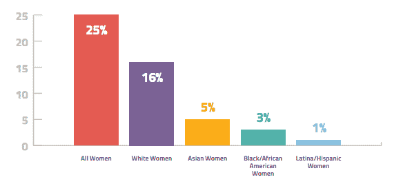

# 技术领域的女性:关键人物、人物和社区

> 原文：<https://dev.to/apium_hub/women-in-tech-key-people-figures--communities>

女性在科技行业并不常见。然而，女性在科技行业的存在意义重大。女性正在成为科学家、知名的科技领袖和首席执行官，每个城市都有支持女性从事科技行业的社区。在这篇文章中，我想观察一下在科技行业取得巨大成就的鼓舞人心的女性，一些支持女性的组织和社区，以及一些统计数据和对未来的预测。

### 一些数字和预测

尽管世界人口的一半是女性，但女性在科技行业的存在已经足够少了。

*   在 1991 年达到 36%的高峰后，从事计算机工作的女性比例一直在稳步下降。
*   2015 年，参与计算相关主题的女性比例达到 25%:

[T2】](https://www.ncwit.org/sites/default/files/resources/womenintech_facts_fullreport_05132016.pdf)

根据 ISACA 的说法，女性有 5 个主要障碍:缺乏导师，在该领域缺乏女性榜样，工作场所的性别偏见，与男性相比不平等的增长机会以及相同技能的不平等报酬。

### 理工女；一些鼓舞人心的例子

**[盖尔·卡迈克尔](https://www.linkedin.com/in/gailcarmichael)T3】**

Gail 是一位备受尊敬的计算机科学家和教育家，目前是 Shopify 的外部教育团队负责人。该小组的任务是让每个人更好地体验学习计算思维和计算机科学。项目旨在侧重于四个专题组之一:政策、外联和多样性、学位和学徒制以及学术研究。她还帮助创建了卡尔顿科学与工程妇女组织，并热情地致力于与女孩和妇女分享她在技术和计算机科学方面的快乐。

**[金伯利·布里安](https://www.linkedin.com/in/kimberlybryant/)T3】**

作为“黑人女孩代码”的创始人和执行董事，金伯利正在迅速成为科技教育领域最具影响力的女性之一。教育非营利组织于 2011 年在旧金山成立，现已扩展到美国和南非的城市。教育重点是教 6 至 17 岁的有色人种女孩开发移动应用程序，学习计算机编程、机器人开发以及其他科学、技术、工程和数学(STEM)技能。《黑人女孩守则》的愿景是，通过从小就赋予少数民族妇女权力并对她们进行教育，增加她们在所有技术领域的人数。金伯利获得过无数奖项，包括杰斐逊公共服务奖。她还在 2013 年被白宫授予“科技包容变革冠军”的荣誉。

**[杰西卡·娜齐](https://www.linkedin.com/in/jessicanaziri/)T3】**

作为一名长期的影响者、技术专家、内容策略师和媒体人士，Jessica 利用她的专业知识帮助初创公司和科技公司进入利基市场。她的许多追随者都是年轻女性，她们对时尚和技术都充满热情。她通过媒体策略开发和品牌定位将技术展现在有影响力的人面前。她也是 TechSesh 的创始人兼首席执行官，该网站提供时尚可穿戴技术、科技女性、小工具和应用程序评论以及技术提示的信息。她职业生涯的主题目标是揭开技术的神秘面纱，让普通人更容易接触到技术。

**[阿曼达·兰纳特](https://www.linkedin.com/in/amandalannert/)T3】**

阿曼达·兰纳特(Amanda Lannert)是 Jellyvision Lab 的首席执行官，jelly vision Lab 是一家帮助用户做出重大生活决定的技术公司，包括从医疗保险到金钱问题的一切。她是公司战略、合作伙伴发展和客户获取活动中不可或缺的一部分。在她的领导下，Jellyvision 在过去四年中有三年的收入翻了一番。此前，Amanda 在李奥·贝纳为凯洛格管理全球品牌。她喜欢在一家以技术为中心的公司担任更重要的角色，同时将自己的业务和品牌专长应用到这个角色中。

**[朱莉·拉森-格林](https://www.linkedin.com/in/julie-larson-green-23214677/)T3】**

Julie 是微软体验组织的首席体验官。她热衷于开发能够处理耗时任务的技术，以便人们能够专注于业务中更重要的事情。她与一个团队合作，孵化新技术和新体验，帮助人们完成工作。在她加入微软的 11 年里，她参与了诸如 Internet Explorer、Office、Windows、Xbox 和 Surface 等产品的开发。

**[狂热的拉里扎德·达根](https://www.linkedin.com/in/avidlarizadeh)**

拉里扎德·达根是谷歌风投在欧洲的剩余合伙人之一。她也是该基金唯一的女性普通合伙人。拉里扎德·达根(Larizadeh Duggan)带领谷歌风投投资了 Yieldify，这是一家成立两年的电子商务初创公司，帮助在线零售商说服人们在线购买产品。除了投资，Larizadeh Duggan 还领导了英国的“代码小时”项目，并且是伦敦科技女孩计划的导师。在加入谷歌风投之前，拉里扎德·达根(Larizadeh Duggan)是时尚零售初创公司 Boticca 的联合创始人。除了在 Accel Partners 担任常驻企业家之外，她还在 Skype 和易贝担任产品管理职务。

### 一些组织&社区支持“科技女性”浪潮

**[女子 4 号科技](http://women4technology.com/)**

由招聘公司 Bailey Fisher 创建的 Women 4 Technology 是一个非正式的女性企业负责人团体，他们通过邀请会面，只是为了建立关系网、会谈和演示。

**[科技女性](http://www.womenintechnology.org/)**

技术领域的女性是一个就业委员会，它只在明确承诺增加为其工作的技术领域女性人数的组织中发布职位广告。

**[BC women](http://www.bcs.org/)**

作为英国计算机学会(BCS)的一个分支，BCSWomen 致力于支持女性在技术、IT 和编码领域的培训和就业。它发现吸引女性从事 It 工作很难，而且女性在职业中断后很难重返 IT 工作岗位。

**[数字妈妈](https://digitalmums.com/)**

下一个组织是数字妈妈，他们试图让女性在线灵活工作。它的目标是培训和指导女性成为在线社区管理者。这个想法是，社交媒体外联是一个不断增长的行业，母亲们已经具备了一些所需的技能，而这份工作允许灵活的时间，可以在家完成。

**[理工女](https://girlsintech.org/)**

“科技女孩”是一个全球性网络，在英国、中国、希腊、智利、法国、阿联酋和美国都有业务。该组织的目标是提高女性在技术工作中的可见度。它举办活动，提供资源，并促进技术工作的可用性。

**[电信和技术领域的女性](http://www.wittgroup.org/)**

这个科技行业女性组织成立于 2001 年，创始人是电信行业的高管们，他们意识到自己往往是公司高层中唯一的女性。该组织教育和指导成员，允许妇女分享想法，并举行会谈和会议。它有 500 名成员，分布在包括英国电信、沃达丰、EE、IBM、Ofcom 和路透社在内的各个公司。

**[创新之母](http://motherofinnovation.com/)**

MoI 组织了一个年度会议，旨在探索和庆祝母亲改变世界的力量。最后一次会议致力于母亲为自己所做的事情，将展示母亲们在教育、医疗、金融和技术方面改变周围世界的方式。

**睿智**

Wise 成立于 30 年前，致力于提高英国科学、技术、工程和数学领域的性别平衡，旨在到 2020 年将女性比例从现在的 13%提高到 30%。Wise 为商业、教育和重返工作岗位的妇女提供支持服务。

**已删除已删除**

科学、工程和技术领域的妇女(WiSET)设在谢菲尔德哈拉姆大学科学教育中心。其目的是分配科学、技术、工程、数学和建筑环境领域中代表性不足的群体的参与。WiSET 提供资源、信息、报告、职业建议和支持，同时开展活动，帮助妇女通过教育和就业进入技术和相关职业。

### 

### 如果你觉得有趣，你可能会喜欢…

[数字业务转型:趋势、统计和关键研究](https://apiumhub.com/tech-blog-barcelona/digital-business-transformation/)

[数字身份趋势&2017 年值得关注的初创公司](https://apiumhub.com/tech-blog-barcelona/digital-identity-trends-startups/)

[以人为中心的创新:职业、利益&示例](https://apiumhub.com/tech-blog-barcelona/human-centered-innovation/)

科技女性:关键人物，人物&社区的帖子最先出现在 [Apiumhub](https://apiumhub.com) 上。

*本帖最初发表于[apiumhub.com](https://apiumhub.com/tech-blog-barcelona/women-in-tech/)T3】*