# 用红黑树将节点涂成黑色

> 原文:[https://dev . to/vaidehijoshi/painting-nodes-black-with-red-black-trees](https://dev.to/vaidehijoshi/painting-nodes-black-with-red-black-trees)

<figure>[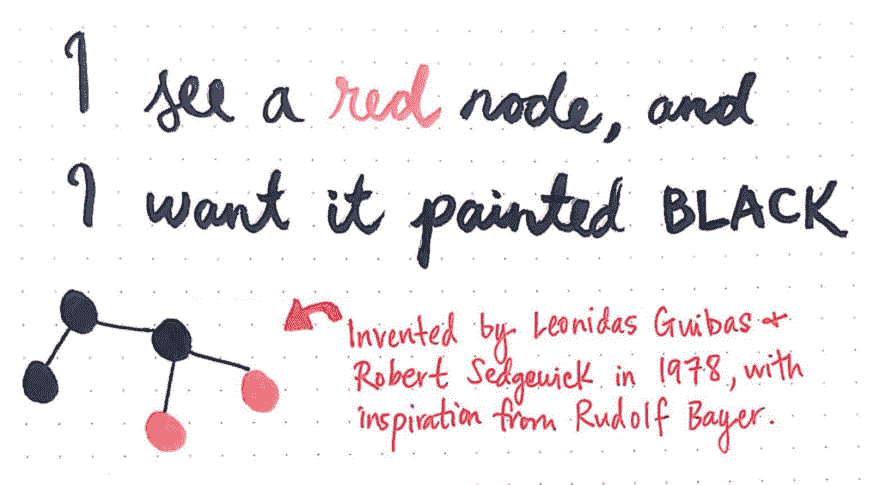](https://res.cloudinary.com/practicaldev/image/fetch/s--wk9yihFJ--/c_limit%2Cf_auto%2Cfl_progressive%2Cq_auto%2Cw_880/https://cdn-images-1.medium.com/max/1024/1%2AbvsHuHYxQCL-Bol3rkznRw.jpeg) 

<figcaption>我看到一个红色的节点，我想把它涂成黑色！</figcaption>

</figure>

做某事几乎总是有不止一种方法。在软件领域尤其如此。事实上，这就是所有软件的本质:用不同的方法来解决相似的问题，或者有时是完全相同的问题。

关于计算机科学中解决问题的许多方法，特别有趣的是，作为程序员，我们每天依赖的许多解决方案实际上是建立在别人最初发明的更天真的解决方案之上的。我们已经看到，这就是我们在本系列中讨论的算法的情况。如果我们回想一下所有这些排序算法，许多更明显和更有效的算法是在更简单、效率更低的解决方案被发明出来之后出现的。归并排序[早在 1945 年就衍生出](https://dev.to/vaidehijoshi/making-sense-of-merge-sort-part-1)，而[冒泡排序](https://dev.to/vaidehijoshi/bubbling-up-with-bubble-sorts)和最早迭代的插入排序[则在 1956 年发明](https://users.cs.duke.edu/~ola/bubble/bubble.html)。但是今天，一些编程语言(包括 Java)使用一种混合了[插入](https://dev.to/vaidehijoshi/inching-towards-insertion-sort)和合并排序[的*解决方案:timsort*](https://en.wikipedia.org/wiki/Timsort) ，它是受这两种解决方案的启发，最近才发明的，在 2002 年。

但不仅仅是排序算法坚持建立在解决方案的基础上；这个真理分散在许多常见的计算机科学问题中。尽管内部纷争不断，但即使是现代的 JavaScript 框架也完全是这样做的:每个框架都学习并借鉴其他框架的解决方案，旨在建立在可行的基础上，并改进不可行的东西。明智的做法是依靠他人已经创建的解决方案，并在此基础上创建我们自己的解决方案。

事实证明，程序员早就知道这一点了。几十年来，他们一直在相互学习对方的解决方案，从排序算法到前端框架，甚至是最简单的数据结构。我们最近在 [AVL 树](https://dev.to/vaidehijoshi/the-little-avl-tree-that-could)中看到了一个例子，这是一种基于[二分搜索法树](https://dev.to/vaidehijoshi/leaf-it-up-to-binary-trees)思想的自平衡树。今天的例子在这两种树形结构的基础上更进一步，用一种非常有趣(可能有点不稳定)的叫做红黑树的结构。

### 非常有纪律的树

既然我们已经知道了平衡二叉查找树背后的基本原理，我们可以直接跳到红黑树。红黑树背后的历史是相当独特的，我们将深入了解这种特殊结构起源的一些特质。红黑树是 1978 年由加利福尼亚州帕洛阿尔托的施乐 PARC 研发公司的两位研究人员列奥尼达·吉巴斯和罗伯特·塞奇威克发明的。他们在一篇共同发表的论文中引入了红黑树的概念，名为“平衡树的双色框架”。

然而，这种结构不是他们一个人发明的；他们改编了另一位德国计算机科学家鲁道夫·拜尔的工作，这位科学家通过对特殊类型的平衡树的研究，已经开始了发明这种精确数据结构的工作。Guibas 和 Sedgewick 都将他们对红黑树的研究归功于 Bayer 的工作，该工作在几年前，即 1972 年发表。的确，如果没有拜耳的铺垫和启发，红黑树永远不会被发现！

好的，我们知道红黑树需要大量的脑力才能来到这个世界。但是到底是什么*红黑树呢？让我们从最简单的定义开始。*

<figure>[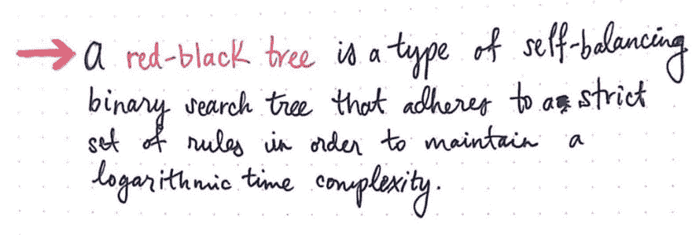](https://res.cloudinary.com/practicaldev/image/fetch/s--WdZ_lmG5--/c_limit%2Cf_auto%2Cfl_progressive%2Cq_auto%2Cw_880/https://cdn-images-1.medium.com/max/1024/1%2AHDeUEvzdQYYALYgGG3R_JQ.jpeg) 

<figcaption>红黑树:一个定义。</figcaption>

</figure>

一棵 ***红黑树*** 是一种自平衡二叉查找树，与其他自平衡树非常相似，比如 [AVL 树](https://dev.to/vaidehijoshi/the-little-avl-tree-that-could)。然而，红黑树是一种结构，必须遵守一套非常严格的规则，以确保它保持平衡；红黑树的规则正是使它能够保持有保证的对数时间复杂度的原因。

在最基本的层面上，一棵红黑树必须遵循四个规则，不管是什么。在构建和收缩(插入或删除)这棵树的每个方面，都必须遵循这四条规则；否则，数据结构不能被认为是红黑树。

<figure>[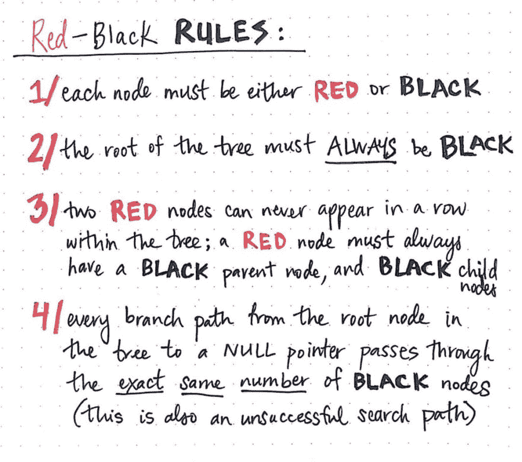](https://res.cloudinary.com/practicaldev/image/fetch/s--LW82x-Dc--/c_limit%2Cf_auto%2Cfl_progressive%2Cq_auto%2Cw_880/https://cdn-images-1.medium.com/max/1024/1%2AgrnKmKuXnGV6exgiVkDnJw.jpeg) 

<figcaption>一棵规则的红黑树。</figcaption>

</figure>

一般来说，红黑树的四个规则总是以相同的顺序出现，如下所示:

1.  树中的每个节点都必须是红色或黑色的。
2.  树的根节点必须始终为黑色。
3.  两个红色节点永远不可能连续出现，一个接一个；红色节点之前必须始终有一个黑色节点(它必须有一个黑色的父节点)，并且红色节点必须始终有黑色的子节点。
4.  每个分支路径——从根节点到空(null)叶节点的路径——必须经过完全相同数量的黑节点。从根到空叶节点的分支路径也被称为*不成功搜索路径*，因为它代表了如果我们要搜索树中不存在的节点时我们将采用的路径。

当我们看到这些规则发挥作用时，它们开始变得更有意义，所以让我们看看一些红黑树(和非树)来试图理解发生了什么。

在此处显示的示例中，第一棵树有三个黑色节点。注意，两个子节点都有指向空叶节点的指针。这可能是显而易见的，但记住这一点很有帮助:

> 空叶节点总是被认为是黑色节点，而不是红色节点。

<figure>[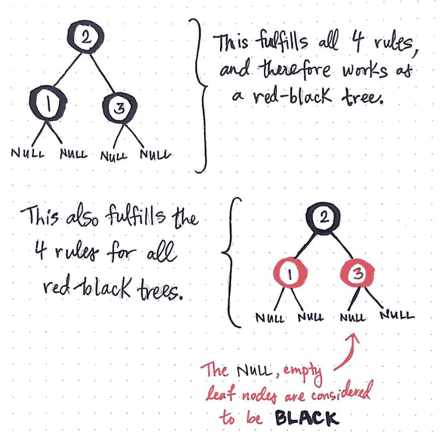](https://res.cloudinary.com/practicaldev/image/fetch/s--oLG88U9D--/c_limit%2Cf_auto%2Cfl_progressive%2Cq_auto%2Cw_880/https://cdn-images-1.medium.com/max/1024/1%2AQU3jZp6gtpsGHY8iLx05Ng.jpeg) 

<figcaption>履行红黑树的规则。</figcaption>

</figure>

第一棵红黑树遵守所有四个规则:

1.  每个节点都是红色或黑色的，
2.  根节点是黑色的，
3.  没有两个红色节点连续出现，
4.  最后，从根节点到所有四个零叶子节点的路径在到达零叶子的途中经过两个黑节点(2 然后 1，或者 2 然后 3)。

有趣的是，第二个例子也是有效的红黑树。这里的主要区别是子节点 1 和 3 都是红色的。然而，两个红色节点都没有连续出现，所以这棵树仍然没有违反第三条规则。此外，在这种情况下，从根到所有空叶节点的分支路径也经过相同数量的节点——在从根到空节点的路径上，我们只经过一个黑节点，即根。所以，我们也没有违反第四条规则。

起初，似乎遵循这四条规则很容易做到；我们刚刚创建了两棵红黑树，没有违反任何规则，对吗？嗯，正如我们将要发现的，这些规则非常严格，非常容易被打破。

演示这一点的最佳方式是使用三个链式节点的示例。

在这里显示的插图中，我们有四个潜在的不同选项来创建一个具有三个节点 1、2、3 的红黑树。事实上，我们可能有更多的选择，但让我们假设我们不打算考虑制作一个没有红色和黑色节点的树，以及一个黑色的根节点。

<figure>[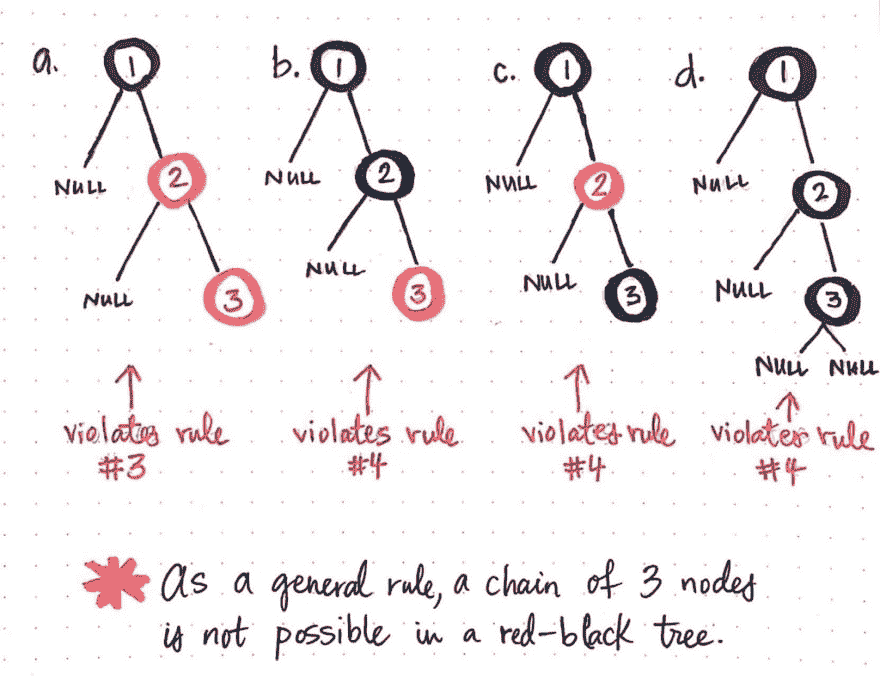](https://res.cloudinary.com/practicaldev/image/fetch/s--zD0ljL3s--/c_limit%2Cf_auto%2Cfl_progressive%2Cq_auto%2Cw_880/https://cdn-images-1.medium.com/max/1024/1%2AZKXcslWYyMllbRsQ-qDZCQ.jpeg) 

<figcaption>一棵红黑树不可能有 3 个节点的链。</figcaption>

</figure>

在树 a 中，我们有一个黑色的根，和两个连续的红色节点。光看这棵树我们就能知道这是个问题；我们违反了第三条规则！

在树 b 中，我们有一个黑色的根、一个黑色的子节点和一个红色的孙节点。这可能看起来很好，但是……还记得第四条规则吗？无论我们选择哪条分支路径，从根节点到每个空叶节点的路径都要经过相同数量的黑节点。从 1 到它的左空子节点的路径只通过一个黑节点，而到 2 的左子节点的路径通过两个黑节点。这完全违反了第四条规则。

同样的问题也发生在树 c 和 d 上；从根节点到每个空节点的路径经过的黑节点数量略有不同，这意味着这些树实际上都不是有效的红黑树！

事实证明，在红黑树领域有一个众所周知的证据，正好证明了我们刚刚看到的情况:

> 三个节点的链不可能都是有效的红黑树。

这些规则看起来比第一眼看起来更严格，对吗？嗯，尽管它们看起来很难理解，但它们非常重要——更不用说强大的功能了。我们来试着解开为什么！

### 遵循红色的规则

遵循红黑树规则最棘手的时候是我们种植或缩小这棵树的时候。完美平衡的红黑树非常好，但是大多数数据结构都倾向于插入和删除元素和数据。当谈到红黑树时，这一开始可能有点令人生畏。

让我们解开如何在插入节点时处理红黑树，一步一步来。

<figure>[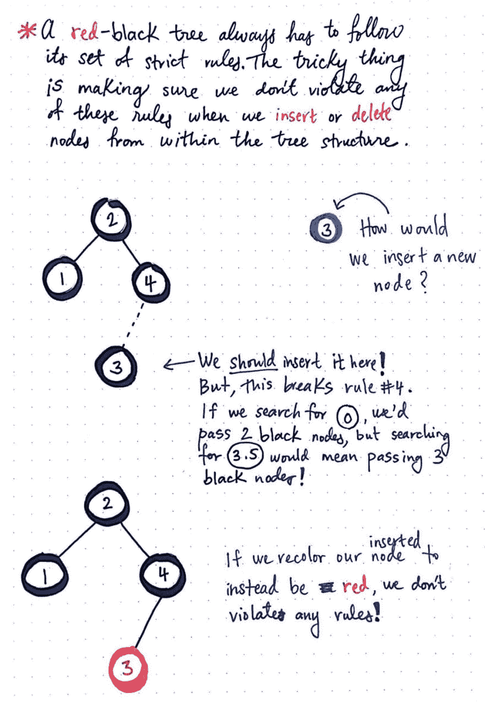](https://res.cloudinary.com/practicaldev/image/fetch/s--NLkwcy09--/c_limit%2Cf_auto%2Cfl_progressive%2Cq_auto%2Cw_880/https://cdn-images-1.medium.com/max/1024/1%2AAAPvzEHupPE4omehfjXWSQ.jpeg) 

<figcaption>我们如何插入一个值为 3 的新节点呢？</figcaption>

</figure>

在这里显示的插图中，我们有一个带有三个黑色节点的树。我们如何在这个树中添加一个值为 3 的新节点呢？

第一步基本上是忽略红-黑规则，最初只是根据正常二叉查找树的规则计算出节点的走向。因为 3 大于 2 但小于 4，所以我们将它作为节点 4 的左子节点。首先，当我们插入这个节点时，我们将违反规则四，因为如果我们从左子树中搜索一个空叶节点，我们将经过两个黑节点，但是通过右子树的不成功搜索将经过三个黑节点。

相反，如果我们将值为 3 的插入节点重新着色为*红色，*而不是黑色，我们并没有违反四个红黑树规则中的任何一个。

在插入红黑树时，这往往是一个好策略。

> 插入一个节点并立即将其涂成红色，可以更容易地识别并随后修复任何违规。

好，现在我们的树有四个节点:1，2，4 和 3。如果我们插入另一个节点，这次的值是 5，会发生什么？

<figure>[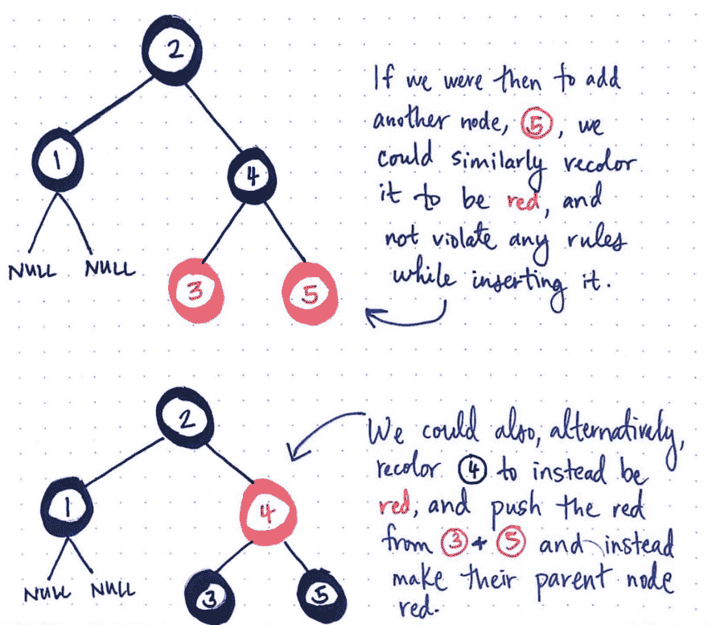](https://res.cloudinary.com/practicaldev/image/fetch/s--rRQ7ql_K--/c_limit%2Cf_auto%2Cfl_progressive%2Cq_auto%2Cw_880/https://cdn-images-1.medium.com/max/1024/1%2ASTI2ey2kGC4_Z_RENTa41A.jpeg) 

<figcaption>插入节点，继续。</figcaption>

</figure>

好的，我们将按照我们已经熟悉的步骤开始:定位节点的位置，并将其重新着色为红色。

在我们的树图中，我们将插入节点 5 作为黑色节点 4 的右子节点。这不会违反任何规则，因为两个红色节点不会一个接一个地出现，并且从根节点到 null 的所有路径仍然正好经过两个黑色节点。

然而，我们也可以将黑色的父节点 4 重新着色为红色*，而不是黑色*的 *。在这个场景中，我们基本上是从它的子节点 3 和 5“向上推”红色，这样它们的父节点就变成红色。请注意，我们仍然没有违反规则三或规则四，在从根到 null 的所有路径中，我们仍然恰好经过 2 个黑色节点。*

正如我们从这个例子中看到的， ***重新着色*** 节点是一种处理插入(和删除)的常用技术！)变成一棵红黑色的树。

<figure>[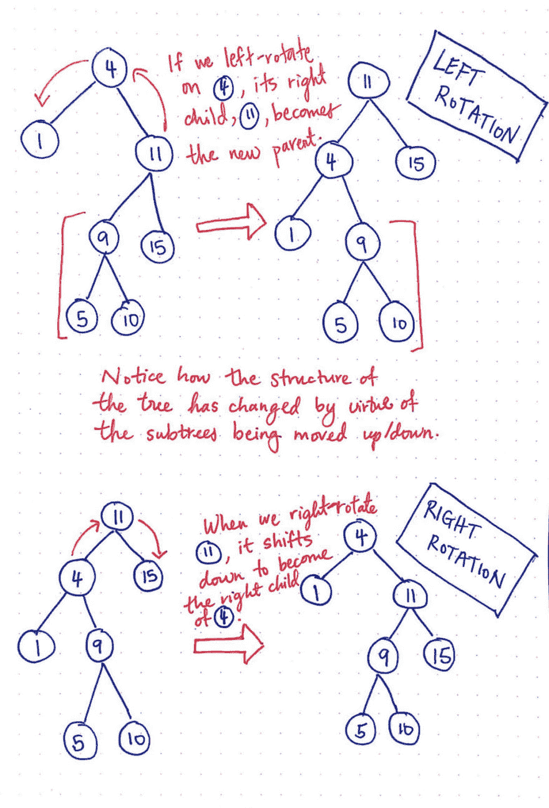](https://res.cloudinary.com/practicaldev/image/fetch/s--RmoDOTTs--/c_limit%2Cf_auto%2Cfl_progressive%2Cq_auto%2Cw_880/https://cdn-images-1.medium.com/max/1024/1%2ARccOz-HQviItgvKG26oHyg.jpeg) 

<figcaption>左右旋转的力量。</figcaption>

</figure>

处理违反规则的另一个方便的技巧是我们在本系列前面遇到的:循环！当我们探索 [AVL 树](https://dev.to/vaidehijoshi/the-little-avl-tree-that-could)的时候，我们学习了轮换(或者我喜欢认为是“光荣的互换”)。

对于红黑树，我们也可以做类似的事情。在这里展示的图画中，我们有一棵不平衡的红黑树；暂且忽略节点的颜色，假设我们需要旋转并重新平衡这棵树。

在第一幅图中，我们在根节点 4 上进行左旋转，因此它的右子节点 11 成为新的父节点。这叫做*。类似地，如果我们在新的父节点 11 上右旋转，并向下移动它，使它再次成为 11 的右子节点，我们正在执行一个 ***右旋转*** 。*

 *请注意，在这两种情况下，当我们旋转时，树的结构是如何变化的；在我们的左旋转中，9-5-10 的子树从右边的子树移到了左边。相反，在我们的右旋转中，9-5-10 的同一个子树从左边的子树移回到右边。 ***旋转*** 倾向于移动和重组一棵更大的红黑树的子树，这也有助于防止任何违反规则的行为。

<figure>[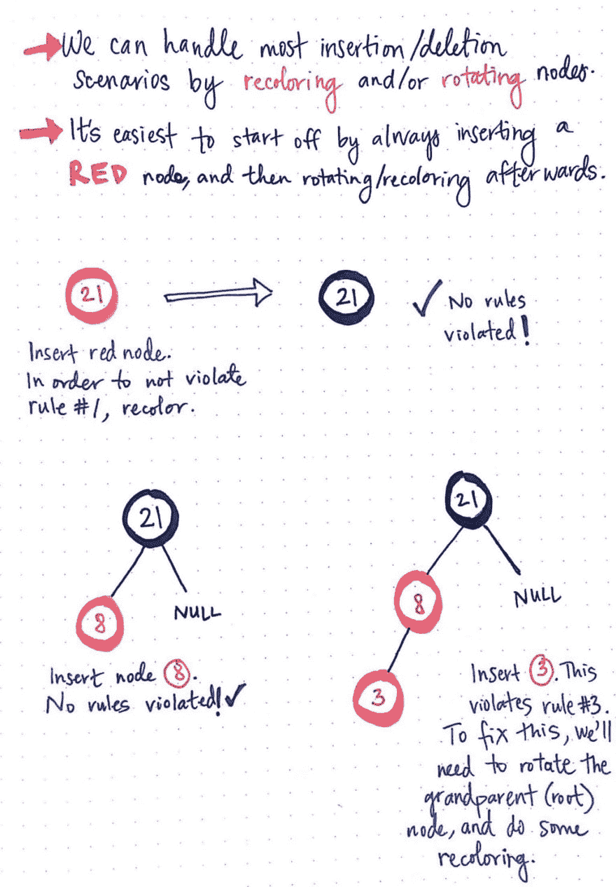](https://res.cloudinary.com/practicaldev/image/fetch/s--cuFiIZU2--/c_limit%2Cf_auto%2Cfl_progressive%2Cq_auto%2Cw_880/https://cdn-images-1.medium.com/max/1024/1%2A-F2EvlK1R0Cnr_16iSJOpw.jpeg) 

<figcaption>通过旋转和重新着色处理插入和删除。</figcaption>

</figure>

让我们再看一个例子，看看重新着色和旋转如何帮助我们将节点插入到红黑树中。

记住:最简单的开始是插入一个红色的节点，然后根据需要重新着色和旋转。

我们将从一个根节点 21 开始，它将是红色的。但是，由于这是根节点，并且我们的规则之一是根节点必须始终是黑色的，我们可以将节点 21 重新着色为黑色。现在，没有违反任何规则！

接下来，我们将在树中插入一个值为 8 的节点，作为根的左子节点。我们可以将其作为红色节点插入，并且在过程中不违反任何规则！

接下来，我们将插入一个值为 3 的节点。将这个节点作为 8 的左子节点插入违反了规则三，因为我们将有两个连续的红色节点。为了解决这个问题，我们需要旋转祖父节点(根节点),然后重新着色。

<figure>[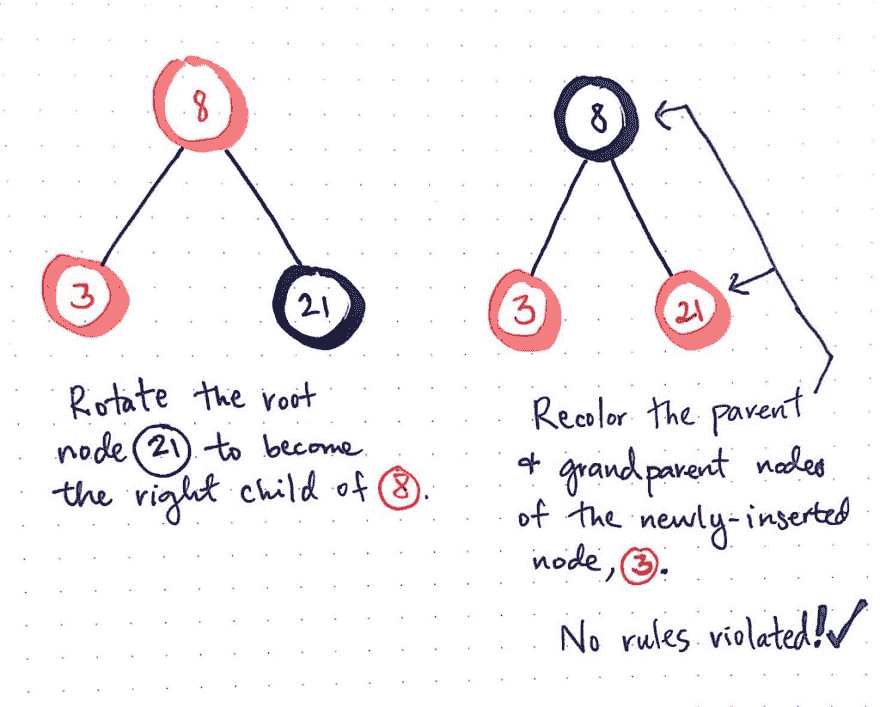](https://res.cloudinary.com/practicaldev/image/fetch/s--3HRxbC4H--/c_limit%2Cf_auto%2Cfl_progressive%2Cq_auto%2Cw_880/https://cdn-images-1.medium.com/max/1024/1%2AyUrsDQvRY0iqS5ugvFjU3w.jpeg) 

<figcaption>旋转和重新着色，不违反任何规则。</figcaption>

</figure>

如果我们向右旋转根节点，将 21 下移成为 8 的右子节点，我们就向解决问题迈出了一步。节点 8 是我们新的根节点，有两个子节点，3 和 21。

然而，现在我们又一次违反了根节点规则！

不要担心——我们可以对新插入的节点(现在是正确的子节点)21 和根节点 8 的原始父节点重新着色。如果我们对 8 和 21 重新着色，我们的根节点又变回黑色，我们的两个子节点都变成红色。

最重要的是，没有违反任何规则，我们有一个完美平衡的红黑树！

### 把它涂黑的好处

好的，所以我们在第一个例子中成功地重新着色和旋转了足够多的颜色，以获得完美的平衡和正确的工作。

但是，将元素插入一棵更大的红黑树会怎么样呢？让我们看一个更复杂的例子；正如我们将看到的，同样的方法适用。

> 处理较大的红黑树的关键是在我们进行的过程中沿着树向上移动任何违反规则的行为。

<figure>[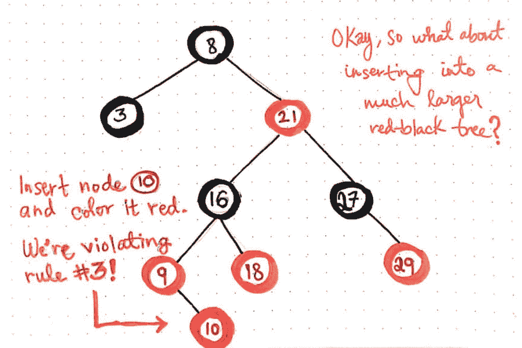](https://res.cloudinary.com/practicaldev/image/fetch/s--uHw-D2se--/c_limit%2Cf_auto%2Cfl_progressive%2Cq_auto%2Cw_880/https://cdn-images-1.medium.com/max/1024/1%2A-w6OKs2lX9h8EK7tzKQjXQ.jpeg) 

<figcaption>插入一棵大得多的红黑树呢？</figcaption>

</figure>

在这个示例树中，我们有八个节点，我们将节点 10 插入到树中。我们将把它作为 9 的左孩子插入，并把它涂成红色。很快，我们可以看到我们违反了规则三——两个红色节点连续出现。

<figure>[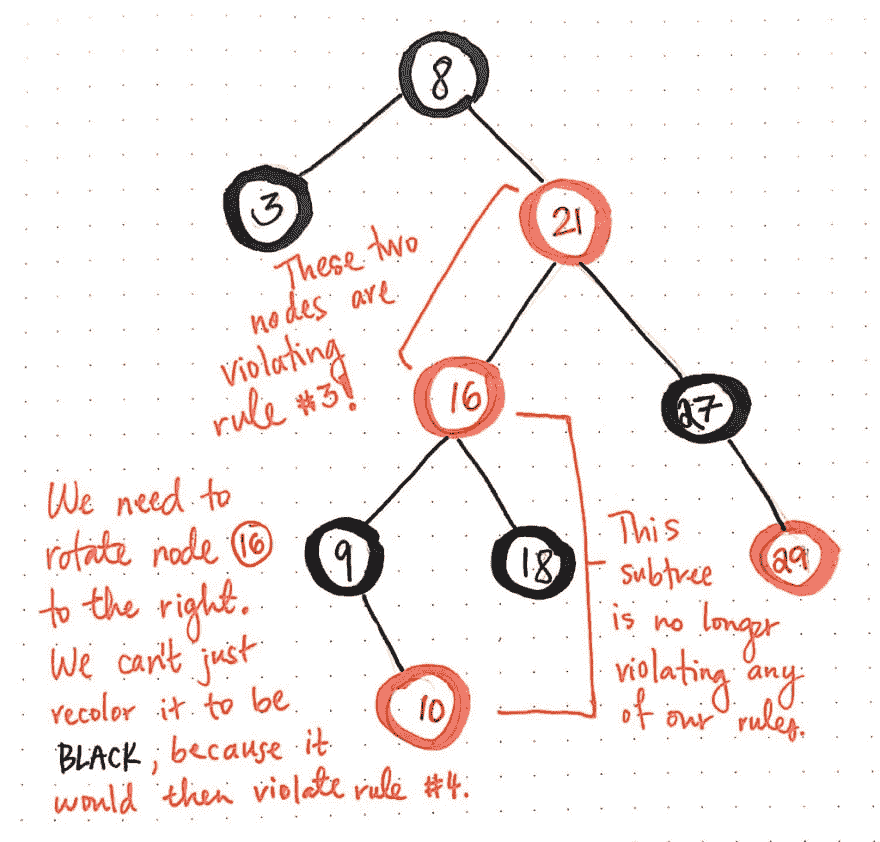](https://res.cloudinary.com/practicaldev/image/fetch/s--S4keFJX6--/c_limit%2Cf_auto%2Cfl_progressive%2Cq_auto%2Cw_880/https://cdn-images-1.medium.com/max/1024/1%2AHxbWVFSXd4FlN0qj36_Xlw.jpeg) 

<figcaption>节点 16 违反了树，所以必须进行旋转。</figcaption>

</figure>

我们可以首先通过对新插入的节点 10 的父节点重新着色来解决这个问题。这至少解决了规则三被打破的问题！

嗯… *有点儿*。实际上，我们通过在这里重新着色所做的就是*将我们的违规上移*，所以节点 16 和 21 现在违反了规则三。我们没有去掉这个违例，只是把它上移了！

我们不能将 16 重新着色为黑色，因为如果我们这样做，我们就违反了规则四，改变了从根节点到零叶子的所有路径上经过的黑色节点的数量。因为没有父节点需要重新着色(除了根节点，我们不想让它变成红色！)，我们现在可以依靠旋转来帮助我们。由于节点 16 违反了连续红色规则，我们可以将该节点向右旋转。

<figure>[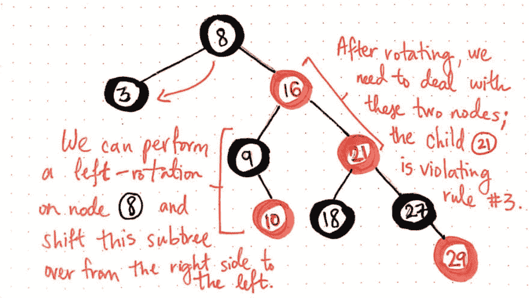](https://res.cloudinary.com/practicaldev/image/fetch/s--cvob7FFp--/c_limit%2Cf_auto%2Cfl_progressive%2Cq_auto%2Cw_880/https://cdn-images-1.medium.com/max/1024/1%2AbqhKnlmOxCxXCIuXMxjpQA.jpeg) 

<figcaption>现在，节点 21 是违反β树的节点！</figcaption>

</figure>

向右旋转节点 16 后，我们有效地向下推了节点 21、27 和 29。

现在，我们需要处理两个连续的仍然违反规则三的红色节点:16 和 21。

我们可以通过向左旋转节点 16 来旋转整个树，并使其成为新的根节点。但是，我们会注意到，如果我们将 16 作为新的根节点，那么节点 9 和 10 都将位于错误的位置。我们需要在节点 9 和 10 上执行左旋转，这样它们都在左子树上，而不是在右子树上。

<figure>[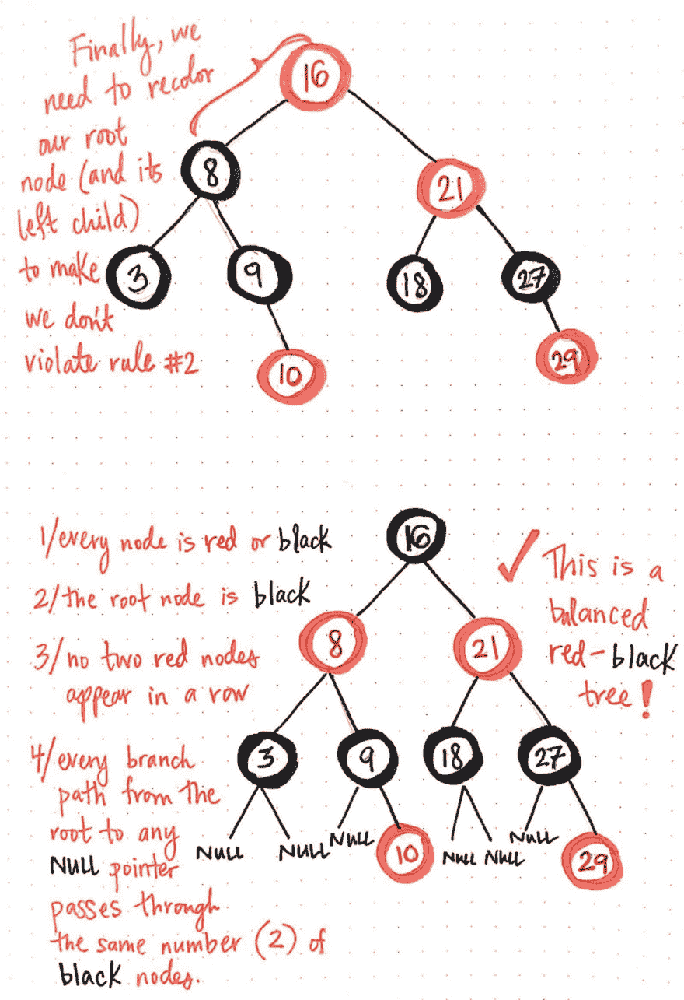](https://res.cloudinary.com/practicaldev/image/fetch/s--xXE4p8_M--/c_limit%2Cf_auto%2Cfl_progressive%2Cq_auto%2Cw_880/https://cdn-images-1.medium.com/max/1024/1%2AO0h4lm5LX9Cy9S6meKdquA.jpeg) 

<figcaption>为了最终完成树的平衡，我们需要对根节点重新着色，β16。</figcaption>

</figure>

我们快到了！只有一个非常明显的问题需要我们解决:我们的根节点是红色的！

不要担心，我们将重新着色我们的根(以及它的左孩子，以确保我们不违反规则二)。

现在，我们的整棵树被重新平衡，实际上是一棵功能正常的红黑树。万岁！

我们可以检查我们的四条规则列表，并确保:

1.  每个节点不是红色就是黑色
2.  根节点是黑色的
3.  没有两个红色节点出现在一行中
4.  从根节点到任何空指针的每条分支路径都经过相同数量的黑节点；在这种情况下，在遇到空指针之前，我们总是要经过树中的两个黑色节点。

好的，即使看起来我们刚才做了很多工作，让我们把插入/删除红黑树的工作放在一个角度来看。

<figure>[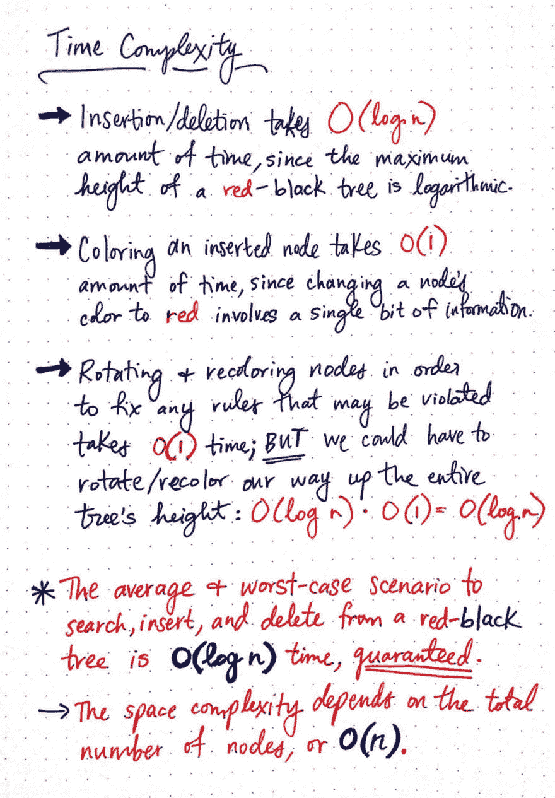](https://res.cloudinary.com/practicaldev/image/fetch/s--kBEEGGJc--/c_limit%2Cf_auto%2Cfl_progressive%2Cq_auto%2Cw_880/https://cdn-images-1.medium.com/max/1024/1%2ADFGdnNtD51eOAIITcBqE2A.jpeg)</figure>

**从红黑树中插入和删除**需要 ***O(log n)*** 的时间量，因为红黑树的最大高度与完全平衡的二叉查找树相同:对数时间。

**给一个节点**添加一个颜色需要一个常量， ***O(1)*** 的时间，因为它只涉及改变一个单独的指针。

**旋转**和**重新着色** **节点**以修复任何被破坏的规则需要一个恒定的时间量，***(1)***，因为我们真正要做的是，再次重新排列指针。然而，正如我们在上一个树的例子中看到的，我们可能不得不旋转和重新着色节点直到树的高度。树的高度是对数， ***O(log n)*** ，乘以旋转/重新着色的工作量， ***O(1)*** ，最后仍然是 ***O(log n)*** 的总和。

因此，红黑树的强大之处在于，从树中搜索、插入和删除的平均和最坏情况总是 ***O(log n)*** 时间，有保证。红黑树的空间复杂度与 BST 无异，取决于总节点数: ***O(n)*** 。

与 AVL 树相比，红黑树没有那么完美的平衡。然而，在插入/删除红黑树的过程中，我们通常需要较少的旋转，这使得红黑树在增长或收缩自由空间方面更胜一筹，但与 AVL 树相比，搜索效率较低。

目前使用的红黑树的最好例子是 Linux 内核的[完全公平调度器](https://en.wikipedia.org/wiki/Completely_Fair_Scheduler) (CFS)，它是在 2007 年引入的。这个调度程序从 CPU 内部处理执行进程的资源分配，实际上使用了红黑树！

红黑树颜色的双重性是所有四个规则的关键部分，也是保持树平衡的重要部分。但是为什么红黑树是用颜色创造的呢？当然，为什么是红色和黑色？

这两个问题的答案是红黑树如此特别的部分原因。我们已经知道，红黑树中的每个节点必须是红色的或者是黑色的。这实际上是每个节点都必须跟踪的一条附加信息；起初，这可能看起来很傻，因为我们还在跟踪每个节点中的*另一条*信息，这占据了空间！

<figure>[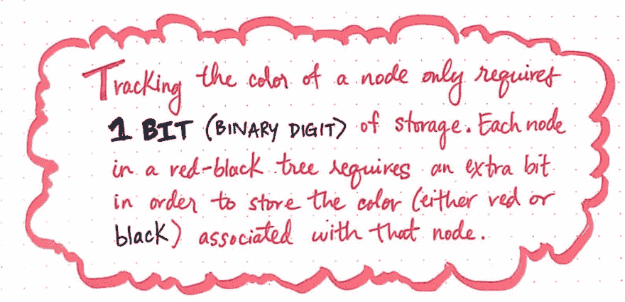](https://res.cloudinary.com/practicaldev/image/fetch/s--ks3oOrT5--/c_limit%2Cf_auto%2Cfl_progressive%2Cq_auto%2Cw_880/https://cdn-images-1.medium.com/max/1024/1%2AhT512eBW5wdRsHbBW9OzsQ.jpeg) 

<figcaption>跟踪一个节点的颜色只需要 1 比特的信息。</figcaption>

</figure>

然而，跟踪一个节点的颜色只需要 ***1 位*** 的存储。我们可能还记得在本系列前面学习了[位、字节和二进制](https://dev.to/vaidehijoshi/bits-bytes-building-with-binary);一个比特是一个单一的 ***二进制数字*** ，从大的方面来说，它是一个存储红色或黑色的极小的空间。一位足够的部分原因是因为树只能有两种可能的颜色，所以在如此小的空间中存储与每个节点相关联的对这些颜色之一的引用就足够了。

好吧，这看起来很简单。但是红色和黑色？这似乎有些随意。为什么不是其他颜色？嗯，正如人们所说，“需要是发明之母”。当 Guibas 和 Sedgewick 在他们的论文上打印他们的研究时，他们可以使用的最新技术是激光打印机，它打印彩色东西的能力有限。

罗伯特·塞奇威克现在是普林斯顿大学的教授(并教授一门在线算法课程！)，[自己解释了这个故事](https://www.coursera.org/learn/algorithms-part1/lecture/GZe13/red-black-bsts):

> 很多人问我们为什么用红黑这个名字。我们在施乐 PARC 公司发明了这种数据结构，这种看待平衡树的方式，施乐公司是个人电脑和许多其他创新的发源地，我们今天生活在图形用户界面、以太网和面向对象的编程和许多其他事物中。但那里发明的东西之一是激光打印，我们非常兴奋附近有彩色激光打印机，可以打印出彩色的东西，而且红色看起来最好。这就是为什么我们选择红色来区分三个节点中的红色链接，链接的类型。

显然，一台单色打印机的设置最终在计算机科学史上扮演了重要角色。谁知道呢？让 1970 年代的硬件来决定几十年后的今天我们绘制节点的方式吧！

### 资源

有大量关于红黑树历史的信息，以及处理旋转和重新着色的策略。然而，当你第一次开始时，很难提取哪些资源是最有用的。这里有一些我最喜欢的，包括红黑树的创造者之一自己的一个很棒的讲座！快乐节点画！

1.  罗伯特·塞奇威克 Coursera 第 45 次讲座——红黑 BSTs
2.  [通用红黑树](http://www.jot.fm/issues/issue_2005_03/column6/)，理查德·维纳博士
3.  红黑树，吉姆·斯克伦尼教授
4.  [红黑树可视化](https://www.cs.usfca.edu/~galles/visualization/RedBlack.html)，大卫·加勒教授
5.  [红黑树简介](http://www.geeksforgeeks.org/red-black-tree-set-1-introduction-2/)，GeeksforGeeks

* * *

*本帖最初发表于[medium.com](https://medium.com/basecs/painting-nodes-black-with-red-black-trees-60eacb2be9a5)T3】**