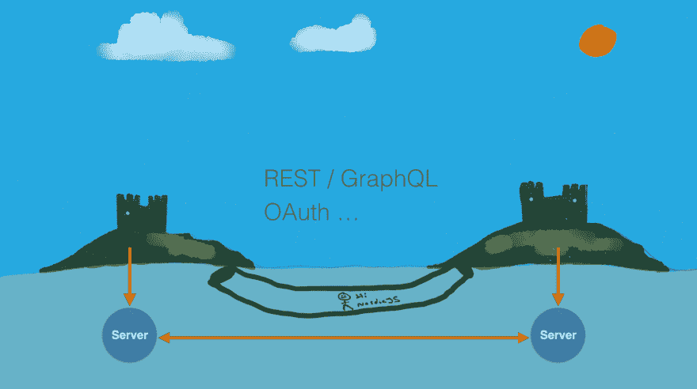
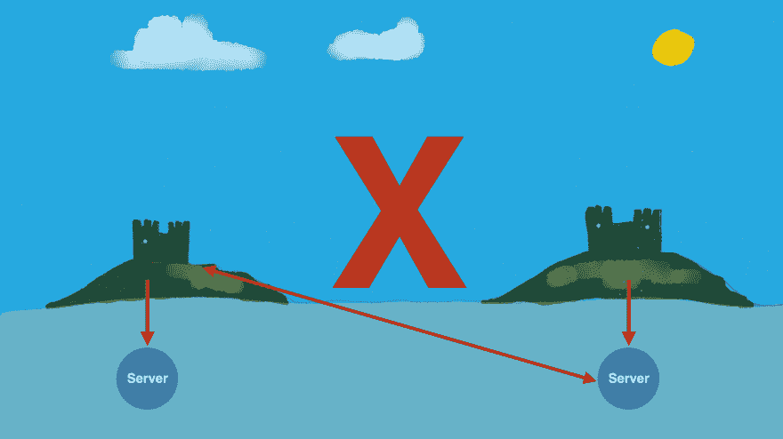
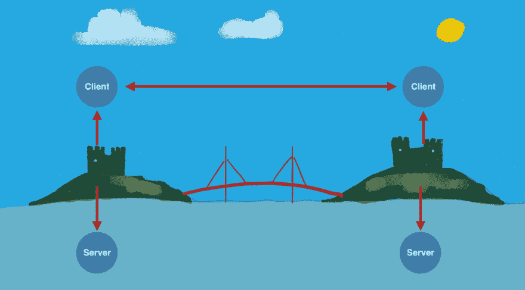
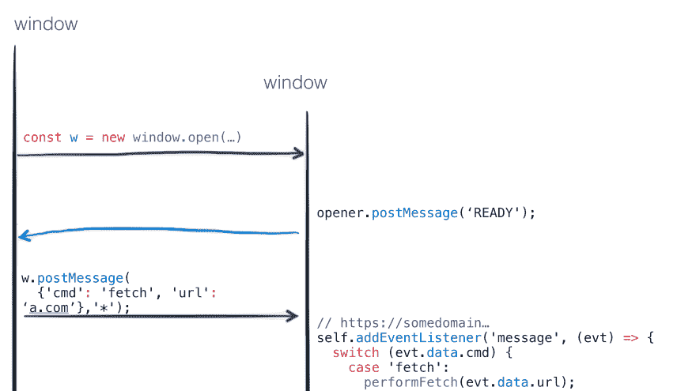
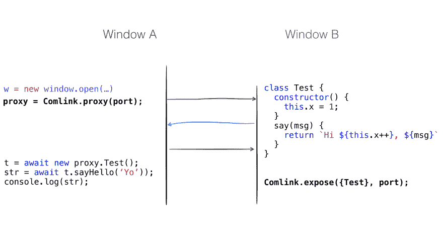

# 网络是我的 API

> 原文:[https://dev.to/paul_kinlan/the-web-is-my-api-1e57](https://dev.to/paul_kinlan/the-web-is-my-api-1e57)

迈克尔·马赫莫夫教会了我很多关于网络的可能性。在与 Mike 一起工作之前，我建立了网络，我了解诸如可链接性和发现等好处，但我从未真正了解什么是可能的。

Mike 说的一件事是“[Web 是我的 API](http://softwareas.com/cors-scraping-and-microformats/) ”，他谈到能够通过微格式和其他结构化数据在页面中展示您的站点和数据，并且能够使用简单的 XMLHttpRequest 和 CORS API 从另一个浏览器上下文中直接访问它:

> 无论如何，这很酷的一点是你可以把网络当作一个 API。网络是我的 API。“抓取网页”听起来可能比“使用网络服务”更脏，但原则上这是更干净的方法。位于浏览器中的网站是对程序可以获得的资源的完美的人类可读的描述，所以它是一个自文档化的 API。最好的 API。但是一个完整的 HTML 文档是一个很大的负担，所以我们需要确保它的结构良好，这就是微格式的用武之地，它为在网页中声明信息定义了轻量级标准。这里有另一个 HTML5 联系，因为我们现在在标准中有一个类似的概念，微数据。

大约在同一时间，我开始从事 [Web Intents](https://en.wikipedia.org/wiki/Web_Intents) 的工作，其精神是相似的——让用户访问来自另一个来源的数据和服务——但它要复杂得多。我希望能够发现服务，然后与这些页面进行交互。Mike 想让网络提供数据和服务。它一直伴随着我。[即使我确实忘记了最初的归属](https://twitter.com/Paul_Kinlan/status/913000817170534400)。

我最近为 Nordic JS 做了一个演讲，我在演讲中强调了我们并没有真正在 web 上建立 truley 互联服务，当我们这样做时，我们遵循的是一个主要是服务器到服务器交互的模型。也就是说，网站将与第三方服务集成，通过它们的服务器将所有 API 请求路由到远程服务，并管理随之而来的所有复杂性。

[T2】](https://res.cloudinary.com/practicaldev/image/fetch/s--vM-a54Nb--/c_limit%2Cf_auto%2Cfl_progressive%2Cq_auto%2Cw_880/https://paul.kinlan.img/server-server.png)

它是可行的，我们用它构建了整个网站，但是当你考虑到认证、授权、传输协议和不同的 RPC 方法(REST、GraphQL 等)时，它会变得非常复杂。Mike 提出了一个更优雅的方案，通过启用 CORS 的站点和一点 JavaScript，我们可以使用站点直接与远程服务对话。

[T2】](https://res.cloudinary.com/practicaldev/image/fetch/s--Er2v01Tp--/c_limit%2Cf_auto%2Cfl_progressive%2Cq_auto%2Cw_880/https://paul.kinlan.img/server-rpc.png)

中间出现了一些问题。主要问题是，尽管 CORS 在浏览器中得到广泛支持，但开发人员很少使用它。CORS 是我们在网络上需要的一种保护，但它很难设置和调试，而且“网络即 API”并没有得到太多的推广。

[T2】](https://res.cloudinary.com/practicaldev/image/fetch/s--gJlqr3c4--/c_limit%2Cf_auto%2Cfl_progressive%2Cq_auto%2Cw_880/https://paul.kinlan.img/server-rpc-nope.png)

我们正在进入一个新的世界，在这个世界中，网站是用 JS 在客户端生成的，用户的会话和状态是完全在客户端管理的。

我们仍然需要从我们的站点到远程服务的通信能力，我仍然坚信我们需要分散我们与其他站点和应用程序的集成，但我们需要做的第一件事是将我们的站点和应用程序连接在一起，而不仅仅是一个链接。我们需要我们的站点向用户系统上的其他窗口直接公开它们的能力和功能。

每个网站都应该能够直接向其他客户端公开一个由网站所有者控制的 API。

[T2】](https://res.cloudinary.com/practicaldev/image/fetch/s--dObrRu_Y--/c_limit%2Cf_auto%2Cfl_progressive%2Cq_auto%2Cw_880/https://paul.kinlan.img/client-rpc.png)

好消息是，我们已经可以做到这一点，我们已经在平台上拥有这些原语至少 7 年了(`postMessage`和`MessageChannel`)，并且从`window.open`开始就一直如此，但是我们不使用这些工具与网站交互，原因与我们不使用 CORS 的原因类似:很难也几乎不可能定义一个简单且一致的 API，并且不需要为每个你想要交互的服务引入巨大的第三方库。

该平台只允许您使用消息传递在站点之间进行通信，这意味着作为服务所有者，如果您想要创建 API，您必须构建一个状态机，将消息序列化为某种状态，对其做出反应，然后将消息发送回客户端，然后您必须为使用您的服务的开发人员创建一个库。这非常复杂，我相信这是我们没有看到更多采用 Web Workers 和客户端 API 的主要原因之一

[T2】](https://res.cloudinary.com/practicaldev/image/fetch/s--pLnkZH_Z--/c_limit%2Cf_auto%2Cfl_progressive%2Cq_auto%2Cw_880/https://paul.kinlan.img/window-dx.png)

我们有一个帮助我们的库: [Comlink](https://github.com/GoogleChromeLabs/comlink) 。

Comlink 是一个小 API，它将`MessageChannel`和`postMessage` API 抽象成一个 API，看起来像是在本地环境中实例化远程类和函数。例如:

**网站**

```
// Set up.
const worker = w.open('somesite');
const api = Comlink.proxy(w);

// Use the API.
const work = await new api.Test();
const str = await work.say('Yo!');
console.log(str); 
```

**网络工作者**

```
class Test {
  say() {
    return `Hi ${this.x++}, ${msg}`;
  }
}

// Expose the API to anyone who connects.
Comlink.expose({Test}, window); 
```

[T2】](https://res.cloudinary.com/practicaldev/image/fetch/s--VBt4fkdo--/c_limit%2Cf_auto%2Cfl_progressive%2Cq_auto%2Cw_880/https://paul.kinlan.img/comlink.png)

我们在服务上公开 API，通过代理在客户端使用 API。

### 有没有更好的例子？

我构建了一个[站点，它订阅了一个 pubsubhubbub 端点，当它接收到 ping 时，它会向一个用户定义的端点发送一个 JSON 消息](https://rss-to-web-push.glitch.me/)。我不想管理这个小应用程序的推送通知基础设施，我建立的另一个网站( [webpush.rocks](https://webpush.rocks/) )可以做到这一切，我只是想使用集成服务..

但是，我如何将保存在 webpush.rocks 客户端的订阅 URL(发送通知所需的数据)放回我的站点呢？

当我最初建立这个网站时，你所能做的就是让用户打开网站，然后在页面之间复制并粘贴 URL。为什么不公开一个任何站点都可以使用的 API 呢？我就是这么做的。

webpush.rocks 定义了一个名为`PushManager`的 API，上面有一个方法`subscriptionId`。当页面加载时，它向窗口公开此 API，如下所示:

```
class PushManager {
  constructor() {
  }

  async subscriptionId() {
    //global var ick...
    let reg = await navigator.serviceWorker.getRegistration();
    let sub = await reg.pushManager.getSubscription();
    if(sub) {
        return `${location.origin}/send?id=${sub.endpoint}`;
    }
    else {
        return ``;
    }
  }
}

Comlink.expose({PushManager}, window); 
```

API 与 DOM 中的`PushSubscriptionManager` API 交互，并返回一个定制的 URL 到调用站点。这里重要的是，因为它是异步运行的，所以我可以等待用户验证他们是否想执行这个动作。

回到调用客户端站点(希望获得 subscriptionId 的应用程序)。当用户点击链接时，我们获得一个对我们刚刚打开的窗口的引用，并将我们的`Comlink`代理连接到它。服务 API 现在向我们的客户端公开，我们可以实例化`PushManager` API，就像它是一个本地服务一样，但是它都与另一个窗口中的远程实例服务进行交互。

```
let endpointWindow = window.open('', 'endpointUrlWindow');

let pushAPI = Comlink.proxy(endpointWindow);
let pm = await new pushAPI.PushManager();
let id = await pm.subscriptionId();

// Update the UI.
endpointUrlEl.value = id; 
```

这是一个正在发生的事情的快速视频。一个非常简单的轻量级交互，它打开服务，然后获取它需要的 ID。

作为一个服务提供商，我向另一个站点公开了一组仅在客户端可用的受限功能，我可以保护这些功能，同时在将数据返回给用户之前请求用户同意，所有这些都是通过一个简单易用的 API 实现的。

网络就是应用编程接口。

非常正确的是，我们不允许站点检查或操作 DOM 或其他来源的状态，但是我认为如果您能够控制站点的服务和功能以及用户如何使用它，那么您就可以向任何想要安全使用您的服务的客户公开最重要的信息和服务(您处于控制之中),并且它允许您:

*   专注于你擅长的事情。
*   网站和应用程序之间的快速数据传输，因为这一切都在客户端。
*   IPC 即使在离线时。
*   在源上下文中运行代码

### 站点应该公开哪些 API？

这是我想探索更多的东西。我向推送通知服务公开了一些基本功能，因为这是该网站的目的，但对我来说重要的是，我可以控制我想将 DOM 的哪些部分返还给其他开发人员。

我想去一个地方，在那里每个网站都可以向用户展示一致的 API，并提供一种发现其他功能和服务的方式。

每个站点所有者可以向他们的服务公开核心功能，这样我们就可以进行基于 CRUD 的操作。我们可以有复杂的互动。

我们可以建立一个网站，在那里我们有类似 Unix 的服务，它们可以很好地完成一件事情，用户可以在客户端将它们连接在一起。

每个站点可以公开一个由服务所有者定义的页面子集的`VDOM`,这样我们就有了一个一致的方法来安全地在站点之间基于 DOM 提取移动数据。

我可以想象，我们可能希望快速访问页面上所有基于 schema.org 的对象或其他结构化数据(它们可以是动态生成的)，就像 Mike 在他的原始帖子中所做的那样。

Comlink 为我们提供了一种方法，在已经存在多年的平台原语的基础上，快速方便地公开和消费服务。我们终于有了很多可以让我们把网络变成 API 的东西。

网络是我的应用编程接口。把它也变成你的。