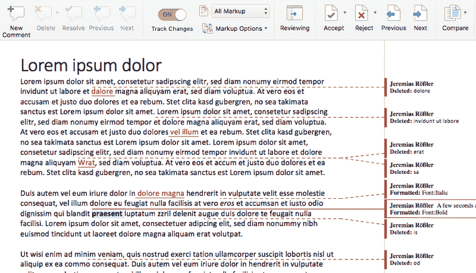

# 白名单测试与黑名单测试

> 原文:[https://dev . to/roesslerj/whitelist-testing-vs-blacklist-testing](https://dev.to/roesslerj/whitelist-testing-vs-blacklist-testing)

从 IT 安全的角度来看，当前 GUI 测试自动化的方法是粗心的，甚至是危险的。这是为什么...

IT 安全的一般原则是禁止一切，只允许真正需要的东西。这减少了你的 [*攻击面*](https://en.wikipedia.org/wiki/Attack_surface) 以及随之而来你可能遇到的问题数量。对于大多数情况(例如，当配置防火墙时)，这意味着应用一个*白名单*:禁止一切，只允许个别列出的例外。并确保检查和记录它们。

将此与软件 GUI 的测试自动化的当前状态进行比较。使用像 [Selenium](https://www.seleniumhq.org) 这样的工具 web 测试自动化的准标准——情况正好相反。这些工具允许测试软件(SUT)中的每一个变更*，除非你手工创建一个明确的检查。关于改变，这是一个黑名单的方法。如果你熟悉软件测试自动化，你会知道这是有充分理由的。这是因为每一个这样的检查的脆性和它带来的维护工作。但是除了为什么会这样，这有意义吗？毕竟，假阴性(遗漏检查)将[削弱对你的测试自动化的信任](https://www.stickyminds.com/article/start-trusting-your-test-automation-again)。*

防御性意味着检查*每件事*，只允许个别和有记录的例外。对软件的每一个其他更改都应该突出显示并进行审查。这相当于 Word 中的“跟踪变更”模式或源代码中使用的[版本控制](https://en.wikipedia.org/wiki/Version_control)。这是唯一不会错过屏幕上[跳舞的小马](https://www.youtube.com/watch?v=UMnZiTL0tUc&feature=youtu.be&t=326)的方法，你没有为它开支票。归根结底，这就是自动化测试的目的:找到回归。

[T2】](https://res.cloudinary.com/practicaldev/image/fetch/s--ZF41C1P0--/c_limit%2Cf_auto%2Cfl_progressive%2Cq_auto%2Cw_880/https://thepracticaldev.s3.amazonaws.com/i/g27l5333oyjc5ceq7spn.png)

当然，要使这种方法在实践中发挥作用，有几个必要的先决条件:

1.  我们需要被测系统(SUT)的执行是*可重复的*(例如，使用相同的测试数据)。无论如何，这是一个非常明智的想法。与几年前相比，使用今天的虚拟化和容器化工具要容易得多。
2.  我们需要处理变化的倍增。软件的每一个变化都会出现在多次测试中，可能是多次。例如，如果网站上的徽标发生变化，这可能会影响到每一次测试。然而，应该只需要审查一次变更。

## 剂量造就毒药

每个软件都有一个理想的检查量。任何可以改变而不会成为问题的东西都不应该被检查。而一切不得改变的*都要*检查。

[T2】](https://res.cloudinary.com/practicaldev/image/fetch/s--qsYK7JH2--/c_limit%2Cf_auto%2Cfl_progressive%2Cq_auto%2Cw_880/https://thepracticaldev.s3.amazonaws.com/i/1cu4ogudcawhr2vughem.png)

在这两种方法之间进行选择时，有两个重要的考虑因素:

1.  你如何以最有效的方式达到中间立场？
2.  如果错过了最佳位置，从哪个“边”接近它的风险更小？

IT 安全指南建议谨慎行事。因此，如果这两种方法产生的工作量相等，您应该选择白名单。但是，当然，你通常不会付出同等的努力。

[T2】](https://res.cloudinary.com/practicaldev/image/fetch/s--Im-GVGzW--/c_limit%2Cf_auto%2Cfl_progressive%2Cq_auto%2Cw_880/https://thepracticaldev.s3.amazonaws.com/i/c08pow4t4ec4pr8ygenz.png)

### 现实生活中的例子

假设你有一个以表格为特色的软件。在你的 GUI 测试中，你应该检查每一行的每一列。对于 7 列和 7 行，这将意味着 49 次检查——仅仅是为了这个表。如果显示的任何数据发生变化，您必须手动复制和粘贴更改以调整检查。

[T2】](https://res.cloudinary.com/practicaldev/image/fetch/s--4X3SGJtF--/c_limit%2Cf_auto%2Cfl_progressive%2Cq_auto%2Cw_880/https://thepracticaldev.s3.amazonaws.com/i/9wnd8hc5fl217wue3qsl.png)

从白名单方法开始，默认情况下会检查整个表。然后，您只需要排除易变的数据或组件(通常是内部版本号或当前日期和时间)。如果数据发生了变化，维护测试就容易多了，因为您通常(取决于工具)有有效的方法来更新检查。猜猜这两种方法哪个更省力...

## 基于文本与基于像素的白名单测试

已经有一些工具可以让你创建白名单测试。有些是纯视觉/基于像素的，比如 [PDiff](https://github.com/bslatkin/dpxdt) 、 [Applitools](https://applitools.com) 和[之类的](https://github.com/igorescobar/automated-screenshot-diff)。这种方法有其优点和缺点。它是普遍适用的——不管你是查看网站还是 PDF 文档。但另一方面，如果同一个变化出现多次，就很难一气呵成了。将变更列入白名单(即排除部分映像)也是一个问题。

批准测试和[文本测试](http://texttest.sourceforge.net)是基于文本的工具，更加健壮。但是 pdf、网站或软件图形用户界面必须转换成纯文本或图像进行比较。忽略更改通常是通过正则表达式完成的。

### 无耻的自我推销:

我只知道一种工具是语义化的，可以应用于软件 GUI，不是基于像素的(尽管它可以)，并且很容易让你忽略易变元素:[重新测试](http://retest.org)。

这是来自[媒体](https://medium.com/@roesslerj/whitelist-testing-vs-blacklist-testing-cac5b9435aa1)的交叉发布。*如果你喜欢这个帖子，比如 twitter，分享或者帮助提高知名度。谢谢大家！*