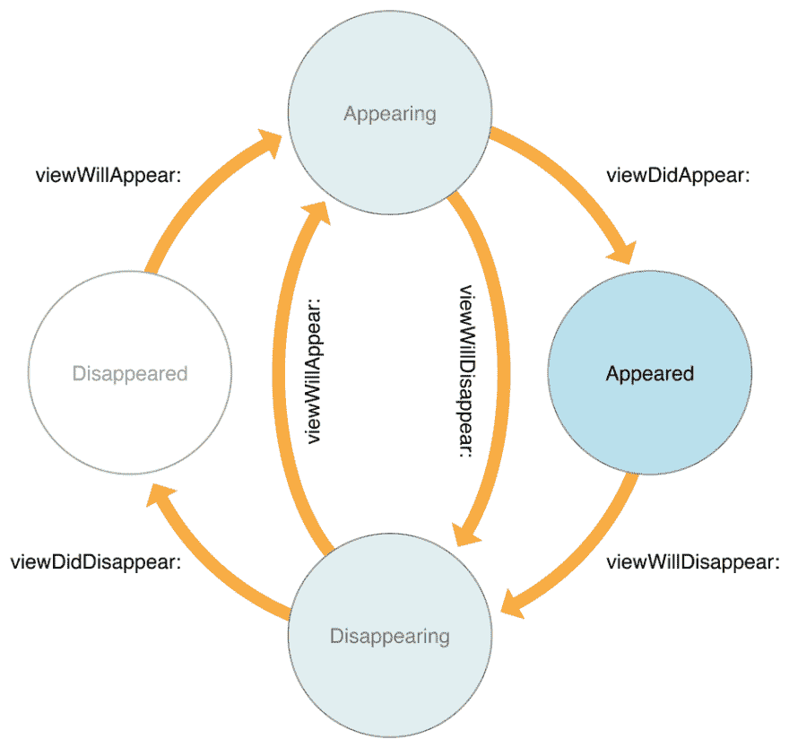
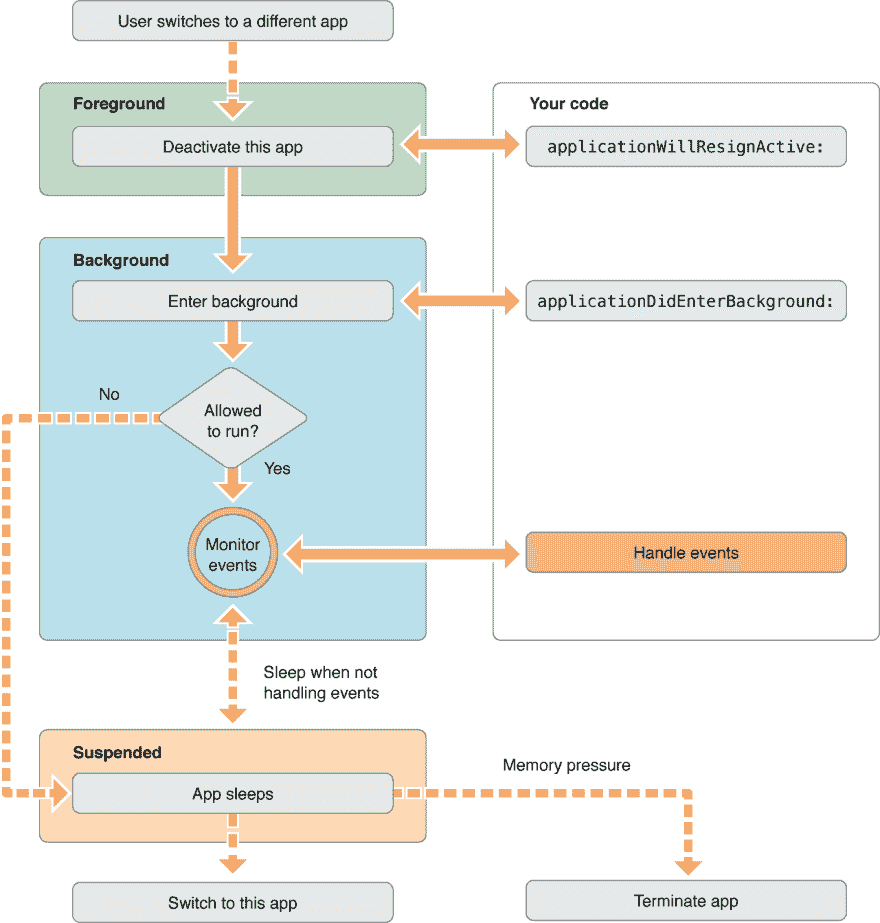
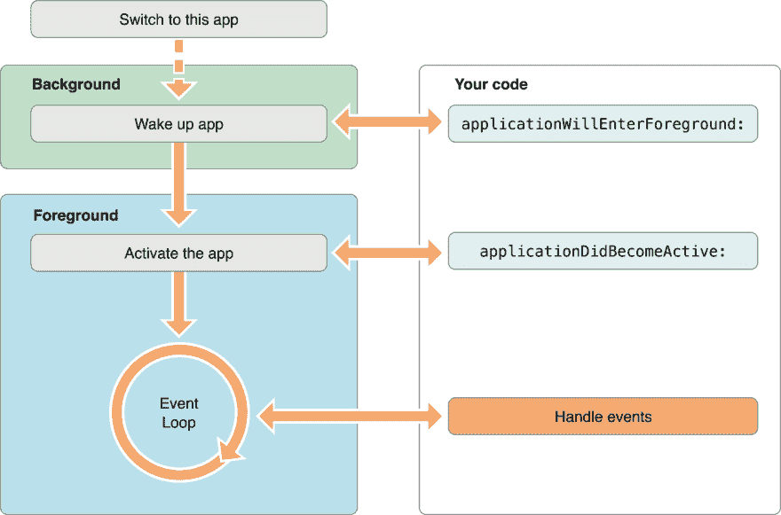

# 如何检测应用程序何时移至背景或前景

> 原文:[https://dev . to/sadra/how-to-detect-when-app-moves-to-background-or-foreground](https://dev.to/sadra/how-to-detect-when-app-moves-to-background-or-foreground)

正如我们所知，实现了一些触发应用程序生命周期的方法:

[T2】](https://res.cloudinary.com/practicaldev/image/fetch/s--pn_seY97--/c_limit%2Cf_auto%2Cfl_progressive%2Cq_auto%2Cw_880/https://thepracticaldev.s3.amazonaws.com/i/fnqvclt37o2kd1pnhdr0.png)

有一个问题。当应用程序移动到后台或前台时，这些方法没有帮助我们！它只是向我们展示了 UIViewControl 的一次性创建或销毁过程。

但是作为指南，在[文档](https://developer.apple.com/library/content/documentation/iPhone/Conceptual/iPhoneOSProgrammingGuide/StrategiesforHandlingAppStateTransitions/StrategiesforHandlingAppStateTransitions.html)中有更多关于应用程序生命周期的信息。

当你的应用程序进入后台时，Cocoa 会广播一个通知，告诉你应用程序正在进入后台。因此，如果您的应用程序或您的 UIViewController 注册了此通知，您就可以知道您的应用程序何时移至后台:

[T2】](https://res.cloudinary.com/practicaldev/image/fetch/s--owXSCwCT--/c_limit%2Cf_auto%2Cfl_progressive%2Cq_auto%2Cw_880/https://thepracticaldev.s3.amazonaws.com/i/8ylzau8kcf4pg76pv3s5.png)

同样，对于移动到前台，我们也有一个通知:

[T2】](https://res.cloudinary.com/practicaldev/image/fetch/s--X0jWpLC---/c_limit%2Cf_auto%2Cfl_progressive%2Cq_auto%2Cw_880/https://thepracticaldev.s3.amazonaws.com/i/dgmk2jju7w6v793fwzsx.png)

因此，你有两种方法来检测你的应用程序何时移动到后台或前台:

### AppDelegate 中的

在应用委托中默认实现，您可以对该问题使用这些默认方法:

```
func applicationDidEnterBackground(_ application: UIApplication) {
    print("applicationDidEnterBackground")
}

func applicationWillEnterForeground(_ application: UIApplication) {
    print("applicationWillEnterForeground")
} 
```

<svg width="20px" height="20px" viewBox="0 0 24 24" class="highlight-action crayons-icon highlight-action--fullscreen-on"><title>Enter fullscreen mode</title></svg> <svg width="20px" height="20px" viewBox="0 0 24 24" class="highlight-action crayons-icon highlight-action--fullscreen-off"><title>Exit fullscreen mode</title></svg>

### In UIViewController

如果你想在 UIViewController 中手动检测它，你应该在你的应用程序中的任何地方注册`UIApplicationWillEnterForeground`或`UIApplicationDidEnterBackground`通知。当用户按下 home 键时，它会移动到背景，然后按两下并选择 app，它会移动到前台。

*   前景

```
override func viewDidLoad() {
    super.viewDidLoad()

    let notificationCenter = NotificationCenter.default
    notificationCenter.addObserver(self, selector: #selector(appMovedToBackground), name: Notification.Name.UIApplicationWillEnterForeground, object: nil)
}

func appMovedToForeground() {
    print("App moved to ForeGround!")
} 
```

<svg width="20px" height="20px" viewBox="0 0 24 24" class="highlight-action crayons-icon highlight-action--fullscreen-on"><title>Enter fullscreen mode</title></svg> <svg width="20px" height="20px" viewBox="0 0 24 24" class="highlight-action crayons-icon highlight-action--fullscreen-off"><title>Exit fullscreen mode</title></svg>

*   背景

```
override func viewDidLoad() {
    super.viewDidLoad()

    let notificationCenter = NotificationCenter.default
    notificationCenter.addObserver(self, selector: #selector(appMovedToBackground), name: Notification.Name.UIApplicationDidEnterBackground, object: nil)
}

func appMovedToBackground() {
    print("App moved to Background!")
} 
```

<svg width="20px" height="20px" viewBox="0 0 24 24" class="highlight-action crayons-icon highlight-action--fullscreen-on"><title>Enter fullscreen mode</title></svg> <svg width="20px" height="20px" viewBox="0 0 24 24" class="highlight-action crayons-icon highlight-action--fullscreen-off"><title>Exit fullscreen mode</title></svg>

这个解决方案对你有用吗？请传下去！ **[推特](https://twitter.com/share)**