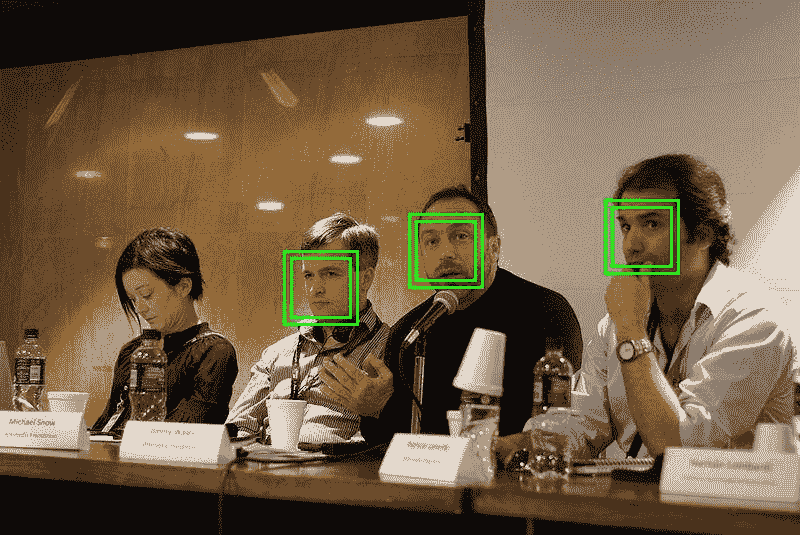

# 基于 python 和 openCV 的简单人脸识别系统

> 原文:[https://dev . to/pranay 749254/simple-face-recognition-system-using-python-and-opencv](https://dev.to/pranay749254/simple-face-recognizing-system-using-python-and-opencv)

# 人脸识别系统

人脸识别系统是一种用于从图像或视频中识别人的计算机应用程序。它主要用于安全目的，以跟踪谁正在进入某个设施或在某个地方搜查某人。它可能不像生物计量或虹膜扫描仪那样合适，但它更容易实现。这个人脸识别系统与保存人脸图像的数据库一起工作。这个系统运行几个算法来确定摄像机或镜头中的人脸是否与数据库中的任何图像相匹配。其中一个算法将人的图像以`grayScale`格式保存在数据库中。另一种算法搜索面部。另一种算法比较面部的某个区域或大小或形状是否与数据库匹配。所有这些算法的组合效果就是这个系统。对于制作一个基本的`Face Recognising System`最好的方法就是使用`openCV`
什么是 openCV？
openCV 是一个用 C++编写的跨平台开源库，由 Intel 开发，用于`Face Recognising System`、`motion sensor`、`mobile robotics`等。该库在大多数操作系统中受支持，如 Windows、Linux、Mac 和 openBSD。该库可用于`python , java , perl , ruby , C#`等。

# 用 Python 和 openCV 进行人脸识别

[T2】](https://res.cloudinary.com/practicaldev/image/fetch/s--Pv6yoPy---/c_limit%2Cf_auto%2Cfl_progressive%2Cq_auto%2Cw_880/https://thepracticaldev.s3.amazonaws.com/i/1h2qja0q40beil1p0wn7.jpg)

###### 图片来源:维基百科，网址:【https://commons.wikimedia.org/wiki/File:Face_detection.jpg T2】

## 源代码:

### 人脸数据库:

```
import cv2
import numpy as np
import sqlite3

faceDetect=cv2.CascadeClassifier('haarcascade_frontalface_default.xml');
cam=cv2.VideoCapture(0);

def insertOrUpdate(Id,Name,Age,Gen,CR):
    conn=sqlite3.connect("FaceBase.db")
    cmd="SELECT * FROM People WHERE ID="+str(Id)
    cursor=conn.execute(cmd)
    isRecordExist=0
    for row in cursor:
        isRecordExist=1
    if(isRecordExist==1):
        cmd="UPDATE People SET Name="+str(Name)+"WHERE ID="+str(Id)
        cmd2="UPDATE People SET Age="+str(Age)+"WHERE ID="+str(Id)
        cmd3="UPDATE People SET Gender="+str(Gen)+"WHERE ID="+str(Id)
        cmd4="UPDATE People SET CR="+str(CR)+"WHERE ID="+str(Id)
    else:
        cmd="INSERT INTO People(ID,Name,Age,Gender,CR) Values("+str(Id)+","+str(Name)+","+str(Age)+","+str(Gen)+","+str(CR)+")"
        cmd2=""
        cmd3=""
        cmd4=""
    conn.execute(cmd)
    conn.execute(cmd2)
    conn.execute(cmd3)
    conn.execute(cmd4)
    conn.commit()
    conn.close()

Id=raw_input('Enter User Id')
name=raw_input('Enter User Name')
age=raw_input('Enter User Age')
gen=raw_input('Enter User Gender')
cr=raw_input('Enter User Criminal Records')
insertOrUpdate(Id,name,age,gen,cr)
sampleNum=0
while(True):
    ret,img=cam.read();
    gray=cv2.cvtColor(img,cv2.COLOR_BGR2GRAY)
    faces=faceDetect.detectMultiScale(gray,1.3,5);
    for(x,y,w,h) in faces:
        sampleNum=sampleNum+1;
        cv2.imwrite("dataSet/User."+str(Id)+"."+str(sampleNum)+".jpg",gray[y:y+h,x:x+w])
        cv2.rectangle(img,(x,y),(x+w,y+h),(0,255,0),2)
        cv2.waitKey(100);
    cv2.imshow("Face",img);
    cv2.waitKey(1);
    if(sampleNum>20):
        break;
cam.release()
cv2.destroyAllWindows() 
```

<svg width="20px" height="20px" viewBox="0 0 24 24" class="highlight-action crayons-icon highlight-action--fullscreen-on"><title>Enter fullscreen mode</title></svg> <svg width="20px" height="20px" viewBox="0 0 24 24" class="highlight-action crayons-icon highlight-action--fullscreen-off"><title>Exit fullscreen mode</title></svg>

###### 来源:【https://www.youtube.com/watch?v=1Jz24sVsLE4】T2&list = plnjem 1 fs 09 cggjdclsue 8 kw 7 gmwdhglmh

这个程序要求一个人提供一个唯一的 id，姓名，年龄，性别和犯罪记录。然后，它收集 20 张人脸图片，然后将其转换为`grayScale`。它保存该人的所有数据在数据库中或更新，如果存在。这里的`cv2`是 openCV 库，使用的数据库是`sqlite3`。[级联分类器](http://docs.opencv.org/2.4/modules/objdetect/doc/cascade_classification.html) `haarcascade_frontalface_default.xml`用于人脸识别系统。

### 面部训练器:

```
import os
import cv2
import numpy as np
from PIL import Image

recognizer=cv2.createLBPHFaceRecognizer();
path='dataSet'

def getImagesWithID(path):
    imagepaths=[os.path.join(path,f) for f in os.listdir(path)]
    faces=[]
    IDs=[]
    for imagepath in imagepaths:
        faceImg=Image.open(imagepath).convert('L');
        faceNp=np.array(faceImg,'uint8')
        ID=int(os.path.split(imagepath)[-1].split('.')[1])
        faces.append(faceNp)
        IDs.append(ID)
        cv2.imshow("training",faceNp)
        cv2.waitKey(10)
    return np.array(IDs),faces

IDs,faces=getImagesWithID(path)
recognizer.train(faces,IDs)
recognizer.save('recognizer/trainningData.yml')
cv2.destroyAllWindows() 
```

<svg width="20px" height="20px" viewBox="0 0 24 24" class="highlight-action crayons-icon highlight-action--fullscreen-on"><title>Enter fullscreen mode</title></svg> <svg width="20px" height="20px" viewBox="0 0 24 24" class="highlight-action crayons-icon highlight-action--fullscreen-off"><title>Exit fullscreen mode</title></svg>

###### 来源:【https://www.youtube.com/watch?v=1Jz24sVsLE4】T2&list = plnjem 1 fs 09 cggjdclsue 8 kw 7 gmwdhglmh

在这一部分，程序训练面部，并以`.yml`格式保存数据。使用的库`os`是 python 中预定义的。另外两个库`numpy`和`pillow`必须手动安装。

### 人脸识别:

```
import cv2
import numpy as np
import sqlite3

faceDetect=cv2.CascadeClassifier('haarcascade_frontalface_default.xml');
cam=cv2.VideoCapture(0);
rec=cv2.createLBPHFaceRecognizer();
rec.load("recognizer/trainningData.yml")
font=cv2.cv.InitFont(cv2.cv.CV_FONT_HERSHEY_COMPLEX,0.4,1,0,1)

def getProfile(id):
    conn=sqlite3.connect("FaceBase.db")
    cmd="SELECT * FROM People WHERE ID="+str(id)
    cursor=conn.execute(cmd)
    profile=None
    for row in cursor:
        profile=row
    conn.close()
    return profile

while(True):
    ret,img=cam.read();
    gray=cv2.cvtColor(img,cv2.COLOR_BGR2GRAY)
    faces=faceDetect.detectMultiScale(gray,1.3,5);
    for(x,y,w,h) in faces:
        cv2.rectangle(img,(x,y),(x+w,y+h),(0,255,0),2)
        id,conf=rec.predict(gray[y:y+h,x:x+w])
        profile=getProfile(id)
        if(profile!=None):
            cv2.cv.PutText(cv2.cv.fromarray(img),"Name : "+str(profile[1]),(x,y+h+20),font,(0,255,0));
            cv2.cv.PutText(cv2.cv.fromarray(img),"Age : "+str(profile[2]),(x,y+h+45),font,(0,255,0));
            cv2.cv.PutText(cv2.cv.fromarray(img),"Gender : "+str(profile[3]),(x,y+h+70),font,(0,255,0));
            cv2.cv.PutText(cv2.cv.fromarray(img),"Criminal Records : "+str(profile[4]),(x,y+h+95),font,(0,0,255));
    cv2.imshow("Face",img);
    if(cv2.waitKey(1)==ord('q')):
        break;
cam.release()
cv2.destroyAllWindows() 
```

<svg width="20px" height="20px" viewBox="0 0 24 24" class="highlight-action crayons-icon highlight-action--fullscreen-on"><title>Enter fullscreen mode</title></svg> <svg width="20px" height="20px" viewBox="0 0 24 24" class="highlight-action crayons-icon highlight-action--fullscreen-off"><title>Exit fullscreen mode</title></svg>

###### 来源:【https://www.youtube.com/watch?v=1Jz24sVsLE4】T2&list = plnjem 1 fs 09 cggjdclsue 8 kw 7 gmwdhglmh

这部分拍摄人脸照片，将其转换为`grayScale`格式，然后与数据库中的照片进行比较。当找到匹配时，它会在屏幕上显示所有信息。没有训练者，正确的面部识别是不可能的。

# 输出:

## T2】

### 我的想法

人脸识别系统远非完美。这比不上视网膜扫描。主要问题是它有时也会认错人。从低分辨率图像或镜头中检测人脸也变得更不可预测。这个东西只能从某个角度工作，从一个人的侧面来看，人脸检测大多数时候都失败了。即使有一些面部表情，如微笑，面部识别也可能不正确。

虽然这个系统确实有它所有的问题，但在某些情况下还是很有用的。与人群打交道时，不可能与每个人直接接触。在这种情况下，更方便的方式，如指纹或生物扫描是不可能的。另一个事实是，由于面部识别系统在某些地方的监控摄像头犯罪中的使用，银行抢劫减少了。这项技术如果开发得当，会对人类非常有益。