# 在金树中寻找斐波那契

> 原文:[https://dev . to/vaidehijoshi/finding-Fibonacci-in-golden-trees](https://dev.to/vaidehijoshi/finding-fibonacci-in-golden-trees)

<figure>[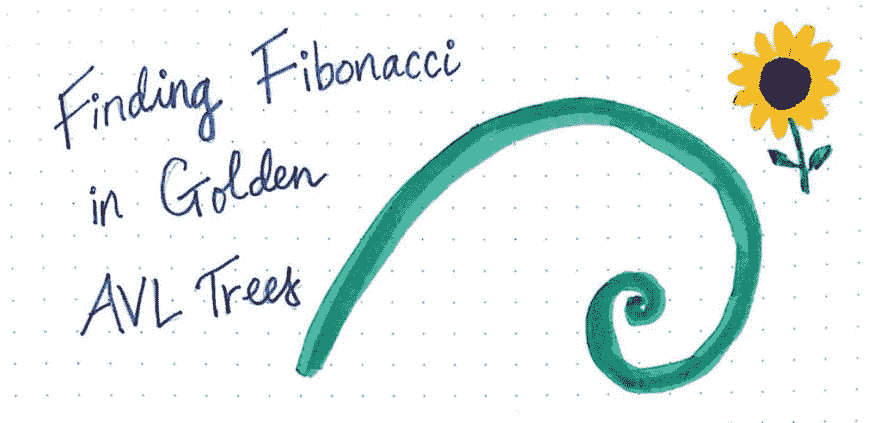](https://res.cloudinary.com/practicaldev/image/fetch/s--5ASal78J--/c_limit%2Cf_auto%2Cfl_progressive%2Cq_auto%2Cw_880/https://cdn-images-1.medium.com/max/1024/1%2ATWkFGCTF_Nn3I0CVCJDrkg.jpeg) 

<figcaption>寻找黄金中的斐波那契(AVL)树</figcaption>

</figure>

学习新事物总会带来让你彻底放松的机会。请注意，这并不总是发生——至少在计算机科学领域是这样的。然而，每隔一段时间，你就会学到一些真正让你敬畏的东西，一些在实际的字典定义中真正令人敬畏的东西；一些感觉真的像灯泡熄灭了一样的东西，让你感到非常感激一开始就试图去理解它。

当然，我说的是个人经历，因为当我了解到 AVL 树的奇迹时，这正是发生在我身上的事情。事实证明，计算机科学的表面下有数学的元素，其中一些我们已经在本系列课程中看到了。但是数学还有另一个隐藏的层面:与我们周围的自然世界的联系。

通常，当我们学习超级理论的东西(像许多核心计算机科学概念)时，很难将这些概念是在哪里产生的，我们为什么使用它们，以及我们为什么应该关心这些概念联系起来。理解事物被发明的历史和理解它的应用和用法一样重要。我们能够看到计算机科学中的一些东西是如何直接连接到与计算无关的其他领域的，这有点罕见！

然而，在今天的帖子中，数学、计算机科学和自然都以最神奇的方式走到了一起。所以，让我们开始吧！

### 寻找树形图案

上周，我们学习了一种称为 AVL 树的独特数据结构，这是一种自平衡二叉查找树。希望你记得 AVL 树是一个高度平衡的树，这意味着它遵循一个黄金法则:树中的任何一片叶子从根节点到树中任何其他叶子的路径都不应该比它长。

关于这条黄金法则，要记住的重要一点是，随着 AVL 树的高度增长，在添加下一个节点之前，它必须在每一层都有最小数量的节点。

<figure>[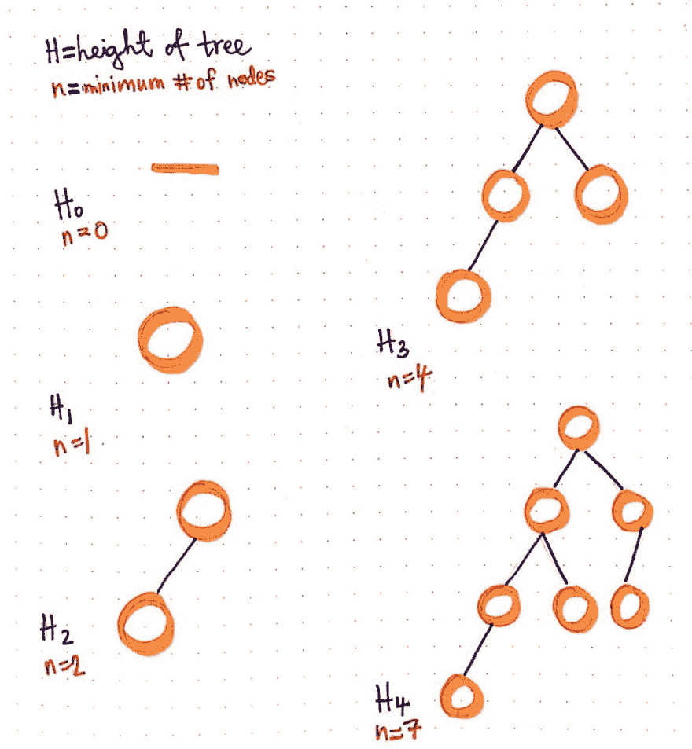](https://res.cloudinary.com/practicaldev/image/fetch/s--q-_LHpTP--/c_limit%2Cf_auto%2Cfl_progressive%2Cq_auto%2Cw_880/https://cdn-images-1.medium.com/max/1024/1%2Axvei9W5JUdbhBe_P83luDQ.jpeg)

<figcaption>AVL 树的高度和创建它们的最小节点数。</figcaption>

</figure>

此处显示的插图举例说明了这一点。在这幅画中，我们可以看到五种不同的 AVL 树，每一种都有不同的高度。

在高度为 0 的 AVL 树中，没有节点，所以 *n* 等于 0。在高度为 1 的 AVL 树中，正好有 1 个节点，而在高度为 2 的 AVL 树中，正好有 2 个节点。记住，我们只考虑节点的最小数量。从技术上来说，我们可以在 AVL 树中添加第三个高度为 2 的节点，这仍然没问题；但是，为了创建一个高度为 2 的高度平衡的 AVL 树，我们至少需要*两个节点。*

当我们需要创建一棵高度为 3 的 AVL 树时会发生什么？嗯，我们至少需要 4 个节点来完成，因为我们需要在添加下一层之前添加一个右边的子树。对于高度为 4 的树，情况类似:我们需要 7 个节点，以便在向左子树添加另一个节点之前创建一个高度平衡的右子树。

让我们更进一步:为了创建一棵高度为 5 的 AVL 树，我们需要的最少节点数是多少？

<figure>[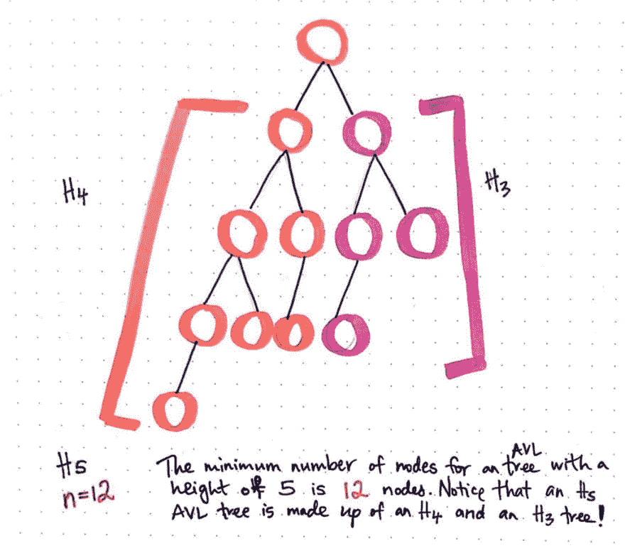](https://res.cloudinary.com/practicaldev/image/fetch/s--cDlsMuZ5--/c_limit%2Cf_auto%2Cfl_progressive%2Cq_auto%2Cw_880/https://cdn-images-1.medium.com/max/1024/1%2AchwidRilzVydjz1BwszJ-w.jpeg) 

<figcaption>高度为-5 的 AVL 树的最小节点数。</figcaption>

</figure>

嗯，基于上周我们所学的关于 AVL 树的知识，我们知道左右子树的高度差不能超过一级。这意味着我们需要增加我们的右子树，然后才能增加我们的左子树。

这里显示的例子说明了高度为 5 的 AVL 树的最小节点数是多少:为了创建高度为 5 的 AVL 树，我们至少需要 12 个节点。如果我们进一步细分，我们可以看到左子树中需要 7 个节点，右子树需要 4 个节点。当然，我们需要一个节点作为根节点。

如果我们长时间观察左边的子树和右边的子树，我们会注意到它们看起来很熟悉。那是因为我们一分钟前在看高度分别为 4 和 3 的 AVL 树时刚刚看到了它们！这两棵树恰好是 AVL 树之前的两个结构，具有最小的节点数和 5 的高度。

如果你觉得这里有一个有趣的模式，那你就对了。

> 具有最少节点数的 AVL 树的高度是它前面的两个最小高度 AVL 树的组合。

这不是高度为 5 的 AVL 树所独有的；事实上，如果我们回头看前面的插图，并靠近高度为 4 的 AVL 树，我们会注意到完全相同的模式。高度为 4 的 AVL 树的左边子树是高度为 3 的 AVL 树，而右边子树是高度为 2 的 AVL 树。

我们甚至可以继续绘制更大的高度平衡的树，并看到这种模式继续下去，即使树的高度变得非常大。

那么，如何将这种模式转化为更抽象的东西呢？我们把这个模式推导到下面的公式:“*树的高度* *n 等于树的高度之和* *n-1 加* *n-2 加**1”*。

<figure>[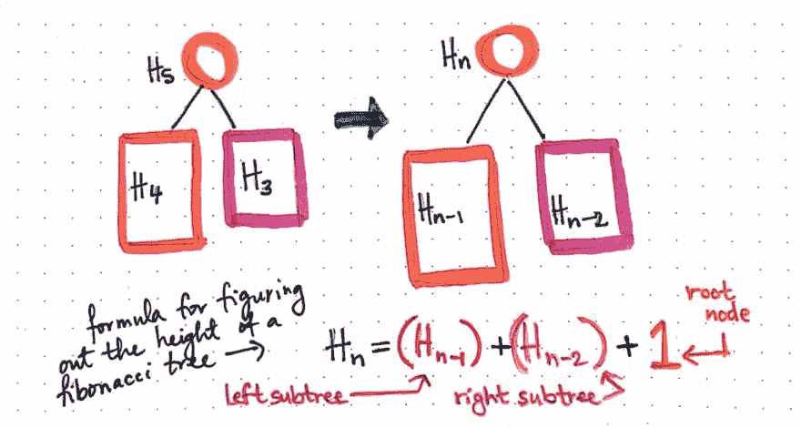](https://res.cloudinary.com/practicaldev/image/fetch/s--M6rNEIaM--/c_limit%2Cf_auto%2Cfl_progressive%2Cq_auto%2Cw_880/https://cdn-images-1.medium.com/max/1024/1%2APc5MCwYKzR94QyEi8Y4bxg.jpeg) 

<figcaption>求斐波那契树高度的公式</figcaption>

</figure>

另一种思考方式是，创建高度为 *n* 的树的最少节点数是通过合并前面的两棵树，并为根节点添加另一个节点。换句话说，为了确定创建高度为 10 的树所需的最小节点数，您需要高度为 9 和 8 的树中的节点数，外加一个根节点。

如果我们在寻找一棵 AVL 树之前对这两棵树求和，我们可以通过编程计算出创建任何给定高度平衡的 AVL 树所需的最少节点数。

瞧！我们就在眼皮底下发现了斐波那契数列！

### 寻找斐波那契和黄金分割比

“将两个数相加得到第三个数”的模式被称为斐波那契数列，以[列奥纳多·斐波那契](https://math.temple.edu/~reich/Fib/fibo.html)命名。年轻的列奥纳多偶然发现的东西可以被总结为一个遵循单一规则的数学序列，这就是我们所知道的斐波那契数列:

> 前两个数字之后的每一个数字都是前面两个数字的和。

一旦我们有了 Fibonacci 序列的前两个数字，我们就有足够的时间来构建整个东西(但是它会永远持续下去，所以我们现在就跳过它)！恰好前两个数字很容易记住:它们是 0 和 1。

<figure>[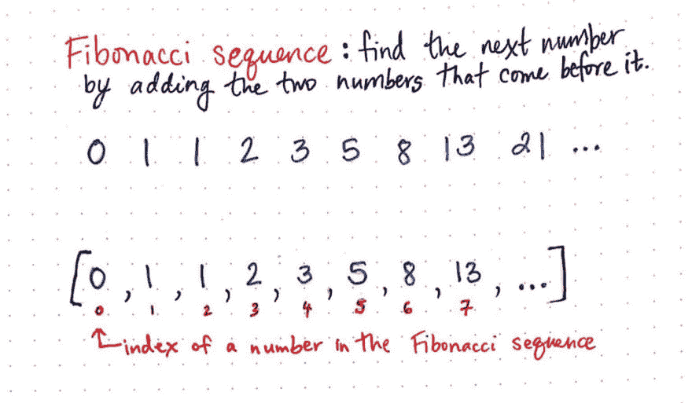](https://res.cloudinary.com/practicaldev/image/fetch/s--JJtpKfkI--/c_limit%2Cf_auto%2Cfl_progressive%2Cq_auto%2Cw_880/https://cdn-images-1.medium.com/max/1024/1%2AKQD6UCzG_EHOE1_FM8BuKA.jpeg) 

<figcaption>斐波那契数列</figcaption>

</figure>

我们已经知道斐波纳契数列和高度平衡的 AVL 树的左右子树之间存在某种关联。也就是说，我们知道高度为 *H* 的树的最小节点数是它前面的两个最小节点树，再加上一个根节点。

既然我们在上一节推导了一个公式，根据节点数来确定树的*高度*，那么我们是否可以用斐波那契数列来反过来确定呢？我们能否抽象出一个公式，根据树的高度来确定树的最小节点数？

我们当然可以！

让我们来分析一下在幕后工作的数学，看看我们是否能弄清楚实际发生了什么。

在此处显示的插图中，我们将进行与之前推导的公式相反的操作，这意味着我们将继续处理高度为 5 的树。如果我们在寻找 *n* ，高度为 *H* 的树的最小节点数，我们可以找到位于斐波纳契[H+2]的索引处的斐波纳契数，并从中减去 1，以确定创建高度为 *H* 的树的最小节点数。

<figure>[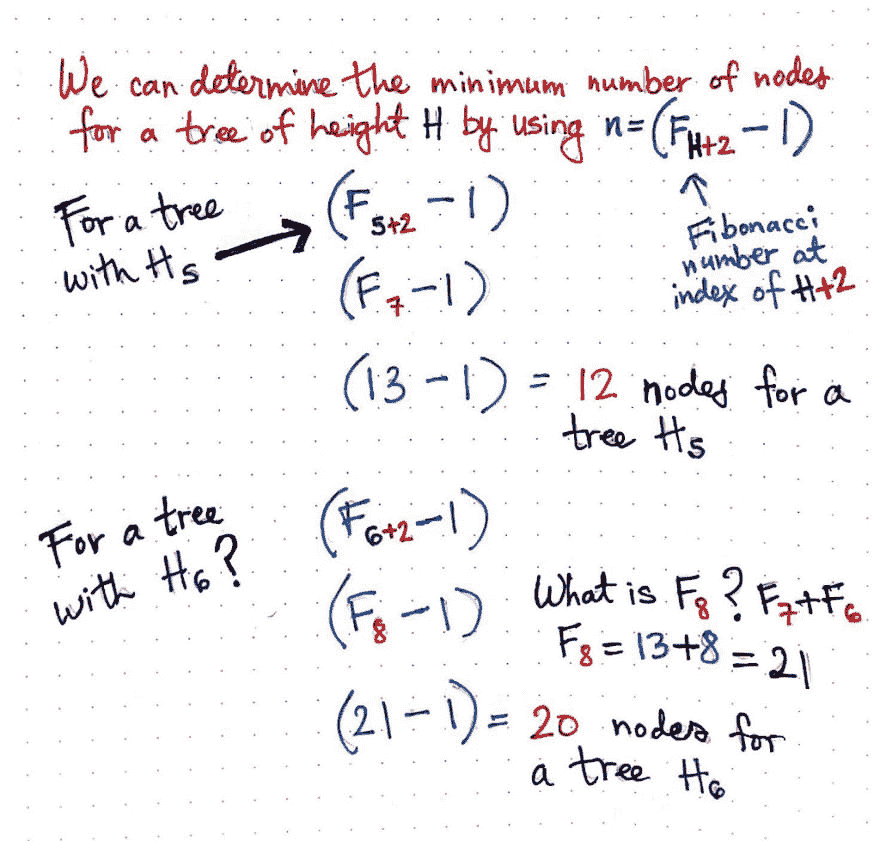](https://res.cloudinary.com/practicaldev/image/fetch/s--XTP1Q8RX--/c_limit%2Cf_auto%2Cfl_progressive%2Cq_auto%2Cw_880/https://cdn-images-1.medium.com/max/1024/1%2AYQ3YX5HznVRtCaO9ENOPkQ.jpeg) 

<figcaption>确定一棵树的最小节点数的公式</figcaption>

</figure>

因此，在树的高度为 5 的情况下，我们需要找到索引为 5 + 2 或 7 的斐波那契数。回想一下，我们将 Fibonacci 序列从 0 开始作为第一个索引，因此 Fibonacci[7]处的元素将给出 13。因为 13 - 1 是 12，我们知道我们至少需要 12 个节点来创建一个高度为 5 的树。

当我们在上一节中画出一棵高度为 5 的平衡树时，这正是我们拥有的节点数！

好吧，那么一棵高度为 6 的树呢？嗯，6 + 2 是 8，位于斐波那契[8]的索引处的元素将是数字 21。请记住，即使我们不知道 Fibonacci[8]索引处的元素，我们也知道 Fibonacci[6] = 8 和 Fibonacci[7] = 13，这意味着我们可以对这两个元素求和，以获得序列中的下一个元素。由于 Fibonacci[8] = 21，我们可以从中减去 1，知道我们至少需要 20 个节点来创建一个高度为 6 的高度平衡的 AVL 树。

拉德。我们刚刚把我们的第一个公式反过来，它使用了斐波那契模式…它的对立面*也*使用了斐波那契模式！

好吧，这很酷，但接下来会更酷。

这个序列长期以来被认为是(并以此命名！)斐波那契实际上是在几百年前由古印度数学家发现的，可以追溯到 6 世纪。直到 600 年后斐波那契发现了它，西方世界才知道这个数列，并因此能够更深入地研究它。

随着越来越多的数学家、科学家和艺术家开始研究这个序列，他们开始理解它与我们周围世界的深层联系。他们发现的一件事是，斐波那契数列与几何和数学中的另一个特殊性质密切相关:黄金螺旋和黄金比例。

不清楚 ***黄金比例*** 是什么时候发现的；尽管是希腊数学家欧几里德在他著名的、被广泛研究和引用的文本“T4 元素”中首次提到了它，但是古埃及人也很有可能在几千年前建造金字塔时使用了它。黄金比例通常被称为“*φ*(*T11【或*T13】)，也被称为达芬奇的“*黄金比例”*。用数学术语来说，如果两个量之间的比率与两个元素相加后与两个量中较大者相比的比率相同，则这两个量具有黄金分割比例。**

黄金分割率通常用分别由正方形和长方形组成的长方形的例子来说明。

<figure>[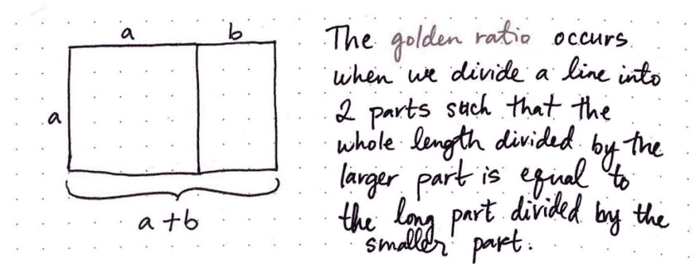](https://res.cloudinary.com/practicaldev/image/fetch/s--PsIXzpck--/c_limit%2Cf_auto%2Cfl_progressive%2Cq_auto%2Cw_880/https://cdn-images-1.medium.com/max/1024/1%2Adcynt8UQnFdPy3fUt7H-xg.jpeg) 

<figcaption>黄金比例:一个定义</figcaption>

</figure>

在上面的例子中，我们可以看到黄金比例在起作用。当我们把一条线分成两部分，使得整个长度除以较大的部分等于较大的部分除以较小的部分时，我们得到了黄金分割比例。在这个特定的图示中，矩形的长边，即 *a + b* 之和，与边 *a* 的比值，将与 *a* 的长度与边 *b* 的比值相同。

但是到底是什么黄金比例呢？我们正在比较*的 a* 和*的 b* ，但是这到底意味着什么呢？好吧，让我们用实际数字来看看黄金比例，看看我们是否能得到一个更具体的答案。

我们知道黄金比例通常被描述为:

> a + b 之于 a，正如 a 之于 b

我们把这里的 *a* 和 *b* 换成整数:a = 5，b = 3。

<figure>[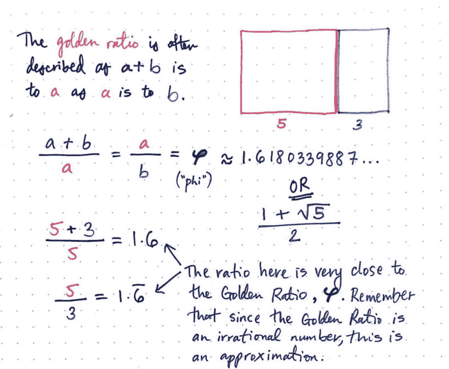](https://res.cloudinary.com/practicaldev/image/fetch/s--pvxpommH--/c_limit%2Cf_auto%2Cfl_progressive%2Cq_auto%2Cw_880/https://cdn-images-1.medium.com/max/1024/1%2AVGNJRzc0C5XMGAE75VCDIA.jpeg) 

<figcaption>黄金分割率又称为 or*。*</figcaption>

</figure>

如果 *a + b 对 a，就像 a 对 b* 一样，那么我们应该能够证明 5 + 3 对 5 的比率与 5 对 3 的比率相同。

好吧，是时候做一下数学计算，看看事实是否如此了！

由于 5 + 3 = 8，我们在这里通过除以 8/3 来确定比值，也就是 1.6。如果我们除以 5/3，我们得到 1.6，重复。

在这两种情况下，我们实际上非常接近*phi(φ)*的值，这是一个无理数，是 1 和 5 的平方根之和除以 2。这个无理数大致*近似于*1.6180339887，通常简称为 1.618。

那么黄金*比率*是如何与黄金*螺旋*相结合的呢？嗯， ***黄金螺旋*** 是一个几何对数螺旋，它的增长因子实际上恰好是——惊喜，惊喜！“黄金比例”。你猜怎么着？斐波那契数列在这里也再次发挥作用！

如果我们用斐波纳契数列中每个连续元素的宽度来构建正方形，我们就可以开始构建矩形了。我们会注意到这些矩形中的每一个都有*黄金分割比例*！随着这些矩形的增长，一个螺旋形状开始出现。

<figure>[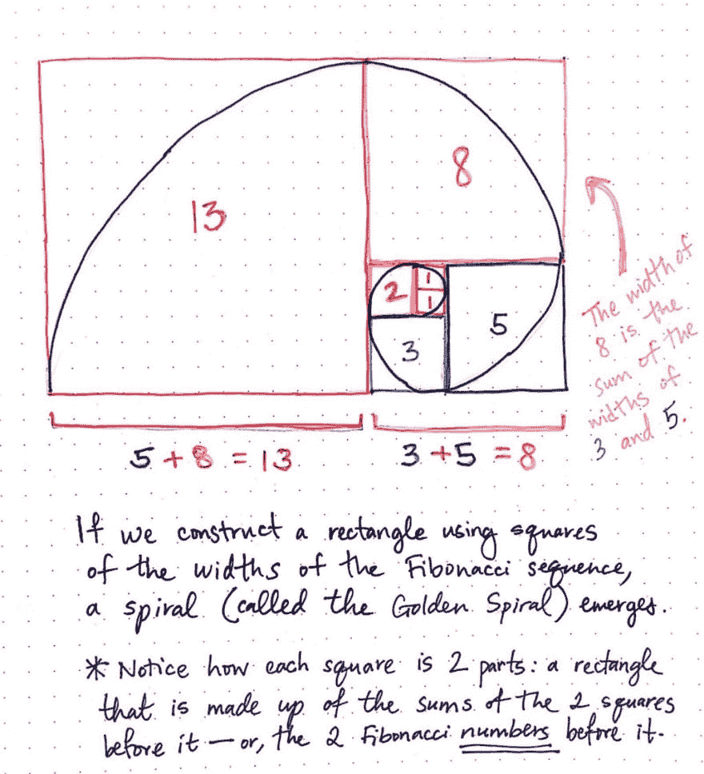](https://res.cloudinary.com/practicaldev/image/fetch/s--lyyo4uqU--/c_limit%2Cf_auto%2Cfl_progressive%2Cq_auto%2Cw_880/https://cdn-images-1.medium.com/max/1024/1%2AKMsWsDm2cKAwrQL8oWiWGQ.jpeg) 

<figcaption>黄金螺旋作为斐波那契数列的表现形式。</figcaption>

</figure>

我们会注意到每个正方形的宽度由两部分组成:另一个正方形和一个矩形，每个正方形的宽度是它前面的两个正方形(两个斐波那契数)的总和。例如，用粉红色绘制的正方形 8 的宽度是它前面的两个正方形 5 和 3 的宽度之和。类似地，红色方块 13 的宽度是它前面的两个方块的总和:8 和 5。

斐波那契数列再次出现！我们用来构建黄金螺旋的每个方块之间的比例与黄金比例直接相关。如果我们用每个斐波纳契数除以它前面的数，这就变得更明显了。

<figure>[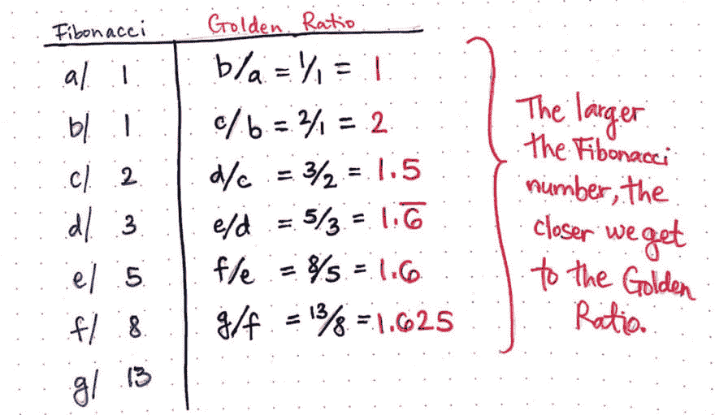](https://res.cloudinary.com/practicaldev/image/fetch/s--GGhOCuXC--/c_limit%2Cf_auto%2Cfl_progressive%2Cq_auto%2Cw_880/https://cdn-images-1.medium.com/max/1024/1%2Ab9ub0f4jSFjOGhPjtN4N9w.jpeg) 

<figcaption>斐波那契数越大，我们就越接近黄金分割率。</figcaption>

</figure>

请注意，随着斐波那契数列的增长，我们越来越接近φ(T1)的实际值。我们永远不会达到黄金比例*确切地说*，因为它是一个无理数；但是我们的斐波纳契数越大，当我们比较一个比率和另一个比率时，我们就越接近它。

斐波那契数列和黄金螺旋[存在于我们的周围](http://jwilson.coe.uga.edu/emat6680/parveen/fib_nature.htm),存在于海星的手臂中，贝壳的图案中，树枝中，甚至存在于我们的*中，存在于人的耳朵中，存在于我们手指的比例中，甚至存在于人手臂的比例中！我个人最喜欢的例子来自我最喜欢的花:向日葵。*

<figure>[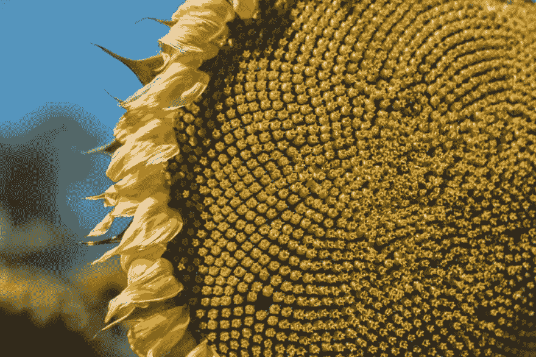](https://res.cloudinary.com/practicaldev/image/fetch/s--aQmWYmTC--/c_limit%2Cf_auto%2Cfl_progressive%2Cq_auto%2Cw_880/https://cdn-images-1.medium.com/max/1024/1%2Agcz8UYcLb6aNm4OLHS0dbw.jpeg) 

<figcaption>照片由[玛乔丽·贝特朗](https://unsplash.com/photos/vYg2mWKqQcU?utm_source=unsplash&utm_medium=referral&utm_content=creditCopyText)翁[昂思普拉](https://unsplash.com/?utm_source=unsplash&utm_medium=referral&utm_content=creditCopyText)</figcaption>

</figure>

拍摄

根据美国科学促进会的**[研究](http://www.sciencemag.org/news/2016/05/sunflowers-show-complex-fibonacci-sequences)**

 *> 这种迹象是向日葵表面不同的种子螺旋的数量。数数到达外边缘的顺时针和逆时针螺旋，你通常会从序列中找到一对数字:34 和 55，或 55 和 89，或“非常大的向日葵”89 和 144。尽管数学可能是美丽的，植物生物学家还没有研究出一个机械模型来完全解释向日葵种子图案是如何出现的。

你猜怎么着？还有另一种方式将这种图案与 AVL 树联系起来，这也许是它们如此金色的原因。

是时候找出答案了！

### 黄金(树高)比

斐波那契比喻中的最后一片花瓣是什么？

为了把它带回家，我们需要回到我们开始的地方:确定 AVL 树的最小节点数和高度之间的关系。我们已经研究了两个不同的公式:首先，我们想出了如何根据我们需要的最少节点数来确定高度；然后，我们根据已知的树的高度来确定我们需要的节点数。

<figure>[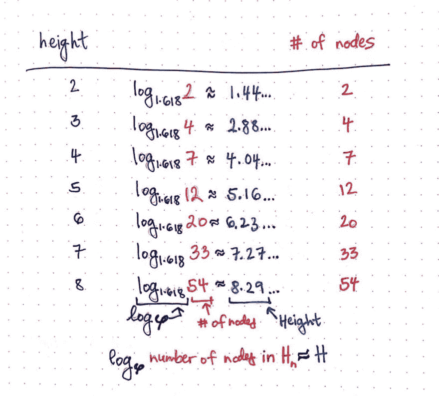](https://res.cloudinary.com/practicaldev/image/fetch/s--gaRFosaT--/c_limit%2Cf_auto%2Cfl_progressive%2Cq_auto%2Cw_880/https://cdn-images-1.medium.com/max/1024/1%2AGzVH6CTNESDu4_JQ1xBICg.jpeg) 

<figcaption>对数基数与节点</figcaption>

</figure>

的高度有唯一的关系

事实证明，斐波纳契数列和黄金分割率一直都在这两个公式的表面之下！

当我们使用树中的最小节点数来确定树的高度时，我们真正做的是*以黄金比例为基数，取最小节点数的对数，这给了我们树的高度的近似值。事实上，这正是 AVL 树的[对数复杂度](https://dev.to/vaidehijoshi/looking-for-the-logic-behind-logarithms)的来源！我们只是一般不提及基数，所以大多数时候它从来没有明确表示我们采用的是*日志* *基数 1.618。**

例如，当我们确定一棵最小节点数为 54 的树的高度为 8 时，我们真正做的是用 54 个节点数为 1.618 的*对数作为基数，这样*大约为*得出 8.29，四舍五入为整数值 8。*

如果我们要绘制节点数量和树高之间的关系，我们将有效地用[来绘制](http://www.wolframalpha.com/input/?i=graph+log+base+golden+ratio+of+x)*n*的对数黄金分割比，其中 *n* 是一棵树中节点的数量。

<figure>[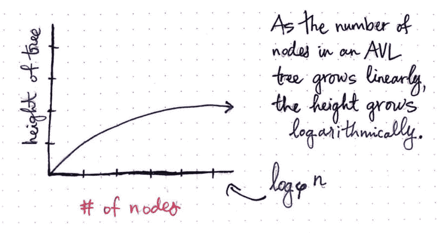](https://res.cloudinary.com/practicaldev/image/fetch/s--2IE9_Zpd--/c_limit%2Cf_auto%2Cfl_progressive%2Cq_auto%2Cw_880/https://cdn-images-1.medium.com/max/1024/1%2Adn_YP2516xfWXmRHpLI-vA.jpeg) 

<figcaption>当 AVL 树中的节点数量线性增长时，高度以对数增长。</figcaption>

</figure>

另一种思考方式是，一棵树的节点数与树高的关系是 ***对数*** 。

> 随着 AVL 树中节点的最小数量线性增长，树的高度以对数增长。

如果你记得在本系列的前面学过对数，那么你可能记得对数函数是指数函数的反函数。那么，我们看到的第二个公式呢？在这个公式中，我们根据树的高度来确定最小节点数。

这种关系将是对数关系的倒数:它将是*指数*。我们可以在下图中看到这一幕。

<figure>[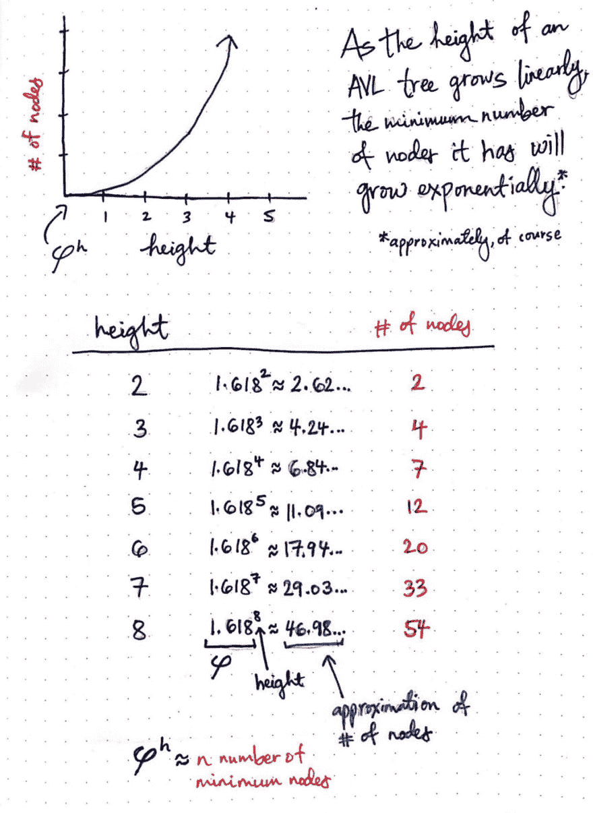](https://res.cloudinary.com/practicaldev/image/fetch/s--HO9iW5n_--/c_limit%2Cf_auto%2Cfl_progressive%2Cq_auto%2Cw_880/https://cdn-images-1.medium.com/max/1024/1%2AOpXbFgjwmEiesFw_pwhqZQ.jpeg) 

<figcaption>随着一棵 AVL 树的高度线性增长，它需要的节点数也呈指数增长。</figcaption>

</figure>

随着 AVL 树的高度线性增长，它所拥有的最小节点数将呈指数增长*(当然是近似的)。*

 *我们可以看到，每次我们将树的高度作为输入，并使用它来导出输入高度的 AVL 树的最小节点数时，我们都有效地将黄金比例提升到我们高度的幂， *h* 。

例如，当我们想要计算高度为 8 的 AVL 树的最小节点数时，我们将提高到 8 的幂，这样我们得到的*大约为* 46.98。请记住，由于我们处理的是一个圆整版的无理数，随着我们的数字变大，我们的近似值有更高的误差幅度。这解释了为什么我们对高度为 2、3、4 或 5 的树的计算比我们对高度为 8 的树的计算要精确得多。如果我们要绘制这些结果，我们会[实际上是在绘制](http://www.wolframalpha.com/input/?i=graph+golden+ratio%5Ex) *的黄金比例的 h 的幂*，也就是我们的树的高度。

如果你对刚刚学到的东西感到惊讶、敬畏、完全好奇，不要担心——我也有同样的感觉。我想我再也不会以同样的方式去想向日葵或橡树了，再也不会了。

(而且，如果我把工作做好了，你也不会。)

### 资源

我很难抑制住自己对斐波那契、黄金分割率和 AVL 树的兴奋，并对这三个主题做了大量的研究。如果你和我一样对它们着迷和惊讶，你会喜欢下面的链接。

1.  数据抽象:AVL 树，露丝·安德森教授
2.  [斐波那契数列](https://www.mathsisfun.com/numbers/fibonacci-sequence.html)，数学很有趣
3.  [AVL 树的最大高度](http://lcm.csa.iisc.ernet.in/dsa/node112.html)，CSA 部门，IISc，班加罗尔
4.  自然界中黄金比例的 15 个不可思议的例子
5.  [斐波那契数，](http://mathworld.wolfram.com/FibonacciNumber.html)沃尔夫拉姆研究
6.  [AVL 树](http://pages.cs.wisc.edu/~ealexand/cs367/NOTES/AVL-Trees/index.html)，埃里克·亚历山大教授

* * *

*本帖最初发表于[medium.com](https://medium.com/basecs/finding-fibonacci-in-golden-trees-1c8967b1f47a)T3】***