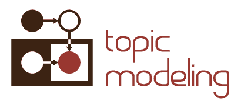
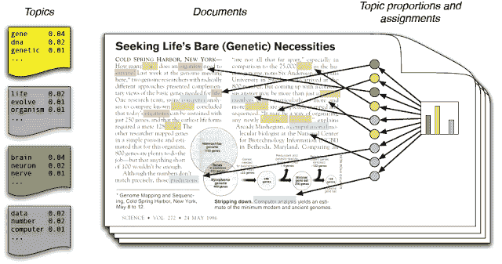
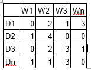

# 主题建模

> 原文:[https://dev.to/japneet121/topic-modelling](https://dev.to/japneet121/topic-modelling)

[T2】](https://2.bp.blogspot.com/-2R8o8TuByy0/WZupbHOH4iI/AAAAAAAABtw/mXSUjcGlp7wDJ9jRxAlvxF-f67v8HqsoQCLcBGAs/s1600/tm.png)

嗨，读者们，

在上一篇文章中，我写了关于从文本中获取知识的内容，这些内容可以从很多来源获得。在这篇文章中，我将写主题挖掘。

## 介绍

主题挖掘可以描述为从一组单词中找出最能描述该组的单词。

原始形式的文本数据不与任何上下文相关联。人们可以通过阅读文章并将其分类为一个或其他类别，如政治、体育、经济、犯罪等，来容易地识别文章的上下文或主题。

任何人在将文本分类到主题之一时都会考虑的因素之一是单词如何与主题相关联的知识，例如

*   印度在测试赛中战胜了斯里兰卡。

*   世界羽毛球锦标赛:何时何地观看 **Kidambi Srikanth** 的第一轮比赛，电视直播，IST 时间，直播

在这里，我们可能在句子中找不到单词 sports，但是用粗体标记的单词与运动有关。

主题建模可以大致分为两种类型

1.  基于规则的主题建模
2.  无监督主题建模

## 基于规则的主题建模

顾名思义，基于规则的主题建模依赖于可以用来将给定文本与某个主题相关联的规则。

在最简单的基于规则的方法中，我们可以只在文本中搜索一些单词，并将其与一个主题相关联，例如，查找单词 sports 将该主题与 *sports* 相关联，查找 travelling 将该主题与 *travel* 相关联

 *T2】*

这种方法可以扩展，一个主题可以表示为一组具有给定概率的单词，例如，对于体育类别，我们可以有一组单词，每个单词都有一定的权重。
题目:体育{" *体育"* :0.4，"*板球* ":0.1，"*羽毛球* ":0.1，"**旅游** ":0.05.....}
题目:旅行{" *旅行* ":0.4，"*徒步* ":0.1，"*火车* ":0.05，"**旅行** ":0.20.......}
*注意“远行”这个词，它出现在两个题目中却有不同的分量。*

如果我们有一个句子“*羽毛球* *球员正在前往英国参加比赛*”，通过简单的方法找到主题的单词，那么这个句子将被归入主题*旅行。*第二种方法通过检查不同单词的概率和权重来改进预测，在这种情况下，“T6”羽毛球“和“旅行”，并通过预测更准确的结果来改进结果，即*体育*。

基于规则的方法的主要缺点是所有的主题在开始时都必须是已知的，并且必须确定和检查概率。这排除了在文本语料库中找到一些新主题的可能性。

## 无监督主题建模

[T2】](https://1.bp.blogspot.com/-g3dI_6STH5s/WZuqBxnrhgI/AAAAAAAABt8/3AGn9JJPL7EHtkNl06Gpms2uMXLxKqj3QCLcBGAs/s1600/lda.png)

文本句子的主题很大程度上取决于句子中使用的单词，并且在无监督主题建模技术中利用这一属性来从句子中提取主题。它很大程度上依赖于贝叶斯推理模型。

### 贝叶斯推理模型

它是一种方法，通过这种方法，我们可以基于一些常识性的假设和以前相关事件的结果来计算某些事件发生的概率。

它还允许我们使用新的观察来改进模型，通过经历许多迭代，其中用观察证据更新先验概率，以便产生新的和改进的后验概率

### 无监督主题建模的一些技术有:

*   TF-IDF
*   潜在语义索引
*   潜在狄利克雷分配

我不会详细讨论这些技术，而是将重点放在 python 中这些技术的实现上。所有的方法都使用文档的向量空间表示。在向量空间模型中，文档由文档术语矩阵表示。

[T2】](https://3.bp.blogspot.com/-MF9AfD1OzdE/WZphHhbDM0I/AAAAAAAABtg/0YAaHqg6-H4EtrE4zA_2TBMHKxQiQzrHgCLcBGAs/s1600/Modeling2.png)

这里是 D1，D2，D3...Dn 是不同的文档，W1、W2、W3....Wn 是属于我们字典的单词(语料库中所有唯一的单词)。DxWy 给出该单词在文档中出现的次数。

```

#importing corpora from gensim for creating dictionary

from gensim import corpora

 #some raw documents .These documents can be stored in a file and read from the file

documents = ["Two analysts have provided estimates for Tower Semiconductor's earnings. The stock of Tower Semiconductor Ltd. (USA) (NASDAQ:TSEM) has \"Buy\" rating given on Friday, June 9 by Needham. The company's stock had a trading volume of 573,163 shares.",

             "More news for Tower Semiconductor Ltd. (USA) (NASDAQ:TSEM) were recently published by: Benzinga.com, which released: “15 Biggest Mid-Day Gainers For Monday” on August 14, 2017.",

             "Tower Semiconductor Ltd now has $2.33 billion valuation. The stock decreased 1.61% or $0.41 during the last trading session, reaching $25.06.",

             "The investment company owned 74,300 stocks of the industrial products firms shares after disposing 5,700 shares through out the quarter.",              

             "Tower Semiconductor Ltd now has $2.37B valuation. The stock rose 0.16% or $0.04 reaching $25.1 per share. About 115,031 shares traded.",

             "Needle moving action has been spotted in Steven Madden Ltd (SHOO) as shares are moving today on volatility -2.00% or -0.85 from the open.",

             "Shares of Steven Madden Ltd (SHOO) have seen the needle move -1.20% or -0.50 in the most recent session. The NASDAQ listed company saw a recent bid of 41.10 on 82437 volume.",

             "Shares of Steven Madden Ltd (SHOO) is moving on volatility today -1.37% or -0.57 from the open. The NASDAQ listed company saw a recent bid of 41.03 on 279437 volume.",

             "Shares of Steven Madden, Ltd. (NASDAQ:SHOO) are on a recovery track as they have regained 28.79% since bottoming out at $32.3 on Oct. 26, 2016."]

 '''

    Text Preprocessiing before calculation vectors

'''

# remove common words(stop words) and tokenize

stoplist = set('for a of the and to in its by his has have on were was which or as they since'.split())

texts = [[word for word in document.lower().split() if word not in stoplist]

         for document in documents]

 # remove words that appear only once in the corpus.

from collections import defaultdict

frequency = defaultdict(int)

for text in texts:

    for token in text:

        frequency[token] += 1

 texts = [[token for token in text if frequency[token] > 1] for text in texts]

 from pprint import pprint  # pretty-printer

pprint(texts)

'''

dictionary is collection of all the words that apprear in our corpus 

'''

#creating dictionary from the corpus which represents each word in the text corpus as a unique integer

dictionary = corpora.Dictionary(texts)

dictionary.save('/tmp/deerwester.dict')  # store the dictionary, for future reference

#saved dictionary can be loaded from the memory for future references.Saves time for recreation of dictionary

 #to print the token id of the words

print(dictionary.token2id)

'''

We can convert any document to vector format by just calling the doc2bow() method of dictionary object.

document="hello this is a good morning"

Input=['hello','this','is','a','good','morning']

preprocessing can be done on the document before passing to doc2bow()

'''

corpus = [dictionary.doc2bow(text) for text in texts]

print corpus

 '''

creating vector space representation for a single document

str="human interaction interface interface"

dictionary.doc2bow(text for text in str.split(' '))

'''

 from gensim import corpora, models, similarities

#convertig the vector space representation to tf-idf transformation

tfidf = models.TfidfModel(corpus)

list(tfidf[corpus])

 #using LDA model for getting the topics

lda= models.LdaModel(corpus, id2word=dictionary, num_topics=2) # initialize an LDA transformation

corpus_lda= lda[corpus] # create a double wrapper over the original corpus: bow->tfidf->fold-in-lda

print lda.print_topics(2) #print the topics

#for classifying the text documents into topics 
#here I have used the old corpus on which it was trained ,one can also use new documents 

for doc in corpus_lda:

    print doc

 Output:

```
[
```

```
(0, u'0.069*"shares" + 0.062*"ltd" + 0.059*"steven" + 0.044*"madden" + 0.044*"tower" + 0.043*"moving" + 0.043*"recent" + 0.041*"stock" + 0.040*"(shoo)" + 0.036*"semiconductor"'),
```

```

```
(1, u'0.077*"shares" + 0.066*"tower" + 0.056*"semiconductor" + 0.050*"stock" + 0.048*"company" + 0.046*"ltd" + 0.045*"ltd." + 0.043*"(usa)" + 0.038*"(nasdaq:tsem)" + 0.035*"trading"')]
```

 #the output gives the topics along with there probability distribution for different words 
```

可以调整 LdaModel 的参数以改善结果。同样，只要用 LsiModel 代替 LdaModel，就可以使用 LSI 技术 
```