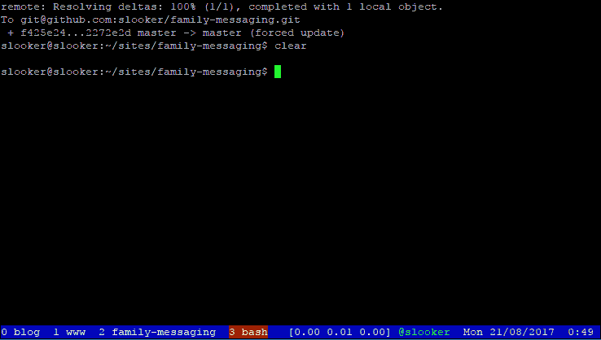
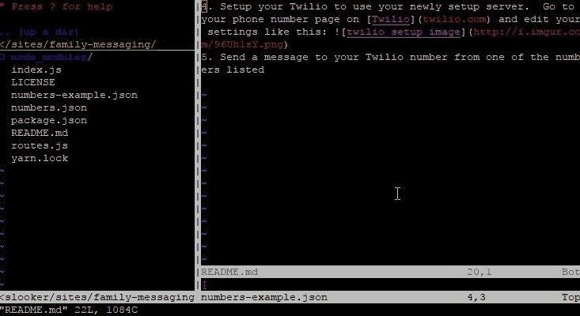
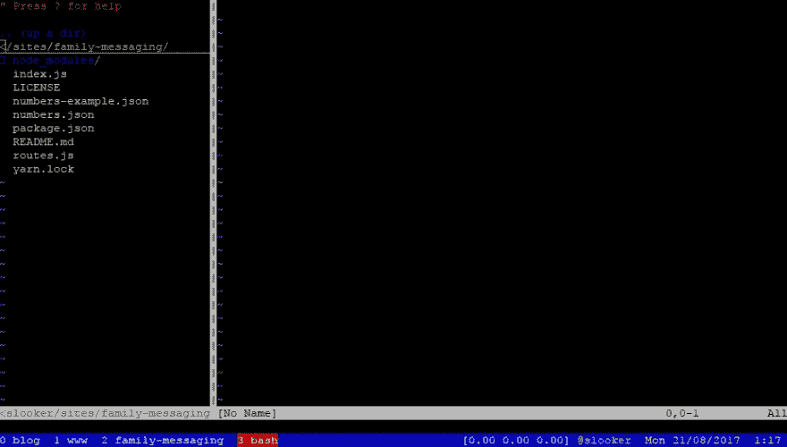

# 从 iPad 开发

> 原文：<https://dev.to/slooker/developing-from-an-ipad>

当 iPad Pro 问世时，我怀疑它对开发人员是否有用，但当我发现 [Duet](https://www.duetdisplay.com/) 可以让我把它用作 Macbook 的辅助屏幕时，我决定花钱买一个。这对于在第二台显示器上保存文档来说是非常宝贵的。

最近，我一直在阅读大量的工具，这些工具可以让你把你的 iPad 作为一个实际的开发盒，这让它对我来说非常有用。要明确的是，大多数这些事情都需要你在你的 iPad 上有一个网络连接，这样你就可以连接到另一个服务器，如[数字海洋](https://m.do.co/c/30da16b13cc2)(免责声明，这是我的 DO 的参考链接)，尽管你可以使用基于云的工具，如谷歌云，AWS 等，以推动。基于云的选项的唯一缺点是，每次你想测试某个东西时，你都必须把你的改变推上来，而不是仅仅能够保存，切换到 Chrome，然后重新加载。

##### Mosh

从 iPad 开发时，我遇到的第一个问题是，每次我离开 SSH 终端太久，在 Safari 中查看页面时，就会断开连接。然后我偶然发现了 [Mosh](www.mosh.org) 。Mosh 使用 UDP 而不是 TCP，可以很容易地在您的服务器上设置。没有延迟，甚至在网络延迟时也能工作。

##### 闪烁外壳

这让我想到了我的下一个应用。 [Blink Shell](http://www.blink.sh/) 是使用 SSH 或 Mosh 的 iOS 客户端。它的价格是 20 美元，起初我犹豫不决，但如果你打算定期从你的 iPad 连接到另一台服务器，它是非常值得的。它是开源的，所以如果你**真的**不想花那 20 美元，你随时可以从 [Github Repo](https://github.com/blinksh/blink) 自己编译。

##### 屏幕

GNU Screen 可能是我日常使用最多的应用程序。GNU Screen 允许你打开多个窗口，你可以通过几个按键在它们之间切换。我是一个老派的 unix 用户，我讨厌使用鼠标或离开键盘做任何事情。GNU Screen 让我可以轻松地在不同窗口之间切换，而不需要这么做。在大多数系统上，对于 Ubuntu/Debian 系统，你可以通过运行`apt-get install screen`来安装 Screen 对于基于 Red Hat/Fedora 的系统，你可以通过运行`yum install screen`来安装 Screen。**最大的**好处是，如果你断开连接，你可以 ssh/mosh 回到你的系统，运行`screen -x`，重新连接你的屏幕会话。您的所有工作仍然在那里，您不必每次都设置您的环境。

屏幕显示从`~/.screenrc`开始，我的设置是在底部显示一个条，这样我就知道我打开了什么窗口，可以很容易地切换到它们。

[T2】](https://res.cloudinary.com/practicaldev/image/fetch/s--RxZk9XK0--/c_limit%2Cf_auto%2Cfl_progressive%2Cq_auto%2Cw_880/http://imgur.com/p1U0901.png)

下面是我用来实现这一点的`~/.screenrc`文件:

```
caption always "%{.bW}%-w%{.rW}%n %t%{-}%+w %= %{..W}[%l] %{..G}%2`@%H %{..Y} %D %d/%m/%Y %c "
termcapinfo xterm ti@:te@
defscrollback 30000 # Use a 30000-line scrollback buffer
autodetach on # Autodetach session on hangup instead of terminating screen completely
startup_message off # Turn off the splash screen 
```

以下是我在 GNU Screen 中最常用的命令列表。更完整的参考资料可在[这里](http://aperiodic.net/screen/quick_reference)找到

*   你想要的快捷方式是`ctrl-a`是默认的“命令”键，所以你按`ctrl-a`然后按另一个键。
*   `ctrl-a c`创建屏幕
*   在提示符下回答`y`后，`ctrl-a k`终止单屏幕终端(但你可以在提示符下键入`exit`或`ctrl-d`退出)
*   `ctrl-a a`让您更改当前屏幕的名称(这就是显示在*底部的内容。我给你看的 screenrc 文件)
*   `ctrl-a d`分离您的屏幕(将您带出屏幕并返回到命令提示符，*仍然保存您的屏幕会话)
*   `screen -x`是我登录时运行的，如果我有一个已经运行的屏幕会话，如果没有一个已经运行的屏幕会话，我就运行`screen`

##### Vundle

Vundle 是一个 VIM 插件管理器。它让生活变得容易多了，我真的不确定以前没有它我是怎么生活的。

要安装它，假设您已经安装了 vim，只需运行`git clone https://github.com/VundleVim/Vundle.vim.git ~/.vim/bundle/Vundle.vim`。您还需要编辑您的`~/.vimrc`文件来使用 Vundle。你可以看看 [Vundle 快速入门文档](https://github.com/VundleVim/Vundle.vim#quick-start)或者你可以使用 [my。vimrc](https://paper.dropbox.com/doc/.vimrc-WSMgdT0JMm33Na1jca0R3) 。

安装好之后，启动 vim，并输入`:PluginInstall`

##### 痛击

对于大多数人来说，这个 shell 不需要介绍，并且是大多数 Linux 发行版的默认 shell。我添加的一个小东西是命令提示符下的 Git 分支。将它添加到您的`~/.bashrc`中，您就可以轻松做到这一点

```
## Bash prompt stuff
parse_git_branch() {
     git branch 2> /dev/null | sed -e '/^[^*]/d' -e 's/* \(.*\)/ (\1)/'
}
export PS1="\u@\h \[\033[32m\]\w\[\033[33m\]\$(parse_git_branch)\[\033[00m\] $ " 
```

这将给出如下所示的提示(至少在我的机器上是这样的):

[T2】](https://res.cloudinary.com/practicaldev/image/fetch/s---bh4LBNN--/c_limit%2Cf_auto%2Cfl_progressive%2Cq_auto%2Cw_880/http://imgur.com/uoDGwj1.png)

##### Vim

我在 iPad 上使用 Digital Ocean 时选择的编辑器是 vim。我是用 vi 长大的，所以 vim 是我的第二天性。这里有一个我在 vim 中最常用的东西的简单备忘单，但是你可以在这里找到一个更长的备忘单。

*   `dd`将删除一行，`p`将放回已删除的行
*   `V`开始一个视觉块，然后你可以用你的箭头上下移动来选择你想要用`dd`和`p`打开的东西
*   `$`转到一行的末尾，而`^`转到一行的开头
*   使用#G `转到特定行，其中#是一个数字。
*   使用`m<Letter>`标记某物(如书签),使用`'<letter>`转到该处。示例:如果我在两个方法之间切换，我将使用`ma`和`mb`来标记它们，然后使用`'a`和`'b`来访问它们。
*   除此之外，我只使用正则表达式替换。我将使用`V`来选择一个块，然后点击`:`,这将改变你在底部的提示为`:'<, '>`,然后你可以做`s/word/replace/g`等
*   键入没有可视块的`:`将让您在整个文件中执行`%s/word/replace/g`操作。
*   `:wq`将写入并退出，`:q`将退出一个未编辑的文件，`:q!`将退出一个文件而不保存，即使它已经被编辑过。

我不能没有 vim 的事情之一是我的`~/.vimrc`中的这一行:

`map <Tab> <C-W>w<C-W>_`

这使得当我使用`:split <filename>`打开多个文件时，我可以点击`<tab>`在两个文件之间切换，它将最大化我刚才切换到的文件。

[T2】](https://res.cloudinary.com/practicaldev/image/fetch/s--5zuauaTB--/c_limit%2Cf_auto%2Cfl_progressive%2Cq_66%2Cw_880/http://imgur.com/JVoCXqv.gif)

我在 vim 中使用的使我的生活更简单的最后两个东西是[nerd tree tab](https://github.com/jistr/vim-nerdtree-tabs)和 [Ctrl-P](https://github.com/ctrlpvim/ctrlp.vim) 。Nerdtree 选项卡是您在上图左侧看到的内容。当你打开一个文件夹而不是单个文件时，它类似于你看到的大多数编辑器，如 VS Code，Sublime 或 Atom。

Ctrl-P 是 vim 的模糊搜索文件查找工具。如果你输入`ctrl-p`并开始输入一个单词，它会在你的文件树中搜索找到它。

[T2】](https://res.cloudinary.com/practicaldev/image/fetch/s--Rg3I_t4g--/c_limit%2Cf_auto%2Cfl_progressive%2Cq_66%2Cw_880/http://recordit.co/pTvj3WTMER.gif)

*原贴于[blog.slooker.com](https://blog.slooker.us/developing-from-an-ipad/)T3】*