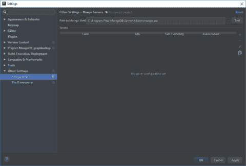
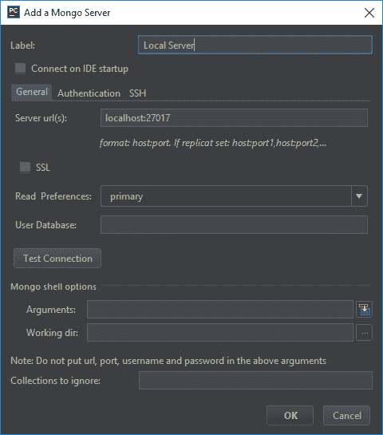
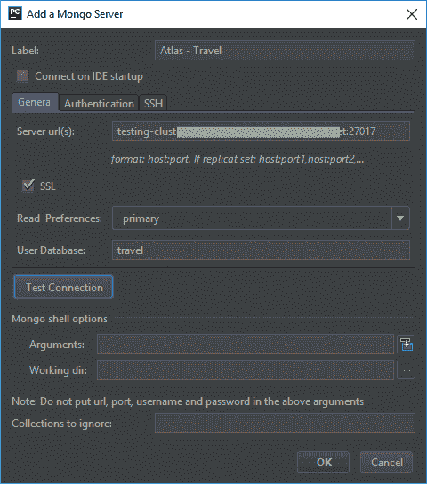
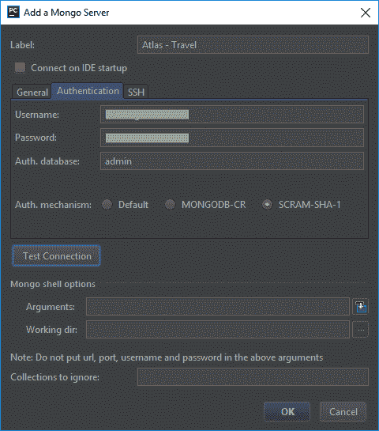
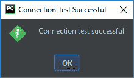
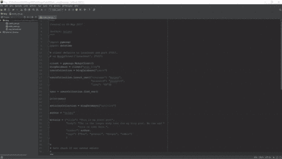
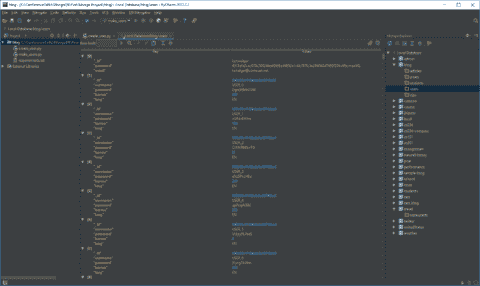
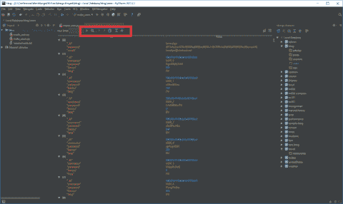

# PyCharm 的 MongoDB 插件

> 原文：<https://dev.to/kenwalger/mongodb-plugin-for-pycharm>

在开发查看和检查您的 [MongoDB](https://www.mongodb.com) 集合时，有许多不同的选项可用。MongoDB 的 [Compass](https://www.kenwalger.com/blog/nosql/mongodb/mongodb-compass-an-overview/) 是一个很好的工具示例，它允许查看数据库、集合或文档并与之交互。然而，在开发时，能够在开发环境中查看数据通常是很有用的。让我们来看看 PyCharm 的一个有用的 MongoDB 插件，用于查看集合。

### MongoDB 插件

虽然我将讨论与 [PyCharm](https://www.jetbrains.com/pycharm/) 相关的 [Mongo 插件](https://plugins.jetbrains.com/plugin/7141-mongo-plugin)，但该插件本身可以与 [JetBrains](https://www.jetbrains.com/) 提供的绝大多数 ide 一起工作。下载并安装插件后，我们需要设置一些东西。我将介绍如何为 MongoDB 服务器的本地安装建立连接，以及作为服务连接到他们的数据库。为了测试连接，我们需要确保这两台服务器都已启动并运行。

#### MongoDB 插件设置

###### 本地服务器

对于本地服务器，设置相对简单。假设我们正在使用默认端口为 27107 的服务器，让我们来看看我们的设置。

[T2】](https://res.cloudinary.com/practicaldev/image/fetch/s--dGxndk_p--/c_limit%2Cf_auto%2Cfl_progressive%2Cq_auto%2Cw_880/https://www.kenwalger.com/blog/wp-content/uploads/2017/08/plugin_settings_blank-e1503103697923.png)

我们在这里看到有一个地方可以输入到我们的*路径到[Mongo Shell](https://www.kenwalger.com/blog/nosql/mongodb-cli-tools/)T5】的路径。一定要把位置放在`mongo`可执行文件，而不是`mongod`的位置。你可以点击路径名旁边的**测试**按钮，以确保插件对正确的文件满意。*

接下来，我们需要添加一个服务器来使用和连接。通过点击`+`符号，我们可以选择配置我们的服务器连接。

[T2】](https://res.cloudinary.com/practicaldev/image/fetch/s--ZhcXF4gE--/c_limit%2Cf_auto%2Cfl_progressive%2Cq_auto%2Cw_880/https://www.kenwalger.com/blog/wp-content/uploads/2017/08/plugin_set_localhost.png)

在这里，我们看到我们能够标记或命名我们的连接，并以*主机:端口*的格式放入服务器位置。对于我们的例子，我们可以使用`localhost:27017`，如上所示。对于没有任何身份验证的单个服务器，这些设置将连接到数据库，您可以看到服务器上的所有数据库。

但是，如果您已经有了某种身份验证，并且想要建立到特定数据库的连接，该怎么办呢？让我们通过与 Atlas 配置的连接来检查这一点。

###### Atlas 服务器

我们将需要我们的 [Atlas](https://www.mongodb.com/cloud/atlas/) 连接 URL，该 URL 在我们的 Atlas 仪表板中可用。请随意使用您自己的服务器的主机名或 IP 地址。对于我的服务器设置，我想为主节点设置一个读取首选项，并连接到数据库中的 travel 集合。

[T2】](https://res.cloudinary.com/practicaldev/image/fetch/s--JMgP4-9v--/c_limit%2Cf_auto%2Cfl_progressive%2Cq_auto%2Cw_880/https://www.kenwalger.com/blog/wp-content/uploads/2017/08/plugin_set_Atlas-1.png)

因为我的 Atlas 服务器确实需要认证，所以让我们来看看那个选项卡。

[T2】](https://res.cloudinary.com/practicaldev/image/fetch/s--WvgAnq6w--/c_limit%2Cf_auto%2Cfl_progressive%2Cq_auto%2Cw_880/https://www.kenwalger.com/blog/wp-content/uploads/2017/08/plugin_set_Atlas_auth-1.png)

我们输入适当建立的用户名和密码，以及[认证](https://docs.mongodb.com/manual/core/authentication/index.html)数据库的名称。在本例中，我使用的是管理数据库。对于 Atlas，我们想选择[急停-SHA-1](https://docs.mongodb.com/manual/core/security-scram-sha-1/#authentication-scram-sha-1) 授权机制。然后我们可以测试这个连接的 T4。如果一切都配置正确，我们应该会弹出好消息。

[T2】](https://res.cloudinary.com/practicaldev/image/fetch/s--E5Plvyd7--/c_limit%2Cf_auto%2Cfl_progressive%2Cq_auto%2Cw_880/https://www.kenwalger.com/blog/wp-content/uploads/2017/08/plugin_add_server_connection_succesful.png)

#### 启动插件

建立连接后，我们可以通过导航到*视图->-工具窗口- > Mongo Explorer* 来使用 Mongo Explorer。它将显示我们配置的连接，当打开连接时，我们会看到我们的数据库列表。

[T2】](https://res.cloudinary.com/practicaldev/image/fetch/s--g4IFNkYn--/c_limit%2Cf_auto%2Cfl_progressive%2Cq_66%2Cw_880/https://www.kenwalger.com/blog/wp-content/uploads/2017/08/mongo_plugin_once-e1503103727858.gif)

选择一个给定的数据库后，我们会得到一个[集合](https://docs.mongodb.com/manual/core/databases-and-collections/)的列表。然后，我们可以选择一个给定的集合，并查看集合中的文档列表。

[T2】](https://res.cloudinary.com/practicaldev/image/fetch/s--w7Wz_6lX--/c_limit%2Cf_auto%2Cfl_progressive%2Cq_auto%2Cw_880/https://www.kenwalger.com/blog/wp-content/uploads/2017/08/plugin_collection_examination-e1503103745838.png)

#### MongoDB Plugin ToolBar

如果我们看一下出现在集合上方的工具栏:

[T2】](https://res.cloudinary.com/practicaldev/image/fetch/s--a3KgKgfX--/c_limit%2Cf_auto%2Cfl_progressive%2Cq_auto%2Cw_880/https://www.kenwalger.com/blog/wp-content/uploads/2017/08/plugin_collection_examination_toolbar-e1503103763829.png)

里面有一些很棒的功能。

[T2】](https://res.cloudinary.com/practicaldev/image/fetch/s--AjedlXid--/c_limit%2Cf_auto%2Cfl_progressive%2Cq_auto%2Cw_880/https://www.kenwalger.com/blog/wp-content/uploads/2017/08/toolbar-e1503103779454.png)

我们看到我们有一个`find`选项，一个切换聚合模式的选项，以及直接从 PyCharm 添加和编辑文档的能力。我们可以选择使用*过滤器*、*投影*以及*排序*参数来运行查询。这个插件包含了一组非常有用的工具。

### 包裹

在成功配置了与 MongoDB 服务器的连接之后，我们现在可以利用 Mongo 插件来查看我们的数据在开发过程中的样子。我个人认为这在开发时是一个巨大的好处和时间节省。如果你使用 JetBrains IDE 进行开发，我强烈建议你看看这个非常有用的插件。

这篇文章中有几个 MongoDB 特定的术语。我为[亚马逊 Echo](https://www.amazon.com/gp/product/B01DFKC2SO/ref=as_li_tl?ie=UTF8&camp=1789&creative=9325&creativeASIN=B01DFKC2SO&linkCode=as2&tag=kenwalgersite-20&linkId=f9e513223de2525a72b95cf9561db55b) 系列产品创建了一个 [MongoDB 字典](https://www.echoskillstore.com/MongoDB-Dictionary/45103)技能。检查一下，你可以说“Alexa，问 MongoDB 什么是文档？”并得到有益的回应。

* * *

*在 Twitter [@kenwalger](https://www.twitter.com/kenwalger) 上关注我，获取我发布的最新消息，或者在我的[博客](https://www.kenwalger.com/blog)上查看原始帖子。*