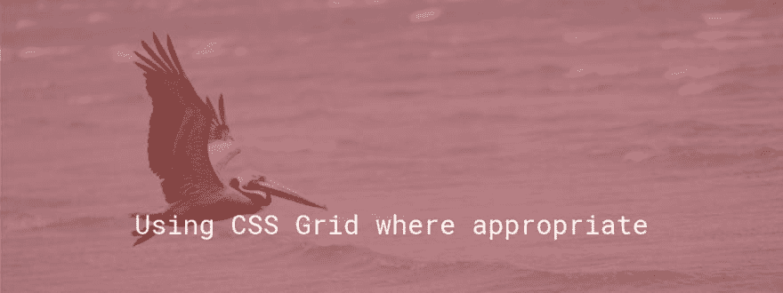

# 在适当的地方使用 CSS 网格

> 原文:[https://dev.to/starbist/using-css-grid-where-appropriate](https://dev.to/starbist/using-css-grid-where-appropriate)

[T2】](https://www.silvestarbistrovic.from.hr/articles/using-css-grid-where-appropriate/)

*本文最初发表于[silvestarbitrovic . from . HR](https://www.silvestarbistrovic.from.hr/articles/using-css-grid-where-appropriate/)。*

最近，我重新设计了我的博客，你们可能已经注意到了。在这个过程中，我决定是时候学习更多关于 CSS 网格的知识并实际使用它了。以下是我学到的。

## 使用 CSS 网格

每次我做一个新的(重新)设计，我通常从页眉开始。标题的第一个组成部分是导航。我的网站架构并不复杂，只是几个页面，博客类别和帖子。

```
<header class="header">
  <ul class="nav">
    <li class="nav__item">
      <a class="nav__link" href="/link/to/nav/item">Item 1</a>
    </li>
    <li class="nav__item">
      <a class="nav__link" href="/link/to/nav/item">Item 2</a>
    </li>
    <li class="nav__item">
      <a class="nav__link" href="/link/to/nav/item">Item 3</a>
    </li>
    <li class="nav__item">
      <a class="nav__link" href="/link/to/nav/item">Item 4</a>
    </li>
  </ul>
</header> 
```

<svg width="20px" height="20px" viewBox="0 0 24 24" class="highlight-action crayons-icon highlight-action--fullscreen-on"><title>Enter fullscreen mode</title></svg> <svg width="20px" height="20px" viewBox="0 0 24 24" class="highlight-action crayons-icon highlight-action--fullscreen-off"><title>Exit fullscreen mode</title></svg>

我想在这里尝试 CSS Grid，所以我从在我的`ul`元素上添加`display: grid`开始。起初，我不确定菜单中会有多少个元素，4 个还是 5 个。但是我必须知道这些信息来定义我的`grid-template-columns`。还是我？

我发现在这种特定的情况下有一种属性可以帮助我。而它被称为 [`grid-auto-flow`](https://developer.mozilla.org/en-US/docs/Web/CSS/grid-auto-flow) 。

> grid-auto-flow CSS 属性控制自动放置算法的工作方式，指定自动放置的项目如何流入网格。

我将这个属性设置为`column`，grid 将足够智能地根据需要添加新列。

```
.nav {
  display: grid;
  grid-auto-flow: row;
}     
@media screen and (min-width: $mq-mobile) {
  .nav {
    grid-auto-flow: column;
  }
} 
```

<svg width="20px" height="20px" viewBox="0 0 24 24" class="highlight-action crayons-icon highlight-action--fullscreen-on"><title>Enter fullscreen mode</title></svg> <svg width="20px" height="20px" viewBox="0 0 24 24" class="highlight-action crayons-icon highlight-action--fullscreen-off"><title>Exit fullscreen mode</title></svg>

为了创建一个响应菜单，我添加了一个较小屏幕的媒体查询，并使用`grid-auto-flow: row`将项目一个接一个地堆叠起来。现在我可以在导航中使用 4 或 5 个元素。一切正常。

[https://codepen.io/CiTA/pen/brVbjx](https://codepen.io/CiTA/pen/brVbjx)

## 使用 CSS 网格项

然后新的问题来了。我想创建一个 Hexo 主题和[与社区](https://hexo.io/themes/)分享，就像我对 [hexo-codepen](https://www.npmjs.com/package/hexo-codepen) 和 [hexo-caniuse](https://www.npmjs.com/package/hexo-caniuse) 插件所做的那样。

为了做到这一点，我想为开发人员提供一个选项，根据需要添加尽可能多的菜单元素。然后事情开始变得复杂。

我认为在标题导航中每行最多允许 4 个元素是个好主意。如果有 4 个以上的元素，将它们放在新行中。

我尝试了各种 CSS 网格属性来实现想要的行为，但是没有一个能和`grid-auto-flow`一起工作。

然后我尝试了一种不同的方法:我将尝试单独定位网格项目，而不是尝试定义一个网格。我将把第一个网格项放在第一行的第一列，然后把第二个网格项放在第一行的第二列，依此类推。

```
@media screen and (min-width: 320px) {
  .nav__item:nth-child(1) {
    grid-area: 1 / 1 / 2 / 2;
  }
  .nav__item:nth-child(2) {
    grid-area: 1 / 2 / 2 / 3;
  }
  .
  ..
  ...
} 
```

<svg width="20px" height="20px" viewBox="0 0 24 24" class="highlight-action crayons-icon highlight-action--fullscreen-on"><title>Enter fullscreen mode</title></svg> <svg width="20px" height="20px" viewBox="0 0 24 24" class="highlight-action crayons-icon highlight-action--fullscreen-off"><title>Exit fullscreen mode</title></svg>

CSS Grid 足够智能，可以根据提供的`grid-area`属性创建网格。这不是最好的解决方案，当然也不是最优雅的，但它确实有效。

[https://codepen.io/CiTA/pen/BdoaQb](https://codepen.io/CiTA/pen/BdoaQb)

## 正确使用 CSS 网格

我对那种解决方案不满意。通过查看编译的 CSS，我意识到文件太大是因为所有那些`nth-child`伪类。我不得不深入挖掘。

在研究了每个网格属性之后，我终于找到了答案。我应该创建所需的网格，但使用`auto`的大小。

```
.nav {
  display: grid;
  grid-auto-flow: row;
}
@media screen and (min-width: 320px) {
  .nav {
    grid-template-columns: repeat(4, auto);
    grid-template-rows: repeat(2, auto);
  }
} 
```

<svg width="20px" height="20px" viewBox="0 0 24 24" class="highlight-action crayons-icon highlight-action--fullscreen-on"><title>Enter fullscreen mode</title></svg> <svg width="20px" height="20px" viewBox="0 0 24 24" class="highlight-action crayons-icon highlight-action--fullscreen-off"><title>Exit fullscreen mode</title></svg>

我定义了 4 列 2 行，结果看起来是一样的。

[https://codepen.io/CiTA/pen/MvKQXZ](https://codepen.io/CiTA/pen/MvKQXZ)

## 使用 flexbox 作为后备

CSS 网格还不被完全支持。

[http://caniuse.com/#search=CSS%20Grid](http://caniuse.com/#search=CSS%20Grid)

我需要一个像样的 CSS 网格后备。因为我是 Flexbox 的超级粉丝，也因为对 Flexbox 的支持非常好，所以创建一个到 Flexbox 的后备是很自然的。

[http://caniuse.com/#search=Flexbox](http://caniuse.com/#search=Flexbox)

今年早些时候，当《粉碎》杂志的[维塔利·弗莱德曼](https://www.smashingmagazine.com/author/vitaly-friedman/)在奥西耶克举办了一个研讨会时，我第一次听说了这个方法。原则是我们应该首先定义 Flexbox，然后使用`@supports`规则添加 CSS 网格。

```
.nav {
  display: flex;
  flex-wrap: wrap; 
}
.nav__item {
  flex: 0 0 auto;
  width: 100%;
}
@media screen and (min-width: $mq-mobile) {
  .nav__item {
    width: calc(100% / 4);
  }
}
// use grid if supported
@supports (display:grid) and (grid-auto-flow: row) {
  .nav {
    display: grid;
    grid-auto-flow: row;
  }
  @media screen and (min-width: 320px) {
    .nav {
      grid-template-columns: repeat(4, auto);
      grid-template-rows: repeat(2, auto);
    }
  }
} 
```

<svg width="20px" height="20px" viewBox="0 0 24 24" class="highlight-action crayons-icon highlight-action--fullscreen-on"><title>Enter fullscreen mode</title></svg> <svg width="20px" height="20px" viewBox="0 0 24 24" class="highlight-action crayons-icon highlight-action--fullscreen-off"><title>Exit fullscreen mode</title></svg>

为了防止 Edge 使用 CSS 网格，我添加了`grid-auto-flow: row`规则。该属性在边缘没有[支持](https://developer.mozilla.org/en-US/docs/Web/CSS/grid-auto-flow#Browser_compatibility)。

除了跨浏览器支持之外，结果还是一样的。

[https://code codes . io/cita/pen/gxpzwj](https://codepen.io/CiTA/pen/gxPzwJ)

## 吸取教训

通过使用 CSS 网格构建导航，我学到了很多东西。这里最大的教训是在适当的地方使用 CSS 网格。在我看来，使用 CSS Grid 构建导航当然是不合适的。

## 最后的想法

我非常喜欢使用许多不同的技术来构建导航组件。构建组件的方法有很多种，只要可行，就没有正确或错误的解决方案。这就是我热爱 CSS 的原因。

你在用 CSS 网格吗？在什么情况下？请在下面留言或在 Twitter 上联系我。