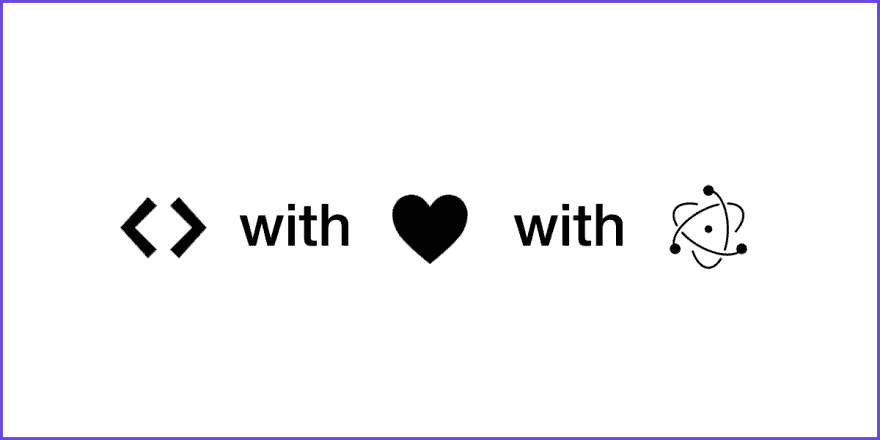

# 为电子辩护

> 原文：<https://dev.to/devtouser432/in-defense-of-electron>

[T2】](https://res.cloudinary.com/practicaldev/image/fetch/s--sBo7qU41--/c_limit%2Cf_auto%2Cfl_progressive%2Cq_auto%2Cw_880/https://thepracticaldev.s3.amazonaws.com/i/a59iivu1kwepjxhv9b4g.png)

Electron 是一个流行的框架，它允许开发人员编写一次代码并部署在多个平台上，如 Mac、Windows 和 Linux，在过去的一年里，它一直处于稳定的 T2 攻击状态。

那些反对者正在聚集起来，阻止新老创业公司采用 electronic 的速度。今天，开发人员使用的两个最流行的工具是用 Electron 构建的:Slack 和 Atom。

反对电子的人说“它太占用内存了。”或者，“它占用了 CPU。”或者更好的是，“它在每个窗口中运行整个谷歌 Chrome 引擎。”

更有甚者，反电子的帖子通常充满了图表和表格，以及带有内存和 CPU 使用情况的活动监视器截图，概述了该框架的邪恶之处以及为什么必须不惜一切代价阻止它。

这些帖子主要关注机器人计算机的感受，最终忽略了决定电子产品成败的因素:大多数人日常运行电子应用的感受。

### 用户的感知

我绝不是“大多数人”。我用的是相对高级的笔记本电脑:2016 款 MacBook，16GB ram(标配)。但是今天的高级开发机器是明天的入门级计算机。在电子公司的梦想世界里，每个计算机用户都有大量的内存。但我认为这个世界正在快速逼近。我们是等到那时才开始利用这个丰富的世界，还是现在就开始计划？

如果我是一个便利的框架开发人员，我应该更关心内存趋势的走向，而不是内存趋势的 T2。计算机行业似乎已经在 8GB 上停留了太长时间，但是 16GB 的标准现实即将到来，如果不是不可避免的话。

当我说电子像梦一样运行时，我可以为我自己说话。在一个典型的日子里，我会打开大约三个 Atom 窗口，一个多团队的闲置和运行，以及积极使用和调试我自己的基于电子的应用程序 Standard Notes。我还会打开或运行一些其他非电子应用程序，比如 Adobe Photoshop、三个各有 3 到 4 个标签的终端窗口、Sequel Pro、平均有 4 到 5 个标签的谷歌 Chrome、苹果邮件、iMessage、Little Snitch、Dropbox 和 iTunes/Apple Music。

那么，每天跑这膨胀的死亡列车是什么感觉？

嗯，感觉*没事*。

我没注意到。我的笔记本电脑不热。我没听到风扇的声音。我在任何应用程序中都没有遇到延迟。我的音乐无缝播放。我可以毫无问题地观看高清 YouTube 视频。我的屏幕不闪烁。我收到通知。我下载新应用并更新旧应用。

我继续我的一天，电子不会妨碍我。

### 商业案例

但是，除了最终用户的感受之外，还有一个更重要的视角:软件公司的感受。

举个例子，我参与的项目是一个开源的跨平台 notes 应用程序，可以在大多数平台上使用，包括 web、Mac、Windows、Linux、iOS 和 Android。所有的桌面应用程序都基于主要的 web 代码库，并使用 Electron 进行捆绑，而 iOS 和 Android 应用程序分别使用自己的原生代码库，一个在 Swift，另一个在 Kotlin。

作为一家没有很多资源的新公司，这种设置只能勉强让我们进入市场。三个代码库对于维护两个代码库来说太多了。每次我们做出改变，都要在三个不同的地方，违背了计算机科学最神圣的保持干燥的宗旨。

作为一个部署在所有这些平台上的单人团队，即使是最微小的变化也需要至少三天的开发时间，每个代码库一天。这包括调试、修复、测试、捆绑、部署和分发每一个代码库。这绝不是一件容易的事。

有时候，一个潜在用户告诉我，这个应用正是他们想要的，但是“对不起，我不使用电子应用。”

如果我坦率地说，也许我会说“我很遗憾地通知你，你想象的世界并不存在。”

让我们通过模拟平行宇宙来满足这个用户的愿望，在平行宇宙中，一个小型软件商店可以在每一个平台上进行本地开发。

这意味着总共要雇佣六名有经验的开发人员。让我们忽略必须在六个不同的平台上对每个微小的变化进行六次的令人厌烦的事情，而是关注成本。平均工资为 15 万美元(对于像 Mac 开发人员这样很难找到的人来说可能更多)，忽略寻找和雇佣这些开发人员的巨大成本，每年的开发成本总计为 90 万美元。

对于一个没有风投资金支持的自举公司来说，这真的不是一个选择。

或者实际上，也许是。你可以把成本转嫁给你的顾客。

让我们假设在运营 12 个月后有 2000 个付费用户的目标。如果我们想让整个公司的利润只有 10 万美元，这意味着向每个用户收取 500 美元/年或 42 美元/月的费用。你想每年花 500 美元买一个 notes 应用吗？

我敢说，这些条件将限制任何寻求向市场引入跨平台解决方案的新创业公司，而原本可能出现的令人惊叹的应用程序将永远不会出现。

也许魔鬼的交易并没有那么糟糕？你得到了一些东西，而不是一无所获。那总是好的。第二，你可以以合理的价格买到它(notes 应用程序每年 36 美元)。第三，你可以在每一个你喜欢使用的平台上得到它，在大多数情况下，网络访问是一个额外的好处。

我敢打赌，随着它为新的创业公司提供的有利条件，以及个人电脑内存可用性的增加，电子将继续被公司和用户所采用。

* * *

如果你是一名开发者，你可以在这里了解更多关于电子的知识。

你也可以在这里看到一些自豪地用电子[构建的应用程序。](https://electron.atom.io/apps/)

*如果你喜欢这篇文章，并希望在未来订阅类似的故事，你可以在 Twitter 上关注 [@bitario](https://twitter.com/bitario) ，或者查看我正在进行的项目 [@StandardNotes](https://twitter.com/standardnotes) ，一个[私人开源 Notes 应用](https://standardnotes.com)。*