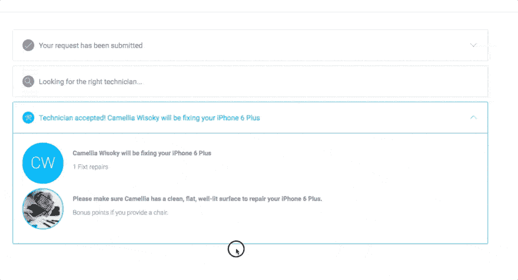

# 将一个自治的 JS 应用程序连接到 ActionCable 以实现实时性

> 原文：<https://dev.to/johnlukeg/connect-an-autonomous-js-app-to-actioncable-for-realtimegoodness>

[T2】](https://res.cloudinary.com/practicaldev/image/fetch/s--7Q_s0_3G--/c_limit%2Cf_auto%2Cfl_progressive%2Cq_auto%2Cw_880/https://thepracticaldev.s3.amazonaws.com/i/e324ir7ndltqmb9rm56c.jpg)

几个月前，我开始学习 Rails Action Cable for Fixt，这样我就可以为我们的客户服务代表实现桌面通知。这非常简单，因为在 Ruby on Rails 的首选 coffeescript 中有很多通过资产管道连接的例子。但作为一个对 websocket 趋势了解不多的人，我开始问自己，如果你想从另一个独立的 web 应用程序连接，该怎么办？最后，我不得不面对这个问题，因为我的任务是将我们的连接到我们的 Ruby on Rails 后端进行实时跟踪。在这里，我开始探索从任何 Javascript 应用程序中利用 Action Cable 的最佳方式。

[T2】](https://res.cloudinary.com/practicaldev/image/fetch/s--TFa8mlaX--/c_limit%2Cf_auto%2Cfl_progressive%2Cq_66%2Cw_880/https://thepracticaldev.s3.amazonaws.com/i/moqu48lfjlr8jnxdav3e.gif)

<figcaption>
[通过 Fixt 提交手机或平板电脑维修](https://fixt.co/repairs)，亲自查看完整功能；)
</figcaption>

* * *

### 动作电缆设置

这不会是一个完整的教程，这意味着我不会包括所有的动作电缆的设置，因为这已经由[边缘指南](http://edgeguides.rubyonrails.org/action_cable_overview.html)做得很好了。相反，如果您已经有了标准的 action cable 设置，我将重点介绍您需要对配置进行的更改。

您需要做两件事来确保您可以从外部连接到您的 websocket。首先，您需要将您客户的地址添加到允许的来源列表中。

```
# config/environments/development.rb
config.action_cable.url = 'http://localhost:3000/cable'
config.web_socket_server_url = 'ws://localhost:3000/cable'
config.action_cable.allowed_request_origins = [
   # Local address of our RoR server
  'http://localhost:3000',
   # Local address we use for our React standalone client
  'http://localhost:8000',
] 
```

Enter fullscreen mode Exit fullscreen mode

```
# config/environments/production.rb
config.websocket_server_url = 'wss://<YOUR_SERVER_SITE>/cable'
config.action_cable.allowed_request_origins = [
   # Address of our Ruby on Rails App
  'https://<YOUR_SERVER_SITE>',
   # Address of our JS App
  'https://<YOUR_CLIENT_SITE>',
] 
```

Enter fullscreen mode Exit fullscreen mode

*注意:我假设您在生产中使用 ssl 证书，但是如果您没有，那么只需将`https`改为`http`，将`wss`改为`ws`*

如果您还没有，您将需要设置一个频道来跟踪您想要接收更新的任何型号。在 Action Cable 中有两种范例，您可以对活动记录对象进行流式处理，也可以对一般通道进行流式处理。这些差异在边缘导轨部分 5.1 流中有更好的解释[。为了简单起见，我将解释我们想要做什么。我们本质上希望将任何更新流式传输到模型的实例，传输到对该模型感兴趣的任何客户端。在我们的 Fixt 案例中，我们希望能够跟踪特定修复实例的更新。](http://edgeguides.rubyonrails.org/action_cable_overview.html#streams) 

```
# app/channels/repair_tracking_channel.rb
class RepairTrackingChannel < ApplicationCable::Channel
  def subscribed
    stream_for repair
  end

  def repair
    Repair.find(params[:id])
  end
end 
```

Enter fullscreen mode Exit fullscreen mode

现在，每当我们想更新对修复感兴趣的客户端时，我们所要做的就是像这样调用:

```
RepairTrackingChannel.broadcast_to(@repair, repair: repair.as_json) 
```

Enter fullscreen mode Exit fullscreen mode

*注意:不一定要用`as_json`。我们实际上在 Fixt 使用 jbuilder，但是因为这篇文章不是关于序列化数据的，所以我不想在这上面花太多时间。*

* * *

### Javascript 设置

既然我们已经将 Action Cable 配置为流传输到我们的独立客户端 JS 应用程序，那么让我们设置客户端。之前的一切都是普通的动作电缆，所以接下来的部分是有趣的部分。

Action Cable 只是 web sockets 之上的一层，所以你真的可以使用好的 ole JS web sockets 连接到它。对于本文，我将使用`actioncable` npm 包，因为它使样板 web 套接字代码更容易理解。如果你是一个反依赖、铁杆、100x 程序员，认为 npm 是为弱者准备的，那么你可能不需要这个教程或任何人的帮助，因为你非常聪明，当你退出这个帖子时，我们都会鼓掌。

[](https://res.cloudinary.com/practicaldev/image/fetch/s--RyBkfqKN--/c_limit%2Cf_auto%2Cfl_progressive%2Cq_66%2Cw_880/https://thepracticaldev.s3.amazonaws.com/i/6j0fw0kkh1ivujwlqtn4.gif) 

<figure>

<figcaption>
不是你赫敏，你是完美的。< 3
</figcaption>

</figure>

让我们继续将 actioncable 安装到我们的项目中。

```
$ npm i -S actioncable 
```

Enter fullscreen mode Exit fullscreen mode

然后，让我们创建一个名为`repair-tracking-subscription.js`
的文件

```
$ touch repair-tracking-subscription.js 
```

Enter fullscreen mode Exit fullscreen mode

通过这个文件，我们希望封装我们所有的 ActionCable 通道逻辑，就像通过资产管道连接到 Action Cable 一样。

```
import ActionCable from 'actioncable';

// 1\. Configure your websocket address
const WEBSOCKET_HOST = process.env.NODE_ENV === 'production' 
                         ? 'wss://<YOUR_SERVER_SITE>/cable' 
                         : 'ws://localhost:3000/cable';

export default function RepairTrackingSubscription(
  repairId, 
  { onUpdate = () => {} } = {}
) {
  // 2\. Define our constructor
  this.cable = ActionCable.createConsumer(WEBSOCKET_HOST);
  this.channel;
  this.repairId = repairId;
  this.onUpdate = onUpdate;

  // 3\. Define the function we will call to subscribe to our channel
  this.subscribe = () => {
    this.channel = this.cable.subscriptions.create(
      { channel: 'RepairTrackingChannel', id: this.repairId },
      {
        connected: this.connected,
        disconnected: this.disconnected,
        received: this.received,
        rejected: this.rejected,
      }
    );
  };

  // 4\. Define our default ActionCable callbacks.
  this.received = (data) => {
    console.log(`Received Data: ${data}`);

    this.onUpdate(data);
  };

  this.connected = () => {
    console.log(`Tracking Repair ${id}`);
  };

  this.disconnected = () => {
    console.warn(`Repair Tracking for ${id} was disconnected.`);
  };

  this.rejected = () => {
    console.warn('I was rejected! :(');
  };
} 
```

Enter fullscreen mode Exit fullscreen mode

1.  这将是您在上一节中设置的`ws` / `wss`地址。您不必在这里硬编码它，但是我不会冒昧地了解您的环境。
2.  对于那些不熟悉 javascript 函数和面向对象编程的人来说，这是我们的构造函数，任何以`this`开头的都是我们对象的成员变量。
3.  我们使用`subscribe`函数来调用 ActionCable 服务器。你可以在构造函数中这样做，省去了一个步骤，但是我认为为了便于理解，这是值得分开的。这种方式也允许你传递订阅，并按你的意愿订阅。
4.  这些是您的 ActionCable 回调，当通道中发生某些操作时，默认情况下会调用这些回调。您可以在 [Edge Guides 5.3 订阅](http://edgeguides.rubyonrails.org/action_cable_overview.html#client-server-interactions-subscriptions)上阅读有关默认和自定义回调函数的更多信息。

就是这样！现在，我们可以从任何地方跟踪维修。只需导入此功能，订阅如下:

```
import React, { Component } from 'react';
import repairTrackingSubscription from './repair-tracking-subscription';

class Tracker extends Component {
  state = {
    repair: {},
  };

  componentWillMount() {
    const { repairId } = this.props;

    const repairChannel = new RepairTrackingSubscription({ 
      repairId, 
      onUpdate: this.onRepairUpdate, 
    });

    repairChannel.subscribe();
  }

  onRepairUpdate = (data) => {
    const { repair } = data;
    this.setState(() => ({ repair }));
  }

  render() {
    const { repair } = this.state;

    return (
      <div>
        { JSON.stringify(repair) }
      </div>
    );
  }
}

export default Tracker; 
```

Enter fullscreen mode Exit fullscreen mode

注意:这是与框架无关的，你可以在你当前所处的任何 javascript 环境中使用这个函数。我现在发现自己处于反应中，似乎无法自拔。发送帮助

## 结论

这对你们中的许多人来说似乎很简单，但上周我确实不确定如何从一个自主应用程序连接到 Action Cable。大多数教程都假设您将在 Ruby on Rails 框架内工作。我希望这能帮助你们中的一些人做一些很酷的鱼。