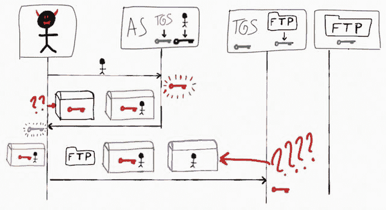

# Kerberos 用图片解释

> 原文:[https://dev.to/danlebrero/kerberos-explained-in-pictures](https://dev.to/danlebrero/kerberos-explained-in-pictures)

*本文原载于[我的博客](http://danlebrero.com/2017/03/26/Kerberos-explained-in-pictures/)T3】*

[Kerberos](https://en.wikipedia.org/wiki/Kerberos_protocol) 是一种认证协议，可用于[单点登录(SSO)](https://en.wikipedia.org/wiki/Single_sign-on) 。SSO 背后的想法很简单，我们只需要登录一次，就可以使用我们有权使用的任何服务，而不必登录所有这些服务。

维基百科[页面]((https://en.wikipedia.org/wiki/Kerberos_protocol))非常好，但是即使在阅读了[的解释比如我是 5: Kerberos](http://www.roguelynn.com/words/explain-like-im-5-kerberos/) 之后，我还是不得不自己画一些图表。

## 谜题

因此，假设目标是让用户与 FTP 服务对话，并让 FTP 服务确保用户是他们所声称的那个人，因为有不法分子会试图拦截参与者之间发送的任何消息并试图利用它。

为了解决这个难题，想象演员被允许使用彩色的钥匙和箱子，需要多少就用多少，但要遵守以下规则:

1.  箱子只能用相同颜色的钥匙打开。
2.  钥匙可以用来打造相同颜色的箱子。
3.  任何人都可以创建新的颜色键，只要该颜色已经不存在。

你会怎么做？

### 设置

以下是演员和初始游戏设置:

[T2】](https://res.cloudinary.com/practicaldev/image/fetch/s--f_WP-rih--/c_limit%2Cf_auto%2Cfl_progressive%2Cq_auto%2Cw_880/http://danlebrero.cimg/kerberos-initial-setup-2.jpg)

拥有黑键的黑暗用户。

FTP 服务，他有一把蓝色的钥匙。

TGS 有一个绿密钥，而且他知道 FTP 服务器有一个蓝密钥，并且有一个拷贝。其他服务会有其他颜色的按键。

AS 知道并拥有 TGS 的绿钥匙和用户的黑钥匙的副本。其他用户会有其他颜色的按键。

### 该剧

[T2】](https://res.cloudinary.com/practicaldev/image/fetch/s---oeyjPkd--/c_limit%2Cf_auto%2Cfl_progressive%2Cq_auto%2Cw_880/http://danlebrero.cimg/kerberos-for-dummies-2.jpg)

让我们解释一下最初的交互，让它更清楚。

1.  用户首先将自己的名字发送给 AS。
2.  AS 伪造了一个新的红色密钥。
3.  AS 发送一个黑盒子(用 AS 的黑密钥副本创建)。它包含一个红色钥匙的副本。
4.  AS 还发送一个绿箱子，里面有红钥匙的另一个副本和用户的名字。

用户不能打开绿箱子，因为他只有黑钥匙，但是他可以打开黑箱子，从那里他获得红钥匙。从现在开始，他可以创造红色的箱子。

等等...希望你能抓住它的要点。

### 偷听做坏事的人

有了这个图，当一些参与者被模拟或者消息被捕获或修改时，很容易检查一些场景。

例如，让我们看看当一个邪恶的家伙试图冒充用户时会发生什么:

[T2】](https://res.cloudinary.com/practicaldev/image/fetch/s--qWmGLDrd--/c_limit%2Cf_auto%2Cfl_progressive%2Cq_auto%2Cw_880/http://danlebrero.cimg/kerberos-evil-guy-2.jpg)

由于邪恶的家伙没有黑钥匙，他无法获得红钥匙，所以他能做的最好的事情就是伪造一个新的钥匙，在这种情况下是紫色的，并用它来创建一个紫色的箱子。

注意，即使绿箱子是好的和有效的，并且 TGS 能够像以前一样打开绿箱子，TGS 也不能打开紫箱子，因为他只有红钥匙。

当然，邪恶的家伙不能只是简单地发送用户的名字，因为 TGS 期待一个箱子(ClassCastException！).

我建议尝试其他场景，比如模仿 TGS 或者邪恶的家伙抓住一些箱子。很好玩！

## 但是这和 Kerberos 有什么关系呢？

不出所料，上图展示了 Kerberos 协议的工作原理。

按照 Kerberos 的说法，AS 是身份验证服务，TGS 是票证授予服务。实际上，这两种服务通常是同一台服务器。

箱子要么是门票，要么是鉴定书。翻译见帖子最后的图例。

该协议中第一个有趣的事情是用户密码(黑密钥)从不通过网络发送，这避免了一大堆可能的安全问题。

发现的一个安全问题是，任何人都可以获得黑盒子并进行离线暴力或字典攻击，因此 Kerberos 5 附带了可选的[预认证](http://superuser.com/questions/200010/how-does-kerberos-preauthentication-increase-security)，并且它可以使用[非对称密钥](https://tools.ietf.org/html/rfc4556)，因此来自用户的初始消息与图中所示略有不同。

有趣的是，FTP 服务器从不与 AS 或 TGS 服务对话来验证用户的身份，这应该有利于系统的可伸缩性。

图中未示出，但是所有箱子都被打上时间戳，并且这种时间戳被服务器检查。这有助于避免重放攻击和会话失效。

用户使用最后一个空的黄色箱子来验证正在与正确的服务器进行对话，并且它实际上包含时间戳。

这个难题的前两条规则来自于 Kerberos 使用对称密钥加密的事实。

我希望这有助于您理解 Kerberos。如果有不清楚的地方(或错误的地方),请给我发邮件或发推文。).

## 图例

按照 Kerberos 的说法(下面的图表便于参考):

*   **AS** :认证服务器。
*   **TGS** :赠票服务。
*   **FTP** :用户想要访问的服务。
*   **黑键**:用户哈希密码。
*   **绿钥匙** : TGS 秘钥。
*   **红色密钥**:客户端/TGS 会话密钥。
*   **绿箱子**:赠票-票。
*   **黄色键**:客户端/服务器会话密钥。
*   **蓝箱子**:客户端到服务器票。
*   **创建箱子**:加密消息。
*   **开箱子**:解密一条消息。

[T2】](https://res.cloudinary.com/practicaldev/image/fetch/s---oeyjPkd--/c_limit%2Cf_auto%2Cfl_progressive%2Cq_auto%2Cw_880/http://danlebrero.cimg/kerberos-for-dummies-2.jpg)