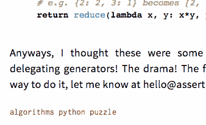

# 哲基尔标签，简单的方法

> 原文:[https://dev.to/rpalo/jekyll-tags-the-easy-way](https://dev.to/rpalo/jekyll-tags-the-easy-way)

> 注意:由于某些原因，我不能在文章正文中包含 YAML 前线的三划线。相反，我将使用`###`来表示。请确保在您自己的代码中使用三重破折号。

我看着我的博客，试图想出一些很酷但可以实现的东西，我可以添加到博客中并进行实验。我决定给我的帖子添加标签——如果没有别的，只是为了看看我写的是什么。我从以下需求开始我的研究和计划:

1.  我必须能够添加标签来描述每个帖子的内容。
2.  理论上，每篇文章都会显示其标签内容。
3.  应该有一种方法将带有相同标签的帖子链接在一起，或者至少从一个带有标签的帖子链接到另一个。
4.  主页应该有某种标签列表，标签排名，标签云等。

我的博客只是一个由 Jekyll 和 Github 页面驱动的静态站点。关于这方面的更多信息，请查看 Jekyll 的主页。我从 jekyll 插件开始我的搜索。我承认我没有太努力地寻找，因为我太容易屈服于“非此处建造”综合症。也就是说，在我搜索的短暂时间里，我没有看到任何能完全符合我要求的东西。

在对 Jekyll 的模板语言(由[液体模板引擎](https://shopify.github.io/liquid/)提供支持)有了一定程度的适应之后，我决定，靠我自己能有多难？原来，哲基尔让它变得相当容易！

## 1。向每个帖子添加标签

这个是最简单的。每篇 Jekyll 帖子都以解析器用来构建站点的一些 YAML 前沿问题开始。您可以使用一些内置变量(如“标签”)，并且您可以定义自己的变量在帖子/页面本身中使用！我只需要修改我的封面一行。

```
###
layout: page
title: Highly Original Example Title
tags: get some dope tags, Add this.  Separate via spaces or commas!
### 
```

<svg width="20px" height="20px" viewBox="0 0 24 24" class="highlight-action crayons-icon highlight-action--fullscreen-on"><title>Enter fullscreen mode</title></svg> <svg width="20px" height="20px" viewBox="0 0 24 24" class="highlight-action crayons-icon highlight-action--fullscreen-off"><title>Exit fullscreen mode</title></svg>

## 2。每个帖子将显示其标签

再一次，Jekyll 的模板和内置变量拯救了我们。在每篇文章的结尾，我添加了下面的 html 代码片段。你可能比我更有创造力。

```
<small>
    
    <a href="/tags/{{  tag  }}/">{{  tag  }}</a>
    
</small> 
```

<svg width="20px" height="20px" viewBox="0 0 24 24" class="highlight-action crayons-icon highlight-action--fullscreen-on"><title>Enter fullscreen mode</title></svg> <svg width="20px" height="20px" viewBox="0 0 24 24" class="highlight-action crayons-icon highlight-action--fullscreen-off"><title>Exit fullscreen mode</title></svg>

这是结果。

[T2】](https://res.cloudinary.com/practicaldev/image/fetch/s--wbL68KnW--/c_limit%2Cf_auto%2Cfl_progressive%2Cq_auto%2Cw_880/http://assertnotmagic.com/img/tag-snippet.png)

简单而美丽。

## 3。应该有一种方法来分组共享标签的帖子

这一个变得更加困难和复杂。我选择通过为每个标签制作一个页面来解决这个问题，这个页面简单地列出了具有该标签的帖子。第一步是创建一个基本的布局模板。在`_layouts/tagpage.html`中创建下面的代码。

```
###
layout: page # This template inherits from my basic page template
###
<!-- We're going to give each page a tag when we create it.
This will be the title -->
<h1>{{ page.tag | capitalize }}</h1>

<ul>
    
    <li>
        {{ post.date | date: "%B %d, %Y" }}: <a href="{{ post.url }}">{{ post.title }}</a>
    </li>
    
</ul> 
```

<svg width="20px" height="20px" viewBox="0 0 24 24" class="highlight-action crayons-icon highlight-action--fullscreen-on"><title>Enter fullscreen mode</title></svg> <svg width="20px" height="20px" viewBox="0 0 24 24" class="highlight-action crayons-icon highlight-action--fullscreen-off"><title>Exit fullscreen mode</title></svg>

最后，在你站点的主目录中，放一个`/tags/`目录。对于您拥有的每个标签，您需要创建一个文件。这篇文章的标签之一是`jekyll`，所以我有下面的文件`tags/jekyll.md` :

```
###
layout: tagpage
tag: jekyll
permalink: /tags/jekyll/ # This is only required for pretty links.
###

# Thus, this page's link is /tags/jekyll/ rather than /tags/jekyll.html 
```

<svg width="20px" height="20px" viewBox="0 0 24 24" class="highlight-action crayons-icon highlight-action--fullscreen-on"><title>Enter fullscreen mode</title></svg> <svg width="20px" height="20px" viewBox="0 0 24 24" class="highlight-action crayons-icon highlight-action--fullscreen-off"><title>Exit fullscreen mode</title></svg>

现在，当 Jekyll 构建时，它将为每个标签构建一个页面，并为每个标签列出一个帖子列表。我正在开发一个 Jekyll 插件，可以根据每篇文章的标签自动生成标签文件夹。或者可能是 Jekyll 构建过程中的一个钩子，这样我甚至不用记得输入`jekyll tag`。我们走着瞧。

## 4。主页应该有某种形式的标签云

这最后一个需要一些解释。将下面的代码添加到您的主页。在阅读下一段之前，先浏览一下下面的 html，这样你就知道我在说什么了。Jekyll 模板中可用的`site.tags`变量是一个有趣的结构。如果你像访问字典一样访问它(或者 dict，或者 hash，取决于你选择的语言)，例如`site.tags["nematodes"]`，你将会收到一个有那个标签的文章列表。如果直接遍历`site.tags`，每一项都可以作为一个元组来工作:(标签名，带有该标签的帖子列表)。在下面的文件中，您可以看到这两种方法。

```
<p>
    
    <!-- Here's a hack to generate a "tag cloud" where the size of
    the word is directly proportional to the number of posts with
    that tag. -->
    <a href="/tags/{{ tag[0] }}/" 
    style="font-size: {{ tag[1] | size | times: 2 | plus: 10 }}px">
        {{ tag[0] }} | 
    </a>
    
</p> 
```

<svg width="20px" height="20px" viewBox="0 0 24 24" class="highlight-action crayons-icon highlight-action--fullscreen-on"><title>Enter fullscreen mode</title></svg> <svg width="20px" height="20px" viewBox="0 0 24 24" class="highlight-action crayons-icon highlight-action--fullscreen-off"><title>Exit fullscreen mode</title></svg>

aaaaandbaboombah！

[T2】](https://res.cloudinary.com/practicaldev/image/fetch/s--OjRUC0C1--/c_limit%2Cf_auto%2Cfl_progressive%2Cq_auto%2Cw_880/http://assertnotmagic.com/img/tag-cloud.png)

正如您所看到的，列表是无序的，因为`site.tags`变量是一个字典，其顺序是不确定的(除非您现在正在用 Python 3 编程，其中字典是按照巧合排序的)。如果你需要他们的订单，你需要变得稍微复杂一点。

## 综述

我最初的搜索提供了这样的方法:

```
###
layout: default
title: Tag
###
<!--
The following part extracts all the tags from your posts and sort tags,
 so that you do not need to manually collect your tags to a place.
=======================
-->


    
    



<!--
=======================
The following part removes dulpicated tags and invalid tags like blank tag.
=======================
-->


    
        
            
        
        
            
        
    
 
```

<svg width="20px" height="20px" viewBox="0 0 24 24" class="highlight-action crayons-icon highlight-action--fullscreen-on"><title>Enter fullscreen mode</title></svg> <svg width="20px" height="20px" viewBox="0 0 24 24" class="highlight-action crayons-icon highlight-action--fullscreen-off"><title>Exit fullscreen mode</title></svg>

以上片段具体摘自@codinfox。你可以在这里找到他的博客。它看起来很好用，有很多花里胡哨的东西。我只是想要简单容易的东西。有任何改进的想法或整洁/更好的布局吗？让我知道。我绝不是他们所说的“以设计为导向”的个体。我可以做出功能很好的东西，但漂亮是我必须找到一些好的导师来学习的东西。

* * *

*最初发布于[我的博客](http://assertnotmagic.com)。*