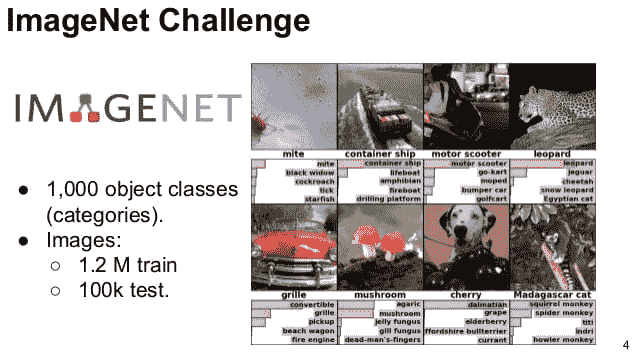
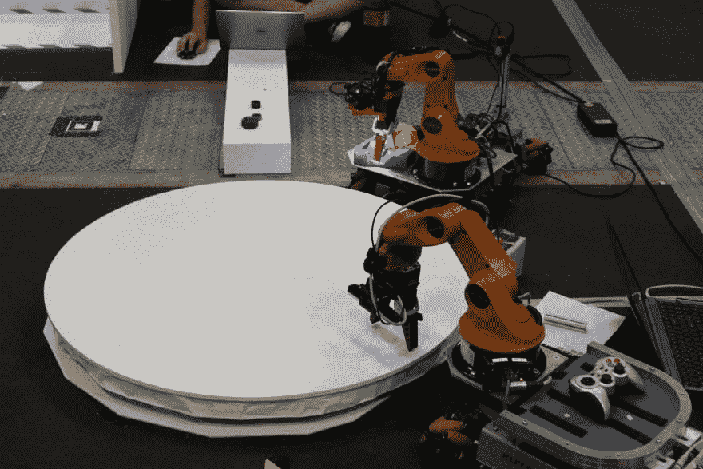
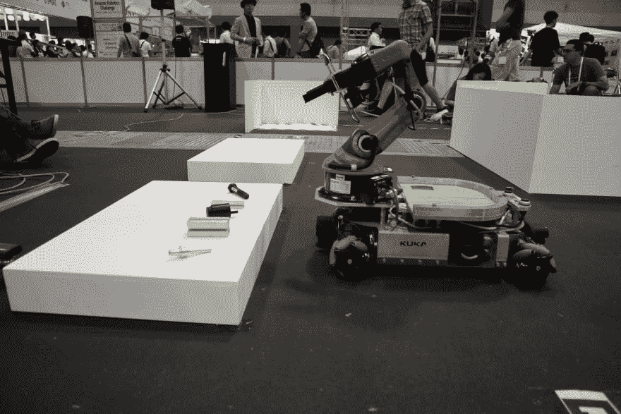
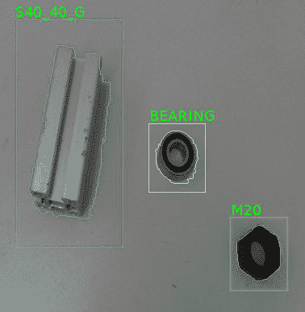

# 你应该通过机器学习来接受偶尔的错误

> 原文：<https://dev.to/deebuls/you-should-accept-the-occasional-faults-by-machine-learning>

人们永远不会实现 100%准确的机器学习算法。如果你有一个，那么请花时间向我们证明它没有过度拟合训练数据集。

对于任何特定任务，性能最好的机器学习算法都可以达到 90%左右的准确率。比如自然语言处理领域的词性标注问题，最先进的是 [97%](https://nlp.stanford.edu/pubs/CICLing2011-manning-tagging.pdf) 。同样，在最著名的大规模视觉识别 [Imagenet 挑战赛](http://image-net.org/)中，2016 年的结果显示[对物体检测的准确率达到 97%](http://image-net.org/challenges/LSVRC/2016/results)。
[](https://res.cloudinary.com/practicaldev/image/fetch/s--CPe3cVCj--/c_limit%2Cf_auto%2Cfl_progressive%2Cq_auto%2Cw_880/https://thepracticaldev.s3.amazonaws.com/i/tkdyk5amktar0xppditm.jpg)

因此，结论是你永远不会达到 100%的准确性。这意味着来自机器学习的一些输出将**不正确**。

基于这两个事实，我们可以得出一个最重要的结论，**我们不应该基于机器学习算法的输出来编写确定性代码**。目前我们所有的代码都是基于确定性风格的，基本上我们知道这个位是 0 还是 1。
例如

```
int i = 5 
```

我们知道 I 的值是 5，完全确定性的。但是如果 I 的值来自机器学习算法，我们不能确定这个值是 5。
对于真实世界的例子，如果图像分类器说对象是桌子，我们不能完全确定该对象是桌子，因为有 4%的可能性该对象不是桌子。

这些关于机器学习的信息对所开发的软件具有更大的影响，这些软件在其软件架构中使用机器学习算法的预测。

我们面对这个问题是基于我们参加 [Robocup@work](http://www.robocupatwork.org/) 比赛的经验。比赛是关于工业环境中的移动机器人和解决拾取和放置任务。
T3T5】

在采摘之前，机器人感知位置并决定采摘哪个对象。
[T3】](https://res.cloudinary.com/practicaldev/image/fetch/s--ku1CWtJu--/c_limit%2Cf_auto%2Cfl_progressive%2Cq_auto%2Cw_880/https://thepracticaldev.s3.amazonaws.com/i/5v7tqjvzsga967zq2ird.jpg)

我们使用基于 CNN 的深度学习算法对需要在我们的训练数据集上以 99%的准确度挑选的对象进行分类。
[T3】](https://res.cloudinary.com/practicaldev/image/fetch/s--yfmnbHHo--/c_limit%2Cf_auto%2Cfl_progressive%2Cq_auto%2Cw_880/https://thepracticaldev.s3.amazonaws.com/i/ux2trvfbbxokufhl6gfc.jpg)

问题是有时物品会被错误分类。但由于我们没有注意到这个弯道的情况，我们最终选择了错误的物体，在比赛中失去了很多积分。这些问题可以使用一些解决方案来适应拐角条件。

在您的软件架构中，有不同的解决方案可以稳健地使用机器学习预测。我们使用的一些解决方案是:

### 使用机器学习算法的置信度参数

大多数最先进的机器学习算法(SVM、随机森林、CNN 等)为它们的预测提供了一个置信度参数。这应该用于确定应该使用哪些预测。但不是算法提供了预期的置信度。例如，在 CNN 分类中，有时它以 100%的置信度误分类。这使得很难将其用作丢弃错误预测的参数。

### 反复预言

永远不要在现实世界中只使用一次预测。例如，如果进行图像分类，我们应该从不同角度或不同相机拍摄多幅图像，并进行多次预测。然后找一个知识融合的方法，把多重预测的预测结合起来，确定什么是正确的预测。

这些是一些简单的解决方案，但使用过滤器和[贝叶斯方法](http://wiki.ros.org/wire)的更复杂的方法将改善结果。

## 结论

从讨论中得出的主要观点是，机器学习算法的输出是不确定的。因此，使用这些输出(预测)的软件不能仅仅基于简单的 if-else 条件，相反，它们应该具有能够**适应预测错误**的机制。

请评论你用来解决算法预测中的错误的各种方法。