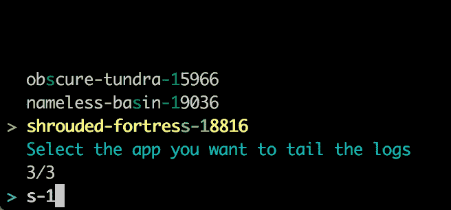

# Heroku CLI 会见 fzf

> 原文:[https://dev.to/peterfication/heroku-cli-meets-fzf](https://dev.to/peterfication/heroku-cli-meets-fzf)

在使用 tmux 和 [fzf](https://github.com/junegunn/fzf) 时，我遇到了另一个有趣的 fzf 用例:使用模糊查找器来简化 [Heroku CLI](https://devcenter.heroku.com/articles/heroku-cli) 的使用。

想象一下，你在 Heroku 上有一些应用程序，然后你想跟踪它们的日志，或者你想 ssh 到其中一个。这有一个问题:为了运行`$ heroku logs -t -a awesome-app-staging`，你必须记住确切的应用名称。或者是`staging-awesome-app`？嗯，你看到问题了吧。另一个解决方案可能是为每个应用程序定义一个别名。然而，这并不能很好地扩展…

但是在命令行界面中为你的 Heroku 应用提供一个模糊查找器怎么样呢？🤖

当我切换到 vim 时，我第一次听说了 fzf，并高兴地开始用它打开我的文件。我最近开始使用 tmux，fzf 也很有帮助。[这篇 stackoverflow 帖子](https://stackoverflow.com/questions/37730996/tmux-script-for-fast-window-switching-with-fzf-tmux-gives-me-the-wrong-options)向我展示了如何使用 fzf 在 tmux 窗口之间切换。我还使用这种方法在 tmux 会话之间切换(并在链接的 stackoverflow 帖子中分享了解决方案)。这最终导致了将 fzf 与 Heroku CLI 结合使用的想法。

[T2】](https://res.cloudinary.com/practicaldev/image/fetch/s--5dL17UXF--/c_limit%2Cf_auto%2Cfl_progressive%2Cq_auto%2Cw_880/https://store2be.github.img/heroku-cli-with-fzf.jpg)

这个神奇的命令是:

```
$ heroku apps --all | grep '(' | sed 's/ .*$//' | fzf --header='Select the app you want to tail the logs' | xargs heroku logs -t -a 
```

<svg width="20px" height="20px" viewBox="0 0 24 24" class="highlight-action crayons-icon highlight-action--fullscreen-on"><title>Enter fullscreen mode</title></svg> <svg width="20px" height="20px" viewBox="0 0 24 24" class="highlight-action crayons-icon highlight-action--fullscreen-off"><title>Exit fullscreen mode</title></svg>

当然你应该为此创建别名:

```
alias heroku-logs="heroku apps --all | grep '(' | sed 's/ .*$//' | fzf --header='Select the app you want to tail the logs' | xargs heroku logs -t -a"
alias heroku-bash="heroku apps --all | grep '(' | sed 's/ .*$//' | fzf --header='Select the app you want to bash into' | xargs heroku logs -t -a" 
```

<svg width="20px" height="20px" viewBox="0 0 24 24" class="highlight-action crayons-icon highlight-action--fullscreen-on"><title>Enter fullscreen mode</title></svg> <svg width="20px" height="20px" viewBox="0 0 24 24" class="highlight-action crayons-icon highlight-action--fullscreen-off"><title>Exit fullscreen mode</title></svg>

## 逐步解说

第一个命令应该是不言自明的。它会给你一个 Heroku 上所有应用的列表。但是这里的格式很重要！该命令返回两个列表。你自己的应用和你合作的应用:

```
$ heroku apps --all

=== peterfication@example.com Apps
obscure-tundra-15966 (us)
nameless-basin-19036 (eu)

=== Collaborated Apps
shrouded-fortress-18816 (eu)          someone-else@example.com 
```

<svg width="20px" height="20px" viewBox="0 0 24 24" class="highlight-action crayons-icon highlight-action--fullscreen-on"><title>Enter fullscreen mode</title></svg> <svg width="20px" height="20px" viewBox="0 0 24 24" class="highlight-action crayons-icon highlight-action--fullscreen-off"><title>Exit fullscreen mode</title></svg>

* * *

首先，我们通过将输出管道化到 grep 来删除所有的行。应用程序的每一行都包含括号，因此我们使用括号来过滤行。

```
$ heroku apps --all | grep '('

obscure-tundra-15966 (us)
nameless-basin-19036 (eu)
shrouded-fortress-18816 (eu)          someone-else@example.com 
```

<svg width="20px" height="20px" viewBox="0 0 24 24" class="highlight-action crayons-icon highlight-action--fullscreen-on"><title>Enter fullscreen mode</title></svg> <svg width="20px" height="20px" viewBox="0 0 24 24" class="highlight-action crayons-icon highlight-action--fullscreen-off"><title>Exit fullscreen mode</title></svg>

* * *

接下来，我们必须确保我们只使用应用程序名称，而不使用其他名称。因此，我们删除了应用程序名称后的所有内容，从空格开始。

```
$ heroku apps --all | grep '(' | sed 's/ .*$//'

obscure-tundra-15966
nameless-basin-19036
shrouded-fortress-18816 
```

<svg width="20px" height="20px" viewBox="0 0 24 24" class="highlight-action crayons-icon highlight-action--fullscreen-on"><title>Enter fullscreen mode</title></svg> <svg width="20px" height="20px" viewBox="0 0 24 24" class="highlight-action crayons-icon highlight-action--fullscreen-off"><title>Exit fullscreen mode</title></svg>

* * *

这是一个很好的列表，我们可以通过管道传递给 fzf。fzf 的结果然后通过管道传递给我们想要执行的 heroku 命令:

```
$ heroku apps --all | grep '(' | sed 's/ .*$//' | fzf --header='Select the app you want to bash into' | xargs heroku logs -t -a 
```

<svg width="20px" height="20px" viewBox="0 0 24 24" class="highlight-action crayons-icon highlight-action--fullscreen-on"><title>Enter fullscreen mode</title></svg> <svg width="20px" height="20px" viewBox="0 0 24 24" class="highlight-action crayons-icon highlight-action--fullscreen-off"><title>Exit fullscreen mode</title></svg>

使用 fzf 选择所需的应用程序后，该命令最终扩展为:

```
$ heroku logs -t -a shrouded-fortress-18816 
```

<svg width="20px" height="20px" viewBox="0 0 24 24" class="highlight-action crayons-icon highlight-action--fullscreen-on"><title>Enter fullscreen mode</title></svg> <svg width="20px" height="20px" viewBox="0 0 24 24" class="highlight-action crayons-icon highlight-action--fullscreen-off"><title>Exit fullscreen mode</title></svg>

💪

* * *

*大家好，我们是 [store2be](https://www.store2be.com) ，一家总部位于柏林的初创公司，为短期零售空间建立了一个支持 SaaS 的市场。如果你喜欢我们发布的内容，你可能想看看[store 2 be 技术页面](https://tech.store2be.com)或者关注我们的[媒体频道](https://medium.com/store2be-tech)。*