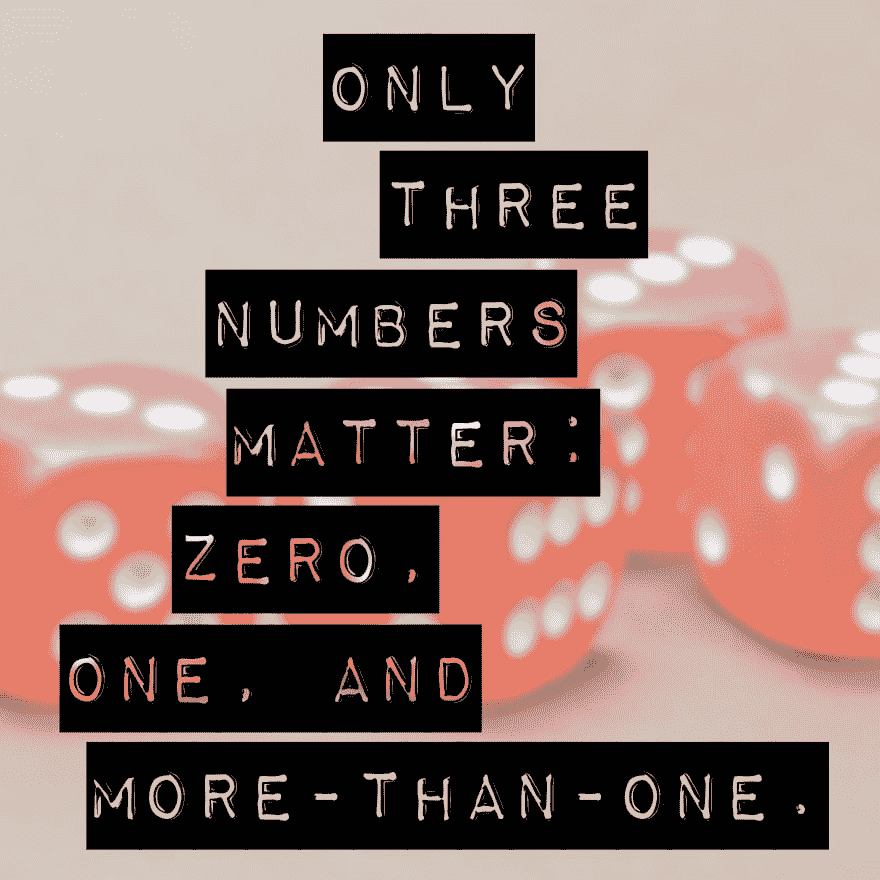

# 只有三个数字重要:零、一和大于一。

> 原文:[https://dev . to/lpas qualis/only-three-numbers-matter-zero-one and-than-one](https://dev.to/lpasqualis/only-three-numbers-matter-zero-one-and-more-than-one)

这篇文章最初发表在 [CoderHood](https://coderhood.com) 上，因为[只有三个数字重要:零、一和多于一](https://coderhood.com/only-three-numbers-matter/)。CoderHood 是一个致力于软件工程人类层面的博客。

[T2】](https://res.cloudinary.com/practicaldev/image/fetch/s--xFBXoOpC--/c_limit%2Cf_auto%2Cfl_progressive%2Cq_auto%2Cw_880/https://thepracticaldev.s3.amazonaws.com/i/6paztzqvxd1blsgcsjwl.png)

## 想象以下情况。

三个朋友渴了。他们决定喝附近喷泉的水。

第一个朋友用手舀水。他毫不拖延地开始喝酒，在其他人开始之前就喝完了。然而，这需要他一段时间，而且过程很混乱。当他做完时，他全身湿透了，他的手冻僵了。

第二个人去买一张纸。然后他把它折叠成一个纸杯。这需要一段时间来做好，但当他完成后，他装满水和饮料。最后，他是干的，他的手是热的，但杯子是湿的，毁了。

第三个买了一盒纸，然后造了一个可以快速折叠纸杯的机器。他花了一整天来做这件事，但是当他做完时，他用第一杯来喝。当第一个杯子开始破碎时，他会做更多。然后，他邀请大家和他一起，用他的机器制作更多的杯子。最终，他开始做小生意，把杯子卖给口渴的人。

这个故事说明了在软件开发中经常发现的一个模式:当设计一个解决方案时，你需要注意的“数字”——起初——是零、一、以及不止一个。暂时忘记其他的。

## 我举几个例子。

如果要测试一个排序算法，应该用零项、一项、多项来测试。零条目是一个通常会引起问题的特例。有一项也是需要核实的特例。在此之后，例如，在 3 和 5 项之间存在很小的差异。零、一和 N，N>1，是你需要注意的三个量，至少从函数的角度来看是这样的。

如果你想创建一个在线编辑器，你可以把它设计成只支持一个用户，这个限制会让你偷工减料。以这种方式开始很容易，但是以后很难改变它来为两个或更多的用户工作。但是，如果您为多个用户设计它，那么您就有了一个可以扩展的通用解决方案。在这个例子中，对零用户的规划支持并不令人信服。零用户支持是你的起点:根本没有在线编辑器。

如果你想设计一个计算量很大的应用程序，你可以把它设计成作为一个单独的进程运行。这样事情就简单了，你不需要担心线程安全。如果您希望应用程序是多线程的，事情会很快变得更加复杂。然而，设计一个使用两个线程或 100 个线程运行的应用程序是同样复杂的。类似地，对于前面的例子，零线程的情况就是您开始时的情况:根本没有应用程序。

一般来说，当你遇到一个特殊的问题时，你有三个主要的途径来解决它:

## “零”路径。(无解，还是幼稚的解。)

当你走这条路时，你选择不做任何工作来设计和构建一个问题的解决方案。您只是什么都不做，或者做最方便的事情，而不需要在设计、可重用性或创新方面进行任何特别的投资。这是一条没有直接成本和价值的道路，隐藏着巨大的成本:没有解决方案就处理问题是低效的、无组织的和不可预测的。

### 例子:

*   如果你需要庇护，你找到一个洞穴。
*   如果你需要拧开螺丝，你可以试着用手。
*   如果你需要在一个数字列表中找到一个数字，你做一个线性搜索(天真的解决方案。)

## “一”的路径。(专门的解决方案。)

当你走这条路的时候，你精心设计了一个狭窄的和专门的解决方案来解决手边的特殊问题。这是一种低成本、低价值的方法。为特定问题构建专用解决方案不需要任何重要的建模或抽象设计。虽然为一个单一问题设计的解决方案能让你快速行动，但结果并不适用于未来类似的问题。

### 例子:

*   如果你在寻找庇护所，你可以把你周围所有的东西堆起来，做一个临时的掩体。
*   如果你需要拧下一个螺丝，你可以制作一个和你的螺丝完全匹配的螺丝刀。
*   如果需要在数字列表中查找一个数字，可以实现一个快速排序算法来对数字集进行排序，并实现一个二分搜索法算法来定位该数字。

## “多一”路径。(解决方案的抽象。)

当你朝这个方向前进时，你会得到一个描述和解决一整类问题的通用抽象，包括手边的特殊问题。这是一种高成本高价值的方法。一旦你完成了这项工作，你就可以把它应用到任何类似的事情上，并在此基础上创造更多的价值。

### 例子:

*   如果你在寻找庇护所，你可以将木材切割成立体木材。一旦你有了立体木材，你就有了建造任何你想要的东西的材料，无论是现在还是将来。你甚至可以卖掉木材，因为这对其他人会有用。
*   如果你需要拧开一个螺丝，你可以制作一个头部可变的螺丝刀。有了这个工具，你可以对付任何你会遇到的螺丝钉。
*   如果你需要在列表中找到一个数字，你首先要把列表的概念抽象成任何数据类型(数字、字符串、对象等等)。然后，抽象出一个搜索算法的概念，获取一个通用列表并找到一个项目。对于需要对集合进行排序的算法，您可以抽象出排序算法的概念。至此，您已经拥有了实现任何算法来解决原始问题的任何变体所需的所有数据类型。

## 这跟什么原理有关？

当你面临设计一个问题的解决方案时，这个原则会提醒你询问是否需要为问题或部分问题建模一个抽象。

设计一个东西来处理一个概念的 N 种可能的变化比设计一个概念的变化要昂贵得多。然而，如果你只为 1 的变化设计一些东西，然后你意识到你需要支持 N，改变你的解决方案来这样做可能会贵几个数量级。

我的建议是，如果你能负担得起，并且你有预感在未来的任何时候你都需要这样的抽象，那么就试着使用“不止一个”的解决方案。

如果你选择了一个解决方案，那就要有意识地去做，不要意外。你需要知道你正在做出的妥协，以及它在未来的影响。

如果你采用零解决方案，你就像一个牛仔从臀部射击一样处理问题，你正在增加一个意大利面条球的挑战，这可能会让你以后付出代价。只有当你知道你在做什么的时候，才这样做。

在未来，我将写关于“不止一个”解决方案的各个方面，以及这些解决方案的成本如何与 N 的大小成比例。例如，想想 Twitter。如果您是为少数用户设计的，那么构建一个执行基本“twitter”功能的系统是很简单的。然而，如果你想让它为数百万整天使用它的用户工作，事情会变得复杂得多。可伸缩性是“N 个以上”解决方案中最昂贵的需求。

请继续关注这个话题的更多内容！

* * *

### 如果你喜欢这篇文章，请保持联系！

*   在 CoderHood 上找到我所有的帖子。
*   在 LinkedIn 上加入我的职业网络。
*   在推特上关注我。
*   加入我的脸书主页。
*   最后，请在 dev.to 上关注我！