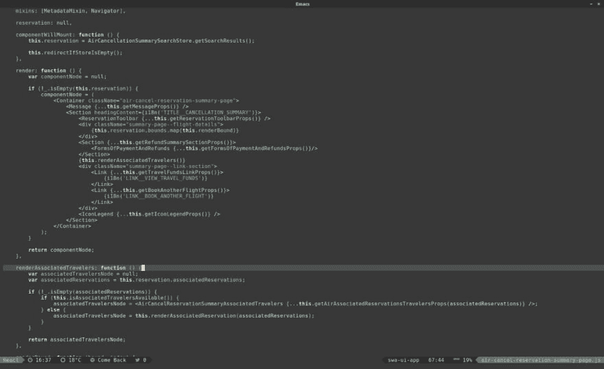
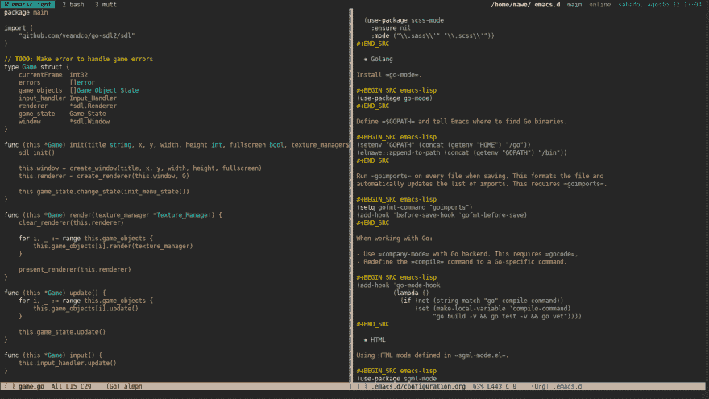

# 我的 Emacs

> 原文：<https://dev.to/elnawe/my-emacs>

我已经用 Emacs 好几个月了。当你进入这个世界时，你会看到很多人说 Emacs 就像一个操作系统，或者设置 Emacs 是一生的任务，这是真的，你实际上永远不会感到无聊。

我当时从一个相当简单的配置开始，用的是 **stock Emacs** (没有 Spacemacs，没有别人的配置)。起初，这看起来很难，但我想要简单的东西，而不是超大过载的 IDE，我可以只用键盘控制，没有太多的干扰，所以我很高兴。

## 我的配置变得识字了

然后我开始添加那些我不想要的东西。为什么？也许因为你可以，而且你可以用代码来做！开始学习 Scheme/Lisp 和 Elisp(这种 Scheme 语言的 Emacs 版本)来创建一堆函数，我看了很多 **EmacsConf** 的视频来寻找新的事情做。我把我所有的配置转移到我现在喜欢的一项技术上:*识字编程*(实际上我正在考虑创建一种专注于这项技术的新编程/脚本语言)

当时，正如我所说的，我添加了许多不需要的功能，尽管看起来很好，但它“超载”了我的 Emacs。这是它的样子(2017/7/5)

[T2】](https://res.cloudinary.com/practicaldev/image/fetch/s--YU_K5-lY--/c_limit%2Cf_auto%2Cfl_progressive%2Cq_auto%2Cw_880/https://thepracticaldev.s3.amazonaws.com/i/u8d2i79bt1c0v0lr77qc.jpeg)

## 回归库存 Emacs

随着时间的推移，我明白了 Emacs *可以是一个 IDE* ，但*它更像一个操作系统*，因为我使用 CLI 程序，Emacs 应该是其中之一。我开始从我的配置中删除不必要的东西，并把包替换成 Elisp 函数(仍在进行中)。我也开始创造自己的低对比度/低干扰主题。

## 结账我的配置

我在任何地方做任何事情都使用 Emacs，所以无论我去哪里，我都需要我的配置。我通过 GitHub 分享我的文件，所以你可以从这里下载我的配置:[https://github.com/elnawe/.emacs.d](https://github.com/elnawe/.emacs.d)。

这是当前状态:

[T2】](https://res.cloudinary.com/practicaldev/image/fetch/s--NQo2Dk3K--/c_limit%2Cf_auto%2Cfl_progressive%2Cq_auto%2Cw_880/https://thepracticaldev.s3.amazonaws.com/i/j1gkgl6bhwxd2yjrk6hi.png)

* * *

PS:我们什么时候会有 dev.to 的 API？我要一个终端客户端！:D