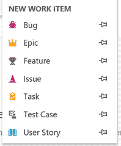
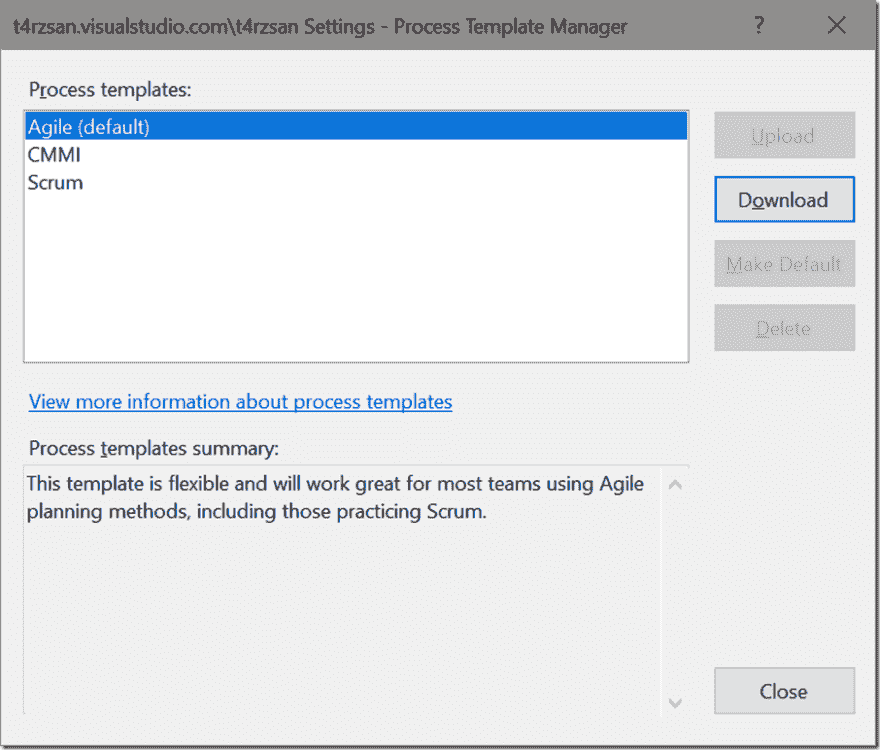

# 更改 Team Foundation Service 上的工作项模板

> 原文：<https://dev.to/t4rzsan/changing-work-item-templates-on-team-foundation-service>

*这篇文章最初出现在我的[个人博客](http://leruplund.dk/2017/08/10/changing-work-item-templates-on-team-foundation-service/)上。*

如果有一件事 Team Foundation Service (TFS)做得非常好，那就是工作项的使用。一个工作项可以是许多不同的东西。例如，它可以是一个 bug、一个任务、一个用户故事、一部史诗或者一个测试用例。它甚至可以是对代码审查的请求。

您可以定义工作项之间的关系和依赖关系，并且您可以将工作项分配给变更集(提交)——这种可能性似乎是无限的。

您可以使用的工作项由您的管理员在创建所谓的团队项目时为您选择的模板决定。

[T2】](http://leruplund.dk/wp-content/uploads/2017/08/image-1.png)

在工作中，自从恐龙在地球上行走以来，我们就一直使用 TFS。那时的 TFS 与今天大不相同，这意味着模板看起来也大不相同。例如，我们团队使用的团队项目模板是基于一些旧的微软基金会框架，只允许 bug 和任务。我不允许我们创建像用户故事或代码审查请求这样的酷东西。

所以我决定升级模板。没有内置的升级方式，所以你必须手动升级。我不是 TFS 专家，但我发现这个过程是

1.  从 TFS 导出工作项模板。
2.  如有必要，编辑模板。
3.  将模板导入 TFS。

听起来很简单，对吧？嗯，这并不难，但有点麻烦。

> 只能在本地 TFS 上更改工作项模板。不要在 Visual Studio Team Services 上尝试这样做(在[visualstudio.com](http://visualstudio.com))。

**导出模板**

工作项模板(WITs)被定义为 XML 文件，所以首先你要从 TFS 中导出你要使用的 XML 文件。导出是通过 Visual Studio 完成的，棘手的是你需要从与你的 TFS 版本相对应的 Visual Studio 版本中完成。因此，在我的例子中，我们是在 TFS 2015 上，所以我需要从 Visual Studio 2015 中导出。

要导出 WITs，请转到菜单 Team –> Team Project Collection Settings –> Process Template manager，在这里您需要决定要升级到哪个模板。如果您想升级到“敏捷”模板，那么您应该下载该模板。

[T2】](http://leruplund.dk/wp-content/uploads/2017/08/image-2.png)

单击“下载”按钮下载 XML 文件。

如果您选择下载“Agile”过程模板，这些文件将被放置在一个名为“Agile”的子文件夹中 WITs 的有趣文件位于“Agile\WorkItem Tracking”下。

如果您看一下“Agile \ work item Tracking \ type definitions”文件夹中的文件，您会看到每个工作项类型都有一个 XML 文件，例如 Bug、UserStory、Task、TestCase、CodePreviewRequest。这些文件定义了工作项的字段和状态。这些是您需要导入到我们的旧团队项目中以将其升级到较新的过程模板的文件。

**导入模板**
对于导入，你需要从命令行使用[witadmin.exe](https://www.visualstudio.com/en-us/docs/work/reference/witadmin/witadmin-customize-and-manage-objects-for-tracking-work)工具。对于 Visual Studio 和 TFS 的正确版本，你必须使用 witadmin.exe。对于 Visual Studio 2015 和 TFS 2015，witadmin.exe 位于

```
%programfiles(x86)%\Microsoft Visual Studio 14.0\Common7\IDE 
```

因此，让我们开始导入工作项模板。不幸的是，我一直无法找到一种方法来一次批量导入所有文件，所以你必须一次导入一个文件。

```
witadmin importwitd /collection:"http://mytfsserver/tfs/MyCollection" /p:"MyTeamProject" /f:"C:\downloadedtemplates\Agile\WorkItem Tracking\TypeDefinitions\Bug.xml"
witadmin importwitd /collection:"http://mytfsserver/tfs/MyCollection" /p:"MyTeamProject" /f:"C:\downloadedtemplates\Agile\WorkItem Tracking\TypeDefinitions\CodeReviewRequest.xml"
witadmin importwitd /collection:"http://mytfsserver/tfs/MyCollection" /p:"MyTeamProject" /f:"C:\downloadedtemplates\Agile\WorkItem Tracking\TypeDefinitions\CodeReviewResponse.xml"
... 
```

尝试导入时，您可能会遇到错误。我遇到了许多重命名错误:

```
TF26177: The field Microsoft.VSTS.Common.BusinessValue cannot be renamed from '
Business Value - Microsoft Visual Studio Scrum 1_0' to 'Business Value'. 
```

如果通过手动编辑 XML 文件来修复错误。在上面的例子中，我在失败的 XML 文件中搜索“商业价值”，并将其更改为“商业价值- Microsoft Visual Studio Scrum 1_0”。进口之后，TFS 的任何地方似乎都无所谓了。

在所有的小聪明都被导入后(没有错误！)最后一步是导入类别。例如，categories.xml 文件定义了哪些工作项可以由用户在 TFS 直接创建，哪些工作项是隐藏的，例如通过 Visual Studio 中的代码审查请求间接创建的代码预览请求。

```
witadmin importcategories /collection:"http://mytfsserver/tfs/MyCollection" /p:"MyTeamProject" /f:"C:\downloadedtemplates\Agile\WorkItem Tracking\Categories.xml" 
```

就是这样！现在，您应该能够从 TFS 内部创建所有漂亮的敏捷工作项，并且您应该能够从 Visual Studio 请求代码审查。