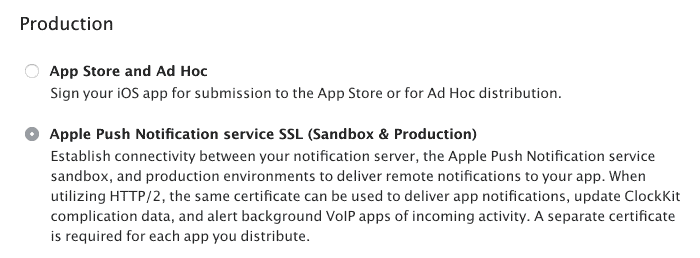
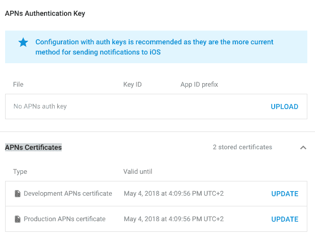

# 使用 Firebase 在 iOS 中推送通知

> 原文:[https://dev . to/on myway 133/push-notification-in-IOs-with-firebase](https://dev.to/onmyway133/push-notification-in-ios-with-firebase)

原帖[https://github.com/onmyway133/blog/issues/64](https://github.com/onmyway133/blog/issues/64)

注意:这适用于 Firebase 4.0.4

## 准备推送通知证书

前往[会员中心](https://developer.apple.com/account/ios/certificate/distribution/create)->-`Certificates`->-`Production`

### 证书

您现在可以对沙盒和生产环境使用一个证书
[](https://res.cloudinary.com/practicaldev/image/fetch/s--poMqeula--/c_limit%2Cf_auto%2Cfl_progressive%2Cq_auto%2Cw_880/https://user-images.githubusercontent.com/2284279/29111626-5617e09c-7ceb-11e7-9f56-c1f9ceab3cd1.png)

### 认证键

*   如果您喜欢使用[认证密钥](https://developer.apple.com/account/ios/authkey/create)，请阅读[提供商认证令牌](https://developer.apple.com/library/content/documentation/NetworkingInternet/Conceptual/RemoteNotificationsPG/CommunicatingwithAPNs.html#//apple_ref/doc/uid/TP40008194-CH11-SW3)

## 配置推送通知

*   进入[火焰基地控制台](https://console.firebase.google.com/)->-`Settings`->-`Project Settings`->-`Cloud Messaging`->-`iOS app configuration`
    *   如果使用证书，两个字段只使用 1 `Apple Push Notification service SSL`
    *   如果您使用认证密钥，请填写`APNS auth key`

[T2】](https://res.cloudinary.com/practicaldev/image/fetch/s--PlAf1GId--/c_limit%2Cf_auto%2Cfl_progressive%2Cq_auto%2Cw_880/https://user-images.githubusercontent.com/2284279/29111784-f0dfcbe4-7ceb-11e7-8aff-db1a50ea3ee5.png)

## 添加 pod

在你的`Podfile`中，声明

```
pod 'Firebase/Core'
pod 'Firebase/Messaging' 
```

<svg width="20px" height="20px" viewBox="0 0 24 24" class="highlight-action crayons-icon highlight-action--fullscreen-on"><title>Enter fullscreen mode</title></svg> <svg width="20px" height="20px" viewBox="0 0 24 24" class="highlight-action crayons-icon highlight-action--fullscreen-off"><title>Exit fullscreen mode</title></svg>

## 禁用应用代理刷机

*   阅读 Firebase 云消息传递中的[方法 swizzling](https://firebase.google.com/docs/cloud-messaging/ios/client)
*   你应该拒绝喝酒。在你的`Info.plist`中这样做

```
<key>FirebaseAppDelegateProxyEnabled</key>
<false/> 
```

<svg width="20px" height="20px" viewBox="0 0 24 24" class="highlight-action crayons-icon highlight-action--fullscreen-on"><title>Enter fullscreen mode</title></svg> <svg width="20px" height="20px" viewBox="0 0 24 24" class="highlight-action crayons-icon highlight-action--fullscreen-off"><title>Exit fullscreen mode</title></svg>

阅读更多关于`Messaging.messaging().apnsToken`

> 此属性用于设置应用程序委托接收的 APNS 令牌。
> FIRMessaging 使用 swizzling 方法来确保自动设置 APNS 令牌。然而，如果你已经通过在你的应用程序的 Info.plist 中将`FirebaseAppDelegateProxyEnabled`设置为`NO`来禁用 swizzling，你应该在你的应用程序委托的-application:didregisterforremotentificationwithdevicetoken:方法中手动设置 APNS 令牌。
> 如果您想设置 APNS 令牌的类型，而不是依赖自动检测，请参见:-setAPNSToken:type:。

## 配置 Firebase

您可以并且应该在代码
中配置 Firebase

```
import Firebase

let options = FirebaseOptions(googleAppID: "", gcmSenderID: "")
options.bundleID = ""
options.apiKey = ""
options.projectID = ""
options.clientID = ""
FirebaseApp.configure(options: options) 
```

<svg width="20px" height="20px" viewBox="0 0 24 24" class="highlight-action crayons-icon highlight-action--fullscreen-on"><title>Enter fullscreen mode</title></svg> <svg width="20px" height="20px" viewBox="0 0 24 24" class="highlight-action crayons-icon highlight-action--fullscreen-off"><title>Exit fullscreen mode</title></svg>

## 处理设备令牌

```
import Firebase

func application(_ application: UIApplication, didRegisterForRemoteNotificationsWithDeviceToken deviceToken: Data) {
  Messaging.messaging().apnsToken = deviceToken
} 
```

<svg width="20px" height="20px" viewBox="0 0 24 24" class="highlight-action crayons-icon highlight-action--fullscreen-on"><title>Enter fullscreen mode</title></svg> <svg width="20px" height="20px" viewBox="0 0 24 24" class="highlight-action crayons-icon highlight-action--fullscreen-off"><title>Exit fullscreen mode</title></svg>

## 获取 FCM 令牌

### 正在检索 FCM 令牌

读取[访问注册令牌](https://firebase.google.com/docs/cloud-messaging/ios/first-message)

> 默认情况下，FCM SDK 会在应用程序初始启动时为客户端应用程序实例生成一个注册令牌。与 APNs 设备令牌类似，此令牌允许您将通知消息定向到该应用程序的特定实例。

```
Messaging.messaging().fcmToken 
```

<svg width="20px" height="20px" viewBox="0 0 24 24" class="highlight-action crayons-icon highlight-action--fullscreen-on"><title>Enter fullscreen mode</title></svg> <svg width="20px" height="20px" viewBox="0 0 24 24" class="highlight-action crayons-icon highlight-action--fullscreen-off"><title>Exit fullscreen mode</title></svg>

### 观察 FCM 令牌变化

阅读[监视器令牌生成](https://firebase.google.com/docs/cloud-messaging/ios/first-message#access_the_registration_token)T2】

```
Messaging.messaging().delegate = self

// MARK: - MessagingDelegate

func messaging(_ messaging: Messaging, didRefreshRegistrationToken fcmToken: String) {
  print(fcmToken)
} 
```

<svg width="20px" height="20px" viewBox="0 0 24 24" class="highlight-action crayons-icon highlight-action--fullscreen-on"><title>Enter fullscreen mode</title></svg> <svg width="20px" height="20px" viewBox="0 0 24 24" class="highlight-action crayons-icon highlight-action--fullscreen-off"><title>Exit fullscreen mode</title></svg>