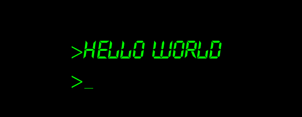

# 你好世界形

> 原文:[https://dev.to/dev3l/the-hello-world-kata](https://dev.to/dev3l/the-hello-world-kata)

[T2】](https://res.cloudinary.com/practicaldev/image/fetch/s--Y4nS2bX---/c_limit%2Cf_auto%2Cfl_progressive%2Cq_66%2Cw_880/https://thepracticaldev.s3.amazonaws.com/i/xubivkzqchmwo0h122kw.gif)

#### Hello World via 测试驱动开发(TDD)

选择一种编程语言(也许是你主要在工作中使用的语言)...表演这个形有多难/简单？

我创建了一个 hello world python kata 模板:[Hello World Kata](https://github.com/DEV3L/python_katas/tree/master/kata_template/hello_world)
[](https://res.cloudinary.com/practicaldev/image/fetch/s--VQYhaVIc--/c_limit%2Cf_auto%2Cfl_progressive%2Cq_auto%2Cw_880/https://thepracticaldev.s3.amazonaws.com/i/7twfnvgp6vtdtntah9dt.png)

如果你已经熟悉 TDD、单元测试和/或嘲讽，那么这看起来是一个荒谬的练习。然而，这个小程序足以锻炼 TDD 加触摸单元测试和嘲弄的每个规则。这些是 TDD 的根本基础！

这篇文章的目的是定义，然后通过这个形的一个解决方案。

# 描述

### 预期行为

创建一个程序，向控制台输出“hello world”。

### 约束

[鲍勃大叔描述的 TDD 三大法则](http://butunclebob.com/ArticleS.UncleBob.TheThreeRulesOfTdd)

*   除非是为了通过失败的单元测试，否则不允许编写任何产品代码。
*   不允许编写任何超过足以导致失败的单元测试；编译失败就是失败。
*   除了足以通过一个失败的单元测试之外，您不允许编写更多的产品代码。

# 解(Python3)

1: [添加测试以断言 hello_world 文件存在](https://github.com/DEV3L/python_katas/commit/b615a5e9e175f175cbdec53b8601cfd163b73a72)

首先创建一个测试文件 **hello_world_test.py** 。使用 import 语句只断言文件退出。**第一+第二 TDD 规则**

```
import hello_world 
```

<svg width="20px" height="20px" viewBox="0 0 24 24" class="highlight-action crayons-icon highlight-action--fullscreen-on"><title>Enter fullscreen mode</title></svg> <svg width="20px" height="20px" viewBox="0 0 24 24" class="highlight-action crayons-icon highlight-action--fullscreen-off"><title>Exit fullscreen mode</title></svg>

> *测试失败* - ModuleNotFoundError:没有名为“hello_world”的模块

2: [添加 hello_world.py 文件](https://github.com/DEV3L/python_katas/commit/b1c1275eb685368b86d9a3a9fa611ed6c03d0e45)

将 **hello_world.py** 创建为空文件。**第一+第三 TDD 规则**

```
# no code, just a new file 
```

<svg width="20px" height="20px" viewBox="0 0 24 24" class="highlight-action crayons-icon highlight-action--fullscreen-on"><title>Enter fullscreen mode</title></svg> <svg width="20px" height="20px" viewBox="0 0 24 24" class="highlight-action crayons-icon highlight-action--fullscreen-off"><title>Exit fullscreen mode</title></svg>

> *测试通过*

3: [添加模拟内置的失败测试. print](https://github.com/DEV3L/python_katas/commit/5b592e54220b85518867e43de6ca3e05ea5043c1)

当‘print’函数被调用时，Python 内建的 print 被调用。更新测试到**模拟**这个内置...**第二 TDD 规则**T4】

```
from unittest.mock import patch

@patch('builtins.print')
def test_hello_world(mock_print):
    import hello_world
    mock_print.assert_called_with('hello world') 
```

<svg width="20px" height="20px" viewBox="0 0 24 24" class="highlight-action crayons-icon highlight-action--fullscreen-on"><title>Enter fullscreen mode</title></svg> <svg width="20px" height="20px" viewBox="0 0 24 24" class="highlight-action crayons-icon highlight-action--fullscreen-off"><title>Exit fullscreen mode</title></svg>

> *测试失败*:断言错误:预期调用:打印(“hello world”)

4: [打印 hello world](https://github.com/DEV3L/python_katas/commit/092ebd2408ac7f000ed097806f4806361bc4def2)

写特征码！！！

```
print('hello world') 
```

<svg width="20px" height="20px" viewBox="0 0 24 24" class="highlight-action crayons-icon highlight-action--fullscreen-on"><title>Enter fullscreen mode</title></svg> <svg width="20px" height="20px" viewBox="0 0 24 24" class="highlight-action crayons-icon highlight-action--fullscreen-off"><title>Exit fullscreen mode</title></svg>

> *测试通过*

5:盈利！(完成)

# 思想

Hello world 是大多数软件工程师学习任何新语言的起点。在 Python 中，它只是“打印(‘hello world’)”。

然而，一行特性代码就足以揭示 TDD 的基本原理！

测试驱动开发是一种编程方法，只需几分钟就能学会，但要精通却是一辈子的事情...

[关于 TDD 电阻](http://butunclebob.com/ArticleS.UncleBob.TheThreeRulesOfTdd):

> 现在大多数程序员，当他们第一次听说这种技术时，会想:“这太蠢了！”“这会让我慢下来，浪费时间和精力，让我无法思考，无法设计，只会打断我的流程。”然而，想想如果你走进一个满是以这种方式工作的人的房间会发生什么。在任意时间选择任意一个人。一分钟前，他们所有的代码都工作正常。