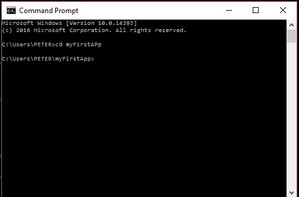
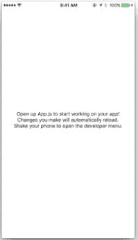

# React Native 入门

> 原文:[https://dev.to/taiwo_xyz/getting-started-with-react-native](https://dev.to/taiwo_xyz/getting-started-with-react-native)

你好，欢迎再次光临。今天，我将谈论 React Native。
很可能你们中的一些人曾经和这个人一起工作过，有些人甚至不知道什么是 React Native。放心吧。这是你可以完美处理的事情。

React Native 只是一个 JavaScript 框架，用于一次性构建原生移动应用。想象一下，你要为一个客户开发一个 android 应用和一个 IOS 应用。你可能是一个懂 JAVA 和 Swift 的人，或者是两者之一。这意味着你可能不得不外包或找人来帮助你学习你可能不熟悉的语言。我说的本地人，就是本地人。

React Native 可以帮助您构建应用程序，没有人会告诉您没有使用 JAVA、Swift 或 Objective C 之类的自定义本地语言，React Native 会给您带来额外的感受。使用 React native 有许许多多的好处。

*   React native 是一个开源框架
*   对 JavaScript 的本地运行做出反应。这意味着，即使是为您编写 JavaScript 的 web 开发人员，也可以在一夜之间成为移动开发人员，而不必去学习一门新语言。这不是很棒吗？要开始使用 React Native，您需要的只是对 JavaScript ES6 的基本理解。

老实说，安装一些功能或工具可能会很麻烦。你开始想知道为什么我们不能仅仅使用次于次的 GUI 类型的安装，为什么有时我们必须使用命令行之类的东西。我也有那个想法。要开始使用 React Native，您可能不需要通过一些严格的步骤来运行您的工作区。本文针对 React Native 入门的基础或新手安装。

创建 React 原生应用是开始构建新 React 原生应用的最简单方法。它允许您启动一个项目，而无需安装或配置任何工具来构建本机代码——不需要安装 Xcode 或 Android Studio。

## 第一步:安装节点。

幸运的是，Node 有一个 GUI 安装，所以你不必对你的命令行做什么，而必须开始写一些你可能不理解或者看起来有点混乱的行。你可以从`nodejs.org/en/download/`获得安装包

那里有一个 Windows 和 Mac 的下载文件。

## 第二步:安装 Create React 原生 App

此时，您需要使用命令行。不要害怕。你只写了一行。打开你的命令提示符或终端，输入

```
npm install -g create-react-native-app
npm stands for Node package manager. 
-g stands for global. 
```

[T2】](https://res.cloudinary.com/practicaldev/image/fetch/s--QZOnGbeG--/c_limit%2Cf_auto%2Cfl_progressive%2Cq_auto%2Cw_880/https://thepracticaldev.s3.amazonaws.com/i/2cvhsqohh6tqy3cysqee.JPG)

这就是你的终端应该看起来的样子。输入后按回车键。完成后，输入

```
create-react-native-app myFirstProject 
```

输入后按回车键。这需要一段时间才能完成。注意:myFirstProject 可以是您想给项目或应用程序起的任何名字。
完成后，您就可以开始部署了。

将目录更改到 React 本机应用程序的安装位置。从上面的片段来看，我的文件夹应该在 Peter 里面。因此，您需要做的就是找到保存所有应用程序文件的文件夹。这可以使用如下所示的更改目录命令来完成。

键入 cd myFirstProject，然后按 enter 键。

[T2】](https://res.cloudinary.com/practicaldev/image/fetch/s--VHRZvfEI--/c_limit%2Cf_auto%2Cfl_progressive%2Cq_auto%2Cw_880/https://thepracticaldev.s3.amazonaws.com/i/317x7khvsbo441vas71h.JPG)

键入`npm start`并按回车键。

这将为您启动一个开发服务器，并在您的终端中打印一个 QR 码。

## 第三步:运行您的应用程序。

从支持 Apple 的设备访问您的应用商店，或者从 Android 设备访问 Google play 商店。

搜索世博。下载并安装。

确保您的手机与电脑在同一个网络上。

打开应用程序并选择扫描代码。

在您的命令提示符或终端中，您的代码应该会在您编写 npm start 时显示。用手机扫描二维码。

Tadaaa..您现在已经完成了 React 应用程序的设置。

要修改您的应用程序，请在您的文件夹或目录中找到 App.js 文件，并使用您喜欢的文本编辑器打开它。对文本部分做一些小的修改，然后保存您的文档。立即注意到手机上的变化。

如果你没有立即注意到任何变化，摇动你的手机打开开发者菜单。

当菜单打开时，选择启用热重装。

一旦对您的源代码进行了任何更改，您的移动应用程序现在应该会立即重新加载。

[T2】](https://res.cloudinary.com/practicaldev/image/fetch/s--YcUwRTJU--/c_limit%2Cf_auto%2Cfl_progressive%2Cq_auto%2Cw_880/https://thepracticaldev.s3.amazonaws.com/i/piq9h5vn57vramqc8558.JPG)

注意:Create React Native App 使得在物理设备上运行 React Native App 变得非常容易，而无需设置开发环境。如果你想在 iOS 模拟器或 Android 虚拟设备上运行你的应用，你必须学习如何安装 Xcode 和设置你的 Android 开发环境。我将在下一篇文章中给出一步一步的方法。设置完成后，您可以在 Android 虚拟设备上运行 npm run android 来启动您的应用，或者在 iOS 模拟器上运行 npm run ios(仅限 macOS)来启动您的应用。

快乐编码..一会儿见…