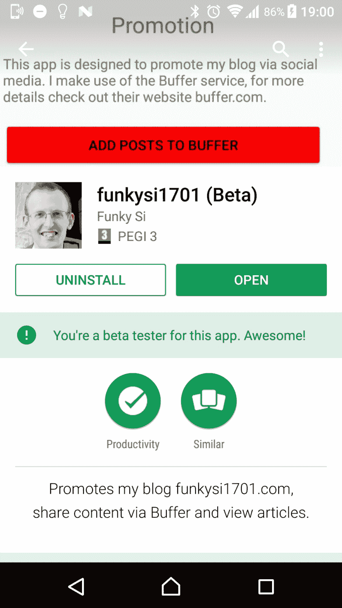

# Android 应用程序开发和 Visual Studio 移动中心

> 原文：<https://dev.to/funkysi1701/android-app-development-and-the-visual-studio-mobile-centre-2o2>

在过去一周左右的时间里，我一直在玩 Xamarin，并创建了一个 android 应用程序。

我现在在谷歌 Play 商店有一个应用程序。看看 https://play.google.com/store/apps/dev?id=6148298088834956775 。【T2

在你匆忙下载应用程序之前，我必须提醒你，它还没做多少事。它显示了我的网站上的一些内容，还有一些允许内容共享的链接。我有一些想法来显示我的博客内容，并允许分享。我也有一些关于应用程序的其他想法，可能对我以外的人有用。如果你有想法或功能要求，请告诉我。

好的，我是如何创建这个应用程序并把它放入应用程序商店的呢？

Xamarin 现在是 Visual Studio 的一部分，所以第一步是将所有 Xamarin 功能安装到 Visual Studio 中，并构建一个应用程序。

接下来，我想监控我的应用程序。现在我知道 Application Insights 不支持应用程序，那么有什么工具呢？我听说过 HockeyApp ，但是它们正在被 T2 的 Visual Studio 移动中心所取代。

将我的应用程序连接到 Visual Studio 移动中心相对容易。首先安装所需的 nuget 包。然后将 using 语句和下面一行添加到 MainActivity.cs 文件中(这些说明可在移动中心获得)

`using Microsoft.Azure.Mobile;
using Microsoft.Azure.Mobile.Analytics;
using Microsoft.Azure.Mobile.Crashes;
using Microsoft.Azure.Mobile.Distribute;
using Microsoft.Azure.Mobile.Push;`

`MobileCenter.Start("[Unique ID]",typeof(Analytics), typeof(Crashes), typeof(Distribute), typeof(Push));`

现在，您可以将移动中心连接到您的源代码(在我的例子中是 VSTS ),并让它为每次提交运行一次构建。

构建的一个复杂性是您需要提供一个密钥库文件(基本上是一个对您的应用程序进行数字签名的证书)。我发现最好的方法是使用 Visual Studio 来创建文件。

在 VS2017 中，工具菜单下有一个名为归档管理器的选项。在这里，单击“分发”按钮并选择“临时”。在“签名身份”部分，您可以创建一个密钥库文件。输入一些细节，就会在 AppData \ Local \ xa marin \ Mono for Android \ keystore[Keystore name][Keystore name . Keystore]中创建一个 Keystore 文件

一旦将密钥库文件添加到构建中，就可以启用 distribute 选项。现在，每次构建后，您都会收到一封电子邮件，其中包含安装应用程序的链接。您也可以启用一个构建状态图标，如  。

每次你的应用程序崩溃时，详细信息将记录在崩溃部分，供你探索和解决问题。

分析部分可让您了解应用程序的使用情况。您还可以添加分析。TrackEvent("Feature X ")来衡量不同特性的使用情况。

你可以做更多的事情，我将在另一个时间探索更多，以及如何让你的应用程序进入谷歌 Play 商店。