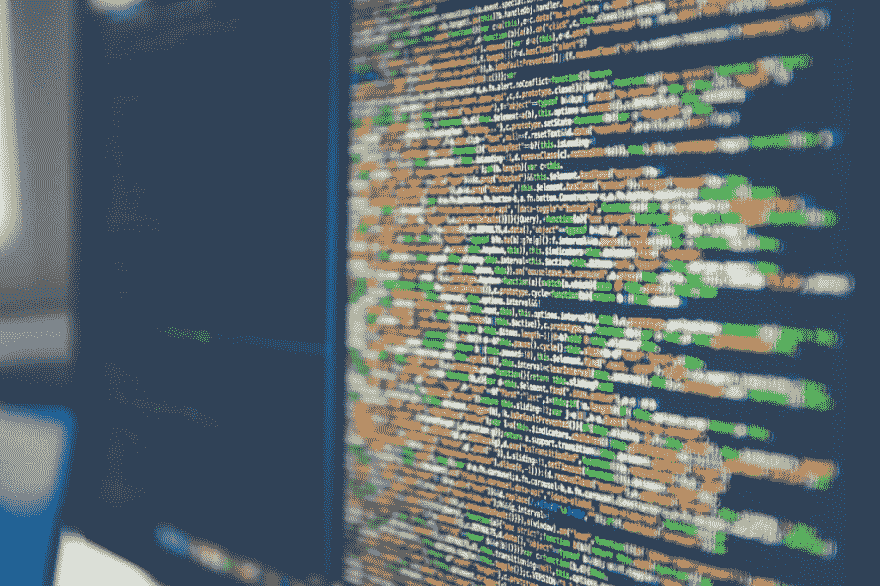

# Laravel 5.4 中的冒险——土地视图管理

> 原文：<https://dev.to/elvispt/adventures-in-laravel-54-land--view-management-2k8o>

[T2】](https://res.cloudinary.com/practicaldev/image/fetch/s--KSgfdC3r--/c_limit%2Cf_auto%2Cfl_progressive%2Cq_auto%2Cw_880/https://cdn-images-1.medium.com/max/1024/1%2AolJUeL2ziDvUPnXBBbPCYA.jpeg)

*更新:这在 Laravel 5.5 中也能正常工作*

最近开始和 Laravel (5.4)一起工作，到目前为止，和它一起工作很愉快。

我遇到的第一个障碍是如何组织视图/模板。

### 页面模板

我走上了简单的道路，遵循以下规则:

1.  抓取控制器名称，排除*控制器名称的*部分，把它改成小写。这样我们就有了一个文件夹来存放控制器使用的模板。比如:*Home controller*>Home>Home。
2.  让我们假设我们在 HomeController 中创建了一个方法，它的工作是加载一个通用的关于我们的页面。所以我们创建了方法 **aboutUs** 并调用相关视图。view 叫什么？就叫它 **about-us** ，意思是一个路径**/resources/views/home/about-us . blade . PHP**。
3.  默认的控制器方法有一个特殊的名字， *__invoke* ，因为我不想有一个名为【invoke.blade.php】T2 的视图，所以我决定只使用控制器的相同名字。所以现在我们有一个名为 **home** 的文件夹和一个名为**home.blade.php**的文件。基于这些规则，我们可以立即高度肯定地假设视图**home.blade.php**在*home controller::_ _ invoke*中被调用。

### 偏音呢？

片段是在不止一个页面/视图中重用的代码块，所以我需要一套规则来创建它们，这样它们存在的位置才有意义，并给出了如何使用它们的想法。这些规则假设你遵循了之前制定的规则。

1.  当 partial 仅在单个控制器的视图中使用时，在控制器视图文件夹中创建一个名为 **partials** 的文件夹。把你的指纹放进去。例如:**/资源/视图/主页/部分/示例-部分. blade.php** 。
2.  当分部由不同的控制器使用时，将它们放在视图文件夹中的**分部文件夹**中，与控制器视图文件夹在同一层。例如:**/资源/视图/部分/示例-部分. blade.php** 。

### Layouts

我看不出改变布局文件(**/resources/views/layouts/master . blade . PHP)位置的理由。**

我肯定会有这些规则不能应用的边缘情况，但是我希望这些规则将这些情况减到最少，而不是有混乱的视图文件，这使得很难确定它的预期用途。

* * *