# 学习反应-第 4 周

> 原文:[https://dev.to/stefdotninja/learning-react-第四周](https://dev.to/stefdotninja/learning-react---week-4)

本文原载于 [stef.ninja](https://stef.ninja/learning-react-week-4/) 。

这是我的[博客驱动学习](https://dev.to/tamrrat/blogging-driven-learning)探索[反应](https://facebook.github.io/react/)的最后一篇文章。我一直在学习来自 [Wes Bos](https://twitter.com/wesbos) 的 [React for 初学者](https://reactforbeginners.com/)课程，并记录我从每堂课中学到的东西。

这是一门很棒的课程，我强烈推荐给任何想学习 React 的人。

你可以在系列的[第一周](https://dev.to/learning-react-week-1/)、[第二周](https://dev.to/learning-react-week-2/)和[第三周](https://dev.to/learning-react-week-3/)找到更多的音符。

* * *

### 第 22 天:制作 React 组件动画

动画是给我们的网页注入动感的一种有趣的方式。这可以通过传统的 css 方法(如下面的 GIF)或一些更具互动性的 React 动画来完成，我们将进一步探讨。

[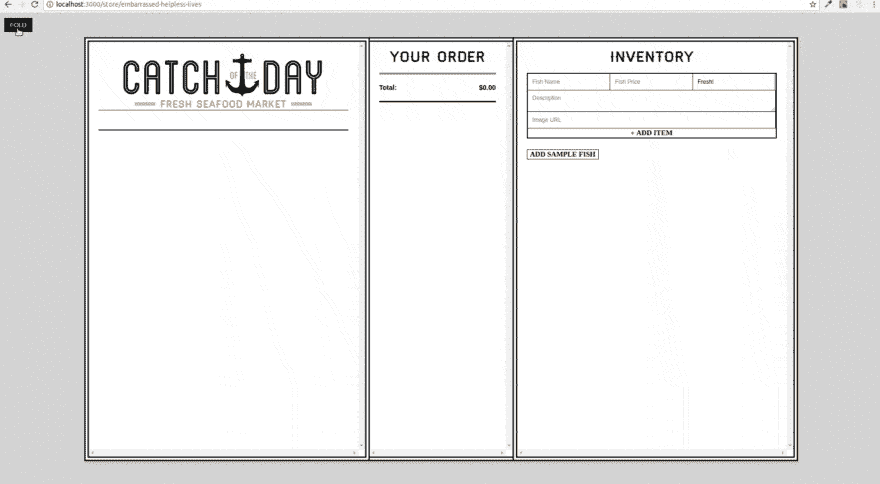T2】](https://res.cloudinary.com/practicaldev/image/fetch/s--GhlC7CIf--/c_limit%2Cf_auto%2Cfl_progressive%2Cq_66%2Cw_880/https://s3-ap-southeast-2.amazonaws.com/ghost-blog-stef-ninja/2017/07/css_animation-1500949974188.gif)

###### NPM 脚本& CSS 预处理程序

今天的课程涉及了一些新概念，包括使用 [styl](https://github.com/tj/styl) 作为 CSS 预处理器。我们还探讨了如何将它集成到 npm 脚本中，以便在开发期间实现热重装。

使用`package.json`中的 npm 脚本，我们能够在终端中调用`$ npm run watch`。然后它会同时运行`start` & `styles:watch`。如果其中一个坏了，另一个就会被杀死，并在终端显示错误。这使得开发变得非常容易。

这是 npm 脚本此时的样子:

[T2】](https://res.cloudinary.com/practicaldev/image/fetch/s--29NNMnRY--/c_limit%2Cf_auto%2Cfl_progressive%2Cq_auto%2Cw_880/https://s3-ap-southeast-2.amazonaws.com/ghost-blog-stef-ninja/2017/07/webpack_scripts-1500949986757.png)

注意:在我们工作的开发环境中，我们不使用外部 CSS 或 CSS 预处理程序，因为我们选择了[风格的组件](https://github.com/styled-components/styled-components)(我在[第 4 天](https://stef.ninja/learning-react-week-1/)中对此进行了更多的讨论)。

###### 动画

既然我们已经选择了样式选项，我们可以开始制作 React 组件的动画了。

我们今天的目标是通过一些微妙的动作让我们的订单充满活力:

*   当一条新的鱼被添加到顺序中时，它应该是活跃的。
*   当一条鱼从订单中删除时，它应该会显示出来。
*   当一条鱼的磅数增加时，这个数字就会活跃起来。

这些只是小动作，我们将做大量的工作来实现它们，但他们给网站的抛光是一个很好的触摸。

我们需要做的第一步是打开我们的 HTML 来包含我们可以为我们的动画挂钩的类。您可以使用 CSSTransitionGroup 来实现这一点。

我们将`ul`组件改为`CSSTransitionGroup`组件。代码看起来是这样的:

[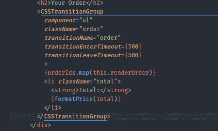T2】](https://res.cloudinary.com/practicaldev/image/fetch/s--kj43bUR8--/c_limit%2Cf_auto%2Cfl_progressive%2Cq_auto%2Cw_880/https://s3-ap-southeast-2.amazonaws.com/ghost-blog-stef-ninja/2017/07/csstransitiongroup-1500950054510.png)

注意:通过添加`component="ul"`,这告诉 React 我们希望组件在 HTML 中呈现一个无序列表组件，但在 React 中将它作为 ReactCSSTransitionGroup 来维护。

组件的附加属性控制 HTML 组件的临时类。您可以通过开发人员工具看到这些类是如何显示的:

[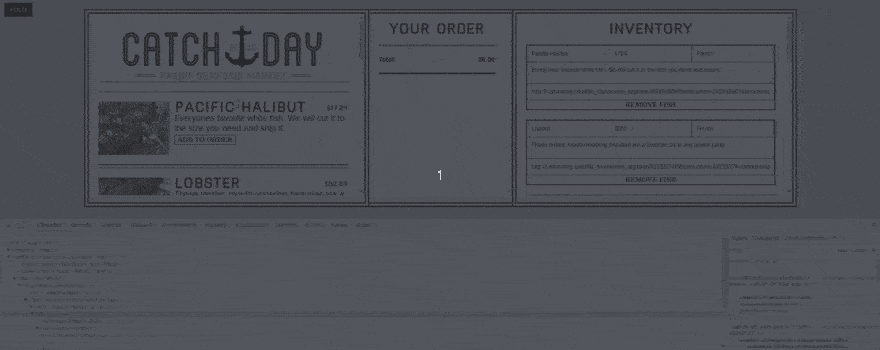T2】](https://res.cloudinary.com/practicaldev/image/fetch/s--htwrwG0U--/c_limit%2Cf_auto%2Cfl_progressive%2Cq_66%2Cw_880/https://s3-ap-southeast-2.amazonaws.com/ghost-blog-stef-ninja/2017/07/CSSTransitionGroup-1500950070552.gif)

这些临时类可以通过 CSS 连接进来。我们能够使用 [CSS 转换](https://developer.mozilla.org/en-US/docs/Web/CSS/CSS_Transitions/Using_CSS_transitions)，因为我们可以引用一个初始状态(类`order-enter` / `order-leave`)和一个最终状态(类`order-enter-active` / `order-leave-active`)。

这些可以这样设计:

[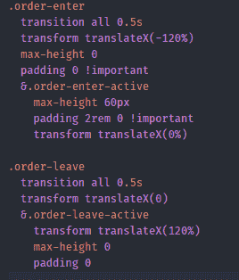T2】](https://res.cloudinary.com/practicaldev/image/fetch/s--m3_g0Xzg--/c_limit%2Cf_auto%2Cfl_progressive%2Cq_auto%2Cw_880/https://s3-ap-southeast-2.amazonaws.com/ghost-blog-stef-ninja/2017/07/styles-1500950094516.png)

**注:`.styl`文件**中缺少`{}, : or ;`

这会渲染出看起来很棒的动画:

[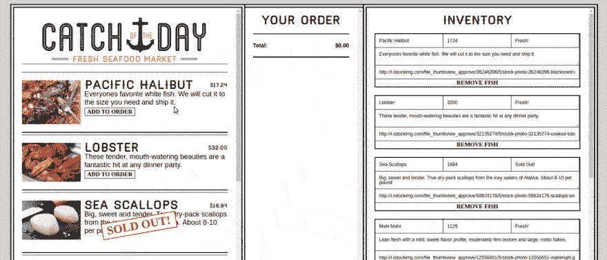T2】](https://res.cloudinary.com/practicaldev/image/fetch/s--VYfKW7ir--/c_limit%2Cf_auto%2Cfl_progressive%2Cq_66%2Cw_880/https://s3-ap-southeast-2.amazonaws.com/ghost-blog-stef-ninja/2017/07/animations_first_step-1500950104227.gif)

今天课程的最后一个任务是动画演示订单中每条鱼的磅数。我们瞄准的动画看起来像是以前的数字被新的数字推出来了。这需要一个元素的副本，这样我们就可以将元素的“旧”版本动画化，同时将元素的“新”版本动画化。

这种动画风格要求我们复制`{count}`跨度。为此，我们将添加一个值为`{count}`的`key`属性，并将`{count}`包装在一个`CSSTransitionGroup`和附加的`span`中。代码如下所示:

[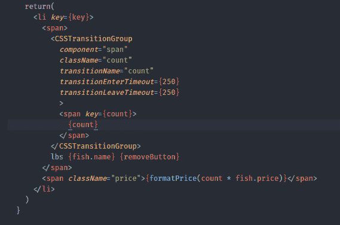T2】](https://res.cloudinary.com/practicaldev/image/fetch/s--0cqGMqIo--/c_limit%2Cf_auto%2Cfl_progressive%2Cq_auto%2Cw_880/https://s3-ap-southeast-2.amazonaws.com/ghost-blog-stef-ninja/2017/07/count_span-1500950117834.png)

这导致创建了两个 spanss 一个带有更新的`{count}`和`order-enter-active`类的新 span 和原来的`{count}`,后者现在有了一个`order-leave-active`类。

[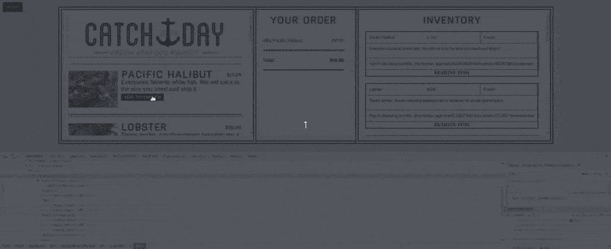T2】](https://res.cloudinary.com/practicaldev/image/fetch/s--94BFn3Qv--/c_limit%2Cf_auto%2Cfl_progressive%2Cq_66%2Cw_880/https://s3-ap-southeast-2.amazonaws.com/ghost-blog-stef-ninja/2017/07/count_csstransitiongroup-1500950133063.gif)

现在剩下的就是添加动画样式了:

[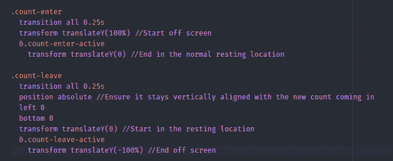T2】](https://res.cloudinary.com/practicaldev/image/fetch/s--loc9QDyc--/c_limit%2Cf_auto%2Cfl_progressive%2Cq_auto%2Cw_880/https://s3-ap-southeast-2.amazonaws.com/ghost-blog-stef-ninja/2017/07/count_animation_styles-1500950148468.png)

###### 做:

*   将 CssTransitionGroup 从“react-addons-CSS-transition-group”导入到`Order.js`
*   将`ul`修改为`CSSTransitionGroup` &添加所需属性。
*   将`{count}`修改为包含在`CSSTransitionGroup` &中，将属性`key`设置为`{count}`(这样我们就有了唯一的引用)。
*   在`_animations.styl`文档中使用 CSS 转场添加动画。

###### 今天的应用程序看起来像:

[T2】](https://res.cloudinary.com/practicaldev/image/fetch/s--hoKtgwz9--/c_limit%2Cf_auto%2Cfl_progressive%2Cq_66%2Cw_880/https://s3-ap-southeast-2.amazonaws.com/ghost-blog-stef-ninja/2017/07/day22_animations-1500950157836.gif)

*【视频 React 组件动画】*

### 第 23 天:胜利的 PropTypes

什么是 PropTypes？它们是确认器，确保进入组件的数据是有效的。

今天的课程讲述了在应用程序的每个组件中插入 PropType 验证。我们使用了`React.PropType`来做这件事，你可以在这里阅读更多关于[的内容。](https://facebook.github.io/react/docs/typechecking-with-proptypes.html)

从 React v15.5 开始，我们应该使用`prop-types`库而不是`React.PropTypes`。这远离了从主`React`对象访问`PropTypes`，这在 React v15.5 中似乎是一个常见的移动。阅读更多关于从 React 迁移[的信息。这里的 PropTypes】。](https://facebook.github.io/react/blog/2017/04/07/react-v15.5.0.html#migrating-from-react.proptypes)

###### 做:

*   向所有组件添加 proptype 验证器。

###### 今天的应用程序看起来像:

[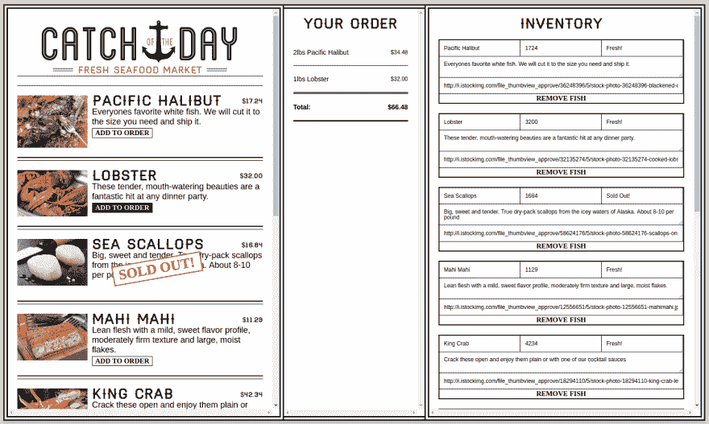T2】](https://res.cloudinary.com/practicaldev/image/fetch/s--kX-HiyQO--/c_limit%2Cf_auto%2Cfl_progressive%2Cq_auto%2Cw_880/https://s3-ap-southeast-2.amazonaws.com/ghost-blog-stef-ninja/2017/07/day23-1501456288496.png)

*注意:在今天的课程中没有任何视觉上的变化。*

*【视频 23:用 PropTypes 验证组件】*

### 第 24 天:用 Firebase 认证

目前，所有访问者都可以编辑数据库和状态。这种级别的认证和安全性对于生产级别的应用程序来说太低了，所以我们真的需要重新控制它。

为此，我们将创建一个应用程序，要求您登录 GitHub、脸书或 Twitter，然后才能编辑商店的库存。第一个登录该商店的人将被保存为该商店的所有者(这不是一个超级实用的真实世界工作流，但对于今天的目的来说已经足够了)。这种认证将全部在客户端完成，后端由 Firebase 处理。

所有敏感的 API 秘密和客户端 id 将直接进入 Firebase，而不是我们面向客户端的应用程序。这增加了一个我们甚至不需要考虑的安全级别。

###### 使用 Firebase 进行登录认证

韦斯让这看起来超级简单。他遵循以下步骤:

1.  使用脸书登录创建一个脸书应用程序。
2.  创建一个在 Firebase 上启用脸书的“登录方法”。
3.  将“OAuth 重定向 URI”从 Firebase 选项卡复制到脸书应用程序设置中。
4.  在脸书应用设置中启用“嵌入式浏览器 OAuth 登录”。保存更改。
5.  将“应用 ID”和“应用密码”复制到 Firebase 脸书认证设置中。

你可以对所有的登录提供者(电子邮件/密码、谷歌、[脸书](https://developers.facebook.com/apps)、[推特](https://apps.twitter.com)、 [GitHub](https://github.com/settings/applications/new) )进行类似的处理。

**连接到 Firebase**

通过我们导入的 rebase 包，连接到 Firebase 非常简单。我们只需要在组件的顶部`Import base from '../base';`，现在我们就可以连接到 Firebase 了。

这一课似乎讲述了一种过时的连接 Firebase.com 的方法。新的 Firebase 控制台和 3.x SDKs 要求不同的方法。我将探索连接到 Firebase.com 使用的方法，韦斯使用，然后也是新的和更新的方法。我需要研究如何“Rebase”与新的和旧的方法。你可以从 Firebase.com 了解更多关于[升级你的 Web / Node.js 应用的信息。](https://firebase.google.com/support/guides/firebase-web)

通过 OAuth 进行认证的 Firebase.com 方法是:

```
ref.authWithOAuthPopup("twitter", function(error, authData) {
  if (error) {
    // An error occurred
    console.error(error);
  } else {
    // User signed in!
    var uid = authData.uid;
  }
}); 
```

<svg width="20px" height="20px" viewBox="0 0 24 24" class="highlight-action crayons-icon highlight-action--fullscreen-on"><title>Enter fullscreen mode</title></svg> <svg width="20px" height="20px" viewBox="0 0 24 24" class="highlight-action crayons-icon highlight-action--fullscreen-off"><title>Exit fullscreen mode</title></svg>

这可以与位于`firebase.auth()`服务之后的新的 Firebase 认证功能相比较。在这次转变中，有许多方法被重命名，您使用 OAuth 验证用户的方式就是其中之一:

```
var auth = firebase.auth();

var provider = new firebase.auth.TwitterAuthProvider();
auth.signInWithPopup(provider).then(function(result) {
  // User signed in!
  var uid = result.user.uid;
}).catch(function(error) {
  // An error occurred
}); 
```

<svg width="20px" height="20px" viewBox="0 0 24 24" class="highlight-action crayons-icon highlight-action--fullscreen-on"><title>Enter fullscreen mode</title></svg> <svg width="20px" height="20px" viewBox="0 0 24 24" class="highlight-action crayons-icon highlight-action--fullscreen-off"><title>Exit fullscreen mode</title></svg>

**保护消防基地**

在前面的课程中，我们打开了 Firebase 数据库的安全规则。这有助于简化开发。既然我们已经接近生产发布，我们需要马上关闭这些。Wes 在`security-rules.json`中为此提供了示例规则:

这些规则不允许知道 Firebase 语法的人以破坏性的方式编辑它。因此，第一条规则不允许任何人删除当前存在的数据，但允许读取所有数据。第二条规则只允许店主编辑已经存在的数据。

```
{
  "rules": {
    // won't let people delete an existing room
    ".write": "!data.exists()",
    ".read": true,
    "$room" : {
      // only the store owner can edit the data
      ".write" : "auth != null && (!data.exists() || data.child('owner').val() === auth.uid)",
      ".read" : true
      }
  }
} 
```

<svg width="20px" height="20px" viewBox="0 0 24 24" class="highlight-action crayons-icon highlight-action--fullscreen-on"><title>Enter fullscreen mode</title></svg> <svg width="20px" height="20px" viewBox="0 0 24 24" class="highlight-action crayons-icon highlight-action--fullscreen-off"><title>Exit fullscreen mode</title></svg>

###### 做:

*   在 Firebase 的`Auth`部分创建 GitHub、Twitter 和脸书注册方法。
*   创建一个方法来呈现`Inventory`组件中的登录按钮。
*   将一个条件语句放入`Inventory`呈现方法中。
    *   检查用户是否登录。如果没有，返回`renderLogin`方法。
    *   检查他们是否是当前商店的所有者。如果不是，返回一个“对不起，你不是所有者”和“注销”按钮。
    *   如果他们通过了这两项检查，用户必须登录&当前商店的所有者。因此，我们将保留默认回报。
*   将`uid` & `owner`的默认状态设置为`null`(在构造函数方法中)。
*   创建并绑定一个接受`provider`的`authenticate`方法。导入 base(连接到 Firebase)。使用`base.AuthWithOAuthPopup`方法。
*   创建并绑定一个处理错误的`authHandler`方法&从 Firebase 返回用户信息负载。在状态中存储用户信息。
*   通过道具将`App`上的`storeID`传递给`Inventory`。
*   从 Firebase 获取商店信息。
*   检查商店是否设置了所有者，如果没有，将当前用户设置为所有者。
*   挂钩到`componentDidMount`生命周期方法，并检查是否存在一个经过身份验证的用户。如果是，调用`authHandler`方法。
*   挂上`Log Out`按钮。
*   提高 Firebase 中数据库规则的安全性。

###### 今天的应用程序看起来像:

[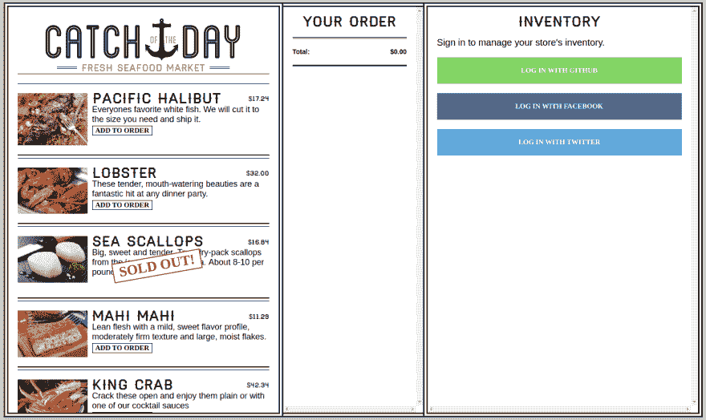T2】](https://res.cloudinary.com/practicaldev/image/fetch/s--fObHM980--/c_limit%2Cf_auto%2Cfl_progressive%2Cq_auto%2Cw_880/https://s3-ap-southeast-2.amazonaws.com/ghost-blog-stef-ninja/2017/07/day24-1501467423406.png)

这将是我上传的最后一张详细介绍应用程序进度的图片，因为最后一课是关于部署的(没有视觉变化)。

*【视频 24:认证】*

### 第 25 天:建立生产反应

`create-react-app`有一个构建步骤。就像在终端中运行命令`npm run build`一样简单。这个过程会导出我们在生产中运行应用程序所需的所有文件。这包括缩小 JS 和 CSS 文件，并为我们的 JS 和 CSS 创建源映射。通过引用编写代码的 JS 或 CSS 文件，而不是编译后的代码行，这些源代码映射将使调试我们的应用程序变得 100%容易。

它还概述了如何在本地和远程服务器上上传和运行它。

[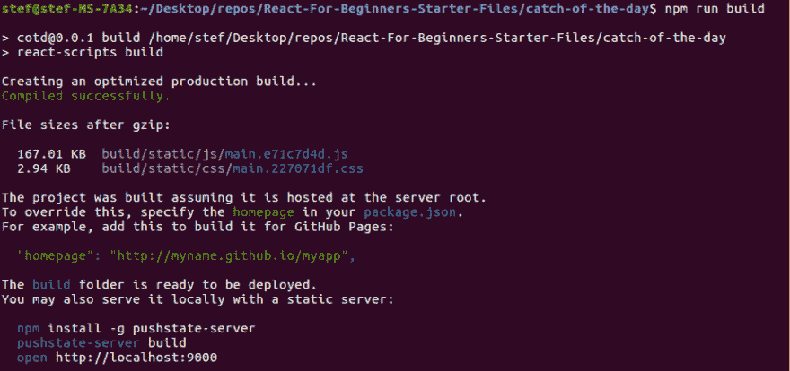T2】](https://res.cloudinary.com/practicaldev/image/fetch/s--Dn65XL8_--/c_limit%2Cf_auto%2Cfl_progressive%2Cq_auto%2Cw_880/https://s3-ap-southeast-2.amazonaws.com/ghost-blog-stef-ninja/2017/08/terminal_output_from_npm_run_build-1501644417629.png)

顶层的`create-react-app`输出是`index.html`和一个`static`文件夹。这个输出没有实际的服务器。这意味着，如果我们只是将这些文件上传到服务器上，我们将得到一堆错误。我们需要一个知道如何服务于`index.html`的服务器，而不管 URL 是什么，并且放弃到浏览器的路由。

接下来的几课将讲述如何将该应用部署到符合这一要求的各种服务器上。因为这些都与构建 React for Production 相关，所以我将在今天全部完成。

##### 部署到 now.sh

[now.sh](https://zeit.co/now) 在云中轻松、快速、可靠地发布您的 JavaScript (Node.js)或 docker 支持的应用、网站和服务。它还附带免费的开源主机。这意味着部署任何你乐意开源的东西都是快速、免费(在一定程度上)和容易的。

韦斯使用的`now-serve`(此处发现)命令被弃用，取而代之的是我们被指引使用`now-static`(此处发现)。我今天无法让它工作，在学习了其他部署过程后，我会再次访问它。

###### 做:

*   运行`npm run build`命令。
*   选择要部署到的服务器。
*   部署到服务器。

*【视频 25 & 26:构建 React for Production，部署到 now . sh】*

### 第 26 天:部署到 GitHub 页面

另一种托管我们的`create-react-app`应用程序的方式是使用 [GitHub 页面](https://pages.github.com/)。

这个过程是“hacky ”,因为我们需要解决这样一个事实，即我们的应用程序将被托管在一个子文件夹(而不是根目录)中。为了在运行构建过程之前说明这一点，我们需要添加`"homepage": "https://YOURGITHUBNAME.github.io/YOURREPONAME"`。我们还需要修改 React 路由器来考虑这个子文件夹。

GitHub pages 不允许您控制页面的路径，因此建议的(笨拙的)方法是复制`index.html`页面，并将副本重命名为`404.html`。这意味着每次浏览器收到 404 代码时，应用程序仍然会显示。我讨厌这个概念，我马上把这个页面拿下来&删除这个回购协议。

###### 做:

*   建立一个空白的 GitHub repo。
*   在`package.json`中设置`homepage`
*   修改`react-router`(在`index.js`中)在子文件夹中运行。(将属性“basename”设置为子文件夹名称)。您可以通过以下方式从 URL 获取变量:

```
const repo = `/${window.location.pathname.split('/')[1]}`;
const Root = ()
...
<BrowserRouter basename={repo} > 
```

<svg width="20px" height="20px" viewBox="0 0 24 24" class="highlight-action crayons-icon highlight-action--fullscreen-on"><title>Enter fullscreen mode</title></svg> <svg width="20px" height="20px" viewBox="0 0 24 24" class="highlight-action crayons-icon highlight-action--fullscreen-off"><title>Exit fullscreen mode</title></svg>

*   运行`npm run build`
*   从新的构建目录初始化一个新的 Git Repo(用`git init`)。
*   添加遥控器(用`git remote add origin git@github.com:YOURGITHUBNAME/YOURREPONAME.git`)
*   运行`git add -A`、`git commit -m "fishy"`、`git push -u origin master`。
*   在 GitHub repo 的设置中，发布`master branch`作为 GitHub 页面的源。
*   将`index.html`复制为`404.html` &提交&推动此变更。

*【视频 27:部署到 GitHub 页面】*

### 第 27 天:部署到 Apache 服务器

现在我们进入正题了。今天，我们部署在一个标准的 Apache 服务器上(就像你每月花几美元从 GoDaddy 或 Bluehost 买到的那种)。

如果您打算部署到子目录(不是根域或子域)，那么您将需要更新`index.js`中的`react-router`信息和`package.json`中的`hompage:`声明。如果没有，可以删除这些附加内容。

我们需要告诉服务器`index.html`应该为所有路由提供服务。对于 Apache 服务器，您可以使用一个`.htaccess`文件来完成这项工作。输入以下内容:

```
RewriteBase /
RewriteRule ^index\.html$ - [L]
RewriteCond %{REQUEST_FILENAME}% !-f
RewriteCond %{REQUEST_FILENAME}% !-d
RewriteRule . /index.html [L] 
```

<svg width="20px" height="20px" viewBox="0 0 24 24" class="highlight-action crayons-icon highlight-action--fullscreen-on"><title>Enter fullscreen mode</title></svg> <svg width="20px" height="20px" viewBox="0 0 24 24" class="highlight-action crayons-icon highlight-action--fullscreen-off"><title>Exit fullscreen mode</title></svg>

这些规则分解为——无论何时你有任何的`/`提供请求的文件名，或者如果没有找到，则提供`index.html`代替。

注意:要为一个`nginx`服务器这样做，你可以在一个`nginx.conf`文件中使用下面的代码:

```
location / {
    try_files $uri /index.html;
} 
```

<svg width="20px" height="20px" viewBox="0 0 24 24" class="highlight-action crayons-icon highlight-action--fullscreen-on"><title>Enter fullscreen mode</title></svg> <svg width="20px" height="20px" viewBox="0 0 24 24" class="highlight-action crayons-icon highlight-action--fullscreen-off"><title>Exit fullscreen mode</title></svg>

###### 做:

*   运行`npm run build`
*   将这些文件 FTP 到您的 Apache 服务器上。
*   创建一个`.htaccess`文件。
*   允许 Firebase 上的域(以便您的登录 OAuth 继续工作)

*【视频 28:部署到 Apache 服务器】*

### 第 28 天:属性初始值设定项和摆脱。绑定()

每当我们想要添加一个我们想要绑定到组件实例的自定义方法时，我们需要在构造函数方法中使用`.bind()`。这是许多重复和复杂的代码，在今天的课程中，Wes 向我们展示了如何使用为 JavaScript (ES6)的未来迭代提出的公共类字段来消除它。

*注意:Wes 引用了 JavaScript 的 [ES 类字段&静态属性](https://github.com/tc39/proposal-class-public-fields)提案，但这已经与另一个提案合并，形成了 JavaScript 的 [ESnext 类特性。](https://github.com/tc39/proposal-class-fields)*

那么这些属性初始化器与移除`.bind()`有什么关系呢？

我们可以把这个从`constructor()` :
中去掉

```
this.loadSamples = this.loadSamples.bind(this) 
```

<svg width="20px" height="20px" viewBox="0 0 24 24" class="highlight-action crayons-icon highlight-action--fullscreen-on"><title>Enter fullscreen mode</title></svg> <svg width="20px" height="20px" viewBox="0 0 24 24" class="highlight-action crayons-icon highlight-action--fullscreen-off"><title>Exit fullscreen mode</title></svg>

然后我们将方法从:

```
loadSamples() {
  this.setState({
    fishes: sampleFishes
    });
} 
```

<svg width="20px" height="20px" viewBox="0 0 24 24" class="highlight-action crayons-icon highlight-action--fullscreen-on"><title>Enter fullscreen mode</title></svg> <svg width="20px" height="20px" viewBox="0 0 24 24" class="highlight-action crayons-icon highlight-action--fullscreen-off"><title>Exit fullscreen mode</title></svg>

致:

```
loadSamples = () => {
  this.setState({
    fishes: sampleFishes
    });
}; 
```

<svg width="20px" height="20px" viewBox="0 0 24 24" class="highlight-action crayons-icon highlight-action--fullscreen-on"><title>Enter fullscreen mode</title></svg> <svg width="20px" height="20px" viewBox="0 0 24 24" class="highlight-action crayons-icon highlight-action--fullscreen-off"><title>Exit fullscreen mode</title></svg>

这是可行的，因为[箭头函数](https://googlechrome.github.io/samples/arrows-es6/)绑定到了父对象(本质上与我们之前使用的`.bind()`做同样的工作，但麻烦少得多)。*需要注意的是，这是一个尚未在 JavaScript 中实现的特性，也不能保证将来会实现。*

我们还可以删除在`constructor()` :
内所做的任何状态声明

```
this.state = {
  fishes: {},
  order:{}
} 
```

<svg width="20px" height="20px" viewBox="0 0 24 24" class="highlight-action crayons-icon highlight-action--fullscreen-on"><title>Enter fullscreen mode</title></svg> <svg width="20px" height="20px" viewBox="0 0 24 24" class="highlight-action crayons-icon highlight-action--fullscreen-off"><title>Exit fullscreen mode</title></svg>

然后，我们可以删除点符号，并将其设置在`constructor()` :
之外

```
state = {
  fishes: {},
  order:{}
}; 
```

<svg width="20px" height="20px" viewBox="0 0 24 24" class="highlight-action crayons-icon highlight-action--fullscreen-on"><title>Enter fullscreen mode</title></svg> <svg width="20px" height="20px" viewBox="0 0 24 24" class="highlight-action crayons-icon highlight-action--fullscreen-off"><title>Exit fullscreen mode</title></svg>

这是一个已经添加到 App 的每个实例中的属性初始值设定项。这意味着该组件的每个实例都将使用该状态进行初始化。

此外，移除点符号可以发生在组件之后需要发生的任何事情上。例如，在组件的`render()`下面检查我们的 propTypes。这些可以被移动到组件返回中，并被赋予一个`static`标志(因为我们不需要每次有这个组件的新实例时都有一个新版本)。

```
App.propTypes = {
  params: React.PropTypes.object.isRequired,
} 
```

<svg width="20px" height="20px" viewBox="0 0 24 24" class="highlight-action crayons-icon highlight-action--fullscreen-on"><title>Enter fullscreen mode</title></svg> <svg width="20px" height="20px" viewBox="0 0 24 24" class="highlight-action crayons-icon highlight-action--fullscreen-off"><title>Exit fullscreen mode</title></svg>

这可以移动到`render()`功能中，并修改为:

```
static propTypes = {
  params: React.PropTypes.object.isRequired,
}; 
```

<svg width="20px" height="20px" viewBox="0 0 24 24" class="highlight-action crayons-icon highlight-action--fullscreen-on"><title>Enter fullscreen mode</title></svg> <svg width="20px" height="20px" viewBox="0 0 24 24" class="highlight-action crayons-icon highlight-action--fullscreen-off"><title>Exit fullscreen mode</title></svg>

###### 做:

*   替换`.bind()`属性初始化器。
*   将所有`propTypes`移动到组件&中，使它们保持静态。

视频 29:今天就做出反应——属性初始化器和摆脱。bind()]

### 第 29 天:扔掉创造-反应-应用降落伞

是聪明的，因为它处理所有幕后的困难魔术(咳咳 webpack 咳咳),并允许你进入那里开始创作。然而，有时默认设置可能不再适用，您需要从`create-react-app`中退出。

*警告:没有办法从 create-react-app 中“退出”,所以请确保您是在 GitHub 分支上这样做的。*

从`create-react-app`弹出就像运行命令`npm run eject`一样简单。

然后，它将安装应用程序工作所需的所有依赖项。它还将创建两个新目录(配置和脚本)。它还会给你的`package.json`文件增加一大堆的`devDependencies`。

现在，您可以根据需要编辑和更新 webpack 配置、eslintConfig 和 babel。

###### 做:

*   在回购中创建新的`ejected`分行
*   运行命令`npm run eject`
*   按需定制。

*【视频 30:从创建-反应-应用中弹出】*

### 第 30 天:部署到燃烧基地

这是我 30 天挑战的最后一天，我已经没有正式的课程了。在过去的几节课中，我好奇的一件事是我们如何使用 Firebase 来托管应用程序(以及处理数据库的持久状态管理)。我也很好奇，不管服务器`index.html`在哪里，我们是否有足够的控制权来控制它的路由。

通过一点快速的研究，我可以看到这不仅是可能的，而且看起来好像 Firebase 就是为此而生的。所以，事不宜迟，让我们把这个应用程序部署到 Firebase 主机上。

###### 部署 create-react-app 到 Firebase

文档介绍了如何将你的应用程序部署到 Firebase。遵循这里[的指示](https://github.com/facebookincubator/create-react-app/blob/master/packages/react-scripts/template/README.md#firebase)(因为它们会比我能描述的任何东西都好)。

###### 在 Firebase 上定制主机行为

Firebase 开放了对内容托管方式的控制——包括自定义错误页面、重定向、重写和标题。在我们的例子中，我们对[重写](https://firebase.google.com/docs/hosting/url-redirects-rewrites)感兴趣。

为此，我在`firebase.json`文档中添加了一些定制。我添加的内容告诉 Firebase 将`build`设为公共目录，并将所有路由重定向到`index.html`文件。它还告诉 It 忽略不需要包含在部署中的文件。

它现在的内容如下:

```
{
  "hosting": {
    "public": "build",
    "rewrites": [{
      "source": "**",
      "destination": "/index.html"
    }],
    "ignore": [
      "firebase.json",
      "**/.*",
      "**/node_modules/**"
    ]
  }
} 
```

<svg width="20px" height="20px" viewBox="0 0 24 24" class="highlight-action crayons-icon highlight-action--fullscreen-on"><title>Enter fullscreen mode</title></svg> <svg width="20px" height="20px" viewBox="0 0 24 24" class="highlight-action crayons-icon highlight-action--fullscreen-off"><title>Exit fullscreen mode</title></svg>

现在，如果你想查看我的应用程序，你可以点击这里查看。

###### 做:

*   安装 Firebase CLI。
*   运行`create-react-app`构建命令。
*   定制`firebase.json`
*   部署到火力基地。

* * *

更多阅读本系列:[第一周](https://stef.ninja/learning-react-week-1/)、[第二周](https://stef.ninja/learning-react-week-2/)、[第三周](https://stef.ninja/learning-react-week-3/)、**或**为自己获取 [React for 初学者课程](https://reactforbeginners.com/)。