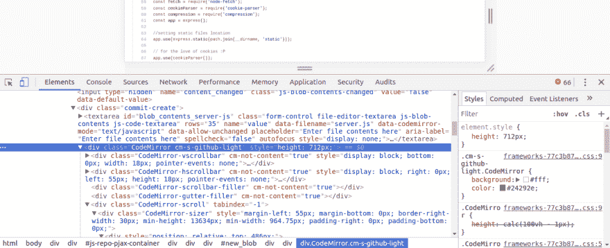

# 我用 Codemirror 构建了它

> 原文:[https://dev.to/sroy8091/i-built-it-with-codemirror](https://dev.to/sroy8091/i-built-it-with-codemirror)

## 我的 Web 应用 SnipCode

这是一个代码保存和共享平台。我的第一个挑战是获得具有良好语法色彩的代码编辑器，而不是简单的文本编辑器。所以我开始搜索其他[人](https://codemirror.net/doc/realworld.html) (codepen，github，等等)用什么作为他们的代码编辑器，经过一番努力，我得到了 codemirror 这个名字

[T2】](https://res.cloudinary.com/practicaldev/image/fetch/s--SGsmF__e--/c_limit%2Cf_auto%2Cfl_progressive%2Cq_auto%2Cw_880/https://thepracticaldev.s3.amazonaws.com/i/apukqmjqlua69thczt5p.png)

在使用 chrome 开发工具检查 [github](https://www.github.com) 时。

## Codemirror web IDE

这是一个基于 javascript 的工具，带有许多 API，可以为您定制基于 web 的 IDE。但是首先我们要做的是下载它。
在 HTML 的文本区域创建一个这样的实例

```
<textarea id="demotext" class="code-input">/* your code here */</textarea> 
```

<svg width="20px" height="20px" viewBox="0 0 24 24" class="highlight-action crayons-icon highlight-action--fullscreen-on"><title>Enter fullscreen mode</title></svg> <svg width="20px" height="20px" viewBox="0 0 24 24" class="highlight-action crayons-icon highlight-action--fullscreen-off"><title>Exit fullscreen mode</title></svg>

我们必须调用 codemirror 构造函数

```
var editor = CodeMirror.fromTextArea(document.getElementById("demotext"), {
        lineNumbers: true,
        matchBrackets: true
    }); 
```

<svg width="20px" height="20px" viewBox="0 0 24 24" class="highlight-action crayons-icon highlight-action--fullscreen-on"><title>Enter fullscreen mode</title></svg> <svg width="20px" height="20px" viewBox="0 0 24 24" class="highlight-action crayons-icon highlight-action--fullscreen-off"><title>Exit fullscreen mode</title></svg>

瞧....

[T2】](https://res.cloudinary.com/practicaldev/image/fetch/s--2IDXCaFn--/c_limit%2Cf_auto%2Cfl_progressive%2Cq_auto%2Cw_880/https://thepracticaldev.s3.amazonaws.com/i/95os983olbp0e40y813r.jpg)

很明显，按钮和所有的设计都只是 CSS。

在我的代码编辑器中编写代码时，我们可以像在这里一样设置选项，显示行号并匹配括号。

等等，我刚才说的语法着色呢。在 codemirror 中有各种模式。我们只需要从模式文件夹中导入这些。比如这里我导入了 Python 模式

```
<script src="/mode/python/python.js"></script> 
```

<svg width="20px" height="20px" viewBox="0 0 24 24" class="highlight-action crayons-icon highlight-action--fullscreen-on"><title>Enter fullscreen mode</title></svg> <svg width="20px" height="20px" viewBox="0 0 24 24" class="highlight-action crayons-icon highlight-action--fullscreen-off"><title>Exit fullscreen mode</title></svg>

现在，我们必须通过使用 mode 调用 setOption 方法来为编辑器设置模式。

```
editor.setOption("mode", language); 
```

<svg width="20px" height="20px" viewBox="0 0 24 24" class="highlight-action crayons-icon highlight-action--fullscreen-on"><title>Enter fullscreen mode</title></svg> <svg width="20px" height="20px" viewBox="0 0 24 24" class="highlight-action crayons-icon highlight-action--fullscreen-off"><title>Exit fullscreen mode</title></svg>

下面是 GitHub 中关于不同模式下 codemirror 实现的代码样例的[要点](https://gist.github.com/sroy8091/31a2c0d2b1971c685b7bc9f49fd2d919)。还有各种其他的[插件](https://codemirror.net/doc/manual.html)具有文本建议等功能，可以添加到 codemirror 中。

因此，使用这个令人敬畏的工具，我创建了我的 web 应用程序 [SnipCode](http://app.snipcode.hasura.me) 的第一个屏幕，用于编辑和发布一个新的 snip。

*这里是关于这一系列 snipcode 开发的所有帖子的索引*

[第一部分:App Idea](https://dev.to/sroy8091/app-idea-for-hasura-internship)
[第二部分:App 原型](https://dev.to/sroy8091/app-prototype)
[第三部分:本地开发](https://dev.to/sroy8091/hasura-local-development)
[第四部分:G for Git](https://dev.to/sroy8091/g-for-git)
[第五部分:数据建模](https://dev.to/sroy8091/its-modeling-time)
[第六部分:Data&Auth API](https://dev.to/sroy8091/postman-a-major-tool-for-developers)
[第七部分:基本功能](https://dev.to/sroy8091/i-love-cookies-expressjscookies)
[第八部分:App 屏幕 1](https://dev.to/sroy8091/i-built-it-with-codemirror)
[第九部分](https://dev.to/sroy8091/app-screen-2)

| 喜欢我的帖子吗？ |
| --- |
| [T2】](https://ko-fi.com/A0A5WBC1) |