# 如何使用 Ionic Creator for UI 创建一个带有 Ionic framework 3 的计算器应用程序

> 原文:[https://dev . to/Nikola/how-to-create-a-calculator-application-with-ionic-framework-3-by-using-ionic-creator-for-ui](https://dev.to/nikola/how-to-create-a-calculator-application-with-ionic-framework-3-by-using-ionic-creator-for-ui)

[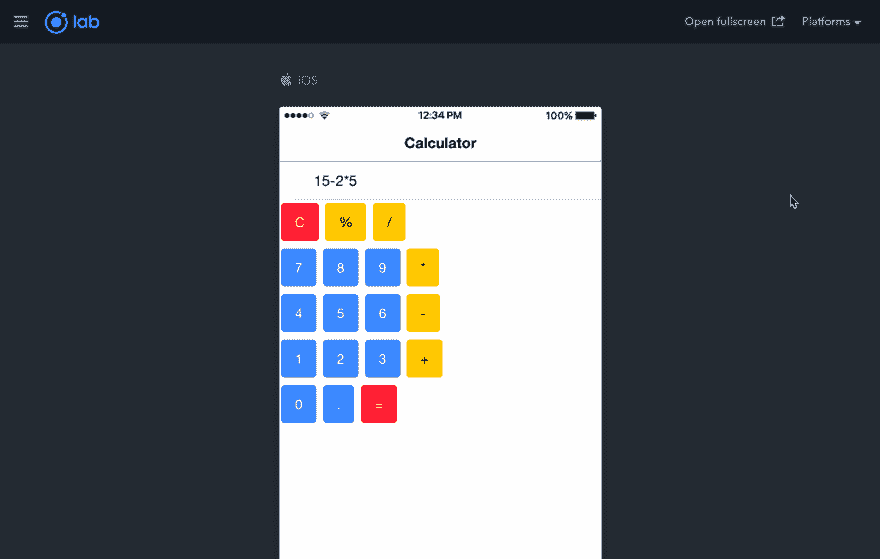T2】](https://res.cloudinary.com/practicaldev/image/fetch/s--QncbkO5k--/c_limit%2Cf_auto%2Cfl_progressive%2Cq_auto%2Cw_880/https://thepracticaldev.s3.amazonaws.com/i/bbp4xlumupu83ei54fjq.png)

*最初发布于[我的博客](http://www.nikola-breznjak.com/blog/javascript/ionic3/create-calculator-application-ionic-framework-3-using-ionic-creator-ui/)T3】*

这是一系列帖子中的第二篇，这些帖子将教你如何利用你的 web 开发知识为 iOS 和 Android 构建混合应用程序。本系列的第一篇文章是关于如何在 Windows 和 Mac 上开始使用 Ionic Framework 3 的。

第二篇文章解释道:

*   如何创建一个计算器界面模型
*   如何使用 Ionic Creator 创建一个无需编码的计算器界面原型
*   如何根据创建的界面启动 Ionic 3 应用程序
*   哪些是最重要的文件夹和文件，Ionic 3 应用程序的起点是什么
*   如何创建计算器逻辑

## 完工项目:

*   从 [Github](https://github.com/Hitman666/Ionic3_2ndTutorial) 中克隆代码
*   在项目目录中执行`ionic lab`,在浏览器中本地运行项目
*   你可以查看这个应用程序的实例或者查看这个 gif: 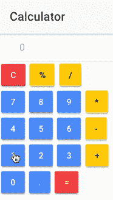

## 简介

由于 App Store 中没有那么多计算器应用程序，谁知道呢，如果你添加一两个必要的调整，你可能会在这一类别中创造一个畅销书。

抛开所有的玩笑和希望；这似乎是体面的，但仍然很容易完成任务。让我们从为我们的应用程序创建接口开始这一章。

## 计算器界面模型

在开始任何应用程序之前，我们应该知道我们想要什么(嗯，至少大体上是这样)。我们应该知道我们的应用程序试图解决什么问题，以及我们将如何解决它。此外，我们应该有一个像样的想法，我们希望我们的应用程序看起来像什么。

前两个问题的答案会相当容易；问题是我们的大脑计算速度不够快(除非你是亚瑟·本杰明)，我们需要一个工具来帮助我们。当然，有特定的计算器设备，但如果我们一直带着它，那就太麻烦了。

此外，由于现在几乎每个人都有智能手机，为智能手机开发一个应用程序会是一个很棒的主意。因为，正如他们所说:

> 有一个应用程序可以做到这一点

这年头基本上什么都有了。如果你发现没有一个应用程序可以解决你可能遇到的某个特定问题，那可能是你的好运气。谁知道呢，你可能会在 AppStore 上成名 5 分钟，直到你的应用程序的另一个克隆体把你推开。

无论如何，回到我们的计算器应用程序；我们不需要任何花哨的选项(至少在这个 1.0 版本中还不需要)，我们将只坚持基本的数学运算，如加、减、除和乘。

这些基本操作将是我们的 MVP(最小可行产品)，正如作者 Eric Ries 在其令人敬畏(也是强烈推荐)的书[精益创业](http://www.nikola-breznjak.com/blog/books/the-lean-startup-eric-ries/)中解释的那样。如果事实证明我们的想法是好的，我们可以随时添加功能。或者，我们可以远离它，如果事实证明它不是继 Flappy Bird 之后的第二个最好的东西*。这样，我们就不会花费太多的时间和金钱来构建一个有十几个功能的应用程序，而这些功能最终根本不会被使用。*

至于用户界面，你可以使用各种工具来模拟你的应用程序的用户界面( [Balsamiq 模型](https://balsamiq.com/products/mockups/)、[模仿鸟](https://gomockingbird.com/home)、[模型生成器](http://mockupbuilder.com/))。我倾向于守旧派，我画了一张我想象中的应用程序的草图，这是我尝试几次后得出的结果:

[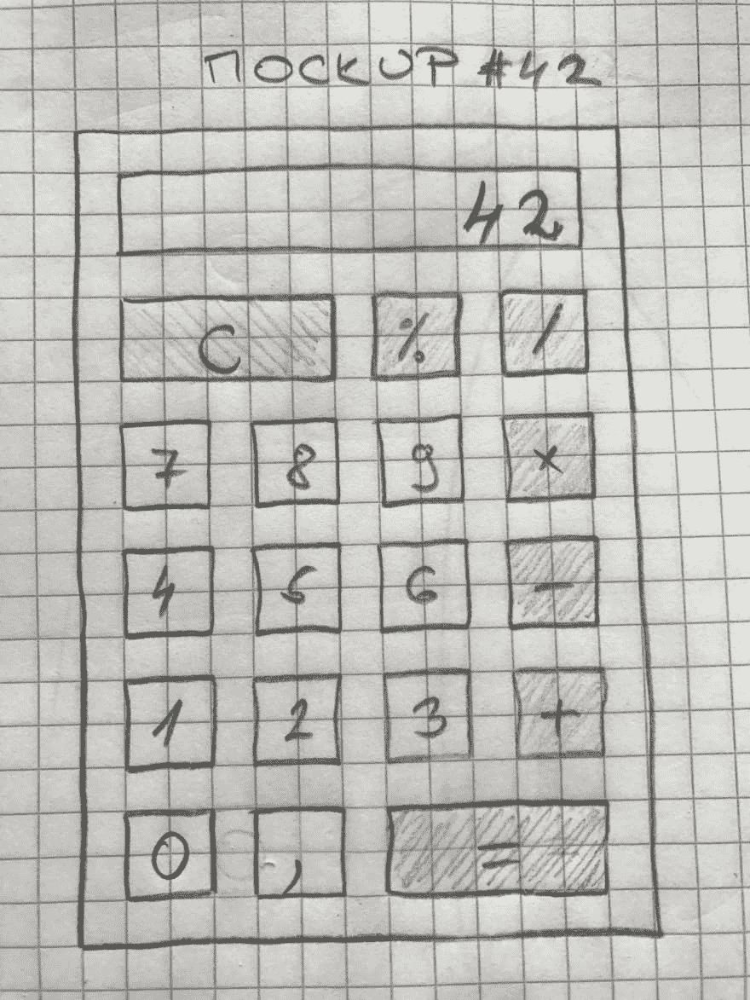T2】](https://res.cloudinary.com/practicaldev/image/fetch/s--1PppJadn--/c_limit%2Cf_auto%2Cfl_progressive%2Cq_auto%2Cw_880/http://i.imgur.com/MfbkZTy.jpg)

## 计算器界面原型

既然我们知道了**我们的应用程序需要做什么**以及**它应该是什么样子**，让我们从创建我们的界面开始。

我们可以通过在 HTML/CSS 中手动编码来创建我们的界面，但我们将在这里展示一种不同的方法——使用 **[Ionic Creator](https://creator.ionic.io/)** 的方法，这是一个很棒的 web 应用程序([很快也会成为桌面应用程序),它可以让你**拖动&放下**组成用户界面的组件。因此，这是一个伟大的工具，有助于**快速用户界面原型**。](http://blog.ionic.io/announcing-creator-ionic-3-support-and-whats-coming-next/)

最好的事情是，你可以下载创建的 HTML/CSS ( [最近](http://blog.ionic.io/announcing-creator-ionic-3-support-and-whats-coming-next/)他们已经添加了 Ionic 3 支持)并直接在你的 Ionic 应用中使用它。当然，稍后在 HTML 和 CSS 代码中将需要一些额外的修改，但是对于创建一个快速原型来说，这已经足够了。

值得注意的是，目前市场上有很多其他的界面原型工具( [InVision](http://www.invisionapp.com/) 、 [Flinto](https://www.flinto.com/) 、 [Figma 2.0](https://www.figma.com/) )。然而，这些工具不像 Ionic Creator 那样有“一键下载并准备好使用 Ionic”的选项。

### 用 Ionic Creator 创建计算器界面

要使用 [Ionic Creator](https://creator.ionic.io/) ，你必须在他们的网站上注册/登录。他们目前提供 Creator Pro 的 14 天试用(无需信用卡注册),这是他们的最佳计划，具有以下功能:

[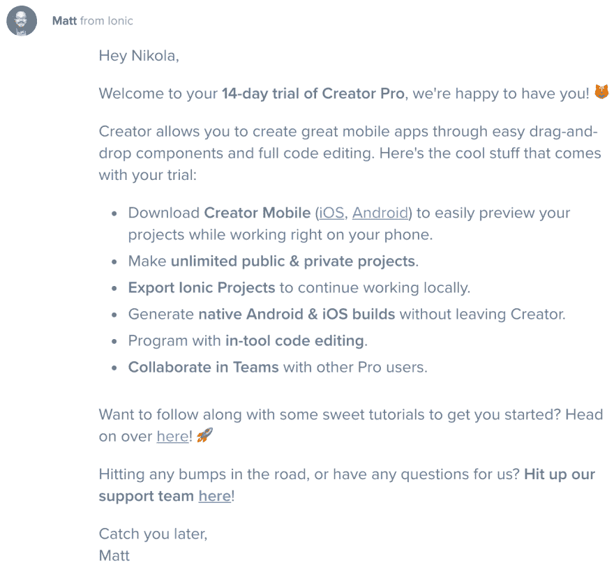T2】](https://res.cloudinary.com/practicaldev/image/fetch/s--hWj-8hWs--/c_limit%2Cf_auto%2Cfl_progressive%2Cq_auto%2Cw_880/http://i.imgur.com/0Apvu5m.png)

在初始屏幕上，点击`New Project`按钮，填写项目名称、类型和离子版本:

[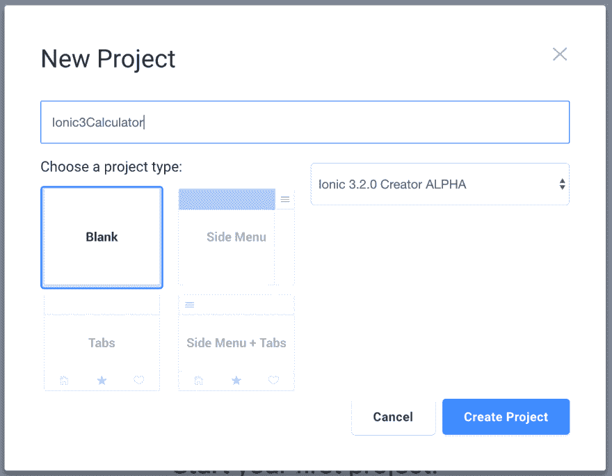T2】](https://res.cloudinary.com/practicaldev/image/fetch/s---yLJGuE1--/c_limit%2Cf_auto%2Cfl_progressive%2Cq_auto%2Cw_880/http://i.imgur.com/ZKtVWjr.png)

> 请注意，Ionic 3 代码导出目前处于 Alpha 模式，这将在未来几个月内改变

Ionic Creator 应用程序的主屏幕如下所示:

[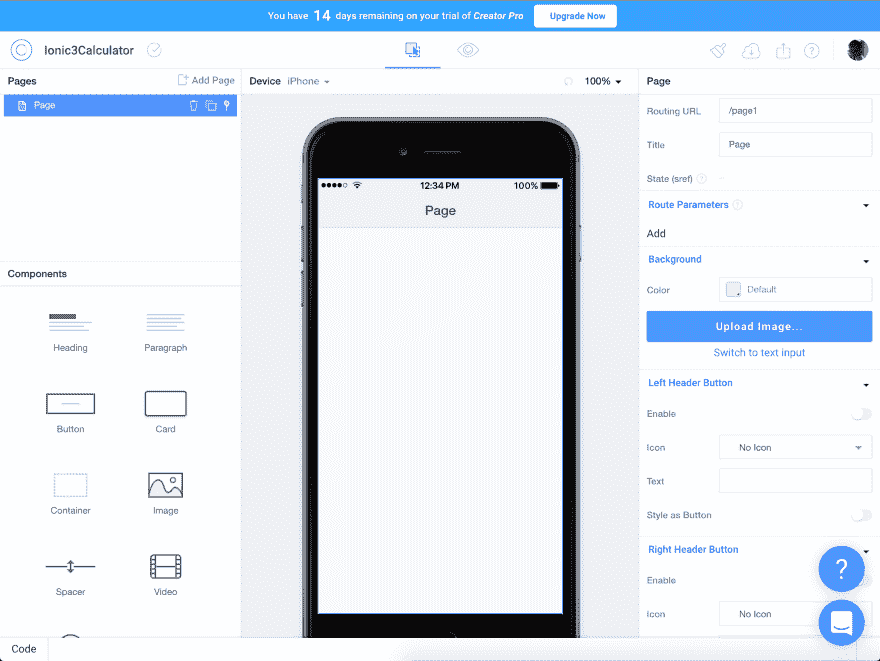T2】](https://res.cloudinary.com/practicaldev/image/fetch/s--av3cLAND--/c_limit%2Cf_auto%2Cfl_progressive%2Cq_auto%2Cw_880/http://i.imgur.com/vxNxgKS.png)

在左上角你会看到**页面**面板，在它里面，你会看到**页面**项目。点击**页面**，在右侧将**标题**改为*计算器*。接下来，通过关闭右侧**杂项**部分下的`Padding`复选框，禁用**填充**选项。下图显示了这应该是什么样子:

[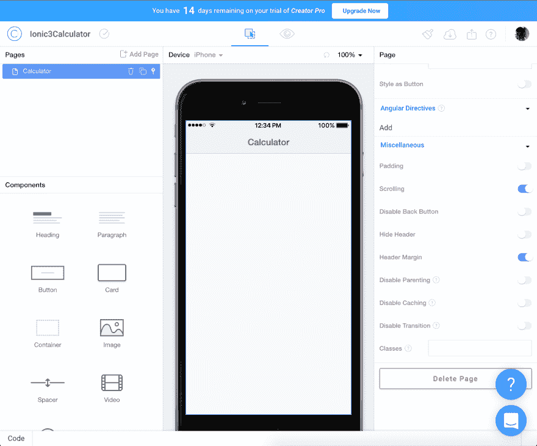T2】](https://res.cloudinary.com/practicaldev/image/fetch/s--UaPreh0B--/c_limit%2Cf_auto%2Cfl_progressive%2Cq_auto%2Cw_880/http://i.imgur.com/yIVsxTR.png)

首先，我们需要某种“显示器”来显示我们点击的数字。理想情况下，我们会使用一个`<label>`组件，然而，它在 Ionic Creator 中还不可用。因此，对于这一点，我们将使用`<input>`元素，稍后当我们下载生成的 HTML 代码时，我们可以很容易地对此进行调整。

> Ionic Creator 以一种拖放的方式工作，这基本上意味着你可以从左侧的**组件**窗格中拖动任何组件，并将其放在屏幕中央的手机图像上。

既然我们得出结论，我们将使用**输入**元素，只需将&拖放到手机上。

选择输入组件(在前面提到的左上角的**页面**面板中点击它)并:

*   将`Placeholder`改为 **0** (零位)
*   将`Name`更改为**显示**
*   删除`Title`下的文本

下图显示了这应该是什么样子:

[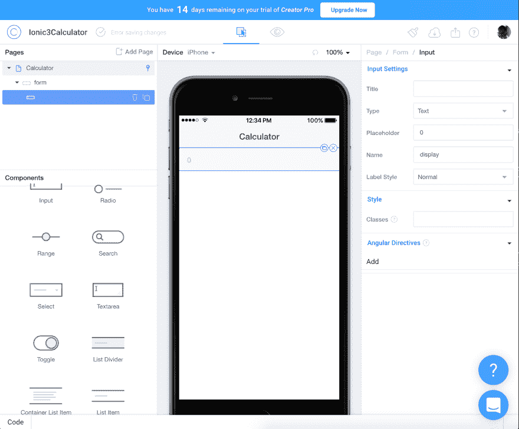T2】](https://res.cloudinary.com/practicaldev/image/fetch/s--crr0s2k9--/c_limit%2Cf_auto%2Cfl_progressive%2Cq_auto%2Cw_880/http://i.imgur.com/BC34Kvv.png)

接下来，根据我们的样机，我们应该添加按钮，将代表以下内容:

*   从 **0** 到 **9** 的数字
*   添加( **+** )
*   减去 _ **-** )
*   乘法( **x** )
*   除法( **/** )
*   模数( **%** ) - *我们毕竟是程序员，对吧？*ðÿ'“ðÿ'ðÿ”

此外，我们需要一个等于按钮( **=** )，一个清除按钮( **C** )和一个浮点(**)。**)按钮。

在第一行我们需要三个按钮，分别代表清零操作( **C** )、模操作( **%** )和除法操作( **/** )。为此，我们将使用组件面板中的**按钮**组件，并将&拖放到屏幕上**输入**字段的正下方。但是，在此之前，您必须拖放&组件，因为我们会将这些操作按钮放入其中。

所以，总结一下:

*   首先，拖放`Container`组件，然后
*   将`Button`组件拖放到和`Container`组件中的手机图像**上**

完成后，将右侧`Style`部分下按钮的`Width`属性改为`Inline`，颜色改为`Energized`。现在，重复该过程两次或点击按钮组件上出现的复制图标(就在`x`图标的左边)。然后将按钮的`Text`分别改为`C`、`%`和`/`。现在，您应该会在 Ionic Creator 窗口中看到类似这样的内容:

[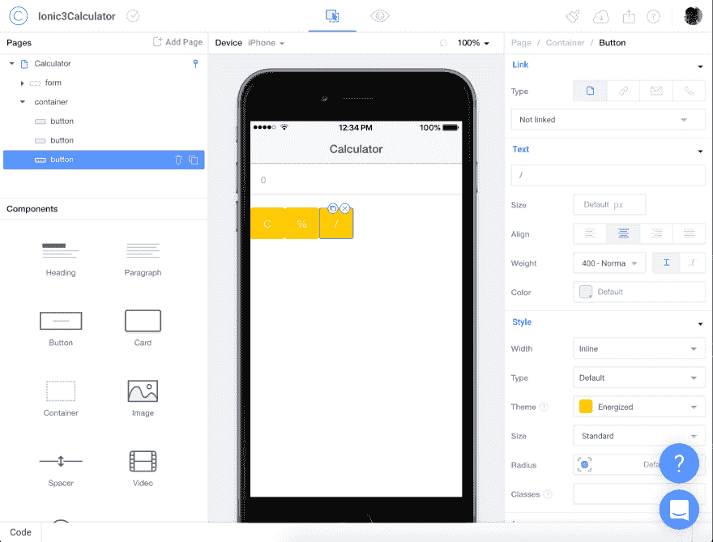T2】](https://res.cloudinary.com/practicaldev/image/fetch/s--V-bB3oyA--/c_limit%2Cf_auto%2Cfl_progressive%2Cq_auto%2Cw_880/http://i.imgur.com/cWiKRiA.png)

不要担心这在我们的设计中看起来不像；我们将在稍后阶段处理这个问题。

> 你们中熟悉 Ionic 1 的人(也在我的[上一本书](https://leanpub.com/ionic-framework)中涉及)知道我们有现在 Creator 中不存在的有用的`Button Bar`组件，但我们仍然有[几个选项](https://forum.ionicframework.com/t/button-bar-alternative-in-ionic/55443)。

现在，对第二行重复该过程，首先在前一行的下面添加另一个`Container`组件，然后添加四个按钮:`7`、`8`、`9`和`x`。数字按钮的额外变化是，你需要将它们的颜色设置为`Positive` (TBH，‘正’是默认颜色，所以你基本上不用做任何改变)。

现在，您需要通过添加接下来的三行来重复这个过程。加快此过程的最佳方法是通过单击复制图标来复制整行:

[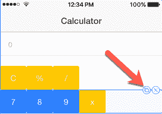T2】](https://res.cloudinary.com/practicaldev/image/fetch/s--tJgmnvLJ--/c_limit%2Cf_auto%2Cfl_progressive%2Cq_auto%2Cw_880/http://i.imgur.com/r7pbNc5.png)

然后更改按钮文本以表示每行中所有缺少的按钮:

*   代表 4、5、6 的按钮和代表减法的按钮( **-** )
*   代表 1、2、3 的按钮和代表加法的按钮( **+** )

数字按钮应该有一个`Positive`样式，操作按钮应该有一个`Energized`样式。

在最后一行，你应该添加三个按钮(在你复制了整行四个按钮后，删除一个按钮):

*   一个代表 0 的按钮，带有`Positive`样式
*   一个代表浮点的按钮(**)。**)
*   一个按钮代表等号操作( **=** )，样式为`Assertive`

您的界面现在应该如下所示:

[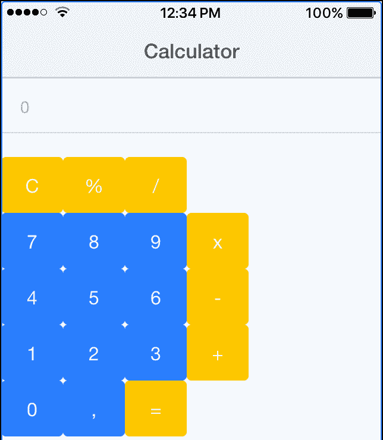T2】](https://res.cloudinary.com/practicaldev/image/fetch/s--PqpRgoaD--/c_limit%2Cf_auto%2Cfl_progressive%2Cq_auto%2Cw_880/http://i.imgur.com/9cuEmgd.png)

不用担心轻微的错位或填充；我们将在下一章中处理这个问题，届时我们将完善我们的应用程序，并为 App/Play 商店做准备。

就这样，我们已经准备好了界面，现在我们可以通过单击标题中的导出图标来导出它，如下图所示:

[T2】](https://res.cloudinary.com/practicaldev/image/fetch/s--Ic-kCN6i--/c_limit%2Cf_auto%2Cfl_progressive%2Cq_auto%2Cw_880/http://i.imgur.com/CVX8yfv.png)

此后，将出现一个包含以下内容的弹出窗口:

[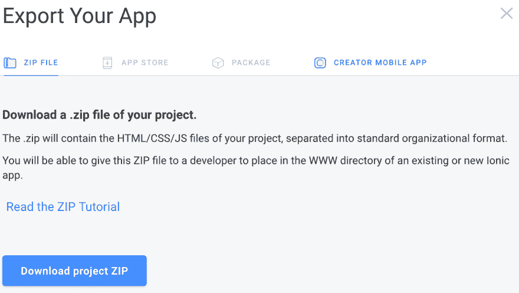T2】](https://res.cloudinary.com/practicaldev/image/fetch/s--x5b7Zhd4--/c_limit%2Cf_auto%2Cfl_progressive%2Cq_auto%2Cw_880/http://i.imgur.com/YWscesL.png)

点击`Download project ZIP`按钮，将其保存到您的电脑中。

## 使用 Ionic Creator 中制作的模板，使用 Ionic CLI 启动项目

首先，解压缩您在上一步中下载的文件。然后，在终端中执行以下命令，启动一个新的 Ionic 应用程序:

`ionic start Ionic3_2ndTutorial blank`

现在进入新创建的`Ionic3_2ndTutorial`目录，用 zip 导出的内容覆盖`src`文件夹。您将想要覆盖`app`目录、`pages`目录和`index.html`文件。

> *注意:你可以随意命名你的项目，在这个例子中我选择了 **Ionic3_2ndTutorial** ，并且我使用了“空白”模板。*

现在，让我们来看看这是怎么回事；执行`ionic lab`，您应该得到如下输出:

``
[INFO]启动 app-scripts 服务器:-la b-l-port 8100-p 8100-livere load-port 35729-r 35729-地址 0.0.0.0 -
Ctrl+C 取消
[09:39:31]手表启动...
[09:39:31]构建开发已开始...
[09:39:31]清洗开始...
[09:39:31]清理在不到 1 毫秒的时间内完成
[09:39:31]复制开始...开始传送文件...
[09:39:33]在 1.83 秒内完成传送
[09:39:33]预处理开始...
[09:39:33]深层链接已启动...
[09:39:33]深度链接在 6 毫秒内完成
[09:39:33]预处理在 7 毫秒内完成
[09:39:33] webpack 启动...
[09:39:33]复制在 1.98 秒内完成
[09:39:38]网络包在 5.41 秒内完成
[09:39:38]sass 开始...
[09:39:39] sass 在 1.02 秒内完成
[09:39:39]后处理开始...
[09:39:39]后处理在 9 毫秒内完成
[09:39:39]皮棉开始...
【09:39:39】构建开发在 8.32 秒内完成
【09:39:39】观察在 8.36 秒内就绪
【09:39:39】开发服务器运行: [http://localhost:8100/](http://localhost:8100/)`

 `[信息]运行
Local:[http://localhost:8100](http://localhost:8100)的开发服务器

[09:39:42]皮棉在 2.32 秒内完成
`

 `在第一个教程中，我们使用了`ionic serve`命令来启动一个本地浏览器，并展示我们的应用程序看起来会是什么样子。这个类似，但在某种程度上更好，因为它可以很好地向我们展示我们的应用程序在不同平台上的样子:

[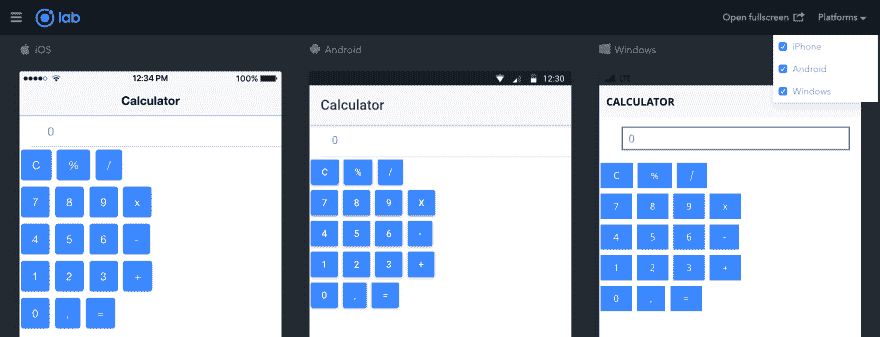T2】](https://res.cloudinary.com/practicaldev/image/fetch/s--uKLm1CFL--/c_limit%2Cf_auto%2Cfl_progressive%2Cq_auto%2Cw_880/http://i.imgur.com/pUTsQSU.png)

如果您愿意，您仍然可以使用`ionic serve`命令。实时预览非常适合快速开发，因为您可以立即看到更改，而无需手动重新加载浏览器。

> 如果您得到类似下面的错误:
> `Error: tsconfig: Cannot read file '/DEV/Ionic3_2ndTutorial/src/tsconfig.json': ENOENT: no such file or directory, open '/DEV/Ionic3_2ndTutorial/src/tsconfig.json'.`
> ，那么您没有在项目目录中运行`ionic lab`命令，因此您应该首先将`cd`放入该目录(如前一步所述)，然后运行`ionic lab`命令。

现在，让我们看看我们生成的文件夹结构是什么样子，每个文件夹负责什么。

## 离子应用文件夹结构

如果您在编辑器中打开该项目(我使用的是 Visual Studio 代码)，您将会看到如下内容:

[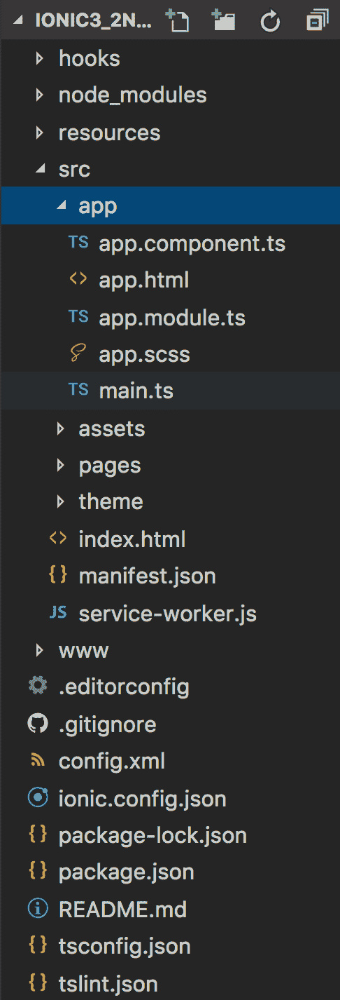T2】](https://res.cloudinary.com/practicaldev/image/fetch/s--Wu-ROmPq--/c_limit%2Cf_auto%2Cfl_progressive%2Cq_auto%2Cw_880/http://i.imgur.com/pPGyKYy.png)

现在我们将解释这些文件和文件夹在 Ionic framework 3 中分别代表什么。

### 挂钩文件夹

**hooks** 文件夹包含了 *Cordova hooks* 的代码，用于在 Cordova 构建过程中执行一些代码。例如，Ionic 使用 Cordova 的 **after_prepare** 钩子来注入特定平台(iOS、Android、Windows Phone)的 CSS 和 HTML 代码。

### 节点 _ 模块文件夹

**node_modules** 文件夹包含 Ionic CLI 在后台使用的所有节点模块，例如 babel、browserify、lodash、uglify、webpack 等等。ðÿ˜文件夹里有 550 多个工具，你现在根本不用担心。

### 资源文件夹

**资源**文件夹包含两个文件(`icon.png`和`splash.png`)和两个文件夹(`android`和`ios`)，其中包含所有需要的图标和闪屏尺寸。Ionic 有一个简单的命令，可以自动为你创建所有的图标和闪屏尺寸。我们将在下一个教程中更详细地介绍这一点。

### src 文件夹

src 文件夹是最重要的，因为它包含了组成我们应用程序的所有文件，我们将在这个文件夹中花费大部分的开发时间。这个文件夹包含几个文件和额外的子文件夹，我们将在下一个标题为`Refactoring our application`的章节中详细介绍。

### www 文件夹

**www** 文件夹包含我们应用程序的优化版本(最小化、压缩等。).在以后的教程中，我们将展示获取该文件夹的内容并将其放在您的 web 服务器上是多么容易，并且您已经准备好并运行了该应用程序。如果你看看这个项目的[实例，这正是我所做的。](http://hitman666.github.io/Ionic3_2ndTutorial/)

### .editorconfig file

**。editorconfig** 是 [Visual Studio 代码](https://code.visualstudio.com/)的配置文件。

### config.xml 文件

**config.xml** 是 [Cordova](https://cordova.apache.org/) 项目的配置文件(您可能还记得第一篇教程，Ionic 是在 Cordova 的基础上构建的)。它包含一些关于应用程序的元信息，如权限和应用程序中使用的 Cordova 插件列表。要了解更多关于`config.xml`文件中可用设置的信息，请参考[官方文档](https://cordova.apache.org/docs/en/latest/config_ref/)。

### ionic.config.json 文件

**ionic.config.json** 是 ionic 的配置文件，用于存储关于 Ionic 项目和相关 Ionic.io 云账户的元信息。我们暂时不会使用 Ionic.io 云账户，我们将在下一章展示如何使用它。

我的`ionic.config.json`文件的内容如下:

 ``{
"name": "Ionic3_2ndTutorial",
"app_id": "",
"type": "ionic-angular"
}`` 

 ``它定义了应用程序的名称及其类型，以及 app_id，以防您已经为此项目创建了云帐户(如果您在启动项目时回答了问题的`Yes`)。

### package.json 文件

**package.json** 是`npm`用来存储当前项目中安装的`npm`包版本的文件。

> `npm` (Node.js 包管理器)是 Node.js 安装自带的 CLI 工具，用于安装其他工具，如前面提到的 Browserify、Babel 等...

我的`package.json`文件的内容，如下所示，很有用，因为我们可以看到我们在项目上安装了哪些 Cordova 插件和依赖项，以及一些元信息，如*名称*、*版本*和*描述*:

 ``{
"name": "Ionic3_2ndTutorial",
"version": "0.0.1",
"author": "Ionic Framework",
"homepage": "http://ionicframework.com/",
"private": true,
"scripts": {
"clean": "ionic-app-scripts clean",
"build": "ionic-app-scripts build",
"lint": "ionic-app-scripts lint",
"ionic:build": "ionic-app-scripts build",
"ionic:serve": "ionic-app-scripts serve"
},
"dependencies": {
"@angular/common": "4.1.3",
"@angular/compiler": "4.1.3",
"@angular/compiler-cli": "4.1.3",
"@angular/core": "4.1.3",
"@angular/forms": "4.1.3",
"@angular/http": "4.1.3",
"@angular/platform-browser": "4.1.3",
"@angular/platform-browser-dynamic": "4.1.3",
"@ionic-native/core": "3.12.1",
"@ionic-native/splash-screen": "3.12.1",
"@ionic-native/status-bar": "3.12.1",
"@ionic/storage": "2.0.1",
"ionic-angular": "3.5.3",
"ionicons": "3.0.0",
"rxjs": "5.4.0",
"sw-toolbox": "3.6.0",
"zone.js": "0.8.12"
},
"devDependencies": {
"@ionic/app-scripts": "2.0.2",
"@ionic/cli-plugin-ionic-angular": "1.3.2",
"typescript": "2.3.4"
},
"description": "An Ionic project"
}`` 

 ``### 包-锁. json 文件

**对于 npm 修改`node_modules`文件夹或`package.json`文件的任何操作，都会自动生成 package-lock.json** 文件。它描述了生成的确切文件夹内容，以便将来的安装可以生成相同的文件夹内容，而不考虑中间的依赖关系更新。该文件旨在提交到源存储库中，以便您的团队成员(或者持续集成系统，如果您已经设置了的话)能够保证安装完全相同的依赖项。

### [T1。gitignore 和 README.md 文件](#gitignore-and-readmemd-file)

都是。gitignore 和 README.md 是与 [GitHub](https://github.com/) 相关的文件。

我相信大多数读者都知道并使用 GitHub(因此也知道并使用 GitHub)，但为了简洁起见，让我们看看[维基百科是如何定义 GitHub](https://en.wikipedia.org/wiki/GitHub) 的:

> GitHub 是一个基于 Web 的 Git 存储库托管服务，它提供了 Git 的所有分布式版本控制和源代码管理(SCM)功能，并添加了自己的特性。与严格意义上的命令行工具 Git 不同，GitHub 提供了基于 Web 的图形界面和桌面以及移动集成。它还为每个项目提供了访问控制和几个协作特性，比如 bug 跟踪、特性请求、任务管理和 wikis。

所以， [Git](https://git-scm.com/) 另一方面是(引自官方网站):

> 一个免费的开源分布式版本控制系统，旨在快速高效地处理从小到大的项目。Git 易于学习，占用空间小，性能快如闪电。它比 Subversion、CVS、Perforce 和 ClearCase 等配置管理工具具有更便宜的本地分支、方便的中转区和多工作流等特性。
> 
> 如果你没有在你的工作流程中使用 Git(和 Github ),我强烈建议你这样做，因为从长远来看，它将被证明是非常有用的。

现在我们已经了解了基本情况，让我们看看上面的文件代表了什么。

**。gitignore** 是 GitHub 的配置文件。下面显示的`.gitignore`文件的内容基本上是指示 Git 它**不应该跟踪**并上传到 GitHub 的文件夹。

 `# 指定使用 Git 时有意忽略的未跟踪文件

# [【http://git-SCM . com/docs/gitignore】](http://git-scm.com/docs/gitignore)

*~
*。西南
*。日志
*。tmp
* . tmp .*
log . txt
*。崇高-项目
*。崇高-工作空间
。vscode/
npm-debug.log*

。想法/
。sass-cache/
。tmp/
versions/
coverage/
dist/
node _ modules/
tmp/
temp/
hooks/
platforms/
plugins/
plugins/Android . JSON
plugins/IOs . JSON
www/
$ RECYCLEBIN/

。DS _ Store
thumbs . db
user interface state . xc userstate
`

 `**README.md** 是 GitHub 上使用的一个 [Markdown](http://daringfireball.net/projects/markdown/) 文件，用来记录你的项目的目的和用途。总的来说，IMHO，每个项目都应该有一个像样的 README.md 文件，它解释了项目的基本用法以及如何运行它、为它做贡献等等的说明。

### tsconfig.json 文件

**tsconfig.json** 是[的类型脚本](https://www.typescriptlang.org/)配置文件。我们不会在这里讨论细节，但是我鼓励你看一下[官方文件](https://www.typescriptlang.org/)。

 ``{
"compilerOptions": {
"allowSyntheticDefaultImports": true,
"declaration": false,
"emitDecoratorMetadata": true,
"experimentalDecorators": true,
"lib": [
"dom",
"es2015"
],
"module": "es2015",
"moduleResolution": "node",
"sourceMap": true,
"target": "es5"
},
"include": [
"src/**/*.ts"
],
"exclude": [
"node_modules"
],
"compileOnSave": false,
"atom": {
"rewriteTsconfig": false
}
}`` 

 ``### [功能区. json 文件](#tslintjson-file)

**tslint.json** 是 TypeScript Linter 配置文件。Linter 是一个检查打字稿代码的可读性、可维护性和功能错误的程序。欲了解更多信息，并了解下面显示的文件内容代表什么，请查看[官方文件](https://palantir.github.io/tslint/usage/tslint-json/)。

 ``{
"rules": {
"no-duplicate-variable": true,
"no-unused-variable": [
true
]
},
"rulesDirectory": [
"node_modules/tslint-eslint-rules/dist/rules"
]
}`` 

 ``## 重构我们的应用

如前所述，我们将在 **src** 文件夹中花费大部分开发时间，这就是为什么我们在前一节中只是简单地提到它。在这里，我们将通过详细解释每个文件(我们将更改的文件)来对其进行全面深入的研究。

最后，我们将添加计算器逻辑，这样我们的计算器将按预期工作。

> 一般来说，将所有代码放在一个文件中，混合逻辑和表示(JavaScript 和 HTML 代码)是绝对不允许的，通常被称为[意大利面条代码](https://en.wikipedia.org/wiki/Spaghetti_code)。你可以从马丁·福勒、肯特·贝克和其他人的书《T2 重构:改进现有代码的设计》中学到更多关于重构代码的知识。如果你正在寻找关于重构和良好编程实践的更轻松的介绍，一般来说，我不会推荐史蒂夫·麦康奈尔的经典[代码全集 2](http://amzn.to/1LWomoq) 。我早在 2011 年就读过这本书，你可以从这本书的第一部分[这里](http://www.nikola-breznjak.com/blog/books/programming/code-complete-2-steve-mcconnell-part-1-laying-foundation/)阅读我的笔记。

^这是这本书第一版的评论(涵盖了爱奥尼亚 1)。我很高兴地告诉大家，从那以后，Ionic 在将逻辑和表示分离成组件方面做得非常出色。这个好处主要来自 Angular(目前在 4.x 版本)。

### index.html 文件

我们离子应用的起点是`index.html`，其内容如下:

 `<！doctype html>T2
的类型`

 `Ionic3Calculator

`

 `> 我希望你对 HTML 有很好的理解，所以我不会解释每一个 HTML 标签。

在`index.html`文件中，我们从`build`文件夹中加载 CSS 和 JS 文件。最重要的标签是`<ion-app></ion-app>`,因为这是我们加载应用程序的地方。

### app 文件夹

带有`src`文件夹的`app`文件夹是每个 Ionic3 应用程序的起点。

[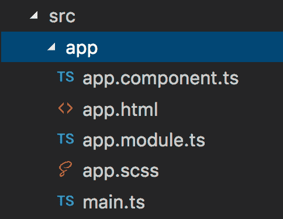T2】](https://res.cloudinary.com/practicaldev/image/fetch/s--HLqDKXYE--/c_limit%2Cf_auto%2Cfl_progressive%2Cq_auto%2Cw_880/http://i.imgur.com/sRZfK8v.png)

#### app.components.ts 文件

在这里，我不会进入太多的细节(因为这篇文章本身就足够长了，现在ðÿ™ƒ)，但我想告诉你你的页面是在哪里加载的。文件的内容应该如下:

``
从' @angular/core '导入{ Component }；
从‘ionic-angular’导入{ Platform }；
从“@ ionic-native/状态栏”导入{ status bar }；
从' @ionic-native/splash-screen '导入{ splash screen }；`

 `从'导入{ CalculatorPage }../pages/计算器/计算器'；

@ Component({
template URL:' app . html '
})

导出类 MyApp {
root page:any = calculator page；

构造函数(platform: Platform，statusBar: StatusBar，splash screen:splash screen){
Platform . ready()。然后(()= > {
//好了，那么平台准备好了，我们的插件也有了。
//在这里你可以做任何你可能需要的更高级的原生事物。
status bar . style default()；
splash screen . hide()；
})；
}
}
`

 `这里重要的一行是`rootPage: any = CalculatorPage;`,它将应用程序的根页面设置为 CalculatorPage，这也是在文件的开头导入的:

`import { CalculatorPage } from '../pages/calculator/calculator';`。

`platform.ready`事件在设备(启动应用程序的手机)设置完毕并准备就绪后触发。这包括在这个项目中使用的插件。如果您试图检查在`ready`函数回调之外是否有可用的插件，您可能会得到错误的结果，因为有些插件可能还没有安装。你可以在这里了解更多关于离子平台实用方法[。](https://ionicframework.com/docs/api/platform/Platform/)

重要的是要注意代码中相同的`CalculatorPage`被注入到`app.module.ts`文件和添加到@NgModule `declarations`和`entryComponents`的位置和方式。

在这个`app`文件夹中，在文件`app.scss`中，你可以放一些你想在你的应用程序中全局应用的样式规则。我们将在下一个教程中讨论样式，在这个教程中，我们将完善我们现有的计算器应用程序。

### cordova.js、manifest.json 和 service-worker.json 文件

在本教程中，我们不会处理这三个文件。我们将把它们留给另一个教程，在这个教程中，我们将解释如何用 Ionic 创建一个 [PWA](https://developers.google.com/web/progressive-web-apps/) (渐进式 Web 应用)以及如何使用本机插件(访问相机等)。).

## 带控制器的计算器逻辑

Ionic Creator 在`pages`文件夹中为我们生成了一个`calculator`页面:

[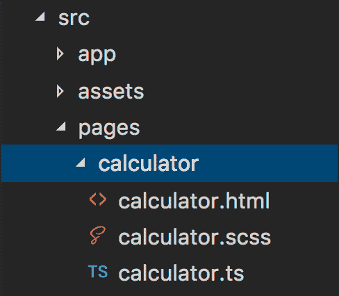T2】](https://res.cloudinary.com/practicaldev/image/fetch/s--wVGLs9xg--/c_limit%2Cf_auto%2Cfl_progressive%2Cq_auto%2Cw_880/http://i.imgur.com/qHoVovh.png)

如前所述，这样的组织比我们以前拥有的要好得多，因为现在我们每个组件都有三个文件:

*   HTML 模板文件(`calculator.html`)
*   [萨斯](http://sass-lang.com/)文件(`calculator.scss`)
*   类型脚本文件(`calculator.ts`)

这样，我们就把表示(HTML + CSS)和逻辑(TS)分开了，这是你应该一直努力的。

Ionic Creator 为我们的`calculator.ts`文件生成了以下代码:

``
从' @angular/core '导入{ Component }；
从‘ionic-angular’导入{ nav controller }；`

 `@Component({
选择器:' page-calculator '，
template URL:' calculator . html '
})
导出类 CalculatorPage {
构造函数(public navCtrl: NavController) {

}
}
`

 `这是一个基本的代码模板，我们在其中导入了`Component`和`NavController`组件；然后我们定义我们的组件装饰器`selector`和`templateUrl`。最后，我们导出了`CalculatorPage`类，并在其中定义了构造函数。

`templateUrl`定义了 HTML 模板的位置，`selector`定义了应用程序生成后将在我们的模板中使用的 HTML 标签(`<page-calculator></page-calculator>`):

[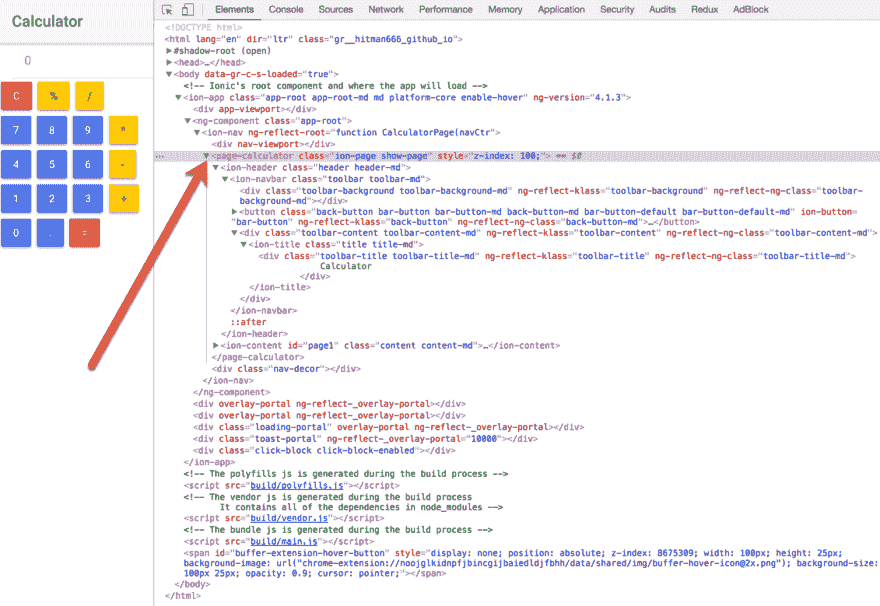T2】](https://res.cloudinary.com/practicaldev/image/fetch/s--Or9j8kVr--/c_limit%2Cf_auto%2Cfl_progressive%2Cq_auto%2Cw_880/http://i.imgur.com/KM8qvx0.png)

在这里，我们将添加一小段代码，让我们的应用程序正常工作。只需将这段代码添加到`CalculatorPage`类中:

``
结果=“”；`

 `BTN clicked(BTN){
if(BTN = = ' C '){
this . result = ' '；
}
else if(BTN = = ' = '){
this . result = eval(this . result)；
}
else {
this . result+= BTN；
}
}
`

 `在这段代码中，我们定义了一个变量`result`，这样我们就可以在模板文件(`calculator.html`)中显示它。

接下来，我们定义了一个名为`btnClicked`的新函数，它接受一个名为`btn`的参数。在函数内部，我们检查传递的参数，根据传递的参数值，我们有三种情况:

*   如果参数等于`C`，那么我们将清除结果
*   如果参数等于`=`,那么我们正在计算等式并显示结果
*   在任何其他情况下，我们只是将按钮的值附加到当前等式中

> 请注意，为了简洁起见，我们没有添加任何额外的检查，比如某人是否意外地(或故意地)在代表某个操作的按钮上点击了两次。我们将在下一章完善应用程序时“解决”这个问题。还有，你可能在网上读到过使用 eval 是错误的或者仅仅是不好的。没错，如果用来评估其他用户输入，它**可能会很糟糕，但在这种情况下，我们会没事的。**

## 整理计算器模板

我们剩下要做的唯一一件事就是在`calculator.html`模板中的按钮上添加适当的函数调用。我们所要做的就是给每个按钮添加`(click)="btnClicked()`函数调用，并传入适当的参数。Ionic Creator 为我们创建的模板是这样的:

``

计算器` 

 `<button id="calculator-button1">C</button>
<button id="calculator-button2">%</button>
<button id="calculator-button3">/</button>

<button id="calculator-button10">7</button>
<button id="calculator-button11">8</button>
<button id="calculator-button12">9</button>
<button id="calculator-button13">x</button>

<button id="calculator-button14">4</button>
<button id="calculator-button15">5</button>
<button id="calculator-button16">6</button>
<button id="calculator-button17">-</button>

<button id="calculator-button18">1</button>
<button id="calculator-button19">2</button>
<button id="calculator-button20">3</button>
<button id="calculator-button21">+</button>

<button id="calculator-button22">0</button>
<button id="calculator-button23">,</button>
<button id="calculator-button25">=</button>

` `我必须指出，在当前版本的离子创造者出口他们仍然有旧的颜色名称，我们将不得不改变这一点。旧爱奥尼亚 1 型的颜色是这样的:

 ``$light: #fff !default;
$stable: #f8f8f8 !default;
$positive: #387ef5 !default;
$calm: #11c1f3 !default;
$balanced: #33cd5f !default;
$energized: #ffc900 !default;
$assertive: #ef473a !default;
$royal: #886aea !default;
$dark: #444 !default;`` 

 ``新的颜色名称现在是这些(在`src/theme/variables.scss`文件中定义):

 ``$colors: (
primary: #488aff,
secondary: #32db64,
danger: #f53d3d,
light: #f4f4f4,
dark: #222,
energized: #ffc900;
);`` 

 ``在我们的模板中，我们有`color="positive"`,我们可以删除它，因为如果按钮上没有定义颜色，它现在是默认颜色。

因此，我们不会更改现有的名称，因为那样我们会破坏使用这个特定变量名的代码。我们将为`energized`添加我们自己的类，这样新的颜色数组将如下所示:

 ``$colors: (
primary: #488aff,
secondary: #32db64,
danger: #f53d3d,
light: #f4f4f4,
dark: #222,
energized: #ffc900
);`` 

 ``此外，与设计有些不同的是，我们将为按钮`C`和`=`添加`danger`颜色。

模板现在应该是这样的:

``

计算器` 

 `<button id="calculator-button1">C</button>
<button id="calculator-button2">%</button>
<button id="calculator-button3">/</button>

<button id="calculator-button10">7</button>
<button id="calculator-button11">8</button>
<button id="calculator-button12">9</button>
<button id="calculator-button13">*</button>

<button id="calculator-button14">4</button>
<button id="calculator-button15">5</button>
<button id="calculator-button16">6</button>
<button id="calculator-button17">-</button>

<button id="calculator-button18">1</button>
<button id="calculator-button19">2</button>
<button id="calculator-button20">3</button>
<button id="calculator-button21">+</button>

<button id="calculator-button22">0</button>
<button id="calculator-button23">.</button>
<button id="calculator-button25">=</button>

` `从代码中可以看出，我们向函数传递了一个参数，该参数表示被单击的按钮。

另外，值得注意的是，我们使用了

`[(ngModel)]="result"`

在`input`元素上，这样我们可以通过角度[双向绑定](https://angular.io/guide/template-syntax#binding-syntax-an-overview)从控制器访问它，我们也可以自己在输入字段中输入一些公式。

我们可以像这样只使用单向绑定:

`[ngModel]="result"`

但是如果我们在输入字段中手工输入一些东西，它不会“传播”到我们的代码中。

## 运行应用程序

现在，您可以通过执行命令来运行应用程序

`ionic lab`

您应该会看到您的强大计算器在浏览器中打开:

[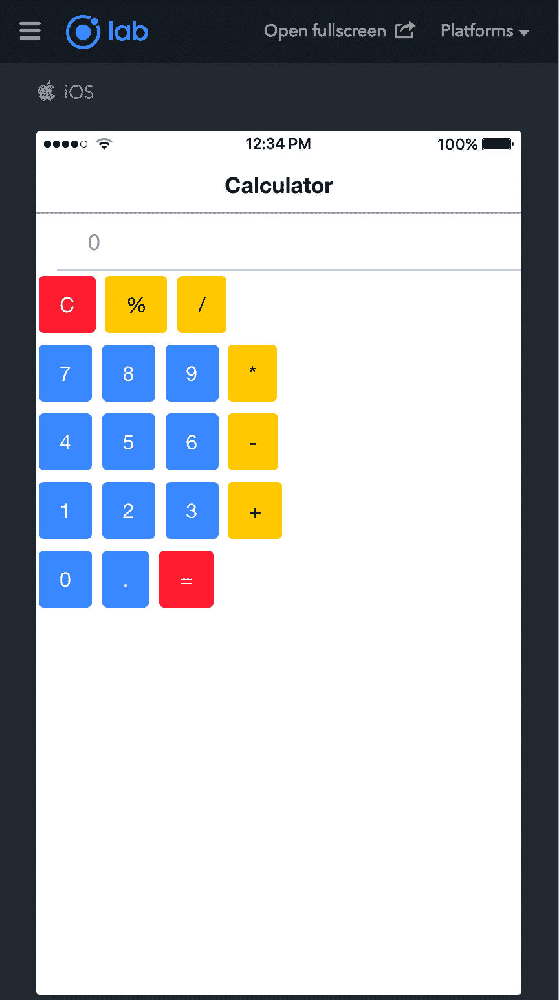T2】](https://res.cloudinary.com/practicaldev/image/fetch/s--g9Ltd93W--/c_limit%2Cf_auto%2Cfl_progressive%2Cq_auto%2Cw_880/http://i.imgur.com/Vx9930d.png)

> 如前所述，不要担心这看起来不“光滑”或不“流行”(或一些其他无意义的词“知识渊博”的人使用这些天)，我们将在下面的教程中处理这一点。

最好的事情，应该是ðÿ™还在按预期工作。因此，如果您尝试输入类似于`2+3-10*2`的内容并点击`=`，您应该会得到预期的`-15`(是的，操作符优先级发生正确)。

我们还有浮点运算，比如`2.3+3.2`等于`5.5`。

正如本章开头提到的，你可以看看 [GitHub](https://github.com/Hitman666/Ionic3_2ndTutorial) 上的源代码，也可以看看这个应用的[实例](http://hitman666.github.io/Ionic3_2ndTutorial/)。

## 结论

在这一章中，我们一步步讲述了如何创建一个计算器应用程序。我们展示了如何创建我们的想法样机；然后我们展示了如何使用 Ionic Creator 创建一个界面，最后展示了如何实现计算器的逻辑。

在下一章中，我们将了解如何在真实的物理设备上测试我们的应用，以及如何使用 [Ionic View App](http://ionicframework.com/products/) 与其他用户分享我们的应用，而无需通过 app store。此外，我们还将了解如何实现 Google Analytics 和 Google Admob 广告，以及如何为商店准备我们的应用程序。此外，我们将看看如何定制图标和应用程序的闪屏。

直到下一次，继续提高ðÿ'``````````````````````````````