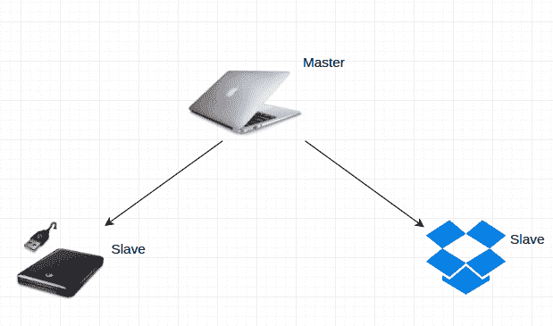
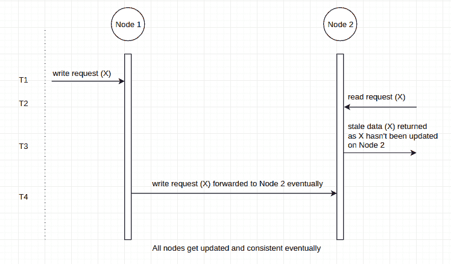
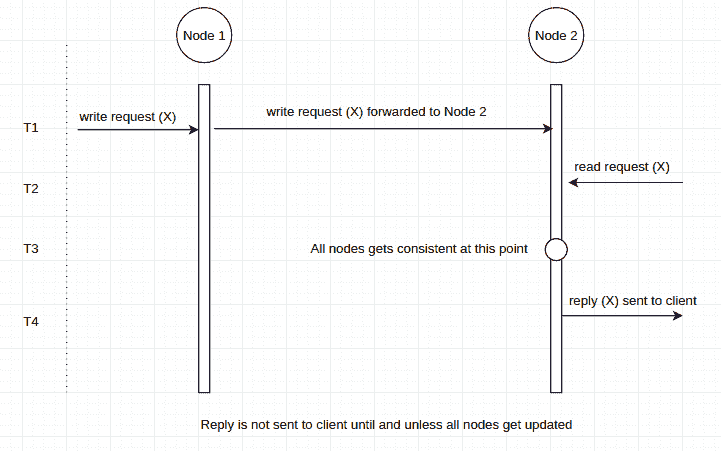

# 分布式数据库中的最终一致性与强一致性

> 原文：<https://dev.to/saurabhgiv/eventual-vs-strong-consistency-in-distributed-databases>

对这个话题的解释从一个类比开始，举一个现实生活中的例子来更好地理解这个概念。

我习惯每天在笔记本电脑上写一些我称之为*技术笔记*的东西来总结我学到的技术概念。每当我想的时候，它帮助我以一种更容易的方式回忆它们。

但是有时候我会担心我的笔记本电脑被偷或者死机。我会丢失所有这些*技术笔记*，所以我开始在我的外部硬盘上备份它们。为了进一步降低丢失它们的可能性，我还购买了 Dropbox 的订阅服务。

[T2】](https://res.cloudinary.com/practicaldev/image/fetch/s--gU6ilcQ_--/c_limit%2Cf_auto%2Cfl_progressive%2Cq_auto%2Cw_880/https://cdn-images-1.medium.com/max/800/1%2APiQhvAicV4TUXohXNdNMuA.png)

每两周，我都会用修改过的和新写的技术笔记更新我的外置硬盘，只要我把笔记本电脑连上互联网，Dropbox 就会得到更新。

在这里，我使用硬盘和 Dropbox 作为阅读技术笔记的来源，而笔记本电脑既可以用来阅读，也可以用来写。(主从模式)

> 冗余带来了可靠性。

现在让我们进入正题。

**案例 1:最终一致性**
每当我们使用一个数据库的多个副本来存储数据时，假设其中一个副本收到一个写请求。在这种情况下，数据库必须找到一种策略，使一个副本上的写请求也能到达其他副本，以便它们都能写入请求的数据并变得一致。

> 一致性在这里意味着对数据库的任何节点的实体的读请求应该返回相同的数据。

最终一致性确保数据库中每个节点的数据最终保持一致。数据库节点达到一致所需的时间可以定义，也可以不定义。

数据最终变得一致意味着更新到达其他副本需要时间。那又怎样？这意味着，如果有人从尚未更新的副本中读取数据(因为副本最终会更新)，那么它可能会返回过时的数据。

[T2】](https://res.cloudinary.com/practicaldev/image/fetch/s--nNHJmXUv--/c_limit%2Cf_auto%2Cfl_progressive%2Cq_auto%2Cw_880/https://cdn-images-1.medium.com/max/800/1%2APFgHx8UYLhk3L5ePPmailQ.png)

我的硬盘也会保留 15 天的陈旧数据，因为它每两周更新一次。让我们假设约翰，我的朋友来了几天后更新，并要求我的硬盘。

```
John: I want your hard disk to read your Tech Notes.

I: Sure, why not. But it has not been updated since last few days.

John: I am fine with it. 
```

现在，硬盘立即提供给约翰*(低延迟)*冒着其中有陈旧数据的风险。但是我确信它会在接下来的两周开始时更新。

> *最终一致性提供了低延迟，但存在返回过时数据的风险*

而另一方面，我们有所谓的强一致性。

**案例 2:强一致性**
它表示，只要一个写请求到达数据库的一个副本，数据就会被传递到所有副本。
但是，在用新数据更新这些副本期间，任何副本对任何后续读/写请求的响应将会延迟，因为所有副本都忙于保持彼此一致。

一旦他们变得一致，他们就开始处理上门的请求。

[T2】](https://res.cloudinary.com/practicaldev/image/fetch/s--byz-cWJn--/c_limit%2Cf_auto%2Cfl_progressive%2Cq_auto%2Cw_880/https://cdn-images-1.medium.com/max/800/1%2AklFtrGr8U-XmyiZ1CJx-0w.png)

这一次，我的朋友维罗妮卡过来要我的技术笔记。

```
Veronica: I want your latest Tech Notes.

I: Sure, why not. I will share a Dropbox link with you.
   But Veronica, access it after few minutes as I have written a
   new Tech Note on the laptop which will get synced with my 
   Dropbox account. 
```

现在，Veronica 能够访问最新的技术笔记，但经过几分钟的延迟。

**结论**

*   强一致性提供了最新的数据，但代价是高延迟。
*   虽然最终一致性提供了低延迟，但是可能用陈旧数据来回复读取请求，因为数据库的所有节点可能不具有更新的数据。

如果你喜欢这篇文章，请与他人分享。
*这篇文章最初发表在媒体上。你可以在这里看一下*。