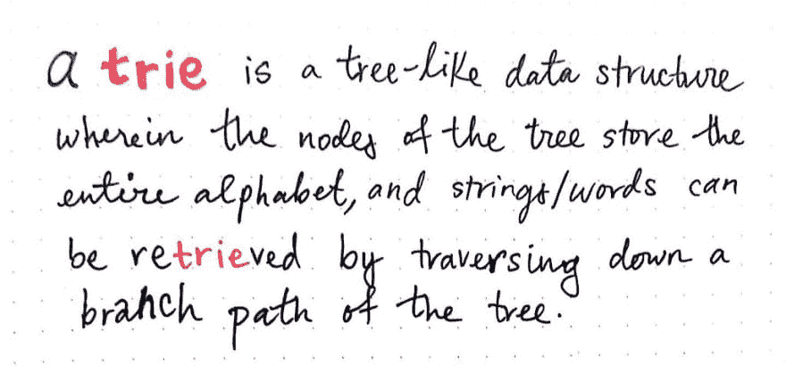
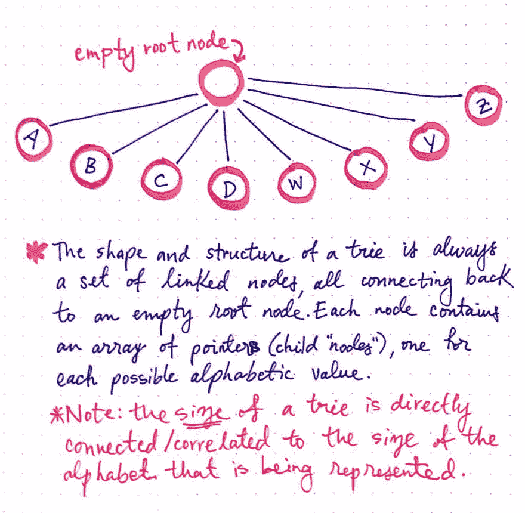
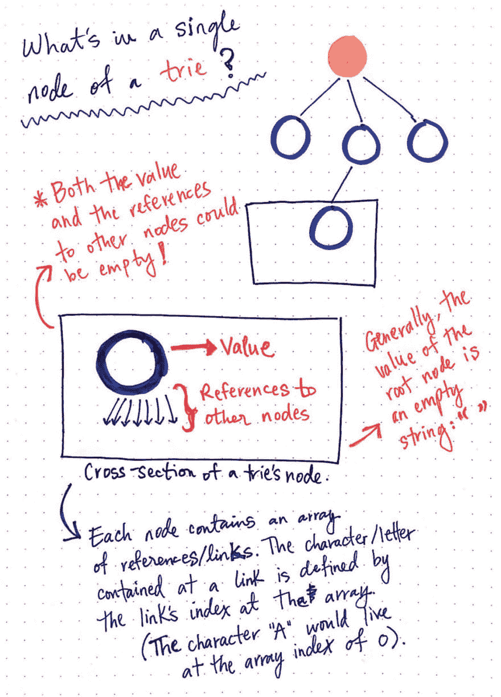
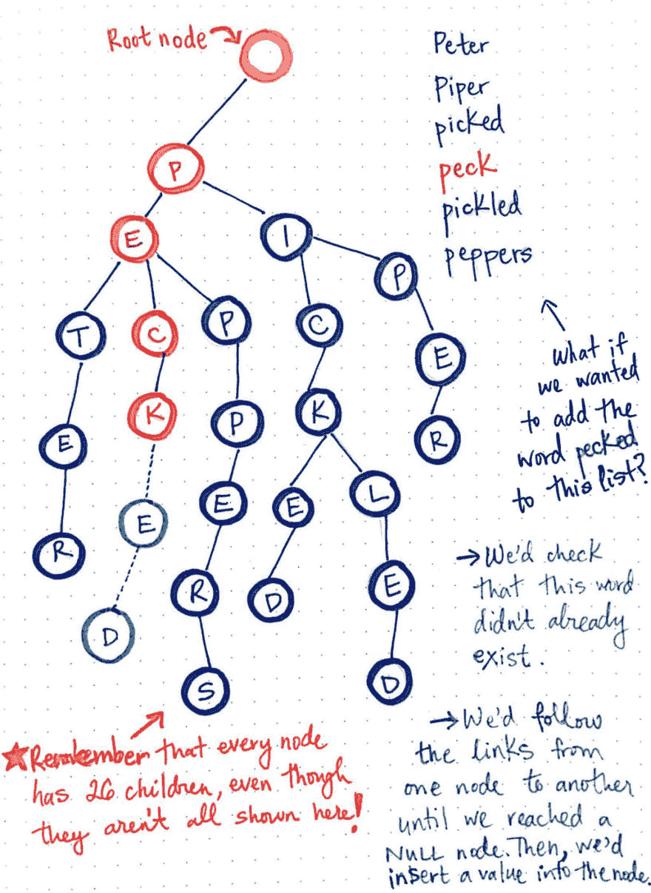
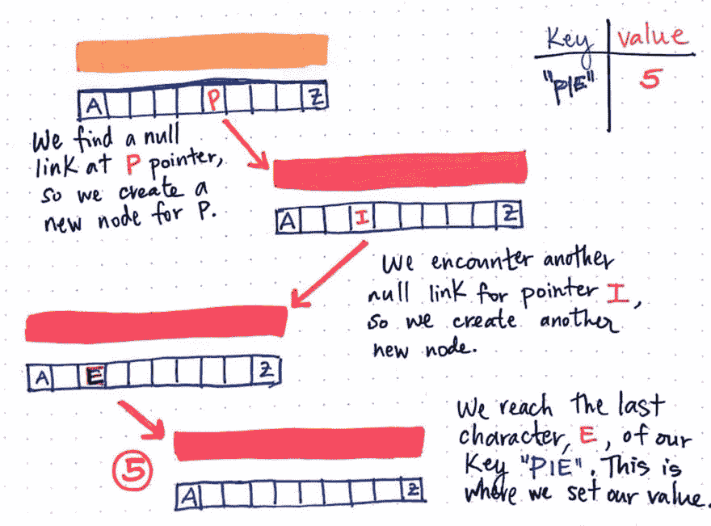
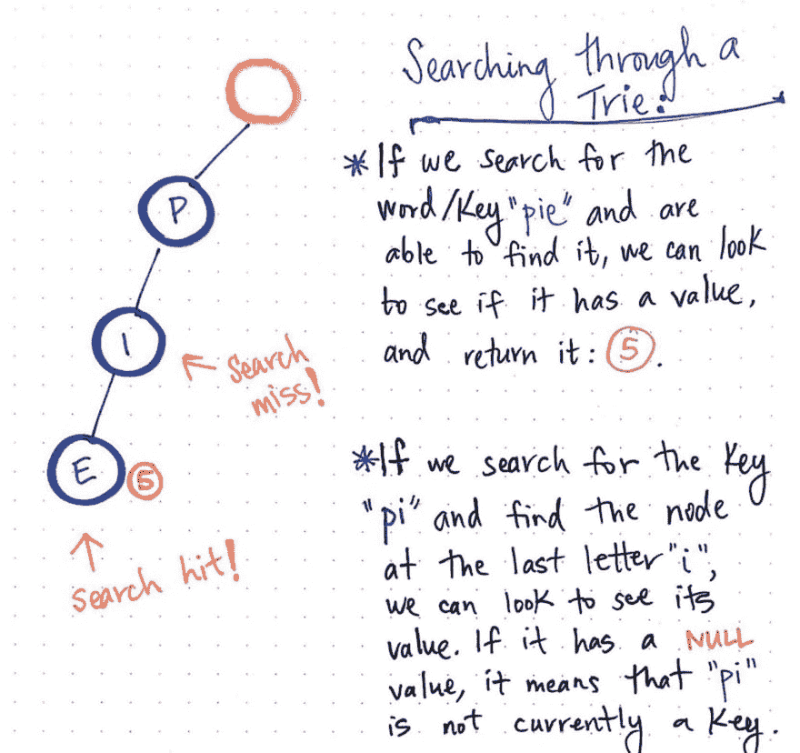
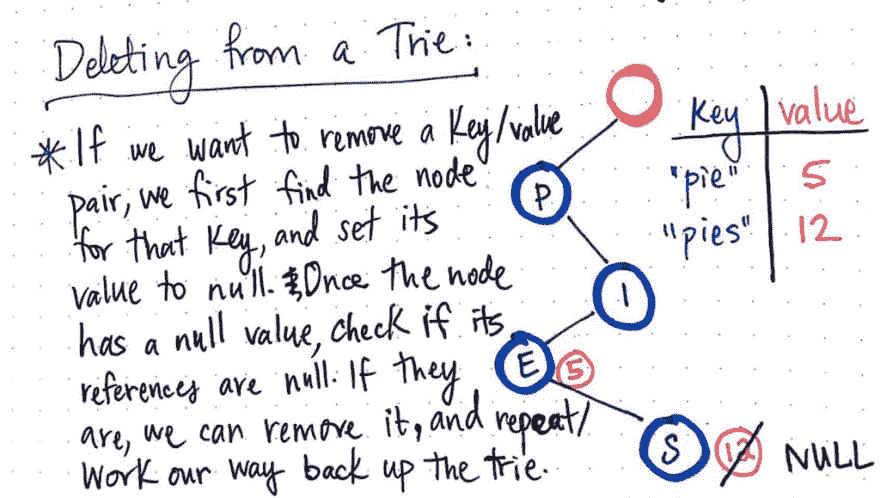
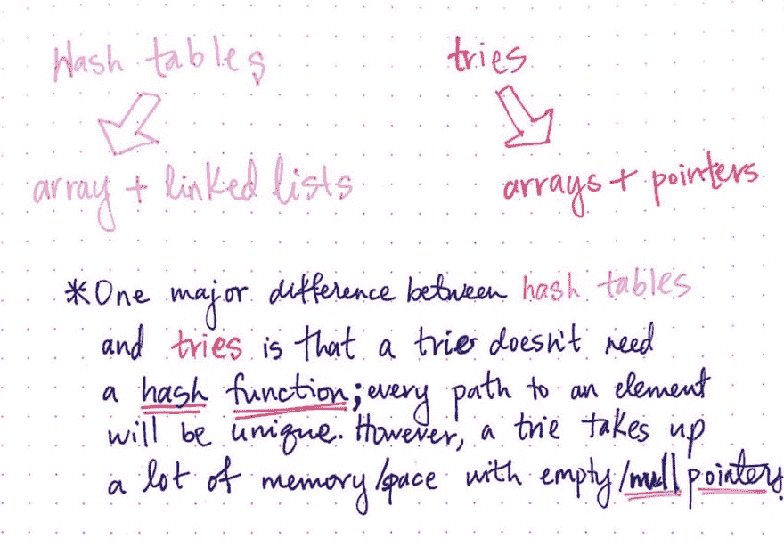
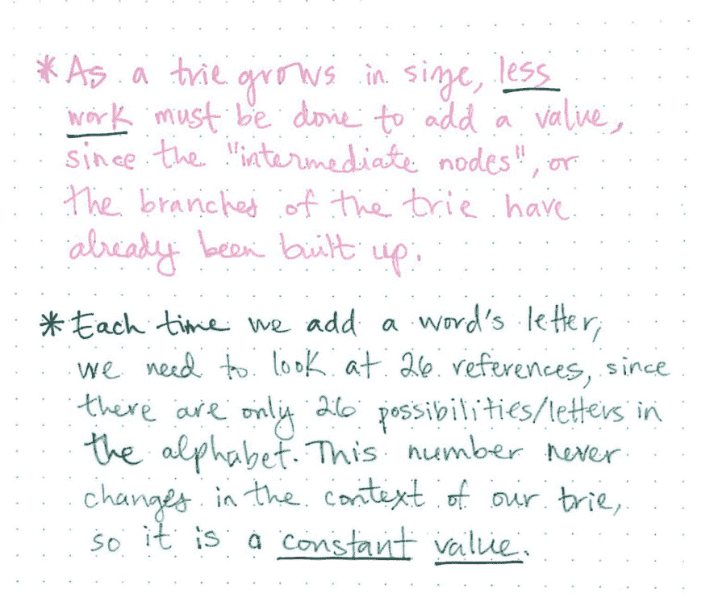
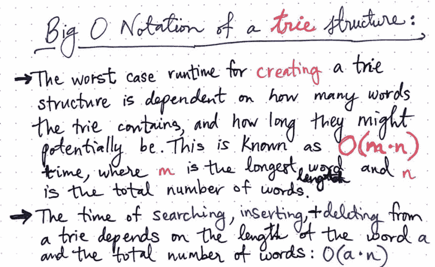

# 试图理解尝试

> 原文:[https://dev.to/vaidehijoshi/trying-to-understand-tries](https://dev.to/vaidehijoshi/trying-to-understand-tries)

在本系列的每一期文章中，我们都试图理解和深入挖掘我们正在学习的事物的权衡。

当我们学习数据结构时，我们看了每种结构的优缺点，努力使我们更容易和更明显地看到该结构是为了解决什么类型的问题而创建的。类似地，当我们学习排序算法时，我们非常关注空间和时间效率之间的权衡，以帮助我们理解何时一种算法可能是比另一种更好的选择。

事实证明，随着我们开始研究更复杂的结构和算法，这将变得越来越频繁，其中一些是作为对超级特定问题的解决方案而发明的。事实上，今天的数据结构是基于我们已经熟悉的另一种结构；然而，它是为了解决一个特殊的问题而创建的。更具体地说，它是作为运行时间和空间之间的妥协而创建的——这是我们在大 O 符号的上下文中非常熟悉的两个东西。

那么，这个我一直在含糊地谈论但实际上没有命名的神秘结构是什么？是时候挖掘并找出答案了！

### 试上试下

有几种不同的方法来表示看似简单的一组单词。例如，哈希或字典是我们可能很熟悉的，比如[哈希表](https://dev.to/vaidehijoshi/taking-hash-tables-off-the-shelf)。但是还有另一种结构是为了解决表示一组单词的问题而创建的:a ***trie*** 。术语“trie”来自单词*re****trie****val*，通常读作“try”，以区别于其他“树”结构。

然而，trie 基本上是一种树数据结构，但是在如何创建和使用它方面，它只需要遵循一些规则。

<figure> 

<figcaption>Trie: a 定义</figcaption>

</figure>

trie 是一种树状数据结构，其节点存储字母表中的字母。通过以特定方式构造节点，可以通过遍历树的分支路径从结构中检索单词和字符串。

计算机科学领域的尝试是一个相对较新的事物。1959 年，一位名叫伦纳德·拉·布里安戴斯的法国人建议在计算中使用它们，这是第一次考虑使用它们。根据唐纳德·克努特在《计算机编程的艺术》中的研究:

> 用于计算机搜索的内存是由伦德·拉·布里安戴斯首先推荐的。他指出，如果我们为每个节点向量使用一个链表，我们可以以运行时间为代价节省内存空间，因为向量中的大多数条目往往是空的。

使用 tries 作为计算结构的最初想法是，它们可以是运行时间和内存之间的一个很好的折衷。但是我们一会儿会回来。首先，让我们后退一步，试着理解这个结构到底是什么样子的。

<figure> 

<figcaption>一个 trie 的大小与它所代表的字母表的大小相关。</figcaption>

</figure>

我们知道字母通常用来表示字母表中的单词。在这里显示的插图中，我们可以开始了解这种表示的确切工作方式。

每个 trie 都有一个空的根节点，带有到其他节点的链接(或引用),每个节点对应一个可能的字母值。

trie 的形状和结构总是一组链接的节点，连接回一个空的根节点。需要注意的重要一点是，trie 中子节点的数量完全取决于可能值的总数。例如，如果我们表示英语字母表，那么子节点的总数与可能的字母总数直接相关。在英语字母表中，有 26 个字母，因此子节点的总数将是 26。

然而，想象一下，我们正在创建一个 trie 来保存高棉(柬埔寨)字母表中的单词，这是已知的最长的字母表，有 74 个字符。在这种情况下，根节点将包含 74 个到 74 个其他子节点的链接。

> trie 的大小与 trie 可能表示的所有可能值的大小直接相关。

好的，所以一个 trie 可能很小也可能很大，取决于它包含的内容。但是，到目前为止，我们只讨论了根节点，它是空的。那么，如果根节点不能容纳所有单词，那么不同单词的字母又在哪里呢？

答案在于根节点对其子节点的引用。让我们仔细看看一个 trie 中的单个节点是什么样子的，希望这将开始变得更加清晰。

<figure>

<figcaption>a trie 的单个节点里有什么？</figcaption>

</figure>

在这里显示的例子中，我们有一个 trie，它有一个空的根节点，它有对子节点的引用。如果我们查看其中一个子节点的横截面，我们会注意到 trie 中的单个节点只包含两个内容:

1.  一个值，可能为空
2.  对子节点的引用数组，所有这些子节点也可能为空

trie 中的每个节点，包括根节点本身，只有这两个方面。创建表示英语的 trie 时，它由一个根节点组成，该节点的值通常设置为空字符串:“”。

该根节点还将有一个包含 26 个引用的数组，所有这些引用最初都指向 null。随着 trie 的增长，这些指针开始被其他节点的*引用*填满，我们很快就会看到一个例子。

这些指针或引用的表示方式非常有趣。我们知道每个节点都包含一个指向其他节点的引用/链接数组。最酷的是，我们可以使用数组的索引来查找对节点的特定引用。例如，我们的根节点将保存从 0 到 25 的索引数组，因为字母表的 26 个字母有 26 个可能的位置。由于字母表是有序的，我们知道对包含字母 A 的节点的引用将位于索引 0。

所以，一旦我们有了一个根节点，我们从那里去哪里？是时候尝试成长了！

### 尝试遍历 trie

一个除了根节点什么都没有的 trie 一点都不好玩！那么，让我们通过玩一个包含一些单词的 trie 来使事情变得复杂一点，好吗？

在下面显示的 trie 中，我们表示以类似于“*Peter Piper pick a peck of 腌辣椒*”开头的童谣。我不会试图让你记住它的其余部分，主要是因为它很混乱，让我头疼。

<figure> 

<figcaption>如果我们想在我们的单词列表中添加一个单词呢？</figcaption>

</figure>

查看我们的 trie，我们可以看到我们有一个空的根节点，这是典型的 trie 结构。我们也有六个不同的单词来代表这个 trie: Peter、piper、picked、peck、腌渍和 peppers。

为了让这个树更容易看，我只画了实际上有节点的引用；重要的是要记住，尽管这里没有说明，但是每个节点都有 26 个对可能的子节点的引用。

注意这个 trie 有六个不同的“分支”,每个分支代表一个单词。我们还可以看到，有些词是共享父节点的。例如，单词 Peter、peck 和 peppers 的所有分支共享 p 和 e 的节点，同样，单词 picked 和 pickled 的路径共享节点 p、I、c 和 k。

那么，如果我们想把单词 pecked 添加到这个 trie 表示的单词列表中，会怎么样呢？为了实现这一目标，我们需要做两件事:

1.  首先，我们需要检查单词 peck 在这个 trie 中是否已经存在。
2.  接下来，如果我们遍历了单词*应该存在的分支，而单词还不存在，我们将在单词应该存在的节点引用中插入一个值。在这种情况下，我们将在正确的引用处插入 e 和 d。*

但是我们实际上如何去检查这个词是否存在呢？我们如何将字母插入正确的位置？以一个小的 trie 为例，这更容易理解，所以让我们看一个空的 trie，并尝试向其中插入一些东西。

我们知道我们将有一个空的根节点，它的值为“”，还有一个包含 26 个引用的数组，所有的引用都是空的(指向 null)。假设我们想要插入单词“pie ”,并给它赋值 5。另一种思考方式是，我们有一个如下所示的哈希:{“pie”:5 }。

<figure> 

<figcaption>理解 trie 结构中的数组指针</figcaption>

</figure>

我们将通过我们的方式工作的关键，使用每个字母来建立我们的特里和必要时添加节点。

我们将首先寻找指向 p 的指针，因为我们的键“pie”中的第一个字母是 p。因为这个 trie 还没有任何内容，所以我们的根节点中 p 处的引用将是 null。因此，我们将为 p 创建一个新节点，根节点现在有一个包含 25 个空槽和 1 个槽(在索引 15 处)的数组，其中包含对一个节点的引用。

现在我们在索引 15 处有一个节点，保存 p 的值。但是，我们的字符串是“pie”，所以我们还没有完成。我们将对这个节点做同样的事情:检查在键的下一个字母 I 处是否有一个空指针。最后，我们到了键的最后一个字符:“pie”中的 e。我们为引用 e 的数组创建一个新节点，在我们创建的第三个节点*中，我们将设置我们的值:5。*

将来，如果我们想要检索键“pie”的值，我们将从一个数组向下遍历到另一个数组，使用索引从节点 p 到 I，再到 e；当我们到达 e 的索引处的节点时，我们将停止遍历，并从该节点检索值，该值为 5。

<figure> 

<figcaption>通过 a trie</figcaption>

</figure>

进行搜索

让我们实际看看通过我们新构建的 trie 进行搜索会是什么样子！

在这里显示的例子中，如果我们搜索键“pie ”,我们遍历每个节点的数组，看看是否有分支路径的值:p-i-e。这有时被称为 ***搜索命中*** ，因为我们能够找到键的值。

但是如果我们寻找的东西并不存在于我们的大脑中呢？如果我们搜索单词“pi ”,而这个单词还没有作为一个带值的键添加呢？好，我们从根节点到索引 p 处的节点，然后从 p 处的节点到索引 I 处的节点，到了这一点，我们就看分支路径 p-i 处的节点是否有值。在这种情况下，它没有价值；它指向空值。因此，我们可以确定键“pi”在我们的 trie 中不作为一个带值的字符串存在。这通常被称为 ***搜索错过*** ，因为我们找不到键的值。

最后，我们可能还想对 trie 做另一个动作:删除东西！如何从我们的 trie 结构中删除一个键及其值？为了说明这一点，我在我们的 trie 中添加了另一个单词。我们现在有了键“pie”和“pies ”,每个键都有自己的值。假设我们想从 trie 中删除关键的“pies”。

<figure> 

<figcaption>从树中删除</figcaption>

</figure>

为此，我们需要采取两个步骤:

1.  首先，我们需要找到包含该键的值的节点，并将其值设置为 null。这意味着向下遍历并找到单词“pies”的最后一个字母，然后将最后一个节点的值从 12 重置为 null。
2.  其次，我们需要检查节点的引用，看看是否所有指向其他节点的指针都是空的。如果都是空的，那说明这个下面没有别的词/分支了，都可以去掉。然而，如果有指向其他节点的指针，而*和*都有值，我们不想删除我们刚刚设置为空的节点。

当我们删除一个单词的子字符串时，为了不删除更长的字符串，这最后一个检查特别重要。但是除了那一张支票之外，没有别的了！

### 试一试身手

当我第一次学习尝试的时候，它们让我想起了很多[散列表](https://dev.to/vaidehijoshi/taking-hash-tables-off-the-shelf)，我们在本系列的前面已经学过了。事实上，我读的关于尝试以及如何构建和搜索它们的书越多，我就越想知道这两种结构之间的权衡究竟是什么。

<figure> 

<figcaption>散列表 vs .</figcaption>

</figure>

事实证明，尝试和散列表都是相互提醒的，因为它们都在幕后使用数组。然而，哈希表使用数组结合链表，而尝试使用数组结合指针/引用。

这两种结构之间有相当多的细微差别，但哈希表和 try 之间最明显的差别是 trie 不需要[哈希函数](https://dev.to/vaidehijoshi/hashing-out-hash-functions)，因为每个键都可以按顺序(按字母顺序)表示，并且是唯一可检索的，因为每个字符串值的分支路径对于那个键的*都是唯一的。这样做的副作用是没有冲突要处理，因此依赖数组的索引就足够了，哈希函数是不必要的。*

然而，与哈希表不同，trie 的缺点是空指针会占用大量内存和空间。我们可以想象一个大的 trie 将如何开始变大，并且随着每个节点的增加，包含 26 个空指针的整个数组也必须被初始化。对于更长的单词，那些空的引用可能永远不会被填满；例如，假设我们有一个键“*”和一些值。这是一个超级长的单词，我们可能不会在 trie 中为这个单词添加任何子分支；这个单词的每个字母都有一堆空指针，它们占据了空间，但是从来没有真正被使用过！*

 *<figure>

<figcaption></figcaption>

</figure>

不过，希望我们不要将单词"*honoreivabilitudinitatibus*用作字符串。

然而，使用尝试有一些很大的好处。首先，创建 trie 的大部分工作发生在早期。如果我们仔细想想，这是有意义的，因为当我们第一次添加节点时，我们每次都必须为数组分配大量内存。但是，随着 trie 大小的增长，我们每次添加一个值时都需要做更少的工作，因为我们很可能已经初始化了节点及其值和引用。添加“中间节点”变得容易得多，因为已经建立了 trie 的分支。

“pro 列”中关于尝试的另一个事实是，每当我们添加一个单词的字母时，我们知道我们将只需要查看节点数组中的 26 个可能的索引，因为英语字母表中只有 26 个可能的字母。尽管 26 看起来很多，但对我们的电脑来说，它真的没有那么多空间。然而，我们*确信*每个数组将只包含 26 个引用的事实是一个巨大的好处，因为这个数字在我们的 trie 上下文中永远不会改变！它是一个 ***定值*** 。

关于这一点，让我们快速看一下 trie 数据结构的时间复杂度。创建 trie 所需的时间直接取决于 trie 包含多少单词/关键字，以及这些关键字可能有多长。创建 trie 的最坏情况运行时间是 trie 中最长键的长度 *m* 和 trie 中键的总数 *n* 的组合。因此，创建一个 trie 的最坏情况运行时是 ***O(mn)*** 。

<figure> 

<figcaption>一个 trie 结构的大 O 符号</figcaption>

</figure>

从 trie 中搜索、插入和删除的时间复杂度取决于被搜索、插入或删除的单词 *a* 的长度，以及单词总数 *n* ，使得这些操作**T5】的运行时间为 O(an)。** 当然，对于 trie 中最长的单词，插入、搜索和删除会比 trie 中最短的单词花费更多的时间和内存。

所以，现在我们知道了 try 的所有内部工作原理，还有一个问题需要回答:try 用在哪里？事实是它们很少被单独使用；通常，它们与另一个结构结合使用，或者在算法的上下文中使用。但是，尝试如何利用其形式和功能的最酷的例子可能是自动完成功能，就像 Google 等搜索引擎中使用的那样。

<figure> 

<figcaption>自动完成作为 trie 结构的子集</figcaption>

</figure>

现在我们知道了 tries 是如何工作的，我们可以想象在搜索框中键入两个字母将如何检索一个更大的 trie 结构的子集。另一个强大的方面是，尝试使搜索元素子集变得容易，因为，类似于[二分搜索法树](https://dev.to/vaidehijoshi/leaf-it-up-to-binary-trees)，每次我们遍历一棵树的一个分支，我们就减少了需要查看的*和其他*节点的数量！值得一提的是，搜索引擎的尝试可能更复杂，因为它们会根据受欢迎的程度返回某些术语，并且可能会有一些额外的逻辑来确定与其 trie 结构中的某些术语相关联的权重。但是，在引擎盖下，他们可能正在试图让这种神奇的事情发生！

尝试也用于匹配算法和实现拼写检查，也可以用于实现[基数排序](https://dev.to/vaidehijoshi/getting-to-the-root-of-sorting-with-radix-sort)的版本。

我想如果我们足够努力，我们会发现尝试就在我们周围！(不好意思，我就是忍不住双关了)

### 资源

尝试经常出现在白板或技术面试问题中，通常是类似“从这个句子中搜索一个字符串或子字符串”这样的问题的变体。鉴于它们在恒定时间内检索元素的独特能力，它们通常是一个很好的工具，幸运的是，许多人已经写了关于它们的文章。如果你想要一些有用的资源，这里有几个好地方可以开始。

1.  [基于数字的排序和数据结构](https://www.cs.cmu.edu/~avrim/451f11/recitations/rec0921.pdf)，Avrim Blum 教授
2.  弗兰克·芬宁教授关于尝试的讲座笔记
3.  [算法:尝试](http://algs4.cs.princeton.edu/lectures/52Tries.pdf)，罗伯特·塞奇威克和凯文·韦恩
4.  [才学](https://brilliant.org/wiki/tries/)，才学
5.  丹尼尔·埃拉德
6.  [尝试](https://www.youtube.com/watch?v=TRg9DQFu0kU)，哈佛 CS50

* * *

*本帖最初发表于[medium.com](https://medium.com/basecs/trying-to-understand-tries-3ec6bede0014)T3】**