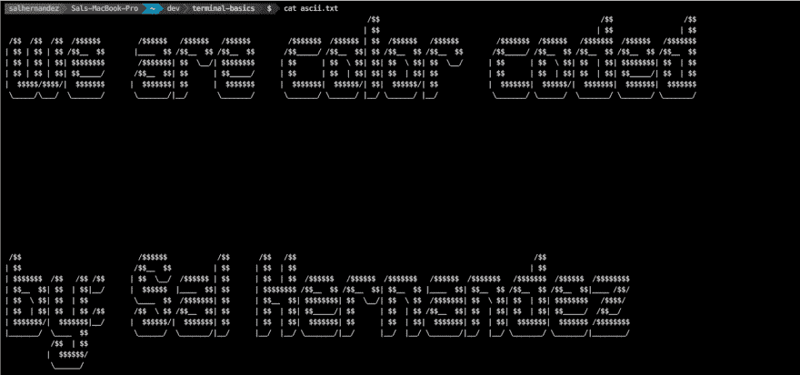
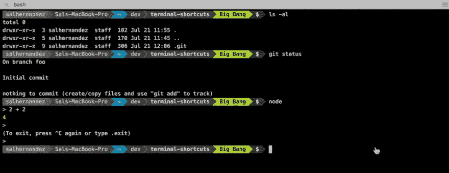

# 这是我最喜欢的几个:终端快捷方式

> 原文:[https://dev . to/click clickonsal/这些是我最喜欢的几个终端快捷方式](https://dev.to/clickclickonsal/these-are-a-few-of-my-favorite-terminal-shortcuts)

终端:用户输入和执行文本命令的界面。

[T2】](https://res.cloudinary.com/practicaldev/image/fetch/s--lBzkm2j7--/c_limit%2Cf_auto%2Cfl_progressive%2Cq_auto%2Cw_880/https://cdn-images-1.medium.com/max/1600/1%2AgqrgBeHFb3--L-EvyTefiw.png)

我承认当我 2014 年第一次开放终端时，我不喜欢它。当时，我坚信使用图形用户界面，如 Mac 上的 Finder，在删除、复制和创建文件和文件夹时会快得多。不过，我阅读的教程和文章一直坚持认为终点是ðÿ"'，所以我继续前进。
很庆幸自己挺过去了，还一直在学习使用终端！最终，随着练习和坚持，理解和速度来了。现在我几乎不用 GUI 来管理我的文件系统。
话虽如此，道路并不平坦。在我的旅途中，有很多终端命令扔给我。我怎么能把它们都记住呢？？！！？立刻？！？！
 
防止你经历同样的焦虑。我整理了一个我最喜欢的终端快捷方式列表。ðŸ˜

`ls`列出文件和目录(文件夹)

[T2】](https://res.cloudinary.com/practicaldev/image/fetch/s--10d2oDdB--/c_limit%2Cf_auto%2Cfl_progressive%2Cq_auto%2Cw_880/https://cdn-images-1.medium.com/max/1600/1%2AWVpJFhZJSNYuKUCsn7nigw.png)

* * *

`cd`改变目录
打印工作目录`pwd`(显示当前工作目录的完整路径名)

[T2】](https://res.cloudinary.com/practicaldev/image/fetch/s--U5nd-ELa--/c_limit%2Cf_auto%2Cfl_progressive%2Cq_auto%2Cw_880/https://cdn-images-1.medium.com/max/1600/1%2AohlYTlQQNLIY6kw9-LBhKA.png)

* * *

`touch`创建新文件

[T2】](https://res.cloudinary.com/practicaldev/image/fetch/s--h3pUlV1O--/c_limit%2Cf_auto%2Cfl_progressive%2Cq_auto%2Cw_880/https://cdn-images-1.medium.com/max/1600/1%2A2BSEFMDP86UIGBqy4VOeAg.png)

* * *

`mkdir`创建新目录

[T2】](https://res.cloudinary.com/practicaldev/image/fetch/s--wIpJYI8r--/c_limit%2Cf_auto%2Cfl_progressive%2Cq_auto%2Cw_880/https://cdn-images-1.medium.com/max/1600/1%2An4mBGc-qUP0e24kd4tIa8Q.png)

* * *

`cp`复制文件或目录

[T2】](https://res.cloudinary.com/practicaldev/image/fetch/s--50DMDB0---/c_limit%2Cf_auto%2Cfl_progressive%2Cq_auto%2Cw_880/https://cdn-images-1.medium.com/max/1600/1%2AeIvuvVo1fJiXCE0TCMmg0w.png)

* * *

`mv`移动(重命名)文件或目录

[T2】](https://res.cloudinary.com/practicaldev/image/fetch/s--QhzIJksn--/c_limit%2Cf_auto%2Cfl_progressive%2Cq_auto%2Cw_880/https://cdn-images-1.medium.com/max/1600/1%2AfodlHdNmGnlwZnyjTEy07Q.png)

* * *

`rm`删除文件
`rm -r`删除目录
中的&文件注意:Therm 命令真的很强大。它删除文件/目录而不恢复。(不去垃圾桶)

[T2】](https://res.cloudinary.com/practicaldev/image/fetch/s--65kIP4NQ--/c_limit%2Cf_auto%2Cfl_progressive%2Cq_auto%2Cw_880/https://cdn-images-1.medium.com/max/1600/1%2A8kSU6qpk_lJiDiUkc9k9OQ.png)

* * *

`Ctrl + A`将光标置于行首
`Ctrl + E`将光标置于行尾。

[T2】](https://res.cloudinary.com/practicaldev/image/fetch/s--RErseWX3--/c_limit%2Cf_auto%2Cfl_progressive%2Cq_66%2Cw_880/https://cdn-images-1.medium.com/max/1600/1%2A8Nx-FAiARb4ja5141k647w.gif)

* * *

`Cmd + k` (Mac) `Ctrl + L (Linux/Mac)清除终端屏幕

[T2】](https://res.cloudinary.com/practicaldev/image/fetch/s--ZIicvwlN--/c_limit%2Cf_auto%2Cfl_progressive%2Cq_66%2Cw_880/https://cdn-images-1.medium.com/max/1600/1%2Au8oeI0D27nFfA_G--kz9zg.gif)

* * *

现在是我最喜欢的——Tab 自动补全！

如果你想记住一个命令，至少输入一个字母，然后按两次 tab 键，它会根据输入的字符显示所有可用的命令。如果你输入了足够的字符，只剩下一个匹配，它会自动完成。这适用于所有 UNIX 命令，甚至您的文件系统。

## T2】

现在继续，跳进你的终端，开始玩它&朝着成为终端玩家的方向努力。😎

* * *

如果你喜欢这篇文章，一定要点击点击绿色心脏！ðÿ'š
要获得更多双关语和代码提示，请在 twitter 上关注我的旅程 [@clickclickonsal](https://twitter.com/clickclickonsal)
通过访问我们的[网站](http://wearecolorcoded.us/#mc_embed_signup_scroll)加入彩色编码 slack 社区，并保持联系。

*本文原载于[彩色编码媒体刊物](https://medium.com/@clickclickonsal/am-i-still-a-junior-developer-1cb0a00ae7ea#.32xfkg8dn)*