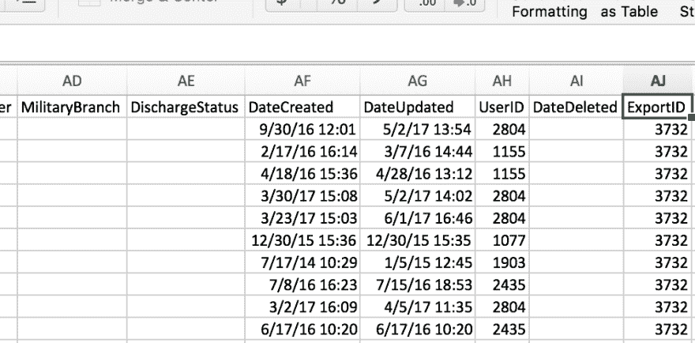

# HMIS，R，SQL -工作挑战三

> 原文:[https://dev.to/ladvien/hmis-r-sql-work-challenge-three-on6](https://dev.to/ladvien/hmis-r-sql-work-challenge-three-on6)

# 用户创建数据错误报告

在这项工作挑战中，我们将结合客户和注册数据，然后我们将添加一个包含用户帐户信息的非 HMIS 数据框架。在这些数据被合并后，我们将解析它们以寻找丢失的数据元素，并提供一个按用户分类的数据错误列表。

## 需要的数据

如上所述，需要的数据是:

1.  `Client.csv`
2.  `Enrollment.csv`
3.  包含 hmis 用户联系信息数据帧

这个挑战的关键就在每一个 HMIS CSV 的末尾。每个导出的 CSV 包含一些描述数据如何产生的[元数据](https://en.wikipedia.org/wiki/Metadata)。

[T2】](https://res.cloudinary.com/practicaldev/image/fetch/s--jth8tF95--/c_limit%2Cf_auto%2Cfl_progressive%2Cq_auto%2Cw_880/https://ladvien.cimg/csv-meta-data.png)

`DateCreated`应表示相应行实际进入 HMIS 的时间。`DateUpdated`是最后一次在 HMIS 中修改和保存该行。`UserID`是最后修改这些数据的案例经理。最后，ExportID 是标识 HMIS CSV 集合在同一个批次中的数字。

我们将重点关注`UserID`元素。请注意，您不会发现用户名，真实姓名，电子邮件地址，或真正的个人 HMIS 用户的任何联系信息。然而，在每个 CSV 中有一个唯一的用户 ID 仍然允许 HUD 使用[内部有效性测试](https://en.wikipedia.org/wiki/Internal_validity)来确定用户的可靠性。

对我们来说，我们将获取另一个数据源，其中包含用户的所有用户标识*和*联系信息。现在，这可能会因每个 HMIS 软件供应商而异。但是每个供应商应该有办法导出系统中的用户列表和他们的`UserID`，这将允许我们将这些数据加入到 HMIS CSV 中。

对于那些参加我的 CoC 的工作挑战的人，我将提供一个包含这些用户数据的 CSV。

在实际的用户名被加入到 CSV 之后，我们将开始解析 CSV 中的数据错误。如果你对计算机科学中的术语[解析](https://en.wikipedia.org/wiki/Parsing)还不熟悉，可以把它想象成一个我们让计算机做所有工作的场景。我们将绘制一行数据来确定是否有错误，而不是一句话。

## 什么是 HMIS 数据错误？

HMIS 数据字典明确说明了什么是数据错误。

*   8 -客户不知道
*   9 -客户拒绝
*   99 -未收集数据
*   空白的
*   不完全响应
*   不确定响应

下面是一个 Client.csv 示例，它包含每种类型的错误。

| 个人 id | 西方人名的第一个字 | 姓 | 告发 | severely subnormal 智力严重逊常 | 禁用条件 | 老兵身份 |
| --- | --- | --- | --- | --- | --- | --- |
| ZP 1u 3 epu 2 fkawi 6k 5 us 5 LDV 50 kri 1 ln 7 |  | Tesa | 2010-01-01 | 123-45-6789 | one | eight |
| ia 26×38 光子鱼雷 8CKR5RDS8KNGHV | 丝状部份 | 法雅 | 1999-1-1 | Four thousand three hundred and twenty-one | one | one |
| lasdu 89 nrabvjww 779 w4 jggan 90 iq5b 2 | 撒拉 | 凯瑞甘 |  | Blahblah | Ninety-nine | Zero |

以下是数据错误:

1.  萨特的名字是空白的
2.  莎拉的出生日期是空白的
3.  费拉的 SSN 是一个不完整的回答(必须是 9 位数)
4.  莎拉的 SSN 是不可确定的
5.  莎拉的否认条件没有被收集。
6.  萨特拒绝提供退伍军人身份。

## 目标

我们将获取一个 HMIS 数据，并将其与包含最终用户信息的数据帧连接起来。然后，我们将创建一个查询来划分数据帧的子集，这样我们得到的数据帧只包含有数据错误的*行。最后，我们将统计数据错误的类型以及导致最多数据错误的最终用户的姓名。*

我们将检查错误的数据元素:

1.  西方人名的第一个字
2.  姓
3.  告发
4.  老兵身份
5.  禁用条件
6.  与 oH 的关系

要获得此信息，我们需要执行以下操作:

1.  加载 Client.csv、Enrollment.csv 和 Users.xlsx
2.  左加入 clientDf 和 enrollmentDf。
3.  将 usersDf 连接到步骤 2 的结果。
4.  分析上面列出的数据元素中的数据错误
5.  创建一个只包含有数据错误的行的数据帧
6.  使用 SQL Count 函数根据上面的元素列表计算数据错误的数量。
7.  使用 SQL Count 函数计算最终用户名称与包含错误的行相关联的次数。
8.  创建这些计数的数据框架
9.  将包含错误计数的数据帧保存到 Excel 文件(。xlsx)

## 资源

以下是对每个步骤都有帮助的资源:

TBD