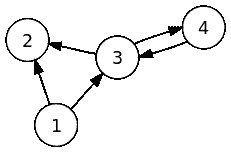
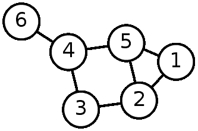

# 带 Rust 的算法:图形

> 原文:[https://dev.to/mnivoliez/algorithmics-with-rust-graph](https://dev.to/mnivoliez/algorithmics-with-rust-graph)

*最初发布在我的[博客](https://mathieu-nivoliez.com/posts/2017-07-25-algorithmics-with-rust-graph/)上。*

你好，今天我们要谈论的是图，它们是什么，我们如何在 Rust 中制作它们。

在那之前，我打算谈谈归并排序。但是，Vaidehi Joshi 已经在她的文章《理解合并排序》中介绍了这个主题。你真的应该读一读，因为它写得很好，很容易理解。

回到主题:图表！
“好吧，什么是图？”

简单来说，图是点的集合，称为节点，以及连接节点的边的集合。图形可以是有向的，其中边像箭头，也可以是无向的。

有向图: [](https://res.cloudinary.com/practicaldev/image/fetch/s--lJs-eQbC--/c_limit%2Cf_auto%2Cfl_progressive%2Cq_auto%2Cw_880/https://i2.wp.com/upload.wikimedia.org/wikipedia/commons/thumb/2/23/Directed_graph_no_background.svg/231px-Directed_graph_no_background.svg.png%3Fresize%3D231%252C153%26ssl%3D1)

无向图: [](https://res.cloudinary.com/practicaldev/image/fetch/s--0rwRh_Ob--/c_limit%2Cf_auto%2Cfl_progressive%2Cq_auto%2Cw_880/https://i0.wp.com/upload.wikimedia.org/wikipedia/commons/thumb/5/5b/6n-graf.svg/333px-6n-graf.svg.png%3Fresize%3D333%252C220%26ssl%3D1)

图表可以按类划分，但是我让你在维基百科上找，文章有很好的证明。
“好吧，那它是干什么用的？”

好问题，我们的读者肯定是个好读者！

我要说的话会让你大吃一惊:你每天都能看到他们！在电信、社交媒体等领域。甚至在编程中，例如在面向对象的语言中，你也可以看到和使用图形。
“好吧，有用。我们如何制造它们？”

我将向你展示一种让它们生锈的方法。

首先，我们可以通过节点的集合、边的集合以及是否有向来定义一个图。

```
struct Graph<'a> {
  nodes: Vec<&'a Node>,
  edges: Vec<Edge<'a>>,
  directed: bool,
} 
```

然后，我们定义节点和边。

```
struct Node {}

struct Edge<'a> {
  source_node: &'a Node,
  target_node: &'a Node,
} 
```

现在我们都有了制作图表所需的结构。

这里可以看到一个例子:link。

我们今天就到这里，我不想让你感到厌烦。下次再见，玩图形。

马修